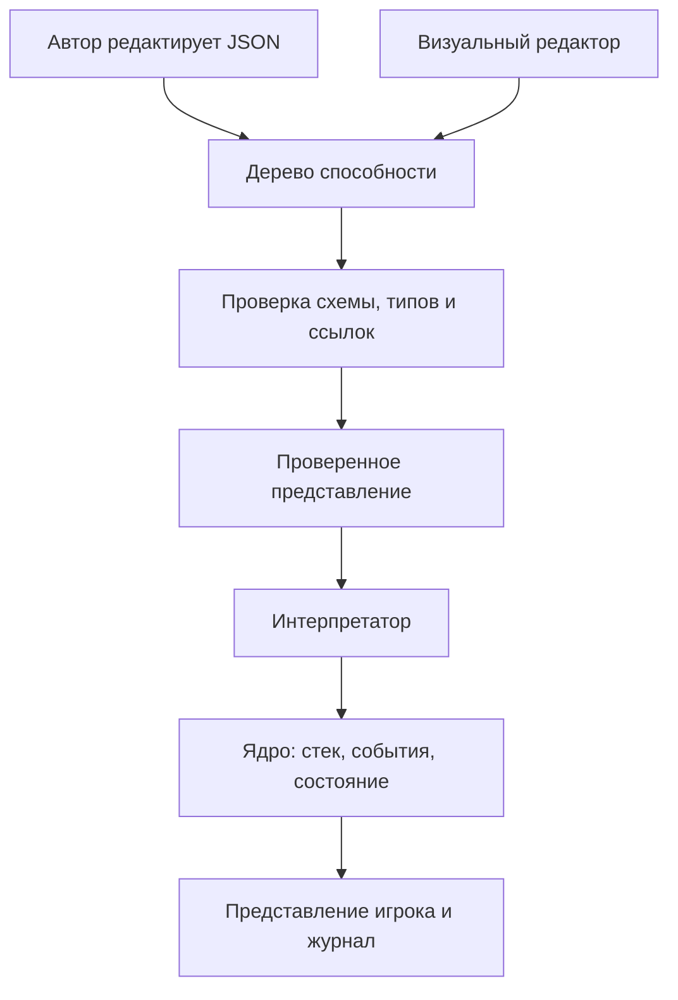

# MagicCards — гейм-дизайнерский план

**Версия:** 0.6 · **Дата:** 13.09.2026 · **Статус:** исходная спецификация; код ещё не реализован.

## 1. Назначение и подтверждённые решения

Этот документ связывает игровой замысел, правила, язык способностей, структуру реализации и проверки. Он служит источником истины для автора игры и разработчика.

**Подтверждено владельцем:**

- Нужна собственная карточная игра с понятным редактором; референсы — Hearthstone и Magic: The Gathering. Универсальность для любых карточных игр не является целью. Импорт чужих форматов возможен отдельными конвертерами.
- Фазы, стек эффектов и ответы соперника входят уже в первый рабочий прототип.
- Приоритет разработки — развитое и проверяемое ядро. Консоль служит первым клиентом и промежуточным результатом; первая публичная версия требует браузерной игры против бота и редактора.
- Вычисления, условия, локальные переменные, счётчики смертей, несколько активаций со стоимостями в ресурсах/жизнях/существах и ауры входят в MVP ядра.
- На этапе ядра карты редактируются в JSON. Для первой публичной версии обязателен понятный редактор карт и способностей: формы, готовые свойства и вложенные блоки.
- Бой сохраняет атаки игрока и назначение блоков. Свойства вроде полёта ограничивают блокирование, а не вводят прямую атаку на существо.
- Виды/признаки доступны в необязательных фильтрах. Ограничения взаимодействия должны расширяться через общие правила; полёт — один из примеров.
- Автор может создавать переиспользуемые определения способностей, прикреплять их к совместимым существам/игрокам/заклинаниям и задавать параметры. Библиотека согласуется с общими правилами ядра, 7.17.
- Целевое распространение — GitHub Pages, предложения карт/способностей/колод через PR с проверками и ревью владельца.
- Игра одному против бота обязательна для первой публичной версии. Полноценный сетевой PvP сейчас не требуется.
- Пользователь может сохранять локальные черновики/колоды, импортировать и экспортировать свой формат и испытывать карты до публикации.
- Сначала меняется документация, затем реализация приводится в соответствие с ней.
- План сохраняется в этой заметке MagicCards.md внутри Obsidian.

**Рабочие допущения v0.6:** TypeScript и браузерный стек; автоматически растущий ресурс без земель; ограниченная модель блоков; числа баланса и стартовые карты ниже. Это предложения для старта, а не ранее утверждённые решения. Их изменения оформляются следующей редакцией.

Описывается собственный профиль правил, а не полная реализация или нормативное изложение MTG.

## 2. Замысел и критерий первого результата

Игрок развивает поле существ, выбирает атаки и блоки, расходует ресурс на угрозы или сохраняет его для ответов. Решения возникают как в свой ход, так и при получении приоритета в чужой.

Цикл автора: **идея карты → описание доступными операциями → сценарий проверки → партия → изменение данных**. Новое сочетание существующих эффектов должно работать без отдельного класса карты или исключения по её id.

Принципы:

1. Журнал объясняет источник, цель и результат каждого эффекта.
2. Правила целей, стоимости, повреждений и реакций едины для всех карт.
3. Сложность способностей складывается из небольшого словаря операций.
4. Ядро работает независимо от UI и воспроизводит партии.
5. Новая механика сначала описывается, затем расширяет общий интерпретатор.

**Критерий MVP ядра E8:** матч проходит в консоли и сценарном раннере; проверены стек/ответы, бой и ограничения по свойствам, фильтры видов, вычисляемые способности, составные стоимости, ауры и последствия смертей; запись воспроизводится. Ручной локальный матч на двоих доступен через последовательную передачу команд. Графический интерфейс не входит в условие готовности ядра.

Включено в ядро: профиль prototype-stack-v1 с rulesetVersion 0.6; существа, быстрые/медленные карты, ресурс, фазы, приоритет, LIFO-стек, триггеры с целями, вычисления/условия/let/foreach, несколько активаций с атомарными составными стоимостями, непрерывные бафы/дебафы и предоставляемые способности, итоги боя/разрешения и отложенные реакции; subtypes/tags/keywords, фильтры, декларативные InteractionRule, временная выдача/подавление keyword и независимые временные непрерывные эффекты; библиотека AbilityDefinition с проверкой носителей, параметрами, привязанными правилами и жизненным циклом выдач. Контент: 12 базовых карт плюс отдельные механические fixtures. Инструменты: консоль, JSON-валидация, сценарный раннер, журнал, снимки и replay.

**Критерий первой публичной версии P1:** «Открыть сайт, собрать колоду, сыграть против бота, создать свою карту и испытать её». Дополнительно пользователь экспортирует проверяемый набор для PR. Обязательны B1 (игровой бот), W1 (браузерный стол), W2 (редактор/мастерская) и W3 (публикационный процесс). Подробнее — в 9, 11–13.

После P1: усиление бота, конвертеры востребованных чужих форматов, графический редактор при необходимости, баланс и оформление. Отдельными механическими расширениями остаются земли/цветная мана, несколько блокирующих, произвольные замены событий, выбор посреди разрешения и рекурсивные effective-ауры. Глубина ранее выбранного ядра сохраняется. Сетевой режим, аккаунты и рейтинги не обязательны для текущей цели.

Сеттинг условно фэнтезийный, имена карт рабочие; иллюстрации ядру не нужны. Целевая длительность человеческой партии 15–25 минут — будущая гипотеза плейтеста, не критерий производительности консоли.

## 3. Базовые правила

Идентификаторы R-* используются в задачах и тестах. Числа хранятся в настройках профиля, а не в UI.

| ID | Область | Правило |
|---|---|---|
| R-01 | Игрок | Два игрока, по 20 текущего и максимального здоровья. Активный игрок — тот, чей ход; обладатель приоритета может быть другим. |
| R-02 | Колода | Ровно 24 карты; максимум две копии одного cardId. Допустимы creature/spell из выбранного проверенного снимка контента. Базовые колоды раздела 8 по-прежнему содержат по две копии его 12 карт. Исходный порядок фиксируется, затем колоды перемешиваются генератором матча. |
| R-03 | Старт | Первый игрок определяется генератором. Оба получают по 4 карты. Пересдачи нет. Первый игрок пропускает только обычный добор своего первого хода. |
| R-04 | Ресурс | Начальный максимум 0; в начале своего хода +1 к максимуму до 10 и восстановление доступного ресурса. Остаток сохраняется между фазами и в чужой ход до следующего собственного восстановления. |
| R-05 | Зоны | Колода, рука, поле, кладбище, стек. У физической карты instanceId, generation пребывания в зоне и ровно одна зона; cardId обозначает общее определение. Способность в стеке не является новой физической картой. |
| R-06 | Лимиты | До 10 карт в руке и 7 существ на своём поле. Добор в полную руку отправляет карту на кладбище без триггера смерти. |
| R-07 | Существо | Базовая атака, максимальное здоровье, отмеченный урон, повёрнутость и ход входа на поле. Текущее здоровье = максимум минус урон. Порядок входа задаёт стабильный порядок объектов. |
| R-08 | Конец | Здоровье игрока ≤ 0 означает поражение при проверке состояния; обоих одновременно — ничью. После результата стек не разрешается. Сдача доступна игроку, принимающему решение. |
| R-09 | Усталость | Попытки добора из пустой колоды наносят владельцу возрастающий урон: 1, 2, 3 и далее. Счётчики раздельные. Добор нескольких карт выполняет отдельные попытки. |

«Персонаж» — игрок или существо. Колода не содержит AbilityDefinition/InteractionRule как игровых карт. Произвольный порядок допустимых карт задаёт исходный список для перемешивания, а библиотечные ссылки разрешаются до матча. Ограничение 24/2 — рабочее правило стартового профиля, проверяемое и редактором, и ядром.

Определения карт неизменны в течение матча; повреждения, зона и модификаторы относятся к экземпляру. Исчезнувшую цель нельзя подменить другим экземпляром с тем же cardId.

## 4. Фазы, приоритет и стек

### 4.1. Структура хода — R-10

| Шаг | Действие при входе | Затем |
|---|---|---|
| READY | Восстановить ресурс, развернуть своих существ. | Без приоритета перейти к UPKEEP. |
| UPKEEP | Выпустить событие начала хода. | Окно приоритета. |
| DRAW | Обычный добор с исключением R-03. | Окно приоритета. |
| MAIN_1 | Нет. | Основная фаза с приоритетом. |
| COMBAT_BEGIN | Открыть CombatScope с новым combatId. | Окно перед атакой. |
| DECLARE_ATTACKERS | Активный игрок одним действием объявляет всех атакующих, включая пустой список. | Окно после объявления. |
| DECLARE_BLOCKERS | Защищающийся одним действием назначает блоки, включая пустой список. | Окно после объявления. |
| COMBAT_DAMAGE | Применить одновременный боевой урон. | Окно после урона. |
| COMBAT_END | Зафиксировать CombatSummary по 7.13, завершить участие в бою, выпустить combat_ended. | Окно приоритета после подготовки триггеров. |
| MAIN_2 | Нет. | Вторая основная фаза. |
| END | Выпустить событие конца хода. | Окно приоритета. |
| CLEANUP | Одновременно снять урон со всех существ и убрать модификаторы и временные непрерывные эффекты «до конца хода». | Проверка состояния и передача хода. |

Объявления и боевой урон не помещаются в стек. Пока игрок редактирует список атакующих/блоков до подтверждения, соперник не действует. Если атакующих нет, после окна DECLARE_ATTACKERS пропускаются блоки и урон, затем наступает COMBAT_END.

В CLEANUP обычного окна нет. Если проверка состояния породила триггеры, поместить их в стек и открыть окно; после его закрытия повторить CLEANUP.

### 4.2. Приоритет — R-11

1. При открытии окна приоритет получает активный игрок после проверок состояния и помещения ожидающих триггеров.
2. Обладатель приоритета может сыграть допустимую карту или выполнить PassPriority.
3. После розыгрыша игрок сохраняет приоритет; серия пасов сбрасывается.
4. Первый пас передаёт приоритет сопернику.
5. Два последовательных паса при непустом стеке разрешают **только верхний элемент**. Затем проверки состояния, триггеры и снова приоритет активному игроку.
6. Два последовательных паса при пустом стеке закрывают окно и переводят игру к следующему шагу.
7. Розыгрыш или разрешение сбрасывает серию пасов.

Пас не завершает весь ход. В MVP нет скрытого автопаса или безусловной кнопки обхода всех окон: возможность ответить должна сохраняться у обоих игроков.

### 4.3. Розыгрыш и цели

**R-12. Скорость и объявление.** Медленные карты и slow-активации играются только активным игроком в MAIN_1/MAIN_2, с приоритетом и пустым стеком. Все существа медленные. Быстрые заклинания играются в любом окне со своим приоритетом, включая чужой ход.

Команда содержит карту из руки и все обязательные выбранные цели. Сначала проверяются приоритет, скорость, стоимость, цели и ограничения. Неверная команда ничего не меняет, включая RNG. Принятая карта оплачивается и перемещается в стек. Отмена выбора до отправки команды бесплатна; после принятия возврата действия нет.

**R-13. Разрешение.** Верхний StackItem снимается со стека разрешения и исполняется целиком без передачи приоритета между эффектами. Физическая карта до завершения остаётся в зоне стека. Существо входит на поле; заклинание после эффектов уходит на кладбище. Отменённая карта уходит на кладбище без эффектов и без возврата стоимости.

При полном поле существо нельзя объявить. Если поле заполнилось уже после объявления, при разрешении карта уходит на кладбище без входа и смерти на поле. Отменённое в стеке существо также не вызывает on_death.

**R-14. Цели.** При разрешении выбранные цели проверяются повторно. Если все обязательные выбранные цели недопустимы, элемент завершается без эффектов. Если сохранилась хотя бы одна, эффекты применяются только к допустимым; существование и пригодность цели проверяются и перед конкретной операцией.

Автоматический селектор «все вражеские существа» вычисляется при выполнении эффекта и не считается выбранной целью. Пустое множество — отсутствие действия. В MVP ручные цели выбираются при объявлении карты/активации и при подготовке адресного триггера через SubmitChoice. Во время PendingDecision приоритет не выдаётся. Выбор посреди самого разрешения отложен.

«Отмена» выбирает ожидающую в стеке карту-заклинание, включая карту существа, но не триггер. Уже разрешающийся элемент недоступен для ответа.

### 4.4. Обязательный пример контрответа

А играет «Искру» и пасует. Б играет «Отмену» на «Искру» и пасует. А играет свою «Отмену» на ответ Б. После двух пасов разрешается только ответ А, отменяя «Отмену» Б. Приоритет снова у А. «Искра» разрешится лишь после следующей пары пасов. Все оплаченные стоимости сохраняются.

## 5. Бой и проверки состояния

**R-15. Атака.** Активный игрок выбирает развёрнутых существ с атакой > 0, находящихся под его контролем с начала текущего хода. Они атакуют защищающегося игрока. Объявление поворачивает их, кроме vigilance («Бдительность»). Новое существо может блокировать сразу, атаковать — со следующего собственного хода.

**R-16. Блоки.** Защищающийся назначает только развёрнутых существ. Каждый блокирует максимум одного атакующего, каждого атакующего блокирует максимум одно существо. Блок не поворачивает. Каждая пара дополнительно проходит общую проверку InteractionRule(block) по 7.15; применимые ограничения соединяются через AND. Получение/потеря keyword после законного объявления пары не отменяет блок. Подтверждённый атакующий сохраняет признак «был заблокирован», даже если блокирующий исчез до урона.

**R-17. Урон.** Незаблокированные атакующие наносят урон игроку. В сохранившихся парах существа одновременно наносят урон друг другу. Заблокированный атакующий без оставшегося блокирующего не наносит урон игроку. Покинувшие поле участники урон не наносят. Участники и значения атаки фиксируются при входе в COMBAT_DAMAGE после ответов; весь боевой урон — один пакет.

**R-18. Повреждения.** Урон увеличивает отмеченные повреждения существа; лечение уменьшает их до 0. Здоровье игрока лечится до максимума. Урон существ снимается в CLEANUP каждого хода. Постоянный бонус атаки действует до выхода с поля и не лечит. Destroy сразу отправляет существо на кладбище независимо от здоровья.

**R-19. Проверки состояния.** Перед выдачей приоритета, после завершения каждого StackItem и действия шага проверять поражения и смерти. Существа с уроном ≥ максимального здоровья одновременно отправляются на кладбище. Повторять до стабильного состояния. Конец матча останавливает дальнейшее разрешение.

Внутри последовательности одного StackItem обычной проверки смертельного урона нет: «урон → лечение» в одной способности может спасти существо. Явный destroy перемещает его сразу. Эта разница обязательна для тестирования.

Полёт/Захват и другие ограничения по признакам входят в MVP через данные InteractionRule по 7.15. В базовом боевом алгоритме нет отдельной ветки для каждой такой способности. Первый/двойной удар, пробивной урон, несколько блокирующих и переназначение подтверждённых блоков остаются будущими расширениями.

## 6. События и срабатывающие способности

Команда — намерение игрока; событие — произошедший факт; эффект — операция правил; триггер — реакция способности на событие. UI не меняет состояние самостоятельно.

**R-20. Триггеры.** Реакции на события накапливаются во время исполнения и помещаются в общий стек перед ближайшей выдачей приоритета, после проверок состояния. Текущее разрешение они не прерывают. На триггер можно ответить быстрым заклинанием, но «Отмена» MVP его не отменяет.

Сначала помещаются ожидающие способности активного игрока, затем другого. Внутри группы: порядок событий, входа источника на поле, индекса способности в JSON. Из-за LIFO последняя помещённая разрешается первой. Ручного упорядочивания в MVP нет; это упрощение собственного профиля.

**R-21. Смерть источника.** Одновременные смерти фиксируются по снимку до удаления. On_death каждого погибшего вызывается один раз. Уже созданная способность сохраняется после ухода источника, хранит его id, владельца и необходимые данные события. Перемещение из руки, колоды или стека на кладбище смертью не считается.

Условия читают состояние в явно заданный момент. Число погибших определяется по DeathRecord в CombatSummary/ResolutionSummary. Блок afterResolve создаёт отдельный триггер после R-19; он позволяет реагировать на смерти от завершённого разрешения без проверки «смерти» посреди effects. Подробные границы подсчёта — в 7.13.

**R-22. Пределы.** До 64 узлов и глубины 8 на способность, без циклов и произвольного кода. До 1000 операций на внешнюю команду. Дополнительно — до 1000 последовательных разрешений StackItem без нового розыгрыша или смены шага; PassPriority этот счётчик не сбрасывает. Превышение даёт техническую остановку с диагностикой, а не победу или игровую ничью.

## 7. Язык карт и JSON

### 7.1. Что именно мы называем языком

**Card DSL** — небольшой предметный язык для описания игровых способностей. Он определяет доступные конструкции, их типы, правила исполнения и связь с состоянием матча. **JSON** — формат сохранения этих конструкций. **Интерпретатор** — часть движка, которая выполняет описанную способность.

Например, объект с type: damage имеет смысл только потому, что движок знает контракт damage: допустимая цель, целочисленная величина урона, изменение состояния и возникающее событие. Сам JSON эту семантику не задаёт.

Описание способности — дерево операций (**AST**). Вложенный if содержит условие и две ветви, каждая ветвь — список эффектов. Автор может редактировать дерево вручную или собирать его в редакторе.



Редактор и текстовый синтаксис не создают отдельного игрового языка: оба должны преобразовываться в одно представление. В MVP достаточно JSON, валидатора и интерпретатора. Компиляция в проверенное представление означает разрешение ссылок и проверку типов, а не генерацию и запуск JavaScript.

**Архитектура языка включает развитый словарь первого ядра.** Выражения, локальные значения, составные стоимости, ауры и итоги событий входят в MVP и обрабатываются едиными механизмами. Это оставляет место для вычислений без специальной логики в каждом эффекте.

Вычисления, стоимости, ауры и итоги боя ниже обязательны для MVP ядра. Только явно помеченные «следующее расширение» конструкции не входят в его приёмку. Наличие примера не заменяет поддерживаемую capability.

### 7.2. Определение карты, экземпляр и контекст

Определение карты — общие данные: id, название, тип, скорость, стоимость, текст, характеристики и inline-способности либо ссылки на AbilityDefinition по 7.17. Экземпляр — конкретная физическая карта с instanceId, зоной, повреждениями и модификаторами. Изменение одного экземпляра не меняет остальные копии и исходный JSON.

Каждое исполнение способности получает контекст:

| Имя | Значение | Когда фиксируется |
|---|---|---|
| source | Носитель исполняемой способности: экземпляр карты либо PlayerRef по 7.17; ссылка и снимок необходимых данных | При создании элемента стека |
| controller | Игрок, управляющий этим элементом | При создании элемента стека |
| opponent | Другой игрок в текущем профиле на двоих | Относительно controller |
| targets | Именованные выбранные экземпляры или StackItem | При объявлении карты |
| event | Данные события, породившего триггер | В момент события; доступны только соответствующей способности |
| locals | Локальные неизменяемые результаты вычислений | Внутри одного ExecutionFrame |
| sourceSnapshot | Effective-снимок источника | При создании элемента стека до оплаты |
| costReceipt | Платежи и снимки жертв по costId | До применения атомарного платежа |
| capturedLocals | Копия локальных значений родителя | При создании afterResolve/отложенной реакции |
| params | Проверенные параметры библиотечной способности; read_param по 7.17 | При связывании intrinsic-прикрепления или выдаче AbilityInstance; в StackItem копируются |
| grantSource/originGrant | Источник выдачи способности, отличный от её носителя source | При выдаче; сохранение по 7.17 |
| candidate | Текущий объект, проверяемый фильтром | Только в области filter |
| attacker/blocker или actor/target | Типизированные роли проверяемого взаимодействия | Только при вычислении InteractionRule соответствующего interaction по 7.15 |

В примерах ссылка на игрока `{ "context": "controller" }` означает игрока, управляющего способностью, независимо от того, чей сейчас ход. Поэтому собственная быстрая карта в чужой ход работает на своего владельца.

Чтение текущего свойства живого объекта и чтение снимка события — разные операции. Например, количество урона в event уже зафиксировано, а текущая атака source могла измениться после ответа соперника. Уход источника с поля не даёт права произвольно подставлять старые значения: контракт конкретного чтения должен явно разрешать снимок либо сообщать об отсутствии объекта.

Типы внутреннего представления:

| Тип | Пример | Зачем различать |
|---|---|---|
| Integer | 3, вычисленная величина урона | Не принимать существо вместо количества |
| Boolean | Цель повреждена | Проверять условия if |
| PlayerRef | controller | Отличать игрока от карты |
| CreatureRef | Выбранное существо | Проверять эффекты характеристик |
| CharacterRef | Игрок или существо | Общие цели урона и лечения |
| CardRef | Карта в конкретной зоне | Будущие операции перемещения |
| StackItemRef | Ожидающее заклинание | Проверять отмену |
| Collection<T> | Набор существ | Различать одну цель и множество |
| Optional<T> | Объект может отсутствовать | Требовать явной обработки отсутствия |

Это типы DSL, даже если реализация написана на TypeScript. TypeScript сам по себе не проверит JSON, пришедший из набора карт.

**Пример ошибки автора:** draw принимает PlayerRef, поэтому попытка взять карту «для выбранного существа» должна отклоняться до начала партии.

### 7.3. Селекторы, фильтры и выбор целей

Селектор отвечает «какие объекты рассматриваются», фильтр — «какие из них подходят», выбор — «какой объект указал игрок». У этих действий разные моменты исполнения.

**MVP: объявляемая цель.**

```json
{
  "targets": [
    {
      "id": "victim",
      "selector": "enemy_creature",
      "count": 1
    }
  ]
}
```

Движок показывает допустимых вражеских существ. Игрок выбирает одно; команда сохраняет его instanceId под именем victim. При разрешении та же цель проверяется по R-14. Новое существо с тем же cardId её не заменяет.

**MVP: цель с фильтром.**

```json
{
  "targets": [
    {
      "id": "victim",
      "selector": "enemy_creature",
      "count": 1,
      "filter": { "type": "is_damaged" }
    }
  ]
}
```

Так объявляется цель «Добивания». Filter применяется к кандидату. При объявлении и повторной проверке цель должна иметь повреждения. Если ответ «Исцелением» полностью снял их, единственная обязательная цель стала недопустимой и карта не выполняет эффекты.

**MVP: автоматическое множество.**

```json
{
  "type": "damage",
  "target": { "selector": "all_enemy_creatures" },
  "amount": 1
}
```

Здесь игрок ничего не выбирает. Множество фиксируется в начале эффекта при разрешении, урон применяется одним пакетом. Существо, появившееся на поле до этого момента, включается; появившееся позже — нет. Пустой набор означает отсутствие урона.

Словарь селекторов v1: self, friendly_player, enemy_player, friendly_creature, enemy_creature, friendly_character, enemy_character, all_enemy_creatures, pending_spell. Имена friendly_* трактуются относительно controller. Self используется в автоматических эффектах существа; pending_spell — в объявляемой цели с count: 1 и проверкой R-14.

Составные фильтры входят в MVP ядра. Filter — Boolean-выражение по candidate и контексту (локальная переменная item в foreach задаётся отдельно); оно использует сравнения/and/or/not из 7.4. Например, «вражеские существа с атакой меньше атаки источника» — обычный запрос с less и read_property. Для разовых эффектов доступен effective, для непрерывных селекторов аур разрешён только BaseView по 7.7. Дополнительные селекторы: all_friendly_creatures, other_friendly_creatures, all_creatures и character (персонаж любой стороны). Источник исключается по instanceId/generation, а не по cardId.

У любого селектора filter необязателен, в том числе у all_enemy_creatures. Has_subtype/has_tag и has_keyword(base/effective) описаны в 7.15. Селектор сам не проверяет боевую досягаемость и не скрывает существ по keyword; ограничения конкретного действия задаются отдельно.

### 7.4. Значения, условия и локальные переменные — обязательная часть MVP ядра

В MVP ядра включены вычисляемые значения, составные условия, запросы к коллекциям и локальные переменные. Число-константа остаётся краткой записью Literal; новый тип выражения не требует отдельной версии каждого эффекта.

#### Типы, арифметика и ошибки

Числа DSL — знаковые 32-битные целые. Поддерживаются literal, add, subtract, multiply, min, max, abs, negate. Переполнение проверяется; неявного переноса JavaScript, дробных чисел, NaN и Infinity нет. Деление в первом ядре не поддерживается. Damage/heal/draw и стоимости требуют результат ≥ 0; отрицательные значения для бафов/дебафов допустимы в modify_stat.

Логические операции: equal, not_equal, less, less_or_equal, greater, greater_or_equal, and, or, not. And/or вычисляются слева направо с коротким замыканием. If вычисляет только выбранную ветвь. Equal сравнивает значения одного типа; ссылки — по instanceId плюс generation, а не по названию карты.

Контракты выражений:

| Узел | Результат | Семантика |
|---|---|---|
| literal | Integer/Boolean | Явное значение |
| read_property | Тип объявленного свойства | Чтение base/effective/snapshot, без произвольного пути в GameState |
| read_event | Тип поля события | Неизменяемый снимок породившего события |
| local | Тип ранее объявленного имени | Зафиксированное значение в текущем ExecutionFrame |
| count | Integer | Число элементов коллекции |
| exists | Boolean | Есть хотя бы один элемент |
| filter | Collection<T> | Стабильный исходный порядок подходящих элементов |
| sum | Integer | Сумма числового выражения по коллекции; пустая сумма 0 |
| if_value | Общий тип обеих ветвей | Вычисляется только выбранная ветвь |
| coalesce | T | Явное значение вместо отсутствующего Optional<T> |

Лексическая область: let виден последующим узлам своего effects и вложенным блокам. Объявления внутри if/foreach не видны после блока; повторное объявление имени в одной области запрещено. Локальные значения неизменяемы. Состояние одной активации не разделяется с другой.

У read_property явно указывается read:

- base — исходная характеристика текущего экземпляра до модификаторов.
- effective — значение после всех применимых модификаторов сейчас.
- snapshot — данные контекста sourceSnapshot/события/оплаченной жертвы в зафиксированный момент.

Чтение отсутствующего объекта возвращает Optional, а не 0. Его необходимо обработать coalesce/exists или использовать снимок. Валидатор запрещает передать Optional<Integer> напрямую в amount. TypeScript-типы не заменяют проверку загруженного JSON.

#### Пример: урон равен удвоенной атаке источника

Способность существа наносит выбранной цели удвоенную текущую атаку. Если источник покинул поле, применяется снимок его атаки при создании StackItem. Это явная семантика конкретной способности.

```json
{
  "type": "damage",
  "target": { "selected": "victim" },
  "amount": {
    "type": "multiply",
    "left": {
      "type": "coalesce",
      "value": {
        "type": "read_property",
        "object": { "context": "source" },
        "property": "attack",
        "read": "effective"
      },
      "fallback": {
        "type": "read_property",
        "object": { "context": "sourceSnapshot" },
        "property": "attack",
        "read": "snapshot"
      }
    },
    "right": { "type": "literal", "value": 2 }
  }
}
```

Дано: атака 3 при активации. Без ответа получается 6 урона. Если до разрешения источник усилили до 5, получается 10. Если источник уничтожен, используется исходный снимок 3 и получается 6. Усиление до 5, затем уход с поля также даёт 6: fallback — снимок активации, а не автоматически последнее известное значение. Для другого замысла автор фиксирует значение let раньше или выбирает доступный снимок события.

#### Пример: зафиксировать количество, затем изменить поле

```json
{
  "effects": [
    {
      "type": "let",
      "name": "n",
      "value": {
        "type": "count",
        "items": { "selector": "all_enemy_creatures" }
      }
    },
    {
      "type": "destroy",
      "target": { "selector": "all_enemy_creatures" }
    },
    {
      "type": "draw",
      "player": { "context": "controller" },
      "amount": { "type": "local", "name": "n" }
    }
  ]
}
```

Если перед разрешением было три вражеских существа, n = 3, они уничтожаются, затем выполняются три попытки добора. Count после destroy дал бы 0; let намеренно сохраняет прежний результат. Локальное n — число, а не «живой запрос».

Снимок Collection<Ref> сохраняет участников и их порядок, но не делает объекты бессмертными: при обращении к ушедшему экземпляру снова применяется правило Optional. Снимок Collection<DeathRecord> сохраняет сами записи о смертях, а не ссылки на живое поле.

#### Пример: составное условие

```json
{
  "type": "if",
  "condition": {
    "type": "and",
    "items": [
      {
        "type": "greater_or_equal",
        "left": {
          "type": "count",
          "items": { "selector": "all_enemy_creatures" }
        },
        "right": 2
      },
      {
        "type": "less",
        "left": {
          "type": "read_property",
          "object": { "context": "controller" },
          "property": "health",
          "read": "effective"
        },
        "right": 10
      }
    ]
  },
  "then": [
    { "type": "heal", "target": { "context": "controller" }, "amount": 3 }
  ],
  "else": []
}
```

Числа 2, 10 и 3 нормализуются в Literal. Проверяются обе ветви типов при загрузке, но исполняется только нужная ветвь. Этот пример лечит на 3, если у противника минимум два существа, а у владельца меньше 10 здоровья.

#### Обход коллекций и доступный контекст

Foreach входит в ядро: при входе фиксируется конечная коллекция; каждый элемент обрабатывается один раз в порядке instanceId/порядке исходного события. Перемещение карты не добавляет её повторно в обход. Не более 128 элементов одной коллекции обхода; превышение — диагностическая ошибка. Внутри блока доступно item, внутри filter/sum — соответствующий элемент выражения.

Условия и выражения чистые: они не добирают карты, не оплачивают стоимости, не расходуют RNG и не изменяют состояние. Даже exists не должен скрыто создавать игровые объекты.

Ошибку выражения в объявляемой команде обнаруживать до оплаты, когда нужные значения известны. Ошибка во время разрешения останавливает технический прогон с указанием карты, узла и контекста. Транзакция внешней команды не публикует частично выполненное состояние; диагностическая копия и причина сохраняются отдельно. Непредусмотренный отрицательный damage не превращается молча в лечение.


### 7.5. Контракты эффектов

Все изменения состояния проходят через игровые операции ядра. Интерпретатор не присваивает произвольные поля GameState по инструкции из JSON.

| Эффект v1 | Аргументы | Результат и ограничения |
|---|---|---|
| damage | target: персонаж или разрешённое множество; amount: Integer ≥ 0 | Урон по R-17–R-19; множество обрабатывается одновременно |
| heal | target: персонаж; amount: Integer ≥ 0 | Лечение до максимума; погибший экземпляр не возвращается |
| draw | player: PlayerRef; amount: Integer ≥ 0 | Последовательные попытки добора с лимитом руки и усталостью |
| destroy | target: существо или разрешённое множество | Немедленное перемещение с поля на кладбище; событие смерти |
| modify_attack | target: существо; amount: Integer > 0 | Сокращение положительного modify_stat(attack), действует до выхода получателя с поля |
| modify_stat | target: существо; stat: attack/max_health; amount: Integer; duration | Знаковый баф/дебаф через вклад модификатора, правила 16.7 |
| create_delayed_trigger | event, scopeId, condition, effects и захватываемый контекст | Однократная подписка до конца текущего боя; сохраняется после ухода источника |
| modify_keyword | target: существо или множество; operation: grant/remove; keyword; duration | Разовый вклад для любого объявленного keyword; remove доминирует над grant, правила 7.16 |
| create_continuous_effect | duration: until_end_of_turn; modifiers | Создать независимый временный источник непрерывных вкладов, включая новых получателей, правила 7.16 |
| grant_ability | target: creature/player или множество; ability: ref/params либо inline; duration | Создать AbilityInstance, проверить appliesTo и stacking; ограничения выдаваемых continuous по 7.17 |
| suppress_ability | target: creature/player или множество; definitionId; duration | Маскировать все выдачи данного определения на выбранных incarnation; не отменять уже созданные StackItem, 7.17 |
| counter_spell | target: StackItemRef | Отмена ожидающей карты-заклинания, без возврата стоимости; не отменяет триггеры |

Для массового destroy все выбранные существа перемещаются одним пакетом, их смерти фиксируются по снимку до удаления. Последовательные одиночные destroy — другая последовательность событий.

Массив effects — последовательность. If содержит такие же массивы then/else, поэтому операции композиционны и не требуют специальных вариантов для каждой карты.

**MVP: последовательность для «Архивиста».**

```json
{
  "type": "draw",
  "player": { "context": "controller" },
  "amount": 1
}
```

События операций содержат источник и идентификатор разрешаемого элемента. Damage с amount: 0 не создаёт событие положительного урона; heal, фактически восстановивший 0, не создаёт событие положительного лечения. Диагностический журнал может отдельно показать операцию без изменения состояния.

Результаты effects и записи событий содержат применённый урон, перемещения и ссылки на frame. Урон учитывается полной применённой величиной, включая избыточный; потеря положительного здоровья может считаться отдельным полем и не подменяет damageAmount. «Погиб от урона» определяется после R-19 через ResolutionSummary/CombatSummary, а не проверкой текущего здоровья посреди эффекта.

### 7.6. Как способность проходит через движок

**MVP: полный пример быстрой карты.**

```json
{
  "id": "examples:heated_insight",
  "name": "Пламенное озарение",
  "type": "spell",
  "speed": "fast",
  "cost": 3,
  "text": "Выберите вражеское существо. Если оно повреждено, нанесите ему 4 урона, иначе 2. Затем возьмите карту.",
  "targets": [
    { "id": "victim", "selector": "enemy_creature", "count": 1 }
  ],
  "effects": [
    {
      "type": "if",
      "condition": {
        "type": "is_damaged",
        "target": { "selected": "victim" }
      },
      "then": [
        { "type": "damage", "target": { "selected": "victim" }, "amount": 4 }
      ],
      "else": [
        { "type": "damage", "target": { "selected": "victim" }, "amount": 2 }
      ]
    },
    {
      "type": "draw",
      "player": { "context": "controller" },
      "amount": 1
    }
  ]
}
```

Это учебная карта в пространстве examples, не тринадцатая карта стартовой колоды.

Разбор исполнения:

1. При загрузке проверяются схема, имена, типы и доступность всех операций. Selected victim связывается с объявлением цели.
2. При выборе карты ядро возвращает допустимые цели. UI отправляет CastCard с выбранным instanceId.
3. Ядро проверяет команду, списывает ресурс, перемещает карту в стек и сохраняет контекст. Срабатывания обрабатываются по общим правилам.
4. Соперник получает возможность ответить через протокол приоритета. JSON карты сам приоритет не передаёт.
5. После двух пасов верхний элемент начинает разрешаться. Victim снова проверяется.
6. Если цель допустима, вычисляется is_damaged и применяется 4 или 2 урона; затем выполняется добор.
7. Во время списка effects соперник не отвечает. Даже смертельно повреждённое существо пока не уходит с поля от проверки состояния.
8. Заклинание завершает разрешение и уходит на кладбище; выполняются R-19, затем ожидающие триггеры помещаются в стек по R-20.
9. Если матч продолжается, активный игрок получает приоритет.

Пример состояния: у цели максимум 5 здоровья и отмечено 1 повреждение. Без ответа условие истинно: ещё 4 урона, затем добор, затем смерть на проверке состояния. Если ответ лечением снял повреждение, ветвь наносит 2, затем добор, цель остаётся на поле.

Если цель покинула поле до разрешения, единственная обязательная цель недопустима: не выполняются ни урон, ни добор, стоимость не возвращается. Если сам добор приводит к поражению от усталости, конец матча определяется по общей проверке состояния после элемента.

Текст на карте нужен игроку. Движок исполняет дерево, а не пытается понимать русскую фразу. В MVP соответствие текста и дерева проверяется при ревью.

### 7.7. Способности, составные стоимости и ауры — обязательная часть MVP ядра

Карта может иметь несколько независимых способностей в abilities. У каждой стабильный id в пределах определения карты. StackItem и команда ссылаются на definitionId/instanceId и abilityId; выбор способности не определяется её позицией в массиве или русским текстом.

Поддерживаются четыре формы: effects самой разыгранной карты, activated, triggered и continuous. Прежняя запись trigger: on_death без kind нормализуется в triggered при загрузке, но новые примеры используют явный kind.

#### Активируемые способности и разные стоимости

Активация выполняется по команде ActivateAbility. Fast-активация разрешена при своём приоритете в любом окне; slow — только активному игроку в MAIN_1/MAIN_2 при пустом стеке. Стоимости и targets принадлежат конкретной способности. В одном экземпляре может быть одновременно несколько fast/slow-способностей.

Пример существа с двумя активациями. Первая тратит ресурс и поворачивает источник. Вторая тратит жизни и жертвует другое своё существо, используя его зафиксированную атаку.

```json
{
  "id": "examples:blood_artificer",
  "name": "Кровавый ремесленник",
  "type": "creature",
  "speed": "slow",
  "cost": 3,
  "attack": 2,
  "health": 4,
  "text": "Две активации: 2 ресурса и поворот — 2 урона врагу; 2 жизни и жертва другого своего существа — лечение своему персонажу на атаку жертвы.",
  "keywords": [],
  "abilities": [
    {
      "id": "charged_strike",
      "kind": "activated",
      "speed": "fast",
      "costs": [
        { "type": "spend_resource", "amount": 2 },
        { "type": "tap", "object": { "context": "source" } }
      ],
      "targets": [
        { "id": "victim", "selector": "enemy_character", "count": 1 }
      ],
      "effects": [
        { "type": "damage", "target": { "selected": "victim" }, "amount": 2 }
      ]
    },
    {
      "id": "blood_exchange",
      "kind": "activated",
      "speed": "fast",
      "costs": [
        { "type": "pay_life", "amount": 2 },
        {
          "id": "offering",
          "type": "sacrifice",
          "selector": "friendly_creature",
          "excludeSource": true,
          "count": 1
        }
      ],
      "targets": [
        { "id": "beneficiary", "selector": "friendly_character", "count": 1 }
      ],
      "effects": [
        {
          "type": "heal",
          "target": { "selected": "beneficiary" },
          "amount": {
            "type": "max",
            "left": 0,
            "right": {
              "type": "read_cost",
              "costId": "offering",
              "index": 0,
              "property": "attack"
            }
          }
        }
      ]
    }
  ]
}
```

Read_cost получает effective-характеристику жертвы из CostReceipt до оплаты. Уход ауры во время оплаты не пересчитывает уже сохранённое значение. Read_cost вне соответствующей активации — ошибка контекста.

Перед включением учебной карты в игровой набор текст сверяется с обеими способностями, числом целей и временем чтения атаки жертвы.

**Стоимость — отдельный язык платежей, не произвольный effects.** В первом ядре разрешены spend_resource, pay_life, tap и sacrifice. У стоимости нет if с побочными эффектами, ответов соперника и промежуточных триггеров. Количество ресурса/жизней может быть выражением, вычисляемым один раз до оплаты.

| Стоимость | Допустимость | Что происходит |
|---|---|---|
| spend_resource | Суммарно хватает доступного ресурса | Ресурс уменьшается |
| pay_life | Суммарно хватает текущего здоровья | Здоровье уменьшается; это LifePaid, не DamageApplied |
| tap | Свой развёрнутый объект на поле; для существа действует готовность с начала своего хода | Объект поворачивается |
| sacrifice | Выбранное своё существо на поле; фильтры и количество соблюдены | Одновременное перемещение жертв на кладбище с DeathRecord(reason = sacrifice) |

Готовность для tap-стоимости существа — то же ограничение входа, что для атаки. Новое существо можно пожертвовать, но нельзя оплатить его поворотом до следующего собственного хода. У abilities без tap такой задержки нет, если её не задаёт контракт.

Pay_life допускает оплату ровно оставшихся жизней. Все законные стоимости выполняются, после чего R-19 фиксирует поражение; способность не успевает вылечить игрока. Например, при 2 здоровья blood_exchange с ценой 2 законен, но проигрывает матч после оплаты. При 1 здоровья команда незаконна и ничего не меняет.

#### Атомарная оплата и её связь со стеком

1. Проверить право активировать abilityId, скорость, лимиты использования и все объявленные targets.
2. Получить выбор жертв и объектов tap из команды; рассчитать все числовые стоимости на одном исходном снимке.
3. Построить CostPlan: суммарные ресурс/жизни, уникальные объекты, будущие перемещения и CostReceipt.
4. Проверить весь план. Одну карту нельзя пожертвовать дважды или повернуть дважды. Поворот и жертва одного существа в одной стоимости допустимы: сначала оно поворачивается, затем жертвуется.
5. В одной транзакции создать StackItem способности с sourceSnapshot, targets и CostReceipt; применить повороты, списание ресурса/жизней, затем одновременно жертвы.
6. Пересчитать непрерывные модификаторы и выполнить проверки состояния. Только теперь поместить накопленные триггеры по R-20 поверх активированной способности.
7. Если матч продолжается и нет ожидаемых выборов триггеров, приоритет остаётся у активировавшего игрока.

Нет частичной оплаты, если не хватило последнего компонента. Нет окна ответа между pay_life и sacrifice. После принятия активации вернуть стоимость нельзя, даже если источник уничтожен или эффект лишился цели.

Жертва вызывает on_death, поскольку существо уходит с поля по причине sacrifice. Эти триггеры лежат выше оплаченной способности; после пары пасов первыми разрешаются они. Сама способность уже существует и сохраняется после жертвы источника.

Объект может одновременно быть выбранной целью и оплаченной жертвой, если фильтр стоимости это разрешает. Тогда при разрешении цель отсутствует, а платежи остаются. Интерфейс/консоль должны объяснить последствие, но не заменять правило запретом.

Необязательный usageLimit поддерживает timesPerTurn. Счётчик привязан к incarnation источника + abilityId; расходуется при успешной оплате, отмена способности его не возвращает. Без лимита повторная активация возможна, если можно снова законно оплатить стоимость.

#### Триггеры, чужие события и выбор целей

Поддерживаются собственные on_enter/on_death, turn_start/turn_end, creature_died, damage_applied, attackers_declared, combat_ended и локальный afterResolve. Начальные и конечные события относятся к ходу; combat_ended — к боевому интервалу; остальные содержат типизированные снимки источника/цели и причин.

Для turn_start/turn_end payload содержит player: PlayerRef активного игрока и turnId. Это позволяет библиотечным реакциям явно выбрать собственный ход по controller носителя.

Новый триггер может иметь condition по снимку event и targets. Condition проверяется один раз при возникновении события. Дополнительное условие, которое должно быть истинно при разрешении, автор выражает через if внутри effects. Так временные моменты не смешиваются.

При подготовке триггера с целью движок создаёт PendingDecision. Владелец способности выбирает допустимую цель командой SubmitChoice, затем StackItem занимает своё заранее определённое место в порядке R-20. Это не передача приоритета и не возможность ответить до завершения постановки всех триггеров.

Если обязательных целей нет, такой триггер не помещается в стек; событие TriggerSkipped объясняет причину. В MVP обязательные выборы имеют count ≥ 1; «можно выбрать 0» вводится отдельно, чтобы не путать отсутствие цели и потерю ранее выбранной цели.

Одновременные триггеры упорядочиваются по R-20. Выборы обрабатываются в порядке помещения, без обхода очереди и ручной перестановки. При сохранении игры сохраняются ожидающий выбор, eventSnapshot, кандидатуры/ограничения и следующая сторона, которая получит приоритет.

#### Ауры: усиления, ослабления, ключевые слова и способности

Continuous-способность регистрирует модификаторы, пока её источник находится в activeZone. Для первого ядра activeZone = battlefield. Аура не создаёт StackItem на каждом пересчёте и не изменяет печатные характеристики карты.

Пример ауры: другим своим существам +1 атаки/+1 максимального здоровья и vigilance; всем вражеским — −1 атаки.

```json
{
  "id": "war_banner",
  "kind": "continuous",
  "activeZone": "battlefield",
  "modifiers": [
    {
      "id": "allied_strength",
      "selector": "other_friendly_creatures",
      "operation": "add_stats",
      "attack": 1,
      "health": 1
    },
    {
      "id": "allied_watch",
      "selector": "other_friendly_creatures",
      "operation": "grant_keyword",
      "keyword": "vigilance"
    },
    {
      "id": "enemy_weakness",
      "selector": "all_enemy_creatures",
      "operation": "add_stats",
      "attack": -1,
      "health": 0
    }
  ]
}
```

Каждый ModifierContribution от способности карты имеет origin = incarnation источника + abilityId + modifierId + incarnation получателя. Независимый ContinuousEffectInstance из 7.16 использует effectInstanceId + modifierId + incarnation получателя. Уход источника удаляет только его вклады; повторный пересчёт не прибавляет их ещё раз. Новое подходящее существо получает вклад при входе. Две одинаковые ауры складывают числовые бонусы, но не создают два независимых флага vigilance.

Поддерживаемые операции continuous v1:

- add_stats: знаковые attack/health.
- grant_keyword/remove_keyword: любой keyword из проверенного индекса AbilityDefinition выбранного снимка контента, без отдельного обработчика для каждого имени.
- grant_rule/remove_rule: cannot_attack и cannot_block.
- grant_ability: прежний inline triggered/activated либо ссылка на библиотечную AbilityDefinition. В v0.5 выдаваемое определение может также иметь привязанные interaction_rule и continuous со stat/rule-вкладами; повторная непрерывная выдача/подавление способностей или keyword внутри полученного определения запрещена по 7.17.

Пример другого эффекта ауры: дать другим своим существам дополнительную активацию лечения.

```json
{
  "id": "healing_discipline",
  "kind": "continuous",
  "activeZone": "battlefield",
  "modifiers": [
    {
      "id": "teach_heal",
      "selector": "other_friendly_creatures",
      "operation": "grant_ability",
      "ability": {
        "id": "granted_heal",
        "kind": "activated",
        "speed": "fast",
        "costs": [
          { "type": "tap", "object": { "context": "source" } }
        ],
        "effects": [
          { "type": "heal", "target": { "context": "controller" }, "amount": 1 }
        ]
      }
    }
  ]
}
```

Source полученной способности — получатель, а originGrant хранит происхождение от ауры. Когда аура исчезает, новые активации недоступны; уже созданная способность остаётся в стеке. Два источника дают две способности с разными originGrant, но один поворот существа не оплачивает две активации.

#### Порядок вычисления непрерывных эффектов

В первом ядре применяется фиксированный конвейер. Библиотечные определения и источники активности нормализуются по 7.17; это уточняет порядок v0.4:

1. **BaseView:** печатные характеристики/признаки, включая keywordId intrinsic-ссылок, владелец, зона, повёрнутость и отмеченный урон.
2. **Поставщики:** с учётом масок включить intrinsic continuous и ContinuousEffectInstance; выбрать их получателей и величины по одному BaseView. Effective-чтения здесь запрещены.
3. **Способности/keyword:** собрать выдачи и подавления, применить маски, объединить unique, получить действующие AbilityInstance и effective keywordId по 7.17.
4. **Вклады:** включить разрешённые stat/rule continuous действующих выданных способностей. Суммировать attack/maxHealth-вклады всех источников; grant/remove_rule сохраняет приоритет remove.
5. **Поведение:** собрать привязанные interaction_rule, активации и подписки по стабильным origin-id. Повторный пересчёт не выпускает on_enter и не дублирует поведение.
6. **EffectiveView:** attack для атаки/урона ограничен снизу 0; maxHealth может стать ≤ 0. Текущее здоровье = maxHealth − markedDamage.
7. Перед выдачей приоритета выполнить R-19 и повторить пересчёт после смертей до стабильности.

Такая модель позволяет предсказуемо тестировать бафы/дебафы. Пример «+1 атаки существам с базовой атакой ≤ 2» допустим. Взаимно зависимые ауры «усиливать, пока итоговая атака < 3» не допускаются в v1; для них позже понадобится отдельная модель зависимостей, а не неограниченный поиск устойчивого состояния.

Эффективные характеристики пересчитываются после изменения фактов, до чтения следующего эффекта. Это ещё не проверка смертей. Например, после destroy источника ауры следующий узел того же StackItem увидит уменьшившееся maxHealth, но обычная смерть от здоровья проверяется только на R-19. Уже явно уничтоженный объект обратно не появляется.

Увеличение maxHealth не снимает markedDamage. Пример: существо 2/2 имеет 1 повреждение; аура +0/+2 делает максимум 4 и текущее здоровье 3. Уход ауры возвращает максимум 2, текущее 1. Существо с 3 повреждениями и максимумом 4 погибнет после снятия этой ауры.

При одновременном уничтожении ауры и получателей события/подписки берутся по снимку перед удалением: выданные триггеры смерти успевают сработать. Если источник ауры ушёл раньше отдельным событием, последующая смерть получателя уже не имеет утраченной выданной способности.

#### Предотвращение и замена событий: описанный следующий этап

Фазы/стек, выражения, активации/стоимости и указанные ауры обязательны в MVP ядра. Произвольные замены «вместо урона лечение» пока не включены в его приёмку: они требуют разрешить конкурирующие замены и предотвращение циклов. Точка расширения остаётся явной:

```text
Предлагаемое событие → будущие замены/предотвращение
                    → применённое событие → триггеры
```

Это единственный статус «следующий этап» в данном подразделе; перечисленные выше активации и ауры больше не отложены ради UI.


### 7.8. Как добавлять новые операции

Расширение имеет четыре уровня:

| Изменение | Пример | Необходимая работа |
|---|---|---|
| Новая композиция | Урон по условию, затем добор | JSON, текст, сценарии карты; ядро не меняется |
| Новая переиспользуемая способность/ограничение | Призрачного блокирует только видящий духов | AbilityDefinition и привязанный InteractionRule в JSON библиотеки, packVersion и сценарий; алгоритм ядра не меняется. Глобальные изменения требуют rulesetVersion |
| Новый общий примитив | Вернуть существо в руку | Контракт, типы, обработчик ядра, схема, описание редактора и проверки |
| Новая модель взаимодействий | Новая зона, действие или замена урона | Сначала правила жизненного цикла/порядка, затем расширение ядра и DSL |

Реестр операций — явная таблица доверенных возможностей движка. Каждая запись содержит стабильный id, категорию, аргументы и типы, доступный контекст, поддерживаемую версию, обработчик, ограничения и метаданные для редактора.

**Проект расширения: карточка контракта return_to_hand.**

| Поле | Предлагаемый контракт |
|---|---|
| Категория | Effect |
| Вход | Один CreatureRef на поле |
| Действие | Переместить карту в руку её владельца |
| Полная рука | Для этого расширения предлагается отправление на кладбище без on_death, поскольку перемещение не является смертью |
| Модификаторы | Снять относящиеся к пребыванию на поле |
| Событие | ZoneChanged с источником, откуда/куда и причиной |
| Метаданные редактора | Блок «Вернуть в руку», вход «существо» |
| Проверки | Обычный возврат, полная рука, исчезнувшая цель, уход источника ауры |

Контракт — предложение для будущей версии, не действующее правило v1. После его принятия та же операция позволит описывать возврат по условию, возврат при событии и возврат множества через ограниченный обход. Не нужны отдельные обработчики каждой карты.

Добавление операции требует:

1. Описать игровое поведение, аргументы, события и граничные случаи.
2. Назначить capability и определить совместимость.
3. Добавить типизированный узел и структурную/семантическую проверку.
4. Реализовать общую операцию ядра через его штатные изменения состояния.
5. Добавить сценарии и метаданные блока редактора.
6. Только затем разрешить ссылку на операцию в наборах.

Реестр можно разделить на доверенные модули basic, combat, zones, modifiers. Модули собираются с приложением и проходят ревью. JSON-набор не загружает произвольный JavaScript и не выбирает файл обработчика на диске или URL.

### 7.9. Проверки, ошибки и ограничения

Три уровня проверки:

| Уровень | Что обнаруживает | Пример |
|---|---|---|
| Структура JSON Schema | Неверные поля, типы, обязательные значения, неизвестные узлы | Damage без amount |
| Семантика DSL | Неверные типы ссылок, отсутствующий target id, недоступный контекст, неподдерживаемая capability | Selected victim без объявления; event у обычного заклинания |
| Игровая проверка | Допустимость конкретного действия в текущем состоянии | Чужой приоритет; цель уже вылечена; ресурс потрачен |

JSON Schema проверяет данные по схеме; наличие в ней if/then/else не исполняет игровые ветви if/then/else нашей карты. Это разные уровни. См. [условную валидацию JSON Schema](https://json-schema.org/understanding-json-schema/reference/conditionals).

**Пример диагностического сообщения:**

```text
Карта: examples:heated_insight
Путь: effects[1].player
Ожидалось: PlayerRef
Получено: CreatureRef из targets.victim
Исправление: выберите controller или другой допустимый PlayerRef.
```

Ошибочный набор отклоняется до матча с полным списком доступных ошибок, без запуска части его карт. Неизвестные поля не игнорируются молча. Ошибка команды сохраняет состояние без изменений. Внутренняя ошибка исполнения — техническая остановка с контекстом, а не обычная недопустимость действия.

Лимиты R-22 применяются и к вложенным ветвям, и к цепочкам триггеров. Foreach входит в MVP с конечным снимком коллекции и лимитами 7.4/16.8; изменения во время обхода не расширяют автоматически исходный список. Неограниченные repeat не поддерживаются. Полноценные циклы while, рекурсия, eval и доступ к внешним системам не входят в язык.

Дополнительно по 7.15: неизвестный keyword/subtype/tag, несуществующая роль interaction, попытка рекурсивного interaction_allowed, effective-запрос в ауре и попытка добавить глобальные правила через обычный card pack отклоняются до матча. Привязанные библиотечные правила допустимы при проверенных hostRole/appliesTo по 7.17. В сообщении указываются id карты/правила и путь JSON. Пустое множество keyword допустимо; неизвестное имя не считается просто отсутствующим признаком.

Данные скрытых зон не попадают в ошибки и представление другого игрока. Возможность DSL читать игровую информацию задаётся правилами конкретного селектора; доступ ядра ко всему GameState не даёт UI такой же доступ.

### 7.10. Версии, наборы и воспроизведение

Различать четыре вещи:

- schemaVersion — форма сериализованных данных и узлов.
- rulesetVersion — игровая семантика, включая R-* и порядок разрешения.
- packVersion — конкретная редакция карт и баланса.
- engineVersion — реализация, способная исполнять соответствующие версии.

Capabilities перечисляют используемые возможности. Это позволяет сообщить «не поддерживается replacement.damage», а не запускать карту частично.

**MVP: пример манифеста небольшого учебного набора.**

```json
{
  "schemaVersion": 2,
  "rulesetId": "prototype-stack-v1",
  "rulesetVersion": "0.6",
  "packId": "examples",
  "packVersion": "0.1.0",
  "requires": [
    "effect.damage",
    "effect.draw",
    "control.if",
    "condition.is_damaged"
  ],
  "cards": ["cards/heated_insight.json"],
  "decks": []
}
```

Редакция документа 0.6 уточняет R-02 для пользовательских колод: rulesetVersion = 0.6, schemaVersion = 2. Базовая колода и механика боя/способностей сохранены. Это проектные версии до первой реализации. Старый формат schemaVersion 1 нормализуется явным адаптером только для ранее описанных базовых карт: числа → Literal во внутреннем AST, отсутствие kind при trigger → triggered. Новые узлы/стоимости/ауры требуют schemaVersion 2. Исходные данные и применённая нормализация фиксируются при загрузке; старый replay не пересчитывается автоматически по новым правилам.

Манифест загружается как целое; проверяется и объявленный requires, и реально использованные узлы. Пропущенный в requires используемый компонент — ошибка набора. Встроенные базовые механизмы выбора целей и зон входят в ruleset и не перечисляются как подключаемые эффекты.

**Пример совместимости:** карта требует effect.return_to_hand, а клиент поддерживает только словарь MVP. Набор отклоняется до матча с указанной причиной. Нельзя пропустить неизвестный эффект и продолжить.

Числовые константы и выражения поддерживаются schemaVersion 2 с нормализацией Literal. Семантическое изменение существующей операции не должно скрываться за прежними версиями. Миграция создаёт новую редакцию, а не переписывает снимки завершённых партий.

Редакция 0.6 сохраняет проектный schemaVersion 2 до первой реализации, но требует новые capabilities для новых узлов: condition.has_subtype, condition.has_tag, condition.has_keyword, condition.interaction_allowed, effect.modify_keyword, effect.create_continuous_effect. Декларативные ограничения interaction.rules входят в требования манифеста ruleset. Requires проверяется отдельно у каждого набора и профиля; общий снимок содержит их объединение. Манифест учебного набора выше описывает только одну карту и не объявляет возможности всех примеров этой заметки.

RulesetManifest задаёт id/version/schemaVersion, requires, каталоги встроенных AbilityDefinition/InteractionRule и явный список globalInteractionRules. KeywordDefinition выводится из AbilityDefinition.keywordId. CardPackManifest может содержать subtypes/tags, abilityDefinitions, interactionRules и dependencies по 7.17; отсутствующие списки пусты. Пользовательские правила только привязаны к носителю через behavior и не становятся глобальными из-за загрузки. Изменения библиотеки меняют packVersion, глобальной семантики — rulesetVersion. Новые capabilities библиотеки перечислены в 7.17; разрешённые ссылки и определения целиком фиксируются в снимке.

Replay сохраняет снимок контента и версии, включая capabilities. После изменения «3 урона» на «2 урона» старая запись продолжает использовать своё определение. Если соответствующая версия движка/правил не поддерживается, воспроизведение явно отклоняется.

### 7.11. Редактор и дополнительные способы авторства

На этапе E1–E8 автор может менять JSON вручную. **Редактор W2 обязателен для первой публичной версии P1** и позволяет создать обычную карту и переиспользуемую способность без ручного JSON. Основной интерфейс — формы и вложенные блоки; граф со стрелками и текстовый DSL остаются последующими способами представления.

Редактор использует метаданные реестра: damage показывает цель и величину; draw — игрока и количество; if — условие и две ветви. Проверяются types, appliesTo/activeOn, параметры и доступный контекст. Ошибка показывается рядом с полем, а сохранение/запуск проходят тот же валидатор, что загрузка набора.

**Пользовательский путь создания карты:**

1. Выбрать creature/spell, задать стоимость и допустимые характеристики. Поля атаки/здоровья доступны существу.
2. Задать вид и признаки; выбрать готовые способности из библиотеки. Несовместимый с носителем Полёт не предлагается заклинанию.
3. Добавить «При событии», «Активация», «Постоянный эффект» или допустимую часть разрешения заклинания. Переиспользуемую способность можно открыть отдельно и редактировать как AbilityDefinition.
4. Настроить цель и необязательные фильтры: «своё существо → зверь → болотный»; поле количества и повторная проверка имеют общие правила R-14.
5. Выбрать эффект и величину: например, «лечить на 3» либо выражение «удвоенная атака источника». Вложенные блоки предоставляют if/let/снимки/стоимости из ядра с подсказками по их смыслу.
6. Просмотреть карточку, проверить ошибки и нажать «Испытать»: сценарий с заданным полем или партия с ботом по 9.5.

Пример из 7.17 в редакторе: карточка «Полёт» → «Ограничение блокирования» → «Носитель — атакующий» → «Блокирующему нужен Полёт или Захват». Автор может открыть привязанное правило по ссылке или хранить его внутри определения; интерфейс объясняет оба варианта обычными словами, JSON формируется автоматически.

W2 поддерживает структурное отображение всех узлов действующего core-профиля; частые операции имеют простые формы, сложные — вложенные типизированные блоки. Наличие ручного JSON-режима не подменяет возможность создать базовую карту, фильтр и AbilityDefinition через интерфейс.

**Логическая структура примера способности; стрелки показывают порядок, а не требование графического UI W2:**

```text
[Цель: вражеское существо → victim]
                  ↓
       [victim повреждено?]
          да ↙       ↘ нет
    [Урон 4]         [Урон 2]
          ↘           ↙
       [Взять controller 1 карту]
```

Позиции/свёрнутость блоков относятся к данным редактора. Будущий граф — ещё одно представление того же дерева и его ссылок. Позиции блоков, масштаб и свёрнутость сохраняются в отдельных данных редактора; они не меняют игровой результат и не участвуют в исполнении.

Игровое описание можно частично генерировать из поддерживаемых шаблонов поведения. Ручной текст хранится отдельно от полученной подсказки; после изменения effects редактор показывает, что описание нужно сверить. Ни ручной, ни сгенерированный текст не исполняется и не заменяет AST. Неподдерживаемый шаблон текста не приводит к выдуманному описанию.

Важная проверка редактора: JSON → формы/блоки → JSON сохраняет игровую семантику, ids, параметры и связи библиотеки. Отображение неизвестной новой операции старым редактором не должно приводить к её удалению при сохранении: редактирование такого набора блокируется с сообщением о несовместимости.

**Проект расширения: текстовый синтаксис.**

```text
when self enters:
    damage opponent by 2
    draw controller 1
```

Такой текст потребует парсера и преобразуется в тот же AST. Отдельный runtime для текстовых карт не создаётся. Русский игровой текст не исполняется и не является исходником программы.

Готовые языки условий, такие как CEL и JsonLogic, полезны как архитектурные ориентиры: окружение выражений ограничивается приложением, правила можно хранить в структурированном виде. Для проекта рекомендуется собственное типизированное дерево, чтобы условия, эффекты и редактор использовали единый контракт. CEL/JsonLogic не вводятся зависимостями v1. См. [CEL](https://cel.dev/overview/cel-overview?hl=en) и [JsonLogic](https://jsonlogic.com/).

### 7.12. Обязательное ядро и следующие расширения

| Возможность | Статус |
|---|---|
| Фазы, приоритет, стек, ответы, базовый бой | Обязательно в MVP ядра |
| Константы, арифметика, сравнения, and/or/not, if, запросы | Обязательно в MVP ядра |
| Let, filter/count/sum/exists и ограниченный foreach | Обязательно в MVP ядра |
| Несколько активируемых способностей, resource/life/tap/sacrifice | Обязательно в MVP ядра |
| Триггеры с ручными целями, SubmitChoice | Обязательно в MVP ядра |
| Статовые ауры, ключевые слова, запреты и grant_ability | Обязательно в MVP ядра |
| Бафы/дебафы, текущие значения и явные снимки | Обязательно в MVP ядра |
| Виды/tags, необязательные фильтры и base/effective keywords | Обязательно в MVP ядра, 7.15 |
| Декларативные ограничения block/contact; сочетание свойств через AND | Обязательно в MVP ядра, 7.15 |
| Modify_keyword и временные независимые ContinuousEffectInstance | Обязательно в MVP ядра, 7.16 |
| Библиотека AbilityDefinition/AbilityInstance, appliesTo, params, ref/inline behavior | Обязательно в MVP ядра, 7.17 |
| Grant/suppress_ability, unique/per_source, on_resolve для spell | Обязательно в MVP ядра, 7.17 |
| CombatSummary/ResolutionSummary, afterResolve, однократный delayed_trigger | Обязательно в MVP ядра |
| Консоль, fixtures, сценарии, полные партии, replay | Обязательно в MVP ядра |
| Браузерный стол, игровой бот, редактор-форма/блоки, локальная мастерская | После E8, но обязательно для публичного P1 |
| Граф со стрелками, текстовый DSL, конвертеры чужих форматов | После P1 по потребности |
| Статусы заморозки/сна/безмолвия с длительностью и подавлением | Следующий этап по 7.14; запреты и жизненный цикл аур уже предусмотрены ядром |
| Произвольные замены событий и рекурсивные effective-ауры | Отдельная следующая механическая спецификация |
| Выбор посреди effects, несколько блокирующих, цветная мана | Следующее расширение; не подменять существующими командами |

Карты связываются с обработчиками один раз при загрузке; определения переиспользуются экземплярами. Подписки индексируются по событию, сохраняя R-20. Ауры пересчитываются по детерминированному конвейеру 7.7. Порядок обхода, кэширование и логирование не должны менять результат.

Критерий расширяемости: новую комбинацию описанных возможностей добавляют данными и тестом. Если каждая новая комбинация требует правки ядра, контракт недостаточно общий.

### 7.13. Смерти после атаки, итоги разрешения и отложенные эффекты

Эта возможность обязательна для первого ядра. Её основа — **записи произошедших событий и завершённые интервалы**, а не сравнение количества карт в кладбище до и после действия.

#### Что считается смертью

Каждая смерть создаёт DeathRecord: eventId, entityRef(instanceId, generation), definitionId, owner, controller, снимок effective-характеристик перед уходом, fromZone, toZone, reason, frameId, combatId при наличии и ссылки на связанные события урона. Reason различает destroy, sacrifice, lethal_damage, zero_max_health и aura_cascade.

Возврат в руку, перемещение со стека на кладбище и переполнение руки не являются смертью. Повторно вошедшая та же физическая карта получает новую generation; её новая смерть — новое событие. Старый DeathRecord неизменяем. Поэтому «число смертей» и «число уникальных физических карт» различаются; по умолчанию count считает события смерти.

Обычное поле source в DeathRecord не должно выдавать выдуманного единственного убийцу: при совместном уроне и снятии ауры причин может быть несколько. Frame и reason определяют точный выбранный ниже вид подсчёта.

#### Интервал боя и момент фиксации

CombatScope получает новый combatId при входе в COMBAT_BEGIN. Он собирает атакующих/блоки, пакеты урона и все DeathRecord до входа в COMBAT_END, включая смерти от ответов и триггеров в окнах этого боя.

При входе в COMBAT_END ядро закрывает CombatScope, фиксирует неизменяемый CombatSummary, очищает участие в бою и выпускает combat_ended. Все дальнейшие смерти в окне COMBAT_END и от ответов на итоговые способности в этот summary не добавляются. Это предотвращает пересчёт результата собственным эффектом.

Если атакующих не объявили, бой всё равно завершается с пустым attackers; смерти от заклинаний в COMBAT_BEGIN могут быть в deaths. Способность «после того, как вы атаковали» дополнительно требует count(event.attackers) > 0 и event.attackingPlayer = controller.

| Вопрос автора | Поле/фильтр |
|---|---|
| Сколько существ погибло за этот бой от любых причин? | count(event.deaths) |
| Сколько погибло непосредственно от боевого пакета? | count(event.combatDamageDeaths) |
| Сколько вражеских существ погибло за бой? | Filter event.deaths по controller относительно владельца способности |
| Сколько погибло моих атакующих? | DeathRecord.entityRef входит в event.attackers, controller = controller |
| Сколько разных физических карт погибло? | Явная distinct по instanceId; отдельная операция, не неявный count |

CombatDamageDeaths — существа, погибшие в первой волне проверки состояния сразу после COMBAT_DAMAGE из-за markedDamage ≥ положительного maxHealth и получившие положительный урон в этом боевом пакете. Смерти следующих волн от снятия ауры попадают только в deaths с reason = aura_cascade. Существа с maxHealth ≤ 0 считаются zero_max_health. Это проверяемое определение собственного профиля; оно не пытается угадывать единственную причинную карту.

Для общих ResolutionSummary первая волна после элемента аналогично отделяется от каскадов, а список deaths включает все смерти в его effects и всех последующих волнах R-19. Оплата стоимости относится к отдельному PaymentFrame и не считается результатом будущего разрешения способности.

#### Пример: за каждую смерть в бою нанести урон и вылечить

Пассивная способность постоянного источника после **вашего** боя с хотя бы одним атакующим наносит вражескому игроку N урона и лечит выбранного своего персонажа на N. N равно всем смертям за бой, включая ответы, жертвы и каскады аур.

```json
{
  "id": "harvest_after_attack",
  "kind": "triggered",
  "trigger": "combat_ended",
  "condition": {
    "type": "and",
    "items": [
      {
        "type": "equal",
        "left": { "type": "read_event", "field": "attackingPlayer" },
        "right": { "context": "controller" }
      },
      {
        "type": "greater",
        "left": {
          "type": "count",
          "items": { "type": "read_event", "field": "attackers" }
        },
        "right": 0
      }
    ]
  },
  "targets": [
    { "id": "beneficiary", "selector": "friendly_character", "count": 1 }
  ],
  "effects": [
    {
      "type": "let",
      "name": "fallen",
      "value": {
        "type": "count",
        "items": { "type": "read_event", "field": "deaths" }
      }
    },
    {
      "type": "damage",
      "target": { "context": "opponent" },
      "amount": { "type": "local", "name": "fallen" }
    },
    {
      "type": "heal",
      "target": { "selected": "beneficiary" },
      "amount": { "type": "local", "name": "fallen" }
    }
  ]
}
```

Выбор beneficiary выполняется перед помещением триггера в стек; потом соперник может ответить. Можно выбрать самого игрока или своё существо. Если единственная объявленная цель исчезла, R-14 прекращает весь элемент, включая урон сопернику. Если автор хочет независимые результаты, он описывает два самостоятельных триггера либо использует автоматические цели; не обходит правило молчаливым исключением.

Чтобы считать только прямые смерти от боевого урона, заменить поле deaths на combatDamageDeaths. Чтобы наносить урон выбранному вражескому существу, объявить отдельный target с selector enemy_creature и направить damage туда. Это композиция того же языка.

Для подсчёта только вражеских смертей используется обычный filter над неизменяемыми записями:

```json
{
  "type": "count",
  "items": {
    "type": "filter",
    "items": { "type": "read_event", "field": "deaths" },
    "as": "death",
    "where": {
      "type": "equal",
      "left": {
        "type": "read_property",
        "object": { "type": "item", "name": "death" },
        "property": "controller",
        "read": "snapshot"
      },
      "right": { "context": "opponent" }
    }
  }
}
```

#### Пошаговая проверка подсчёта

Дано: источник способности остаётся на поле. Объявлена атака. Одно существо уничтожено ответным заклинанием до DAMAGE; два погибли непосредственно от боевого урона; ещё одно — в следующей волне от исчезновения ауры.

1. На входе COMBAT_END фиксируется deaths = 4, combatDamageDeaths = 2.
2. Способность выбирает своего игрока целью лечения и помещается в стек.
3. Соперник отвечает и уничтожает ещё одно существо.
4. Итоговый триггер всё равно использует 4, поскольку summary уже закрыт.
5. Он наносит 4 урона и лечит на 4 в пределах здоровья; при варианте combatDamageDeaths — 2 и 2.
6. Если источник уничтожен **после** появления триггера, способность остаётся. Если он погиб **до** combat_ended, обычной battlefield-подписки уже нет и триггер не возникает.

Если нужно «объявив атаку, гарантированно выполнить эффект после боя, даже если источник погиб», применяется отложенная подписка: на событии attackers_declared создаётся один delayed_trigger до combat_ended текущего combatId, с зафиксированным controller и sourceSnapshot. Она существует независимо от источника и удаляется после единственного срабатывания. Это входит в ядро как create_delayed_trigger; бессрочные и повторяющиеся отложенные подписки в первом профиле запрещены.

#### После разрешения: урон, затем число погибших

Для «нанесите массовый урон; затем вылечитесь за каждое погибшее существо» вводится блок afterResolve у заклинания или активируемой способности. Основной effects выполняется целиком, затем R-19, затем формируется ResolutionSummary. AfterResolve создаёт **отдельную отвечаемую способность**, а не продолжает прерванное разрешение.

```json
{
  "effects": [
    {
      "type": "damage",
      "target": { "selector": "all_enemy_creatures" },
      "amount": 2
    }
  ],
  "afterResolve": {
    "effects": [
      {
        "type": "heal",
        "target": { "context": "controller" },
        "amount": {
          "type": "count",
          "items": { "type": "read_event", "field": "deaths" }
        }
      }
    ]
  }
}
```

AfterResolve получает event = ResolutionSummary этого элемента, sourceSnapshot и controller; локальные значения завершённого основного frame доступны как неизменяемые capturedLocals. Его собственные let имеют новую область. Блок создаётся только после нормального разрешения родителя, не после отмены или завершения без эффектов из-за всех недопустимых целей, и не после конца матча.

Сначала в общей постановке идут ранее накопленные реакции обычных событий; afterResolve имеет порядковый номер события завершения элемента. Затем ко всем применяется группировка сторон R-20. Поведение относительно других триггеров не зависит от порядка обхода объектов.

DeathRecord жертвы при оплате не входит в этот ResolutionSummary. Смерти от других триггеров, которые разрешатся позднее, также не входят. Если автор хочет посчитать весь бой или ход, он выбирает соответствующий интервал, а не расширяет задним числом завершённое разрешение.

Важный предел: afterResolve не меняет R-19. Существо от обычного смертельного урона не умирает посреди основного effects; для результата смерти используется отдельный следующий элемент с собственным окном ответов.


### 7.14. Статусы: заморозка, сон и подавление способностей — после MVP ядра

По предложению владельца полноценная система временных статусов оставлена для развития. В ядре уже нужны запреты cannot_attack/cannot_block и управляемое включение/исчезновение аур; на их основе статусы добавляются как данные с жизненным циклом. Это не повод создавать отдельные исключения для каждой карты.

Различать три независимых аспекта:

- **Запреты действий:** нельзя атаковать, блокировать или активировать способность.
- **Подавление способностей:** не работают activated/triggered/continuous определённых категорий.
- **Срок действия:** до конкретного шага, пока действует источник, до снятия или указанного события.

Название «сон» само по себе не определяет эти правила. Для собственного профиля предлагаются следующие шаблоны; это проект следующей версии, не уже реализованные механики:

| Статус | Предлагаемое поведение | Что сохраняется |
|---|---|---|
| Заморозка | Cannot_attack до конца следующего собственного хода получателя | Блок, ауры и способности доступны, если отдельно не запрещены |
| Сон | Cannot_attack + cannot_block и запрет активаций до начала следующего собственного хода | Триггеры и ауры по умолчанию продолжают действовать |
| Безмолвие | Подавить activated, triggered и continuous до снятия | Базовая атака/здоровье и возможность боя; чужие числовые бафы/дебафы остаются |

Если нужен сон с отключением ауры, шаблон сна дополнительно включает continuous в suppressAbilities. Ключевые слова подавляются отдельным параметром; отключение ауры автоматически не означает потерю vigilance из другого источника.

**Проект структуры статуса:**

```json
{
  "type": "apply_status",
  "target": { "selected": "victim" },
  "status": {
    "definitionId": "statuses:deep_sleep",
    "prohibitions": ["cannot_attack", "cannot_block"],
    "suppressAbilities": ["activated", "triggered", "continuous"],
    "suppressKeywords": false,
    "duration": {
      "type": "until_next_controller_turn_start"
    }
  }
}
```

Это будущий узел effect.apply_status; набор с ним не допускается в первый core-профиль без новой capability. Duration привязывается при применении к конкретному ближайшему будущему началу хода controller получателя. Если статус наложен в его текущий ход, текущий START уже не подходит. Истечение выполняется на входе READY до выдачи приоритета; порядок повторного включения аур и checkpoint фиксируется вместе с реализацией статусов.

StatusInstance хранит statusInstanceId, definitionId, получателя с generation, источник/владельца применения, appliedAt, expiresAt/условие и категориальные ограничения. Повторное наложение создаёт отдельный экземпляр; по умолчанию длительности не перезаписываются. Пока остаётся хотя бы один запрещающий экземпляр, действие запрещено. Remove_status явно задаёт конкретный экземпляр или все совпадающие definitionId.

Статус прикреплён к пребыванию получателя на поле и снимается при его выходе; повторный вход не наследует его. Срочный статус по умолчанию живёт до своего срока даже после ухода наложившего источника. Связь «только пока источник активен» задаётся отдельной длительностью.

#### Что потребуется от ядра

1. Хранение StatusInstance и обработка сроков как части GameState/replay.
2. Проверка запретов в getLegalActions и execute одинаково; скрыть кнопку в UI недостаточно.
3. Маска suppression до регистрации исходящих continuous-вкладов и подписок.
4. Повторная маска после grant_ability, чтобы чужая аура не вернула запрещённую активацию.
5. Финальные запреты статусов после вычисления правил аур: обычный remove_rule ауры не снимает статус; для этого нужен remove_status.
6. Пересчёт аур и R-19 после применения/снятия/истечения статуса.

Подавление не стирает CardDefinition и не удаляет способности из сохранённой карты. После снятия статуса исходные способности снова доступны. Уже созданный StackItem сохраняется; status.silence не является counter_spell/counter_ability. Триггеры, которые возникли бы во время подавления, не «догоняются» после пробуждения.

Если подавлена continuous-способность источника, все её исходящие вклады удаляются. Пример: аура давала +0/+2 существу с 3 повреждениями и базовым maxHealth 2. При отключении ауры максимум падает до 2; на checkpoint существо погибает. Позднее снятие сна с источника ауру возвращает, но погибшее существо не воскрешает.

Безмолвие получателя не снимает приходящий числовой баф чужой ауры: получатель не является источником этой continuous-способности. При этом выданная ему activated-способность блокируется маской suppression. Визуальное отображение должно различать «способность есть, но подавлена» и «способность отсутствует».

#### Сложность и будущие проверки

Один временный cannot_attack сравнительно прост: хранение срока и общая проверка действия. Подавление аур/подписок сложнее из-за каскадов здоровья, выданных способностей и восстановления. Архитектура 7.7/16 уменьшает объём этой работы, но не делает её только косметическим флагом.

Для этапа статусов нужны отдельные сценарии: несколько наложений и разные сроки; нельзя атаковать, но можно блокировать; подавление/возврат ауры; каскад смерти; сохранение уже созданной способности; отсутствие отложенного «догоняющего» триггера; сон и grant_ability; source ушёл; смена generation; save/load/replay на шаге истечения.


### 7.15. Виды, признаки и декларативные правила взаимодействия

Виды существ, необязательные фильтры по признакам и общие правила ограничений взаимодействия входят в MVP ядра. Полёт/Захват и призрачность/зрение духов — примеры данных этой системы. Ядро не закрепляет все ограничения за полётом.

#### Категории данных

| Поле/система | Что обозначает | Пример |
|---|---|---|
| type | Базовый тип карты, определяющий её устройство | creature, spell |
| subtypes | Вид/племя; существо может принадлежать нескольким | beast, elf, construct |
| tags | Признаки для правил и контентных групп | swamp, forest, undead |
| keywords | Объявленные ключевые способности с правилами поведения | flying, reach, vigilance |
| statuses | Временные экземпляры с длительностью/подавлением | Сон, заморозка; отдельная следующая подсистема 7.14 |

«Болотной зверь» в примерах — subtypes содержит beast **и** tags содержит swamp. Названия и регистр текста не участвуют в логике; подписи локализуются отдельно. Если автору нужен самостоятельный вид swamp_beast, он явно объявляет его в реестре и выбирает has_subtype, без догадок по названию.

**Пример определения летающего болотного зверя:**

```json
{
  "id": "examples:marsh_drake",
  "name": "Болотный дракончик",
  "type": "creature",
  "speed": "slow",
  "cost": 3,
  "attack": 2,
  "health": 3,
  "subtypes": ["beast"],
  "tags": ["swamp"],
  "keywords": ["flying"],
  "text": "Полёт.",
  "abilities": []
}
```

Subtypes/tags — множества без повторений. В текущем профиле они не изменяются во время матча и читаются из BaseView; это стабильная основа фильтров аур. Keywords разделяются на base и effective: полёт может быть напечатан, выдан или подавлен модификатором.

Для совместимости отсутствующие subtypes/tags нормализуются в пустые массивы. Keywords у существа по умолчанию также пусты. Свойства нельзя выводить из строки name/text или называть летящим объект только потому, что картинка показывает крылья.

Subtypes и tags объявляются контентными словарями набора со стабильными id, displayName и описанием. Дополнительные значения не требуют кода, если правила используют уже существующие предикаты. Полностью квалифицированные id наборов допускаются для предотвращения коллизий; короткие beast/swamp в примерах — встроенные id профиля. Неизвестные ссылки и дубликаты отклоняются.

Keywords объявляются через AbilityDefinition.keywordId выбранного снимка контента, включая пользовательские библиотеки по 7.17. Ограничение на существующих предикатах можно добавить JSON-правилом; новая операция или новый этап игры потребует кода. Декоративный тег не получает поведение автоматически: ниже явно разделены идентификатор способности, правило и точка его применения.

#### Необязательный фильтр у любого селектора

Сначала selector определяет широкое множество по типу/зоне/стороне. Затем filter сужает его. Без filter селектор сохраняет прежнее значение. Один и тот же Predicate AST используется для объявляемых targets и автоматических множеств.

Основные предикаты:

| Узел | Аргументы | Что проверяет |
|---|---|---|
| has_subtype | object, subtype | Принадлежность виду из subtypes |
| has_tag | object, tag | Наличие признака tags |
| has_keyword | object, keyword, read | Наличие base/effective-способности |
| is_damaged | object или неявный кандидат фильтра | Наличие отмеченных повреждений |
| and/or/not | Вложенные предикаты | Сочетание условий |
| interaction_allowed | interaction, participants | Выполнение ограничений указанного взаимодействия; не полная допустимость команды |

Внутри filter доступен `{ "context": "candidate" }`. Это текущий проверяемый объект, не источник способности. В обычном condition/effects candidate недоступен, если его не создал filter; валидатор должен обнаружить такую ошибку.

У прежнего краткого `{ "type": "is_damaged" }` внутри target.filter сохраняется неявный candidate. Новый общий синтаксис рекомендует явную ссылку object. Для has_subtype/has_tag/has_keyword объект должен иметь тип CreatureRef; исчезнувшая incarnation возвращает false, а не подставляет снимок. У not поле item содержит один предикат; у and/or поле items содержит массив предикатов. Has_keyword требует read: effective для текущих целей/боевых проверок. Чтение base оставляется для правил, которым важна печатная способность.

**Пример: лечение только своих болотных зверей.**

```json
{
  "id": "marsh_heal",
  "kind": "activated",
  "speed": "fast",
  "costs": [{ "type": "spend_resource", "amount": 1 }],
  "targets": [
    {
      "id": "patient",
      "selector": "friendly_creature",
      "count": 1,
      "filter": {
        "type": "and",
        "items": [
          {
            "type": "has_subtype",
            "object": { "context": "candidate" },
            "subtype": "beast"
          },
          {
            "type": "has_tag",
            "object": { "context": "candidate" },
            "tag": "swamp"
          }
        ]
      }
    }
  ],
  "effects": [
    { "type": "heal", "target": { "selected": "patient" }, "amount": 3 }
  ]
}
```

Болотный зверь подходит, лесной зверь и болотный эльф — нет. Умение летать на этот фильтр не влияет. Полностью здоровый болотный зверь — законная цель; если нужны только повреждённые, автор добавляет is_damaged. Выбор и повторная проверка R-14 используют один предикат.

**Пример: найти всех вражеских существ, которые сейчас не летают.**

```json
{
  "selector": "all_enemy_creatures",
  "filter": {
    "type": "not",
    "item": {
      "type": "has_keyword",
      "object": { "context": "candidate" },
      "keyword": "flying",
      "read": "effective"
    }
  }
}
```

Само all_enemy_creatures не скрывает летающих и не проверяет способность источника добраться до них. Это позволяет той же выборке обслуживать массовое лечение/урон, счётчики и ауры. Ограничение досягаемости применяется только там, где конкретное действие или способность его требует.

#### Свойство и правило поведения — отдельные данные

AbilityDefinition по 7.17 описывает переиспользуемую способность и её behaviors. KeywordDefinition — индекс keywordId → abilityRef и подпись; поведение в нём не дублируется. Для ограничений используются InteractionRule с when/require, подключённые через behavior и hostRole носителя. Ниже показаны тела шаблонов правил; полная цепочка «карта → способность → правило» приведена в 7.17.

В первом ядре обязательная точка применения — **block**, проверка пары атакующий/блокирующий. Пользователь подтвердил бой через атаку игрока и назначение блоков. Автоматического нападения на выбранное вражеское существо в этой модели нет.

**Два шаблона привязанных правил: полёт и призрачность.** Их подключение к действующим носителям определяет 7.17; сам факт загрузки шаблона не включает глобальное ограничение.

```json
[
  {
    "id": "rules:flying_block_restriction",
    "interaction": "block",
    "when": {
      "type": "has_keyword",
      "object": {
        "context": "attacker"
      },
      "keyword": "flying",
      "read": "effective"
    },
    "require": {
      "type": "or",
      "items": [
        {
          "type": "has_keyword",
          "object": {
            "context": "blocker"
          },
          "keyword": "flying",
          "read": "effective"
        },
        {
          "type": "has_keyword",
          "object": {
            "context": "blocker"
          },
          "keyword": "reach",
          "read": "effective"
        }
      ]
    },
    "reasonCode": "BLOCK_REQUIRES_FLYING_OR_REACH"
  },
  {
    "id": "rules:spectral_block_restriction",
    "interaction": "block",
    "when": {
      "type": "has_keyword",
      "object": {
        "context": "attacker"
      },
      "keyword": "spectral",
      "read": "effective"
    },
    "require": {
      "type": "has_keyword",
      "object": {
        "context": "blocker"
      },
      "keyword": "spirit_sight",
      "read": "effective"
    },
    "reasonCode": "BLOCK_REQUIRES_SPIRIT_SIGHT"
  }
]
```

Первая запись означает: если атакующий имеет flying, блокирующему нужен flying **или** reach. Вторая: если атакующий имеет spectral («Призрачность»), блокирующему нужен spirit_sight («Зрение духов»). Второе правило использует тот же интерпретатор и не требует новой ветки в алгоритме боя.

Поля InteractionRule:

| Поле | Контракт |
|---|---|
| id | Стабильный id определения правила; у inline-rule квалифицируется через definition/behavior. Привязанный экземпляр дополнительно содержит носителя/origin |
| interaction | Зарегистрированная точка применения с типизированными ролями |
| when | Boolean: когда ограничение действует; всегда присутствует |
| require | Boolean: что должно быть выполнено, если when истинно |
| reasonCode | Стабильный код отказа; текст объяснения хранится отдельно |

Взаимодействие block связывает роли attacker/blocker с двумя текущими CreatureRef на поле. Предикаты могут использовать has_keyword, has_subtype, has_tag, сравнения характеристик и and/or/not. Роли объявлены контрактом взаимодействия; источник заклинания не подставляется вместо атакующего автоматически.

**Общий алгоритм** evaluateInteraction:

1. Проверить существование, generation, зону и тип участников согласно interaction. Отсутствующий обязательный участник даёт отказ с причиной, без подстановки снимка.
2. Получить один согласованный EffectiveView для проверки всех правил этой пары.
3. Выбрать явные globalInteractionRules данного interaction и привязанные правила активных AbilityInstance, у которых hostRole совпадает с участником пары. Не включать неиспользованные шаблоны из каталога. Для каждого выбранного правила вычислить when.
4. Если when истинно, вычислить require. Все применимые require должны быть истинны.
5. Вернуть allowed и список violatedRuleIds/reasonCodes. Если применимых ограничений нет — allowed = true. Не менять состояние, не расходовать ресурс или RNG.

Правила соединяются через **AND**, альтернативы внутри конкретного правила — через явный OR. Успех одного правила не отменяет отказ другого. Порядок записей не меняет законность; диагностика сортируется по rule id, hostRef и origin. В MVP нет отдельной операции «безусловно разрешить вопреки всем запретам».

Окончательная допустимость объявления блока = базовые проверки команды **AND** evaluateInteraction(block). Базовые проверки проверяют шаг, сторону, участие в объявленной атаке, развёрнутость блокирующего, cannot_block и лимит одной пары. Сам evaluateInteraction не заменяет проверки всей команды и не объявляет блок. Ограничения cannot_attack/cannot_block из 7.7 остаются абсолютными для соответствующего объявления.

| Атакующий | Блокирующий | Результат проверки свойств |
|---|---|---|
| Без ограничивающих keyword | Наземный, flying или reach | Разрешено |
| flying | Без flying/reach | Отказ по rules:flying_block_restriction |
| flying | Только reach | Разрешено; reach не делает существо летающим |
| spectral | Только flying | Отказ по rules:spectral_block_restriction |
| flying + spectral | Только flying | Отказ по rules:spectral_block_restriction |
| flying + spectral | reach + spirit_sight | Разрешено |
| flying + spectral | Только spirit_sight | Отказ по rules:flying_block_restriction |

Здесь «разрешено» относится к свойствам пары; повёрнутое существо или cannot_block всё равно не может объявить блок. Два существа с одинаковой Бдительностью не получают особого права блокировать друг друга. Универсальная проверка «есть хоть один общий keyword» не используется.

Для полёта взята семантика блокирования из [официального справочника MTG](https://magic.wizards.com/en/keyword-glossary). Призрачность и правила сочетания выше — спецификация нашей игры. «Нелетающий» означает отсутствие effective flying, а не второй синхронизируемый флаг. Аналогично можно проверить отсутствие любого другого keyword.

#### Ограничения фильтра и действия не смешиваются

All_enemy_creatures всегда означает всех существ противника в соответствующей зоне. Наличие flying, spectral или других признаков само по себе не исключает их из damage/heal. Фильтр становится ограничением только там, где он указан в карте или в правилах конкретного действия.

Если автору нужно «лечение только существ, с которыми возможен контакт», это отдельное именованное взаимодействие contact с ролями actor/target, а не вызов правил объявления блоков. Контракт contact требует две текущие ссылки на существ на поле; проверяет только ограничения контакта, без фазы боя, повёрнутости или cannot_block. В первом профиле для примера задаётся следующее правило:


```json
{
  "id": "rules:spectral_contact_restriction",
  "interaction": "contact",
  "when": {
    "type": "has_keyword",
    "object": {
      "context": "target"
    },
    "keyword": "spectral",
    "read": "effective"
  },
  "require": {
    "type": "has_keyword",
    "object": {
      "context": "actor"
    },
    "keyword": "spirit_sight",
    "read": "effective"
  },
  "reasonCode": "CONTACT_REQUIRES_SPIRIT_SIGHT"
}
```

**Объявляемая цель способности, требующей такого контакта:**


```json
{
  "id": "patient",
  "selector": "friendly_creature",
  "count": 1,
  "filter": {
    "type": "interaction_allowed",
    "interaction": "contact",
    "participants": {
      "actor": {
        "context": "source"
      },
      "target": {
        "context": "candidate"
      }
    }
  }
}
```

Такую цель можно использовать у heal. Обычный heal без этого фильтра продолжает лечить призрачных существ. Этот пример contact не вводит ограничения по полёту: если они нужны именно контакту, автор добавляет ещё одну запись с interaction: contact, ролями actor/target и нужными предикатами. Даже совпадающие требования block/contact хранятся как явные правила своих взаимодействий.

Если источник контактной способности исчез к разрешению, interaction_allowed возвращает false. SourceSnapshot не заменяет живого участника. Повторная проверка выбранной цели подчиняется R-14. Это осознанное свойство способности с таким фильтром; обычные способности переживают источник по своим существующим контрактам.

Interaction_allowed разрешён в разовых запросах/выборе целей, но запрещён внутри when/require других InteractionRule и внутри непрерывных фильтров аур. Первое исключает рекурсию проверок, второе — зависимость членства ауры от изменяемого ею EffectiveView. Произвольный вызов команды из предиката невозможен.

#### Что добавляется данными, а что требует расширения ядра

| Задача автора | Изменение |
|---|---|
| Новый вид болотного зверя, тег пустыни | Словарь subtypes/tags и фильтр карты; тот же has_subtype/has_tag |
| «Призрачного блокирует только видящий духов» | Описания keywords и правило block из существующих предикатов |
| «Блокировать можно только существом с атакой не меньше 3» | When/require с read_property и сравнением; без новой ветки боя |
| Временно дать/убрать любой объявленный keyword | Modify_keyword либо модификатор ауры, один общий обработчик |
| Новое действие «нырнуть», другая зона, несколько блокирующих | Новый контракт действия/состояния и точка применения, затем код, схема и сценарии |
| Новый порядок урона, например первый удар | Изменение шагов/пакетов боя; одного имени keyword недостаточно |

Возможность расширения ограничена существующими примитивами и точками применения. Мы заранее делаем общими данные признаков и проверку ограничений; универсального исполнения ещё не описанной механики из её названия нет.

**Где лежат данные.** В снимке контента разделены карты, AbilityDefinition, словари признаков и InteractionRule. Предлагаемые каталоги: cards/, abilities/, traits/, rules/. Ruleset определяет глобальные правила и реестр доступных операций; манифест набора перечисляет файлы пользовательской библиотеки и точные версии её зависимостей по 7.17. Эти файлы появятся при реализации; примеры пока находятся в заметке.

Пользовательский набор может добавить способность и привязанное правило на готовых предикатах. Оно действует через носителя, не переопределяя глобальные правила партии. Такой контент меняет packVersion; изменение глобальных правил или контрактов примитивов требует rulesetVersion. Встроенные короткие keywordId: vigilance, flying, reach, spectral, spirit_sight; свои имена квалифицируются namespace набора.

Добавить InteractionRule на существующих предикатах — изменить JSON библиотеки и сценарии без изменения алгоритма ядра. Существующая семантика vigilance задана R-15 и подключается через доверенный builtin core:vigilance. Библиотека не загружает произвольные обработчики.

Загрузка проверяет id, типы носителей/ролей, ссылки и capabilities. При начале матча фиксируется полное замыкание definitions и версия правил; replay использует тот же снимок. Правила индексируются по interaction и активным носителям. При лимите 7 существ не нужен отдельный обработчик каждой комбинации свойств.

### 7.16. Временная выдача и подавление ключевых способностей

Общие modify_keyword и grant_keyword/remove_keyword работают с любым объявленным keyword: flying, reach, spectral, spirit_sight или следующим описанным признаком. Ниже полёт используется как наглядный пример пользовательского запроса. Эта механика входит в модификаторы MVP ядра и не требует готовой общей системы сна/безмолвия. Исходный JSON не изменяется: ядро создаёт вклад с происхождением и длительностью.

#### Разовый эффект до конца хода

**Заклинание: существа, которые сейчас летают, теряют полёт до конца текущего общего хода.**

```json
{
  "id": "examples:grounding_wave",
  "name": "Приземляющая волна",
  "type": "spell",
  "speed": "fast",
  "cost": 2,
  "text": "Все летающие существа теряют полёт до конца хода.",
  "effects": [
    {
      "type": "modify_keyword",
      "target": {
        "selector": "all_creatures",
        "filter": {
          "type": "has_keyword",
          "object": { "context": "candidate" },
          "keyword": "flying",
          "read": "effective"
        }
      },
      "operation": "remove",
      "keyword": "flying",
      "duration": { "type": "until_end_of_turn" }
    }
  ]
}
```

Участники фиксируются при исполнении эффекта. Каждый получает вклад до CLEANUP текущего turnId. Существо, вошедшее позже, не затронуто. Существо, которое в момент эффекта было наземным, тоже не затронуто и позднее может получить flying. Эти ограничения должны соответствовать тексту карты.

Для уже затронутого существа новый grant(flying) до истечения remove не возвращает полёт: в нашем профиле remove имеет приоритет над grant. После истечения подавления вычисляются все оставшиеся источники; если хотя бы один выдаёт flying или он есть в базовом определении, полёт снова доступен.

Если затронутая карта ушла и вернулась, новая generation не наследует старый вклад. Исходное определение карты и другие экземпляры не меняются.

Modify_keyword принимает operation: grant/remove, зарегистрированный keyword, target-множество/ссылку и одну из длительностей 16.7. Это общий эффект: аналогично можно временно выдать reach или убрать vigilance. Снятие ключевого слова не подавляет остальные способности существа.

**Тот же эффект для другого свойства:** выбранное в targets.victim вражеское существо теряет spectral до конца хода. Поле operation: grant вместо remove выдало бы указанный keyword. Выбор цели объявляется отдельно обычным targets-контрактом.

```json
{
  "type": "modify_keyword",
  "target": {
    "selected": "victim"
  },
  "operation": "remove",
  "keyword": "spectral",
  "duration": {
    "type": "until_end_of_turn"
  }
}
```

Никакой специальной операции remove_flying или remove_spectral в DSL нет. После снятия spectral правило rules:spectral_block_restriction перестаёт ограничивать новые блоки этого существа, но другие применимые правила продолжают действовать.

#### Аура: никто не может иметь полёт, пока источник на поле

```json
{
  "id": "grounding_field",
  "kind": "continuous",
  "activeZone": "battlefield",
  "modifiers": [
    {
      "id": "suppress_flying",
      "selector": "all_creatures",
      "operation": "remove_keyword",
      "keyword": "flying"
    }
  ]
}
```

Здесь намеренно **нет фильтра effective flying**. Запрет на flying применяется ко всем существам, в том числе новым и получившим flying позднее. Если выбирать только тех, кто «сейчас летает», а затем убирать им полёт, сама аура могла бы выключать основание собственного фильтра и создавать колебания.

Все существа — допустимая стабильная область действия по BaseView. Для «только враги» используется all_enemy_creatures; для «только болотные звери» добавляется фильтр subtypes/tags. Подавление не зависит от текущего flying, поэтому общий конвейер 7.7 остаётся детерминированным.

Уход источника удаляет только его suppress_flying-вклады. Два источника подавления требуют ухода обоих. Подавление continuous самого источника будущим статусом имеет тот же эффект отключения ауры; уже существующие другие источники полёта сохраняются и проявляются после снятия подавления.

#### Непрерывный запрет от заклинания до конца хода

Третий вариант — **«до конца хода существа не могут иметь полёт»**, включая тех, кто появится позднее. Для этого используется create_continuous_effect: зарегистрированный временный поставщик модификаторов, который живёт независимо от физической карты заклинания.

```json
{
  "type": "create_continuous_effect",
  "duration": { "type": "until_end_of_turn" },
  "modifiers": [
    {
      "id": "ground_all",
      "selector": "all_creatures",
      "operation": "remove_keyword",
      "keyword": "flying"
    }
  ]
}
```

Экземпляр хранит effectInstanceId, controller, sourceSnapshot, createdFrameId, expiresTurnId и проверенные modifier-программы. Он создаётся один раз при разрешении и использует тот же механизм вкладов, что аура. Смена зоны заклинания после разрешения его не отменяет; CLEANUP удаляет поставщик и его вклады. Повторное разрешение создаёт второй независимый источник.

В первом ядре create_continuous_effect поддерживает только until_end_of_turn; произвольные условия существования вводятся отдельной спецификацией. Операции его modifiers и ограничения BaseView совпадают с 7.7. Controller временного поставщика фиксирован при создании; friendly/enemy вычисляются относительно него. SourceRef не переопределяется случайным существом и не продлевает срок эффекта; чтение source после ухода требует явного snapshot/fallback по 7.4. Для other_friendly_creatures исключается только исходная incarnation, если она всё ещё на поле. Self у поставщика от обычного заклинания не является CreatureRef и отклоняется типовой проверкой. Выданные через него способности получают стабильный originGrant; после истечения новые активации недоступны, уже созданные остаются в стеке.

| Вариант | Уже находящиеся существа | Новые существа | Прекращение |
|---|---|---|---|
| Modify_keyword с фильтром flying | Только летающие при разрешении | Не затрагиваются | CLEANUP или выход получателя |
| Continuous карты на поле | Все подходящие | Включаются при входе | Уход/отключение источника |
| Create_continuous_effect | Все подходящие | Включаются при входе | CLEANUP |

Различие фиксируется в тексте карты и проверках. Один и тот же флаг flying не заставляет эти три жизненных цикла работать одинаково.

#### Когда проверяются свойства и что происходит с объявленными блоками

Ограничения block проверяются при подтверждении DeclareBlockers по текущему EffectiveView. Потеря/получение flying, spectral, reach или spirit_sight **до** этого момента меняет доступные пары. Вся декларация проверяется атомарно; незаконная пара отклоняет команду целиком.

После законного объявления приобретение/потеря этих keyword не отменяет существующую пару. Например, наземное существо успело законно заблокировать наземного атакующего; затем атакующий получил полёт — блок остаётся. Если flying-блокирующий после объявления потерял flying, он тоже продолжает блокировать. Подтверждённый «был заблокирован» сохраняется, даже если сам блокирующий покинет поле по R-16.

Это выбранная семантика объявления боя; она соответствует принципу [MTG 506.4a–b](https://media.wizards.com/2026/downloads/MagicCompRules%2020260619.pdf). Для явно выводящего из боя будущего эффекта нужен отдельный контракт. Generic InteractionRule ограничивает объявление, а не непрерывно разрывает уже созданную связь.

Для обычных адресных способностей с has_keyword/interaction_allowed фильтр проверяется при объявлении и разрешении. Поэтому target «летающее существо» может стать недопустимым после приземления, а target «болотный зверь» остаётся допустимым. Автоматическое множество вычисляется при начале конкретного эффекта.

Будущая система статусов может использовать те же вклады для заморозки полёта, но должна отдельно определять запреты атаки и подавление других способностей. Remove flying сам по себе не означает сон, запрет атаковать игрока или отключение аур.


### 7.17. Библиотека способностей: определение, носитель и подключаемое поведение

В MVP ядра автор может создавать отдельные **AbilityDefinition** и подключать их к картам по ссылке. В будущем редактор показывает определение как «карточку способности»: название, допустимые носители, параметры и подробное поведение. Такая карточка является ресурсом библиотеки. Ей не назначаются цена розыгрыша, место в колоде, зона или повреждения. Физическая карта заклинания/существа при необходимости выдаёт способность из этой библиотеки своим эффектом.

Определение переиспользуется, а каждый источник выдачи создаёт отдельную запись **AbilityInstance**. Одна и та же Регенерация может находиться у разных существ с разными параметрами; правка одного runtime-экземпляра не переписывает библиотеку.

#### Как читать behaviors, kind и ref

Ранее предложенный фрагмент читается буквально: **«список поведения этой способности включает правило взаимодействия; само правило нужно найти в библиотеке по указанному id»**.


```json
{
  "behaviors": [
    {
      "kind": "interaction_rule",
      "ref": "rules:flying_block_restriction"
    }
  ]
}
```

| Часть | Человеческое значение |
|---|---|
| behaviors | Что делает данная способность; массив, потому что поведение может состоять из нескольких частей |
| kind: interaction_rule | Эта часть проверяет допустимость взаимодействия, например блокирования |
| ref | Ссылка на другое определение внутри загруженного снимка контента |
| rules:flying_block_restriction | Уникальный id правила; по нему загрузчик находит JSON с условиями |

Ref не является URL, именем JavaScript-функции или командой. Двоеточие отделяет пространство имён от имени. Названия flying_block_restriction или any_other_name сами ничего не исполняют: смысл находится в определении, на которое ссылаются.

Первоначальный короткий фрагмент объяснял ссылку, но не был полным контрактом: он не задавал локальный id поведения и роль носителя. В формате v0.5 для interaction_rule обязательны **id и hostRole**, как в полном примере ниже. Недостающая запись не допускается валидатором.

#### Полный пример: карта → способность → правило

**1. Карта существа содержит ссылки на способности:**

```json
{
  "id": "examples:library_drake",
  "name": "Дракончик из библиотеки",
  "type": "creature",
  "speed": "slow",
  "cost": 3,
  "attack": 2,
  "health": 3,
  "subtypes": [
    "beast"
  ],
  "tags": [
    "swamp"
  ],
  "keywords": [],
  "text": "Полёт. В начале вашего хода лечит себе 1 повреждение.",
  "abilities": [
    {
      "id": "flight",
      "ref": "abilities:flying"
    },
    {
      "id": "recovery",
      "ref": "abilities:regeneration",
      "params": {
        "amount": 1
      }
    }
  ]
}
```

Flight/recovery — локальные id прикреплений внутри карты; ref — глобальные id определений. Они решают разные задачи: несколько прикреплений одного определения должны различаться. Свой локальный id обязателен у нового формата ссылок; прежние встроенные тела abilities также уже имеют id.

**2. Определение Полёта связывает способность с поведением:**

```json
{
  "id": "abilities:flying",
  "name": "Полёт",
  "appliesTo": [
    "creature"
  ],
  "activeOn": {
    "creature": [
      "battlefield"
    ]
  },
  "stacking": "unique",
  "keywordId": "flying",
  "parameters": {},
  "behaviors": [
    {
      "id": "air_block",
      "kind": "interaction_rule",
      "hostRole": "attacker",
      "ref": "rules:flying_block_restriction"
    }
  ]
}
```

AppliesTo допускает только creature. ActiveOn уточняет, что способность работает на поле; карта существа в руке или стеке не участвует в ограничениях блокирования. Stacking: unique означает один действующий набор поведения Полёта независимо от числа источников выдачи. KeywordId сохраняет возможность спросить has_keyword(flying) и использовать старое сокращение keywords.

HostRole: attacker означает: **это правило проверяется лишь в парах, где носитель данной способности является атакующим**. Оно не накладывает полёт на всех остальных существ. Для правила защиты от контакта носитель мог бы занимать роль target; для ограничения собственного блокирования — blocker.

**3. В библиотеке находится само условие:**

```json
{
  "id": "rules:flying_block_restriction",
  "interaction": "block",
  "when": {
    "type": "has_keyword",
    "object": {
      "context": "attacker"
    },
    "keyword": "flying",
    "read": "effective"
  },
  "require": {
    "type": "or",
    "items": [
      {
        "type": "has_keyword",
        "object": {
          "context": "blocker"
        },
        "keyword": "flying",
        "read": "effective"
      },
      {
        "type": "has_keyword",
        "object": {
          "context": "blocker"
        },
        "keyword": "reach",
        "read": "effective"
      }
    ]
  },
  "reasonCode": "BLOCK_REQUIRES_FLYING_OR_REACH"
}
```

При проверке блока движок связывает attacker с носителем Полёта и blocker с предложенным защитником. When проверяет применимость, require — необходимое условие. Здесь защитнику нужен flying или reach. Носитель не получает копию каждого подходящего защитника и не хранит список разрешённых cardId.

**Пример результата:** у существа А есть abilities:flying. Существо Б без flying/reach не может объявить блок А. Получив reach от другой способности, Б становится подходящим блокирующим при выполнении остальных правил боя. Автор Б не добавляет отдельную проверку «нельзя блокировать А».

#### Когда использовать ref, а когда писать правило прямо здесь

Для небольшой уникальной способности можно заменить ref на **rule** и разместить то же условие внутри behavior:


```json
{
  "id": "air_block",
  "kind": "interaction_rule",
  "hostRole": "attacker",
  "rule": {
    "id": "rules:flying_block_restriction",
    "interaction": "block",
    "when": {
      "type": "has_keyword",
      "object": {
        "context": "attacker"
      },
      "keyword": "flying",
      "read": "effective"
    },
    "require": {
      "type": "or",
      "items": [
        {
          "type": "has_keyword",
          "object": {
            "context": "blocker"
          },
          "keyword": "flying",
          "read": "effective"
        },
        {
          "type": "has_keyword",
          "object": {
            "context": "blocker"
          },
          "keyword": "reach",
          "read": "effective"
        }
      ]
    },
    "reasonCode": "BLOCK_REQUIRES_FLYING_OR_REACH"
  }
}
```

Ровно один из ref/rule обязателен. Загрузчик нормализует оба варианта в одинаковый проверенный узел. У встроенного rule его id локален для AbilityDefinition/behavior; у отдельного ресурса id глобален в каталоге правил. Само поле ref никогда не содержит условие.

Отдельный ресурс удобен, если правило переиспользуется или его хочется редактировать отдельно. Если оно нужно только Полёту, разрешено хранить rule прямо в AbilityDefinition: автору не обязательно создавать третий файл. Даже в этом варианте правило не копируется в каждую карту существа.

Загрузка файла InteractionRule лишь добавляет определение в каталог. **Правило начинает действовать через активный behavior носителя.** В RulesetManifest отдельно перечислены globalInteractionRules — только они применяются глобально без такого носителя. Один id нельзя одновременно подключить глобально и как привязанное поведение: это ошибка конфигурации, исключающая двойную проверку/неснимаемое ограничение.

В v0.5 примеры flying/spectral/contact_spectral из 7.15 являются шаблонами привязанных правил: flying использует hostRole attacker; spectral — attacker для block и target для contact. Они исключены из глобального списка. Все применимые ограничения продолжают соединяться через AND; hostRole сужает область, а не отменяет чужое require.

#### Допустимый носитель, зона и цель эффекта

| Носитель | Проверяемый тип | Допустимые состояния activeOn в первом профиле |
|---|---|---|
| Карта существа | creature | battlefield; остальные зоны не активируют прикреплённое поведение MVP |
| Игрок | player | in_game; это состояние игрока, а не новая карточная зона |
| Карта заклинания | spell | stack; выполнение on_resolve только при разрешении самой карты |

Тип берётся из определения объекта. Существо в стеке не становится spell только из-за того, что «Отмена» может выбрать ожидающую карту существа по R-14. Слово character в DSL означает объединение player/creature; в appliesTo перечисляются конкретные типы. У activeOn должна быть запись для каждого разрешённого типа и не должно быть лишних записей.

AppliesTo — объявление автора, которое проверяется по телу. Валидатор не верит записи player, если behavior читает creature.attack или использует tap. Он проверяет каждый допустимый тип отдельно. Source в библиотечной способности — её **носитель**; источник наложившего заклинания/ауры хранится отдельно в grantSource/originGrant. Для игрока source имеет PlayerRef, controller — сам этот игрок. Для существа и заклинания сохраняются прежние правила controller и явных sourceSnapshot.

**Носитель и получатель эффекта — разные роли.** Полёт нельзя прикрепить к spell. Однако spell может иметь эффект grant_ability, выбирающий creature и выдающий ему abilities:flying. В этом случае проверка appliesTo относится к существу-получателю. Неправильное прикрепление в JSON отклоняется до матча; динамически исчезнувший/неподходящий получатель обрабатывается по R-14 и контракту эффекта.

PlayerDefinition/config может содержать abilities тем же форматом ссылок. У игрока нет generation карточной зоны: AbilityInstance.host хранит PlayerRef. Временная выдача игроку допускается, если выполняется appliesTo; permanent_on_instance для игрока означает до конца матча. Новых героев, портретных карт или дополнительных зон это само по себе не вводит.

#### Поведение собирается из прежнего DSL

| Kind внутри behaviors | Контракт |
|---|---|
| interaction_rule | Привязанная проверка пары, hostRole и ровно один ref/rule; без изменения состояния |
| continuous | Modifiers по 7.7: статы, ключевые слова, запреты или выдача способностей в разрешённых слоях |
| activated | Прежние speed/costs/targets/effects и optional limits; каждый behavior — отдельная активация |
| triggered | Прежние trigger/condition/targets/effects; события/стек по R-20 и снимки по R-21 |
| on_resolve | Программа effects как часть разрешения своей карты spell; правила ниже |
| builtin | Ссылка ref на явно поддерживаемый обработчик ядра и его capability, например core:vigilance с capability builtin.vigilance |

Пустой behaviors допустим для способности-маркера: например, reach и spirit_sight проверяются правилами других носителей через has_keyword. Такой keyword всё равно имеет AbilityDefinition, ограничение носителя и общий жизненный цикл.

Builtin не загружает код из набора. Он нужен уже определённым правилам вроде R-15, которые меняют автоматическое действие; произвольная строка новой механики не становится обработчиком. Новый код появляется только через реестр операций 7.8.

У нового continuous-behavior область активности наследуется от activeOn. Старое activeZone в inline-способности поддерживается адаптером и должно совпадать с областью, если указано вместе с новым определением. Self для игрока внутри такой непрерывной программы означает игрока, но add_stats v0.5 остаётся операцией характеристик **существа**: способность с таким модификатором не может объявить appliesTo player. Лечение игрока поддерживается через обычный heal.

**Регенерация с параметром для существа или игрока:**

```json
{
  "id": "abilities:regeneration",
  "name": "Регенерация",
  "appliesTo": [
    "creature",
    "player"
  ],
  "activeOn": {
    "creature": [
      "battlefield"
    ],
    "player": [
      "in_game"
    ]
  },
  "stacking": "per_source",
  "parameters": {
    "amount": {
      "type": "Integer",
      "min": 1,
      "max": 5,
      "default": 1
    }
  },
  "behaviors": [
    {
      "id": "recover",
      "kind": "triggered",
      "trigger": "turn_start",
      "condition": {
        "type": "equal",
        "left": {
          "type": "read_event",
          "field": "player"
        },
        "right": {
          "context": "controller"
        }
      },
      "effects": [
        {
          "type": "heal",
          "target": {
            "context": "source"
          },
          "amount": {
            "type": "read_param",
            "name": "amount"
          }
        }
      ]
    }
  ]
}
```

В событии turn_start поле player имеет PlayerRef активного игрока, turnId — id начавшегося хода. Это явный контракт payload; condition сравнивает его с controller носителя. Read_param читает Integer из неизменяемых параметров прикрепления. Существо лечит свои повреждения, игрок восстанавливает здоровье до своего максимума по R-18. Начало чужого хода не запускает эту реакцию.

Parameters первого ядра описывают Integer с обязательными min/max и необязательным default. Неизвестный параметр, отсутствие обязательного или выход за пределы отклоняются при связывании/выдаче. Params содержат значения, не код и не произвольный AST. Это исключает замену безопасного параметра на новый селектор или операцию. Другие типы параметров получают отдельные контракты при расширении.

**Стойкость как характеристика, принадлежащая способности:**

```json
{
  "id": "abilities:steadfast",
  "name": "Стойкость",
  "appliesTo": [
    "creature"
  ],
  "activeOn": {
    "creature": [
      "battlefield"
    ]
  },
  "stacking": "per_source",
  "parameters": {},
  "behaviors": [
    {
      "id": "extra_health",
      "kind": "continuous",
      "modifiers": [
        {
          "id": "health_bonus",
          "selector": "self",
          "operation": "add_stats",
          "attack": 0,
          "health": 2
        }
      ]
    }
  ]
}
```

Она прибавляет 2 к maxHealth через ModifierContribution, не меняя CardDefinition.health и markedDamage. Снятие этого экземпляра способности удаляет его health_bonus; checkpoint может обнаружить смерть по прежним R-19. Две выдачи от разных источников дадут +4, поскольку stacking = per_source.

**Способность для заклинания — дополнительный добор:**

```json
{
  "id": "abilities:insight",
  "name": "Озарение",
  "appliesTo": [
    "spell"
  ],
  "activeOn": {
    "spell": [
      "stack"
    ]
  },
  "stacking": "per_source",
  "parameters": {},
  "behaviors": [
    {
      "id": "draw_extra",
      "kind": "on_resolve",
      "effects": [
        {
          "type": "draw",
          "player": {
            "context": "controller"
          },
          "amount": 1
        }
      ]
    }
  ]
}
```

У spell с такой ссылкой сначала выполняются корневые effects карты, затем on_resolve-behaviors в порядке прикреплений и behaviors. Это один StackItem и один общий ExecutionFrame: между частями нет приоритета и обычного checkpoint смерти. Суммарный ResolutionSummary охватывает всё разрешение карты. Корневой afterResolve карты использует этот общий итог; локальный afterResolve внутри on_resolve в v0.5 запрещён, чтобы не вводить неописанную промежуточную границу.

On_resolve может объявить targets: загрузчик объединяет их с корневыми targets карты в её CastCard. Имена получают префикс attachmentId/behaviorId; selected внутри поведения остаётся локальным. Ручной выбор посреди разрешения не появляется. Общая R-14 применяется ко всем обязательным выбранным целям карты, поэтому потеря единственной цели может отменить также безадресный добор. Condition внутри effects использует прежний if.

У on_resolve нет собственной speed/costs: оплачивается карта по R-12. Неявной повторной оплаты/дополнительного StackItem нет. Отмена карты и неразрешившаяся по R-14 карта не выполняют on_resolve. Локальные let разных behavior не пересекаются; каждое получает свою область имён в общем frame.

Пример «Усиленное заклинание меняет урон всех других эффектов» из обсуждения **не является готовым примитивом**: для него нужен контракт изменения чужой программы/урона. Библиотека переиспользует уже описанный DSL, а не делает каждое словесное название исполняемым. Озарение выше реализуется имеющимся draw и имеет однозначное место в разрешении.

#### Выдача, повторения и потеря способности

Новое разовое действие **effect.grant_ability** использует тот же план выдачи, что operation: grant_ability внутри continuous. В эффекте target — creature/player или разрешённое множество, ability — ссылка с params либо прежнее встроенное тело, duration — одна из 16.7. Локальный id внутри ability не нужен при временной выдаче: уникальный origin создаёт ядро.

**Заклинание выдаёт существу Полёт до конца хода:**

```json
{
  "type": "grant_ability",
  "target": {
    "selected": "recipient"
  },
  "ability": {
    "ref": "abilities:flying"
  },
  "duration": {
    "type": "until_end_of_turn"
  }
}
```

Targets.recipient должен быть заранее объявлен как creature. Временная выдача способностей заклинаниям, уже ожидающим в стеке, не включается: их проверенная программа фиксируется при объявлении, как прежде. Spell получает библиотечную способность из своего определения карты.

**Аура выдаёт Регенерацию другим своим существам:**

```json
{
  "id": "regeneration_aura",
  "kind": "continuous",
  "activeZone": "battlefield",
  "modifiers": [
    {
      "id": "teach_regeneration",
      "selector": "other_friendly_creatures",
      "operation": "grant_ability",
      "ability": {
        "ref": "abilities:regeneration",
        "params": {
          "amount": 1
        }
      }
    }
  ]
}
```

В effect.grant_ability способность проверяется по типу каждого допустимого получателя до создания записи; одно применение создаёт стабильные разные origin для разных получателей. В течение повторного пересчёта ауры origin остаются прежними.

Носитель выданной Регенерации — получатель, а не источник ауры. Две такие ауры дают две независимые реакции лечения по per_source. Собственный turn_start проверяется относительно controller получателя. Уход одной ауры удаляет только её выдачи; новый получатель включается по BaseView. Пересчёт не создаёт ещё один экземпляр при неизменном origin.

| Stacking | Повторное присутствие | Снятие |
|---|---|---|
| unique | Все источники хранятся, но для одного host/definitionId действует один набор behaviors; параметры у unique запрещены в v0.5 | Удалить один источник; пока остаётся другой, способность продолжает работать |
| per_source | Разный origin даёт отдельный набор behaviors с собственными параметрами; повтор того же origin идемпотентен | Удалить только указанный экземпляр и его вклады |

Две одинаковые intrinsic-ссылки уникальной способности считаются ошибкой автора, включая смешение keywords: flying и явной ссылки на abilities:flying. Несколько внешних выдач unique законны. Это позволяет заметить случайный дубль в контенте, сохраняя нормальную игру аур/заклинаний.

Для unique представитель происхождения выбирается стабильно по порядку создания, затем origin-id; после его исчезновения оставшийся источник становится представителем без повторного on_enter или «получения заново». Уже созданный StackItem сохраняет прежние origin/params/sourceSnapshot и не переназначается.

KeywordId необязателен. Если он указан, definition обязано иметь stacking unique, пустые parameters и appliesTo только creature в первом профиле. Это сохраняет булеву семантику keywords. Не всякая библиотечная способность обязана быть keyword: Стойкость и Регенерация выше работают без него.

Прежние grant_keyword/remove_keyword и modify_keyword сохраняются как сокращения выдачи/маскирования соответствующей уникальной AbilityDefinition. При remove_keyword(flying) все текущие источники Полёта у получателя остаются записаны, но способность не действует; новые выдачи тоже не обходят маску по 7.16. После истечения маски восстанавливается одно эффективное поведение от оставшихся источников. Ref-вариант выдачи не может обойти этот запрет.

Для адресного подавления определения, в том числе без keywordId, используется эффект **suppress_ability**: target, definitionId для всех совпадений и duration. Он создаёт маску подавления, а не удаляет исходное определение. Повторный пересчёт ауры не обходит маску подавленного экземпляра. Duration и область получателей работают как у modify_keyword; маска definitionId захватывает также позднейшие выдачи того же определения этой incarnation. Выбор отдельного источника выдачи для маскирования оставлен расширению; автоматическое удаление вкладов ушедшего источника уже работает по origin. Новая generation не наследует маски.

**Пример: подавить все выдачи Стойкости выбранному существу до конца хода:**

```json
{
  "type": "suppress_ability",
  "target": {
    "selected": "victim"
  },
  "definitionId": "abilities:steadfast",
  "duration": {
    "type": "until_end_of_turn"
  }
}
```


Revoke_ability в первом ядре работает только для creature/player; у spell в стеке программа уже зафиксирована. Исчезнувший источник выдачи и истечение её срока удаляют сам экземпляр независимо от масок. Уже произошедшее лечение не отменяется; уже созданный StackItem/pendingTrigger остаётся по R-20/R-21. После восстановления не запускаются пропущенные события. Полные категории сна/безмолвия и их сложные сроки по-прежнему отложены по 7.14.

#### Пересчёт, происхождение и пределы зависимостей

AbilityInstance хранит instanceId способности, definitionId или id нормализованного inline-определения, hostRef, params, grantSourceRef/sourceSnapshot выдачи, origin, createdSequence и duration. Intrinsic-instance принадлежит конкретной incarnation карты; выдача ауры дополнительно привязана к её provider-id и modifier-id. Для активации идентификатор behavior формируется из attachment/ability-instance + локального behaviorId; это устраняет коллизии двух Регенераций/активаций.

Обновлённый конвейер v0.5:

1. Построить BaseView и intrinsic AbilityInstance; применить маски их отключения. В BaseView входят печатные keywordId явных intrinsic-ссылок, поэтому keywords-сокращение и полная ссылка равнозначны и для base-фильтров.
2. Активные intrinsic continuous-поставщики и ContinuousEffectInstance вычисляют по одному BaseView выдачи/подавления keyword и способностей, а также свои обычные вклады.
3. Собрать выданные AbilityInstance, применить все маски к intrinsic и выданным, объединить unique и получить итоговые effective keywordId.
4. Включить привязанные interaction_rule и остальные behaviors действующих экземпляров. Разрешённые выданные continuous дают дополнительные stat/rule-вклады по BaseView.
5. Рассчитать числовые характеристики, grant/remove_rule и подписки как в 7.7; затем R-19 на штатной границе. Перед чтением следующего effects пересчитать значения без внеочередной проверки смерти.

Чтобы этот порядок не требовал поиска устойчивого состояния, действуют проверяемые ограничения:

- Ауры выбирают получателей и величины по BaseView, включая фильтры; effective и interaction_allowed в них запрещены.
- Определение, выдаваемое через grant_ability или keyword, может содержать triggered/activated/interaction_rule и continuous **только со stat/rule-модификаторами**. Такой continuous не выдаёт/не подавляет keyword или другие способности. Библиотечные ауры с такими выдачами допустимы как intrinsic, но не как полученная от другой ауры/эффекта способность.
- Маски suppress_ability в v0.5 — разовые эффекты; continuous-модификатор, подавляющий другую произвольную способность, не вводится. Remove_keyword у ауры остаётся допустимым, поскольку keyword-definition не может сама выдавать/снимать keyword.
- Ссылки на правила разрешаются до партии; правило не содержит вызова другого interaction_allowed. Вложенное включение AbilityDefinition в behaviors не поддерживается; повторное использование идёт через прикрепления/grant, а не рекурсивное разворачивание библиотек.
- Эффекты активируемых/срабатывающих способностей могут выдавать другие способности позднее через стек; это отдельные действия, охватываемые бюджетом R-22, а не рекурсивный пересчёт одного слоя.

Каждый вклад полученного continuous привязан к AbilityInstance и modifierId. Потеря способности удаляет её исходящие вклады, затем возможен каскад смерти. Чужой баф, у которого этот объект только получатель, не удаляется. InteractionRule блокирования проверяется при декларации; потеря/выдача способности после законного блока не меняет правило R-16.

Будущая маска категорий статусов 7.14 распространяется на kind поведения внутри определения: отключение triggered убирает реакции, continuous — его исходящие вклады. Подавление самого keywordId дополнительно выключает всё определение keyword. Это проект стыковки со статусами, не реализация apply_status в MVP.

#### Пользовательские наборы, версии и совместимость

Пространства abilities: и rules: в примерах принадлежат встроенной учебной библиотеке профиля. В пользовательском наборе, например swamp_pack, ресурсы получают собственные id swamp_pack:flying_variant и swamp_pack:block_variant; префикс не выбирает обработчик. Зависимость на встроенную библиотеку фиксируется rulesetVersion, на стороннюю — dependencies.

CardPackManifest v0.5 получает списки файлов **abilityDefinitions** и **interactionRules**. Второй список содержит доступные по ссылке шаблоны, не глобальные изменения боя. Имена собственных ресурсов принадлежат namespace набора; неизвестная ссылка/неподключённая зависимость/дубликат id — ошибка. Manifest.dependencies явно перечисляет packId/packVersion используемых библиотек, без плавающей версии; snapshot включает полное разрешённое замыкание зависимостей. Дубли id не переопределяются порядком загрузки.

Пользовательский keywordId имеет namespace набора; короткие flying/reach/vigilance/spectral/spirit_sight — встроенные алиасы ruleset. KeywordDefinition становится записью индекса: id, displayName и abilityRef. Она выводится из AbilityDefinition.keywordId, а не редактируется параллельно как второе определение поведения. Каждому keywordId соответствует ровно одна definition.

Ruleset по-прежнему определяет фазы, типы ролей, глобальные запреты и доверенные операции. Пользователь может создать AbilityDefinition/привязанное правило на существующих примитивах без изменения rulesetVersion; меняется packVersion. Изменение globalInteractionRules или семантики примитива требует новой rulesetVersion. Набор не добавляет новые builtin-обработчики или глобальные правила самовольно.

Совместимость прежних примеров:

| Прежняя запись | Нормализация v0.5 |
|---|---|
| keywords: [flying] | Intrinsic-ссылка на встроенную abilities:flying с детерминированным локальным id |
| Inline activated/triggered/continuous в abilities | Локальное AbilityDefinition с одним behavior; сохраняется прежний локальный id команды |
| Inline ability в grant_ability | Выдача нормализованного локального определения; сохраняется originGrant |
| Grant/remove keyword | Общая выдача/маска AbilityDefinition через индекс keywordId |
| InteractionRule flying/spectral из 7.15 | Определение шаблона, подключённое через behavior соответствующего keyword; не самостоятельное глобальное правило |

Сокращения не создают второй параллельный механизм. Полная ссылка и keywords-форма должны давать одинаковые base/effective признаки, блоки и подавление. При загрузке фиксируются исходный формат, адаптер, defs и resolved bindings. Уже начатая партия не подхватывает правки библиотеки; старые replay используют свои definitions и ruleset.

Новые capabilities: library.abilities, behavior.interaction_rule, behavior.on_resolve, expression.read_param, effect.grant_ability, effect.suppress_ability. Старые kind triggered/activated/continuous сохраняют ранее объявленные возможности. Лимиты R-22 применяются к **разрешённой программе с учётом ref**, а не только к короткой ссылке. Максимум 32 behaviors на definition, 64 активных источника способностей на одного носителя, 4096 AbilityInstance на матч и 256 шаблонов привязанных правил на один снимок контента; runtime-лимиты учитываются вместе с 16.8.

Проверки и будущий редактор используют один реестр типов. При выборе носителя spell редактор предлагает только совместимые definitions, а загрузчик повторяет проверку независимо от UI. В debug видны definition, параметры, носитель, источник выдачи, активность/маска и порождённые вклады. Недоступный блок объясняется конкретным behavior и правилом, а не сообщением «неправильная карта».


## 8. Проверочный набор

Числа баланса — стартовое предложение. А/З = атака / максимальное здоровье. В каждой базовой колоде по две копии строки: 12 × 2 = 24 карты. Пользовательские колоды выбирают другие допустимые карты по R-02.

| cardId | Название | Цена | Тип, скорость, А/З | Способность |
|---|---|---:|---|---|
| core:recruit | Новобранец | 1 | Существо, slow, 1/2 | Без способностей. |
| core:sentinel | Дозорный | 2 | Существо, slow, 2/3 | Vigilance: не поворачивается при атаке. |
| core:healer | Лекарь | 3 | Существо, slow, 2/3 | On_enter: вылечить своему игроку 2 здоровья. |
| core:archivist | Архивист | 3 | Существо, slow, 1/3 | On_enter: взять 1 карту. |
| core:ember_bearer | Носитель углей | 2 | Существо, slow, 2/1 | On_death: нанести вражескому игроку 1 урон. |
| core:spark | Искра | 2 | Заклинание, fast | Нанести выбранному вражескому персонажу 3 урона. |
| core:mend | Исцеление | 1 | Заклинание, fast | Вылечить выбранному своему персонажу 3 здоровья. |
| core:rally | Воодушевление | 2 | Заклинание, fast | Дать выбранному своему существу +2 атаки до выхода с поля. |
| core:execution | Добивание | 3 | Заклинание, slow | Уничтожить выбранное повреждённое вражеское существо. |
| core:searing_bolt | Обжигающий разряд | 3 | Заклинание, fast | Если выбранное вражеское существо при разрешении повреждено, нанести 4 урона, иначе 2. |
| core:ember_rain | Дождь углей | 4 | Заклинание, slow | Всем вражеским существам 1 урон одним пакетом. |
| core:counterspell | Отмена | 2 | Заклинание, fast | Отменить выбранную ожидающую карту-заклинание, включая существо; триггеры не являются целью. |

Две симметричные колоды проверяют правила; различные архетипы и баланс — следующая редакция после плейтеста.

Контрольные комбинации:

- Искра → Отмена → Отмена на ответ: LIFO и новая выдача приоритета после каждого разрешения.
- Воодушевление после блоков меняет предстоящий урон; после DAMAGE не меняет уже нанесённый.
- Добивание → Исцеление: полное снятие повреждений делает цель недопустимой.
- Удалённый блокирующий не открывает урон игроку от уже заблокированного атакующего.
- Массовая смерть Носителей углей порождает отдельные элементы стека в порядке R-20.
- Исцеление в ответ Обжигающему разряду может изменить ветвь условия.

Тестовые определения вне колод проверяют turn_start/turn_end, «урон → лечение» и ограничитель циклов.

### 8.1. Отдельные механические fixtures ядра

Базовая колода 24 карты сохраняется для простых партий. Приёмка развитого ядра дополнительно требует следующие определения из examples; они не добавляются автоматически в базовую колоду.

| Определение | Параметры | Обязательная механика |
|---|---|---|
| examples:blood_artificer | Существо, slow, цена 3, 2/4 | Две активации из 7.7: ресурс/tap и life/sacrifice |
| examples:war_banner_source | Существо, slow, цена 3, 1/4 | Continuous war_banner из 7.7 |
| examples:healing_mentor | Существо, slow, цена 3, 1/3 | Continuous healing_discipline, выдающая активацию другим своим существам |
| examples:harvest_keeper | Существо, slow, цена 4, 2/4 | Harvest_after_attack из 7.13 с выбором своего персонажа |
| examples:variable_mage | Существо, slow, цена 3, 2/3 | Fast-активация ценой 1 ресурс, цель enemy_character; damage = удвоенная атака по правилу effective/coalesce в 7.4 |
| examples:plague_pulse | Заклинание, slow, цена 4 | 2 урона всем вражеским существам; afterResolve лечит controller по числу DeathRecord |
| examples:marsh_drake | Существо, slow, цена 3, 2/3 | Beast + swamp + flying, полное определение в 7.15 |
| examples:marsh_healer | Существо, slow, цена 2, 1/3 | Активируемая marsh_heal из 7.15, лечение только болотных зверей |
| examples:reach_guard | Существо, slow, цена 2, 1/3 | Keyword reach без flying |
| examples:spectral_drake | Существо, slow, цена 4, 2/3 | Flying + spectral; обе независимые проверки блокирования |
| examples:spirit_guard | Существо, slow, цена 3, 1/4 | Reach + spirit_sight; противодействие двум ограничениям |
| examples:grounding_wave | Заклинание, fast, цена 2 | Modify_keyword по текущим летающим, 7.16 |
| examples:grounding_source | Существо, slow, цена 3, 1/4 | Continuous grounding_field из 7.16 |
| examples:grounding_weather | Заклинание, fast, цена 3 | Create_continuous_effect из 7.16 до конца хода, включая новых получателей |
| examples:library_drake | Существо, slow, цена 3, 2/3 | Ссылки на Полёт и Регенерацию с параметром, 7.17 |
| examples:steadfast_guard | Существо, slow, цена 2, базовые 1/2 | Abilities:steadfast; эффективное здоровье 4, пока способность действует |
| examples:insight_spell | Заклинание, fast, цена 2 | Без корневых effects; ссылка abilities:insight даёт один draw в своём разрешении |
| examples:wing_gift | Заклинание, fast, цена 1 | Цель friendly_creature; grant_ability(flying) до конца хода, 7.17 |
| examples:suppress_steadfast | Заклинание, fast, цена 1 | Цель enemy_creature; suppress_ability(steadfast) до конца хода, 7.17 |

Варианты тестовых определений проверяют отрицательный maxHealth, несколько выданных способностей, delayed_trigger после гибели источника и недопустимую циклическую ауру. Варианты признаков включают болотного эльфа, лесного зверя, существо без необязательных массивов и контактное лечение с фильтром 7.15. Они проверяют фильтрацию независимо от баланса. Каждый сценарий явно задаёт используемые определения и снимок контента. Баланс этой библиотеки не является задачей первого ядра.

## 9. Игровой результат: браузер, бот и мастерская карт

### 9.1. Два этапа готовности

**MVP ядра E8:** проверяемый матч в консоли и сценарном раннере; разработчик может воспроизвести сложный случай, проверить библиотеку способностей и получить журнал/replay. Проверочный бот помогает автоматическим прогонам.

**Первая публичная версия P1:** пользователь открывает сайт, собирает допустимую колоду, играет против бота, создаёт карту/способность в редакторе, испытывает свой набор и экспортирует файлы для PR. Для P1 обязательны E8, B1 и W1–W3. Графический редактор со стрелками, сетевой PvP и конвертеры чужих форматов не входят в этот порог.

Глубина ядра из 7.12 сохраняется. Консоль — первый клиент и средство проверки, а публичная версия требует полноценного пользовательского цикла. Простая графика допустима; отсутствие игрового соперника или доступного редактора не считается выполненным P1.

### 9.2. Консоль и браузерный стол

Консоль позволяет начать локальную партию, посмотреть состояние/стек/допустимые действия, разыграть карту, выбрать способность и оплату, объявить атаки/блоки, ответить на PendingDecision, передать приоритет, сохранить и воспроизвести матч. Подробный интерфейс — в 16.9. Оба клиента используют execute/getLegalActions и один профиль правил.

Для ручного матча на двоих за одним устройством сохраняется режим передачи управления с сокрытием чужой руки. В одиночном режиме одна сторона принадлежит человеку, другая — боту; приоритет и обязательные выборы переключают управляющего автоматически, без экрана передачи компьютера боту. Автоматического пропуска возможностей ответа человека нет.

Браузер показывает здоровье/ресурс, руки/поле, ход/фазу, приоритет, стек и цели, доступные способности, атаки/блоки и объяснения событий. Отказ действия содержит причину. Клавиатурные/кнопочные выборы достаточны для P1; drag-and-drop, сложные анимации и иллюстрации не обязательны.

GitHub Pages публикует статические HTML/CSS/JavaScript; выбранная архитектура позволяет выполнять клиент, ядро, редактор и бота в браузере без собственного игрового сервера. Это вывод для нашего проекта из [модели GitHub Pages](https://docs.github.com/en/pages/getting-started-with-github-pages/what-is-github-pages). Сетевая игра не является текущей целью.

### 9.3. Бот: проверочный, игровой, улучшенный

| Уровень | Назначение | Граница готовности |
|---|---|---|
| Проверочный, E8 | Выбирать допустимые команды с отдельным seed, находить ошибки/циклы | Автоматические прогоны не требуют человека; сбои фиксируются как technical_error, не как результат игры |
| Первый игровой, B1 | Играть против человека: оценивать атаки/блоки, лечение, жертвы, ресурс и ответы | Проходит тактические сценарии, отвечает на все виды решений и завершает партии поддерживаемыми колодами |
| Улучшенный, после P1 | Анализировать несколько продолжений и взаимодействие ответов | Отдельные измерения качества; глубокий поиск не является условием P1 |

B1 использует общие игровые команды, включая ActivateAbility, DeclareBlockers, SubmitChoice и PassPriority. Он должен принимать решения при чужом ходе и при собственном триггере с целью. Нельзя считать бота готовым, если он играет только карты в основной фазе, а ответы/стоимости/выборы передаёт человеку.

**BotDecisionContext** содержит playerId бота, допустимое представление getPlayerView, публичный стек/журнал, свою руку, текущие ActionTemplate либо PendingDecision, decisionId/revision, policyVersion, seed и бюджет выбора. Чужая рука, порядок обеих колод, rngState матча и полные debug-снимки в него не передаются. Известная библиотека карт не означает знания порядка/состава скрытой руки. Контент боту доступен в той же мере, что каталогу пользователя; значение имеет то, какие экземпляры где находятся.

Список действий и разрешённые варианты целей/стоимостей выдаёт общий API. Кандидаты команд собираются ограниченным детерминированным генератором с проверкой целого объявления; отдельная эвристика бота не подменяет законность блока, оплаты или цели. GetDebugView запрещён для игрового бота. При одинаковом BotDecisionContext и policy seed решение не зависит от скрытых данных реального матча.

**Начальная эвристика B1:**

1. Найти очевидное немедленное завершение партии в свою пользу и избежать заведомо проигрышной оплаты жизнями.
2. Оценить урон игроку, сохранение своих существ, выгодность разменов, снятие опасных аур и фактическое лечение, ограниченное максимумом.
3. Сопоставить пользу с ресурсом, поворотом и ценностью жертв; нулевое полезное действие не обязано превосходить пас.
4. При наличии стека оценить доступные ответы и риск текущего верхнего эффекта; не тратить «Отмену» на собственную пользу без основания.
5. Объявлять атаки/блоки целиком с учётом действующих способностей и уже известных последствий; проверять достаточность всей оплаты.

Это эвристика, а не обещание оптимальной игры. Оценки строятся по общим операциям/параметрам/признакам, без таблицы исключений по cardId. Автор пользовательской карты не обязан писать собственный AI-скрипт. Для неизвестной боту сложной композиции действует законный резервный выбор; качество таких решений может быть ниже. Публичные стартовые колоды подбираются для первого игрового бота, а сложные fixtures продолжают проверять ядро независимо от силы соперника.

B1 не получает полное состояние реального матча для поиска. Если позже появится симуляция скрытых продолжений, она строится из наблюдения и явно созданных гипотез, не из подсмотренной колоды. Первый вариант может использовать локальные оценки известных последствий без полноценного поиска.

### 9.4. Выполнение бота, бюджет и воспроизведение

Общий модуль bot/policy не зависит от DOM или Node.js. В консоли его вызывает адаптер раннера; в браузере для вычислений используется Web Worker, обменивающийся сериализуемыми сообщениями. Worker выполняет работу отдельно от основного потока интерфейса; [контракт Web Workers](https://developer.mozilla.org/en-US/docs/Web/API/Web_Workers_API/Using_web_workers) используется как техническая основа.

Координатор отправляет боту decisionId и revision текущего состояния. Ответ содержит те же идентификаторы и одну команду. Перед execute координатор проверяет актуальность ответа и право бота действовать. Запоздалый ответ после новой партии/загрузки/смены решения отбрасывается. Worker не записывает GameState напрямую.

PolicyConfig задаёт предел кандидатов/оценок; начальная рабочая настройка — до 256 кандидатов на решение, а не полный перебор всех комбинаций. Конкретный бюджет CPU уточняется на W1 по измерениям. При исчерпании числа оценок берётся лучший уже проверенный кандидат. Если кандидат ещё не найден, резервная политика завершает законный обязательный выбор: пас при приоритете, пустая допустимая декларация, детерминированный допустимый вариант цели/стоимости. Она не выбирает Concede автоматически.

Рабочая граница текущей игры не содержит «обязан атаковать/блокировать», поэтому пустая декларация допустима; новый подобный примитив потребует обновить резервную политику. Если сам API не может предоставить решение существующего обязательного выбора, фиксируется техническая ошибка с диагностикой, а не бесконечное ожидание или выдуманная команда.

Policy seed отделён от rngState матча, как в 16.9. При равных оценках порядок и policy seed дают воспроизводимый выбор. Основной предел — количество работы, а таймер служит аварийным ограничителем зависания. Срабатывание таймера/перезапуск worker и выбранная резервная команда записываются в диагностике; повтор фактической партии определяется записанными командами, не повторным запуском таймера.

Replay хранит обычные команды обеих сторон; policyVersion/seed/config — дополнительная информация. Изменение эвристики не переписывает уже сыгранную партию. Save/load сохраняет игровой snapshot; незавершённый расчёт worker можно отменить и запросить заново по сохранённому решению.

### 9.5. Черновики, колоды и кнопка «Испытать»

Мастерская хранит локальные DraftCard, DraftAbility, DraftDeck и DraftScenario с версиями и зависимостями. Это данные клиента, отдельные от GameState и официального опубликованного набора. Адаптер browser/storage сохраняет их локально; импорт/экспорт файла обязателен. Ошибка сохранения показывается явно, исходный черновик остаётся доступен для экспорта. Синхронизация аккаунтов не требуется.

Пользователь выбирает допустимые карты из опубликованного каталога и своих проверенных наборов. Колода проверяется по R-02 и привязывается к снимку definitions. Импортированный набор, который не прошёл валидацию, доступен только для исправления и не участвует в обычной партии.

«Испытать» предлагает два режима:

- **Сценарий:** задать поле, руки, фазу и ресурс через форму; выполнить действия и проверить выбранные утверждения.
- **Партия с ботом:** выбрать свои/тестовые колоды, создать из проверенного черновика отдельный снимок и начать матч.

При запуске фиксируются карта, библиотечные способности, правила и колоды. Изменение открытого черновика не меняет уже начатый тестовый матч; для нового поведения запускается новый тест. После завершения сохраняются журнал/replay и возможность вернуться к редактированию.

Из записанного сценария можно экспортировать fixture, команды и assertions по 16.9. Ожидаемый результат автор проверяет и указывает явно: наблюдавшееся поведение не становится автоматически эталоном, иначе ошибка ядра могла бы закрепиться как «правильный» тест.


## 10. Техническая опора

Рабочий стек ядра: TypeScript + Node.js, JSON Schema, Vitest. Браузерные React/Vite относятся к следующему клиенту. Версии зависимостей фиксируются при начале реализации; правила не зависят от рендерера.

Подсистемы:

- engine/state: экземпляры, зоны, очередь стека и состояния выбора.
- engine/rules: фазы/приоритет, бой, проверки состояния и стоимости.
- engine/interactions: чистый evaluateInteraction, типизированные роли, индекс декларативных ограничений и причины отказов; без веток по конкретному keyword.
- engine/dsl: типы, связывание AST, выражения и интерпретатор.
- engine/abilities: AbilityDefinition bindings, AbilityInstance, параметры, маски, происхождение, unique/per_source и нормализация старых записей.
- engine/events: события, pendingTriggers, summary интервалов и delayedTriggers.
- engine/modifiers: BaseView, вклады, EffectiveView, ContinuousEffectInstance и индекс предоставленных способностей.
- content: определения, схемы, capability-реестр, словари видов/признаков, KeywordDefinition как индекс, AbilityDefinition и каталоги привязанных правил, RulesetManifest/InteractionRule, нормализация версий.
- bot: независимая политика выбора, генерация кандидатов по разрешённому API, оценки, резервный выбор и отдельный seed.
- cli: тонкий клиент ядра и диагностический вывод.
- web: браузерный стол, редактор, мастерская, coordinator/worker и локальное хранилище; адаптеры ядра, не отдельные правила.
- scenarios: fixtures, последовательности команд и проверки промежуточных состояний.

Обязательные модели: GameState, CardDefinition, CardInstance, EntityRef, StackItem, ExecutionFrame, PendingDecision, Command, GameEvent, DeathRecord, CombatSummary, ResolutionSummary, CostPlan, CostReceipt, ModifierContribution, ContinuousEffectInstance, AbilityDefinition, AbilityInstance, AbilityBinding, AbilitySuppression, KeywordDefinition, InteractionRule, BoundInteractionRule, InteractionVerdict, RulesetSnapshot, ContentSnapshot, ReplayRecord. Клиентские модели P1: BotDecisionContext/BotDecision, DraftCard/DraftAbility/DraftDeck/DraftScenario, ExportBundle; будущий импортёр использует ImportReport. Подробные поля/инварианты — в 7 и 16.

Контракт ядра:

- createGame(config, contentSnapshot, seed) создаёт законное начальное состояние.
- getLegalActions(state, playerId) возвращает ActionTemplate: действия, необходимые поля выбора и ограничения, без перебора декартова произведения всех жертв/целей.
- execute(state, command) возвращает новое состояние и упорядоченные события либо IllegalCommand; технический отказ помечается отдельно.
- getPendingDecision(state, playerId) возвращает доступный выбор нужной стороны.
- getPlayerView(state, playerId) формирует публичное представление со скрытием чужих закрытых зон.
- getDebugView(state) предназначен только для консоли/тестов с открытой диагностикой.
- validateContent(manifest, definitions, rulesetSnapshot) проверяет схемы, типы носителей/ролей, параметры, словари, зависимости, ссылки, версии и capabilities.
- bindAbility(attachment, hostType, contentSnapshot) возвращает проверенный план behaviors; один контракт используется загрузкой intrinsic и runtime-выдачей.
- validateRuleset(manifest, definitions) связывает KeywordDefinition/InteractionRule с доверенными предикатами и контрактами ролей.
- evaluateInteraction(view, interaction, participants, contentSnapshot) возвращает InteractionVerdict = allowed + violations по 7.15/7.17: глобальные правила плюс активные привязки нужных носителей. Используется боем и фильтрами без изменения состояния.
- replay(record) проверяет совместимость и воспроизводит команды, включая SubmitChoice.
- validateDeck(deck, contentSnapshot, ruleset) проверяет R-02, типы и доступность всех карт.
- getDecisionContext(state, playerId) формирует разрешённое наблюдение, ActionTemplate/PendingDecision и токен актуальности без скрытых данных; одинаково обслуживает человека и бота.
- getSelectionOptions(state, playerId, partialCommand) возвращает только разрешённые варианты выбора по правилам DSL; конечная команда всё равно целиком проверяется execute.

Команды: CastCard, ActivateAbility, PassPriority, DeclareAttackers, DeclareBlockers, SubmitChoice, Concede. ActivateAbility.source допускает CreatureRef на поле или PlayerRef, если определение разрешает такого носителя; tap/sacrifice и другие операции дополнительно проверяют свои конкретные типы. Для активации используются abilityId, targets и costChoices. Объявления целиком проверяются до изменения состояния. EndTurn не подменяет окна ответов.

Стабильное состояние, исходный seed, версии и принятые команды полностью определяют результат. Реестр операций и нормализация определений фиксируются при загрузке. Матч не подхватывает обновлённую карту посреди игры.

Первичная структура реализации:

```text
README.md
AGENTS.md
schemas/
cards/core/
cards/examples/
abilities/
rules/
traits/
rulesets/prototype-stack-v1/
decks/
src/engine/
src/content/
src/cli/
tests/rules/
tests/cards/
tests/scenarios/
tests/replay/
fixtures/
```

На B1/W1/W2 добавляются src/bot, src/web, src/web/editor, src/web/storage и worker/coordinator; на W3 — публикационная сборка. Ядро не импортирует Node.js filesystem или DOM; загрузка ресурсов выполняется адаптерами. Сериализуемые сообщения worker содержат BotDecisionContext, а не копию полного закрытого GameState. Исходные карты и колоды не редактируются через генерируемые файлы. Нормативный документ — эта заметка; README/AGENTS ссылаются на неё без второй независимо редактируемой копии.

Git уже инициализирован, на последней проверке main без коммитов. Перед кодом проверить актуальное состояние, настройки и выбрать рабочую ветку. Хранилище Obsidian автоматически не перемещать.

## 11. Этапы реализации с приоритетом ядра

Все этапы кода пока **не начаты**. E8 — проверка ядра; P1 — первая публичная игра с ботом и редактором. Это разные критерии завершения одной разработки.

| Этап | Результат | Условие завершения |
|---|---|---|
| E0 | Спецификация 0.6 | Контракты ядра, библиотека способностей, E8/P1, бот, мастерская, колоды и PR описаны; конвертеры/сеть не расширяют первый выпуск |
| E1 | Типы, схемы, состояние и каркас CLI/раннера | AbilityDefinition/ref/inline, appliesTo/activeOn/params, нормализация, каталоги/dependencies, команды, RNG, fixtures и assertions |
| E2 | Фазы, стек, приоритет | Два паса, ответы, скорости, общий frame on_resolve, имена целей и повторная проверка; неверные команды атомарны |
| E3 | Бой, InteractionRule и checkpoint | Чистые предикаты признаков, AND ограничений, атомарные декларации, фиксация блоков, одновременный урон и смерти; без UI |
| E4 | Выражения, фильтры и триггеры | Арифметика, let/filter/count/sum/foreach, фильтры видов/keyword/contact, eventSnapshot и адресные триггеры с SubmitChoice |
| E5 | Активации и стоимости | Несколько abilityId, CostPlan/Receipt, resource/life/tap/sacrifice, лимиты и снимки оплаченных объектов |
| E6 | Ауры и экземпляры способностей | Grant/suppress_ability, keyword-адаптеры, unique/per_source, разрешённые выданные continuous, сроки/маски, происхождение и каскады |
| E7 | Итоги событий и отложенные реакции | CombatSummary/ResolutionSummary, фильтрация смертей, afterResolve и delayed_trigger |
| E8 | Приёмка первого ядра | CLI, сложные fixtures, core-сценарии включая R-02, replay и 100 прогонов проверочного бота с разбором остановок |
| B1 | Первый игровой бот | Все виды решений, тактические fixtures, положенная информация, policy seed/бюджет и резервный выбор; сценарии 9.3–9.4 |
| W1 | Браузерный матч против бота | Стол/стек/выборы, coordinator и worker, save/load; человек сохраняет все окна ответа |
| W2 | Редактор и мастерская | Формы/блоки карт и AbilityDefinition, колоды, локальные черновики, «Испытать», импорт/экспорт своего формата и round-trip |
| W3 | Публикационный процесс | Экспорт для PR, автоматические проверки, ревью владельца, согласованная сборка Pages и проверка подпути |
| P1 | Приёмка первой публичной версии | Полный цикл «сайт → колода → бот → своя карта → испытание → экспорт для PR» без ручного JSON для обычной карты |
| I1 | Импортёр чужого формата после P1 | Поддерживаемая версия источника, преобразование в черновик, отчёт о потерях/адаптации и проверки |

Порядок E1 → E2 → E3 → E4 → E5 → E6 → E7 → E8. Минимальные чистые предикаты признаков/and/or для InteractionRule реализуются к E3; E4 расширяет их до полного словаря выражений и фильтров способностей. Проверки и CLI-поддержка каждой возможности делаются вместе с ней. B1/W1–W3 не являются условиями E8, но обязательны для P1. После E8: B1 → W1 → W2 → W3 → P1; формы можно разрабатывать по уже стабильным метаданным одновременно с интеграцией клиента. I1 и графический редактор не блокируют P1. Новую механику нельзя переносить за E8 только потому, что её неудобно показать в текущем UI.

По осмотру 13.09.2026 найдены Obsidian и новый Git-репозиторий; кода пока нет. Регистрацию MagicCards и команды перепроверить перед реализацией. Установка, сборка, тесты, линт и деплой выполняются только по commands общего реестра. Регистрация — отдельная задача; в этой сессии реестр других проектов не меняется. Push в main, merge и релизы запрещены правилами каталога.

## 12. План проверок

Ниже будущие проверки, **не отчёт о выполненных тестах**.

| ID | Сценарий | Ожидаемый результат |
|---|---|---|
| T-01 | Повтор при одинаковом seed/контенте/командах | Совпадают раздача, события и состояние. |
| T-02 | Неверный приоритет, стоимость, цель, декларация | Отказ без изменений зон, стека, ресурса и RNG. |
| T-03 | Первые ходы и полный цикл фаз | Правильные добор, ресурс в чужой ход, восстановление и порядок R-10. |
| T-04 | Два паса с пустым/непустым стеком | Следующий шаг / ровно один верхний элемент; затем приоритет активному. |
| T-05 | Скорости и несколько своих розыгрышей | Медленная карта ограничена; быстрая допустима в ответ; приоритет после розыгрыша сохраняется. |
| T-06 | Искра → Отмена → контрответ | Правильные LIFO, зоны, ресурс и новые окна. |
| T-07 | Недопустимые цели до разрешения | Все недопустимы — нет эффектов; частично допустимы — обработка сохранённых. |
| T-08 | Новое/повёрнутое существо, vigilance | Атаки ограничены; новый блокирующий допустим; vigilance не поворачивает. |
| T-09 | Повторные блоки и несколько блокирующих | Вся неверная декларация отклонена. |
| T-10 | Удаление блокирующего и усиление после блоков | Нет прохода заблокированного урона в игрока; учитывается усиление до DAMAGE. |
| T-11 | Боевой и массовый смертельный урон | Одновременные смерти, каждый on_death ровно один раз. |
| T-12 | Урон → лечение в одном / разных элементах | Проверки состояния происходят между элементами, а не между обычными эффектами. |
| T-13 | CLEANUP и постоянный бонус | Урон снят; бонус атаки сохранён. |
| T-14 | Триггеры обеих сторон, погибший источник | Порядок R-20; уже созданная способность сохраняется. |
| T-15 | Существо отменено / поле заполнилось | Нет входа/on_death; стоимость не возвращается. |
| T-16 | Полная рука, пустая колода, летальный урон обоим | Верны переполнение, усталость, ничья и остановка стека. |
| T-17 | Условная карта, ответ лечением | Условие вычислено при разрешении, обе ветви проверены. |
| T-18 | Дубликаты, битые ссылки, неизвестные узлы, глубина | Адресная ошибка до матча. |
| T-19 | Циклические реакции с пасами | Ограничитель всей цепочки выдаёт техническую остановку. |
| T-20 | Баланс изменён после экспорта | Replay использует снимок; несовместимая версия отклонена. |
| T-21 | Передача приоритета, блоки и выбор через CLI/API | Решения доступны нужному actor; PendingDecision не выдаёт приоритет; обычное представление скрывает чужую руку. |
| T-22 | Начало/конец хода и исключение CLEANUP | Триггеры нужной стороны, переход только после закрытия окна. |
| T-23 | 100 партий с фиксированными seed | Нет исключений/нарушений зон/технических остановок; превышение 500 общих ходов — незавершённый тест, не ничья. |
| T-24 | После ядра, этап W3: статическая сборка в подпути | Работают ресурсы/JSON; отсутствие картинки заменяется заглушкой; не входит в приёмку ядра. |

Дополнительные проверки языка по разделу 7:

| ID | Сценарий | Ожидаемый результат |
|---|---|---|
| T-25 | Полные корректные JSON-примеры MVP и явно отрицательные/неполные варианты | Полные примеры соответствуют своим схемам; отсутствующие аргументы и неизвестные поля отклоняются с путём ошибки. Помеченный короткий фрагмент 7.17 не принимается как полное определение. |
| T-26 | Selected без объявления, CreatureRef вместо PlayerRef, event вне триггера | Семантический валидатор отклоняет контент до матча. |
| T-27 | Пламенное озарение: цель повреждена / вылечена в ответ / исчезла | Урон 4 или 2 и один добор; при исчезнувшей единственной цели нет обоих эффектов. Проверки смертей после всего элемента. |
| T-28 | Неподдерживаемая capability и используемая, но не объявленная операция | Набор целиком отклоняется до матча; сообщение указывает отсутствующую возможность. |
| T-29 | Две копии одного определения, контекст controller в чужой ход, нулевой урон | Экземпляры независимы; сторона не подменена активным игроком; нулевой урон не вызывает событие положительного урона. |

Выражения, снимки, выборы триггеров, стоимости и ауры проверяются core-сценариями ниже. Round-trip форм/блоков обязателен на W2 для P1. Произвольный выбор посреди effects и конкурирующие замены событий остаются отдельными механическими расширениями.


Обязательные сценарии развитого ядра:

| ID | Сценарий | Ожидаемый результат |
|---|---|---|
| T-30 | Атака источника 3 → 5 до разрешения; источник затем отсутствует | Формула из 7.4 даёт 6 без ответа, 10 с живым усиленным источником, 6 по fallback снимка активации после его ухода. |
| T-31 | Let count = 3; уничтожение коллекции; последующий draw | Добор 3; новое count после удаления = 0; переменная другой активации независима. |
| T-32 | And/or, if_value, Optional и переполнение | Короткое замыкание; одна ветвь вычисления; необработанный Optional отклонён; ошибка арифметики не публикует частичный результат. |
| T-33 | Несколько способностей одного источника | ActivateAbility выбирает точный abilityId; стоимости, цели, счётчики и события двух способностей не смешиваются. |
| T-34 | Не хватает ресурса/жизней/жертв в составной стоимости | Ни один компонент не оплачен; CostPlan отклонён; RNG и committed-events неизменны. |
| T-35 | Здоровье 2, цена 2 жизни; затем эффект лечения | Все законные платежи выполнены; R-19 фиксирует поражение до эффекта; LifePaid не создаёт damage-триггер. |
| T-36 | Tap и sacrifice одного объекта; повторная жертва | Один tap + одна жертва законны; одна карта дважды в sacrifice или tap отклоняется атомарно. |
| T-37 | Жертва источника и жертва существа под аурой | StackItem сохраняется; CostReceipt содержит атаку до оплаты; потеря ауры не меняет снимок. |
| T-38 | On_death от платежа и оплаченная способность | Смертельные триггеры помещаются поверх способности; ответов между компонентами платежа нет. |
| T-39 | Источник уничтожен после активации; цель исчезла; usageLimit | Стоимость не возвращается; способность без исчезнувшей обязательной цели исполняется; потерявшая все цели прекращается; лимит уже израсходован. |
| T-40 | Новый источник с tap-стоимостью и без неё | Tap до следующего собственного хода недоступен; обычная активация без tap и sacrifice доступны при прочих выполненных условиях. |
| T-41 | Две ауры +1/+1; повторный пересчёт; одна ушла | Бонус +2/+2, затем +1/+1; повторный пересчёт не накапливает дополнительные вклады. |
| T-42 | Новый получатель, выход/повторный вход, баф/дебаф разных сторон | Членство ауры актуально; generation сменена; вклад не остаётся на старой цели; стороны фильтруются правильно. |
| T-43 | Снятие health-ауры при отмеченном уроне | Повреждения сохранены; каскадные смерти по волнам R-19; on_damage не возникает от снижения maxHealth. |
| T-44 | Grant/remove vigilance и cannot_attack/cannot_block | Срабатывает порядок слоёв, remove доминирует; после его ухода оставшийся grant восстанавливается. |
| T-45 | Grant_ability от двух аур; источник ауры ушёл | Две различимые способности; утраченные нельзя активировать; уже созданный StackItem остаётся; подписки не дублируются. |
| T-46 | Одновременная смерть источника ауры и получателя с выданным on_death | Подписки взяты до удаления и срабатывают; если аура ушла раньше отдельным событием, поздней смерти выданного триггера нет. |
| T-47 | Аура читает effective-характеристику для собственного членства | Набор отклонён до матча; разрешённый BaseView-запрос даёт стабильный результат без итерационного цикла. |
| T-48 | Бой: 1 смерть от ответа, 2 от боевого пакета, 1 каскадная | Deaths = 4, combatDamageDeaths = 2; фильтр стороны использует controller в записи смерти. |
| T-49 | После CombatSummary соперник убивает ещё существо | Ранее созданный итоговый эффект по-прежнему наносит/лечит 4; нулевая исходная смертность остаётся 0. |
| T-50 | Нет атакующих; источник итоговой способности погиб до/после события | Условие факта атаки не выполнено без атакующих; ранняя смерть источника убирает обычный триггер, поздняя не отменяет уже созданный. |
| T-51 | Delayed_trigger от объявления атаки; источник погиб | Подписка переживает источник, срабатывает один раз на свой combatId и удаляется; следующий бой её не повторяет. |
| T-52 | AfterResolve после массового урона, отмены, оплаты и каскада аур | Summary включает эффекты/волны текущего разрешения, исключает платежи и позднейшие триггеры; отменённый/неразрешившийся родитель не создаёт afterResolve. |
| T-53 | Триггер с целью, отсутствие целей, старый SubmitChoice, сохранение ожидания | Корректное PendingDecision; без целей TriggerSkipped; старый ответ отклонён; save/load/replay сохраняют порядок и resumePriority. |
| T-54 | Foreach меняет исходное поле; лимиты коллекций/модификаторов/цепочек | Список обхода фиксирован; нет повторного обхода новых объектов; лимиты дают technical_error с диагностикой. |
| T-55 | Один seed при разном логировании и кэшировании; сохранение аур/платежей/выборов | Контрольный вектор RNG и итоговые события совпадают; replay восстанавливает те же summary, CostReceipt и EffectiveView. |
| T-56 | Subtype beast и tag swamp; отсутствующие массивы; несколько видов | Фильтр лечения требует оба признака: болотный зверь подходит, лесной зверь/болотный эльф — нет; пустые массивы нормализуются, дубликаты отклоняются. |
| T-57 | All_enemy_creatures с filter и без него; выбранная и автоматическая цель | Без filter включены flying/spectral; явный фильтр одинаково проверяет каждый candidate; base/effective не смешиваются. |
| T-58 | Матрица flying/reach/наземный, повёрнутость и cannot_block | Результаты 7.15 соблюдены; reach не даёт flying; успешное правило признаков не обходит базовые запреты команды. |
| T-59 | Flying + spectral и перестановка InteractionRule | Требуются оба ограничения: reach + spirit_sight проходит, каждый признак отдельно не проходит; порядок не меняет законность. |
| T-60 | Добавить пользовательский keyword и привязанное block-правило в новую версию набора | Комбинация работает через неизменный интерпретатор без ветки по cardId/keyword и без смены ruleset; старый снимок контента не меняется. |
| T-61 | Обычное лечение/урон и явный contact-фильтр; источник ушёл | Обычные эффекты не ограничены block; contact учитывает свои правила и живые роли; исчезнувший источник делает контактную цель недопустимой. |
| T-62 | Выдать/убрать flying, reach, spectral перед/после DeclareBlockers | До декларации меняются допустимые пары; после законного объявления блок сохраняется; незаконная декларация не меняет ничего. |
| T-63 | Grounding_wave; новый grant и новый получатель; уход/возврат | Снимок только текущих летающих; поздний grant подавлен у затронутого, новые получатели не затронуты; новая generation не наследует вклад. |
| T-64 | Две grounding-ауры, новые существа, grant и уход одного источника | Фильтр по BaseView без обратной связи; remove держится, пока активен хоть один источник; после обоих восстанавливаются оставшиеся выдачи. |
| T-65 | Временный непрерывный эффект, выход заклинания, новый получатель и CLEANUP | Поставщик независим от карты в кладбище; включает новых получателей; истекает один раз одновременно со снятием повреждений. |
| T-66 | Выбранная flying-цель теряет keyword в ответ; фильтр болотного зверя | Первый фильтр перепроверяется по effective и отклоняет цель; второй не меняется из-за полёта. |
| T-67 | Неизвестный id/keyword/роль, рекурсивный interaction_allowed, effective-аура, глобальные правила в card pack | Все отклоняются до матча с путём JSON; привязанные шаблоны card pack допустимы по 7.17; неизвестное interaction не считается разрешённым. |
| T-68 | Save/load/replay с несколькими suppress/grant и ContinuousEffectInstance | Совпадают effective keywords, происхождение/сроки вкладов, отказы InteractionRule и снимок ruleset; RNG не зависит от проверки признаков. |
| T-69 | Полный ref и inline-rule Полёта; короткий неполный пример | Полные варианты одинаково ограничивают блок носителя; отсутствие id/hostRole или одновременные ref/rule отклоняются до партии. |
| T-70 | Неиспользованный шаблон и активный носитель правила | Сам загруженный шаблон не меняет бой; правило действует только при совпадении hostRole с носителем, не влияет на посторонние пары. |
| T-71 | AppliesTo/activeOn: Полёт у spell, ложное player у stat-способности | Неверные прикрепления отклоняются; заклинание, выдающее Полёт законному creature, допустимо; player/in_game не создаёт карточную зону. |
| T-72 | Keywords flying против явной AbilityDefinition; оба сразу | Раздельные варианты равнозначны по base/effective, правилам и подавлению; двойное intrinsic unique — ошибка контента. |
| T-73 | Регенерация amount 1/3, default, чужой ход и player | Параметры независимы; событие своего хода создаёт нужный heal; неподходящий тип/параметр/значение отклоняется. |
| T-74 | Unique от двух источников; suppress keyword; один источник ушёл | Поведение одно, происхождений два; маска блокирует также ref-выдачу; после её истечения работает оставшийся источник без повторного on_enter. |
| T-75 | Две выдачи per_source и повторный пересчёт той же ауры | Два набора behaviors с разными origin, параметры/активации различимы; повтор пересчёта не добавляет третий. |
| T-76 | Стойкость +2 maxHealth, подавление, чужая health-аура, checkpoint | Уходит только собственный бонус Стойкости; markedDamage и чужой вклад сохранены; смерть по R-19 без нового damage-события. |
| T-77 | Выданная реакция создала StackItem; способность подавлена/истекла | Созданный элемент сохраняет params/sourceSnapshot/origin; новые реакции отсутствуют; после восстановления пропущенные события не догоняются. |
| T-78 | On_resolve: корневые эффекты, два модуля, цели с одинаковыми локальными id | Один StackItem/frame, порядок определён, нет промежуточных пасов/checkpoint; цели разделены префиксами и выбраны при CastCard. |
| T-79 | On_resolve после counter/R-14, локальный afterResolve и собственные costs | Отменённая/неразрешившаяся карта не исполняет модули; неподдерживаемые поля отклонены; общий корневой afterResolve видит итог карты. |
| T-80 | Выдаваемый continuous со статами против повторной выдачи keyword/ability | Статовый вариант допустим; повторная непрерывная выдача/подавление из полученной способности отклоняется до партии; нет цикла активности. |
| T-81 | Пользовательская библиотека, зависимости, чужой id, неизвестный ref, builtin | Только точное разрешённое замыкание ссылок; конфликты/неподдерживаемые обработчики отклонены; пользовательский шаблон не становится глобальным. |
| T-82 | Save/load/replay библиотечных способностей и смена библиотеки на диске | Сохраняются definitions, params, маски, origin/unique-представитель и привязанные правила; старый матч использует прежний снимок. |
| T-83 | Пользовательская колода и неизменность базовых колод | 24 доступные creature/spell, не более 2 одного cardId; 23/25 карт, третья копия, неизвестный id и AbilityDefinition вместо карты отклоняются. Базовые 12 × 2 сохранены. |
| T-84 | Бот получает приоритет, выбор триггера, атаку/блок и составную оплату | Для каждого вида решения формируется законная команда без помощи человека и без обхода фаз/стоимостей. |
| T-85 | Очевидный летальный ход, выгодный блок, лечение полной цели, цена всех жизней | На заданных тактических fixtures B1 выбирает полезный ход/защиту, не тратит ресурс на нулевое лечение и не проигрывает ненужной оплатой; ожидание задано вручную. |
| T-86 | Разные скрытые руки/колоды при одинаковом BotDecisionContext | Один policy seed даёт одинаковое решение; чужие карты и rngState отсутствуют в сообщениях worker; getDebugView не вызывается. |
| T-87 | Бюджет исчерпан, резервный выбор, обязательный SubmitChoice | Берётся проверенный кандидат либо законный fallback; обязательный выбор завершается, нет бесконечных пасов вместо выбора и автоматической сдачи. |
| T-88 | Worker отвечает после новой партии/загрузки/смены revision | Устаревшая команда отбрасывается; актуальная проходит execute целиком; UI и worker не меняют состояние в обход ядра. |
| T-89 | Сохранение/replay с ботом, смена policyVersion, аварийный таймер | Записанные команды воспроизводят прежний матч; стратегия и таймер заново не определяют историю; seed матча не смешан с policy seed. |
| T-90 | Создание существа, болотного фильтра и формулы урона через формы | Карта получается без ручного JSON; типы/контекст корректны, ошибка возле нужного поля, экспорт проходит общий валидатор. |
| T-91 | Создание AbilityDefinition, ref/inline-rule и несовместимый носитель | Редактор раскрывает поведение/роль; spell не получает Полёт, но выдаёт его выбранному существу; используются общие правила 7.17. |
| T-92 | JSON → формы/блоки → JSON; неизвестный узел; ручной текст | Семантика/ids/params/ссылки сохранены; неизвестные узлы не удаляются; изменение поведения помечает текст для сверки. |
| T-93 | Черновик/колода после перезагрузки, неудачное сохранение и импорт | Успешно сохранённое восстанавливается; ошибка видна и доступен экспорт; невалидный импорт не уничтожает прежний черновик. |
| T-94 | «Испытать» со сценарием и ботом; черновик изменён во время партии | Оба режима используют проверенный ContentSnapshot; текущий матч сохраняет исходное поведение, следующий тест берёт новую редакцию. |
| T-95 | Экспорт fixture/команд/assertions из мастерской | Раннер воспроизводит сценарий; ожидаемые утверждения выбраны автором, наблюдавшийся результат не записывается автоматически как истина. |
| T-96 | PR с картой/AbilityDefinition, отсутствующей зависимостью или неверным сценарием | Неполный набор не проходит проверки; изменение общей способности проверяет её пользователей; успешная автоматика не заменяет ревью владельца. |
| T-97 | Публикация в подпути и частично недоступное обновление | Загружаются JSON/worker/ресурсы нужной версии; из смешанного/неполного контента новая партия не запускается; старый snapshot сохранён. |
| T-98 | «Предложить карту», перенос в чистую локальную среду | Экспорт содержит свой набор/сценарии и точные зависимости; не требует токена сайта; пакет загружается без неопубликованных черновиков автора. |
| T-99 | Размышление бота и управление интерфейсом | Worker выполняет вычисления; интерфейс остаётся доступным, отмена/новая партия прерывают устаревший запрос, окна ответа человека сохраняются. |
| T-100 | Сквозная приёмка P1 | Открыть сайт, собрать допустимую колоду, завершить матч с ботом, создать/испытать карту через формы и экспортировать проверяемый PR-пакет. |
| T-101 | После P1/I1: поддерживаемый импорт и несовпадающая семантика | Известные узлы преобразуются с отчётом; иное событие/стоимость/длительность требуют адаптации, смысл не меняется молча. |
| T-102 | После P1/I1: частичный импорт, неизвестный код/операция | Черновик и ImportReport сохранены; неполная карта не считается готовой и не попадает в игровой манифест; исходный код не исполняется. |

Для каждой карты — «дано → действие → результат»; для условий обе ветви, для ответов изменение состояния до разрешения. Полные партии не доказывают баланс.

**Приёмка MVP ядра:** E1–E8 завершены; T-01–T-23 и T-25–T-83 пройдены. Базовые 12 карт и механические fixtures 8.1 работают из JSON; сложные сценарии проходят в консоли/раннере, snapshot/replay повторяет состояния и события. Все технические остановки и незавершённые прогоны разобраны, а не засчитаны победами/ничьими. Браузер, графика и T-24 не блокируют приёмку; T-24 выполняется на W3.

**Приёмка первой публичной версии P1:** E8, B1 и W1–W3 завершены; дополнительно пройдены T-24 и T-84–T-100. Бот отвечает на все виды решений и проходит зафиксированные тактические fixtures; редактор создаёт обычные карты/способности без ручного JSON; тест/экспорт/PR-процесс воспроизводимы. Оценка силы/баланса продолжается после выпуска. T-101–T-102 относятся к I1 и не блокируют E8/P1.

## 13. Наборы сообщества, публикация и импорт

### 13.1. От локальной карты до PR

Первый публичный процесс:

1. Создать карту или переиспользуемую способность в мастерской.
2. Проверить типы/ссылки/параметры и испытать карту в сценарии либо партии с ботом.
3. Нажать «Предложить карту»: получить файлы JSON, зависимости/манифест, проверочный сценарий и инструкцию для GitHub.
4. Добавить экспортированные файлы в PR к проекту. Пользователь делает это через GitHub; приложение не требует GitHub-токен в браузере.
5. Автоматические проверки подтверждают формат, ссылки, поддерживаемые операции и сценарии. Владелец рассматривает смысл карты и баланс.
6. После принятия изменений выполнить публикационную сборку и обновить официальный набор сайта.

Экспортировать можно также колоду и AbilityDefinition. Зависимости включаются файлами собственного набора либо точными ссылками на уже доступные версии; нельзя получить работающий только в черновиках одного браузера PR. Локальный namespace не переопределяет встроенные id.

До одобрения пользователь может играть со своим проверенным локальным набором. Статус «локальный» виден в каталоге и матче; он не выдаётся за официальный контент. Публикация требует действия владельца, а не только успешного теста против бота.

Запуск автоматических проверок привязывается к событию [pull_request GitHub Actions](https://docs.github.com/en/actions/reference/workflows-and-actions/events-that-trigger-workflows#pull_request).

Проверки PR: схемы/типы/версии, замыкание ссылок, уникальные id, лимиты DSL, соответствие сценариев правилам и регрессии затронутых операций. При правке общей AbilityDefinition проверяются все карты набора, которые на неё ссылаются. Бот помогает обнаружить ошибки, но победа/поражение в нескольких партиях не доказывает баланс.

Новая AbilityDefinition/привязанное правило на поддерживаемых операциях меняет packVersion. Изменение глобальной семантики или примитива требует документации и rulesetVersion. Само добавление карты не расширяет код автоматически.

### 13.2. GitHub Pages и обновления контента

Сайт и проверенные JSON публикуются одной сборкой. GitHub Actions может собирать и публиковать артефакт Pages; процесс описан в [официальной документации](https://docs.github.com/en/pages/getting-started-with-github-pages/using-custom-workflows-with-github-pages). Проверки PR и публикация принятой редакции — разные стадии; конкретные команды определяются на W3 через реестр проекта.

Манифест публикации фиксирует версии приложения/правил/наборов и пути ресурсов. Клиент сначала получает манифест и проверяет совместимость всей загрузки. Если часть файлов отсутствует или не соответствует версии, новая партия не создаётся из частично обновлённого набора; предлагается повторить загрузку. Сохранённые партии/replay используют свои ContentSnapshot.

Для проектного URL GitHub Pages учитывается подпуть репозитория, в том числе у JSON, изображений и скрипта worker. На W3 проверяется реальный статический маршрут; конфигурация Vite берётся из [официального руководства](https://vite.dev/guide/static-deploy#github-pages). Непосредственная запись репозитория со страницы и автоматическое создание PR не обязательны для P1: экспорт и понятная инструкция обеспечивают первый процесс.

Эта спецификация описывает будущий выпуск. Она не является поручением сейчас пушить в main, сливать PR или публиковать сайт; текущие правила рабочего каталога сохраняются.

### 13.3. Конвертация чужих карт после стабилизации формата

Универсальный движок для всех карточных игр не является целью. Возможен отдельный импортёр конкретного исходного формата/версии, который переводит поддерживаемое описание в наш DSL. Создание импортёров не блокирует P1.

| Элемент источника | Возможность переноса |
|---|---|
| Название, описание, вид и базовые числа | Сопоставление полей и проверка допустимых значений |
| Ключевая способность с совпадающими правилами | Ссылка на нашу AbilityDefinition после проверки семантики |
| Поддерживаемое событие/цель/условие/эффект | Преобразование в AST с проверочным сценарием |
| Цветная мана, другая зона, другой способ боя | Требуется адаптация; нельзя молча заменить смысл |
| Произвольный код Java/Python или неизвестный эффект | Автоматический перенос не гарантируется; явный отказ/ручная работа |

Сходство названия не означает совпадения поведения: проверяются момент срабатывания, цели и повторная проверка, стоимость, длительность, взаимодействие с подавлением, стеком и смертью. Например, «При розыгрыше» и «При входе на поле» нельзя объединить без анализа исходных правил.

Импортёр создаёт **черновик и ImportReport** со статусом каждого узла: «перенесено», «нужна адаптация», «не поддерживается». Отчёт содержит исходный id/путь, целевой путь, выполненное преобразование и причину ограничения. Полностью перенесённая карта ещё проходит наш валидатор и сценарии; это не утверждение совместимости всех карт исходной игры.

Частичный результат не попадает в игровой манифест как готовая карта. Если автор сознательно меняет механику, редактор сохраняет её как адаптированную карту с собственным id/описанием и отметкой решения. Неподдерживаемые данные сохраняются в отчёте/черновике для исправления, а не удаляются молча. Исполнение кода из импортированной карты не используется как обход ограничений DSL.

Импорт своего JSON в мастерскую обязателен уже на W2; конвертация чужого формата — отдельный последующий этап I1. У каждого импортёра свои поддерживаемые версии, словарь сопоставлений и набор положительных/отрицательных проверок.

### 13.4. Дальнейшее развитие

После P1: плейтест и баланс колод, улучшение решений бота, первый востребованный импортёр, затем при необходимости графический редактор и дополнительные механики. Формы, локальные черновики, импорт/экспорт своего формата и игра с ботом уже входят в P1.

Статусы по 7.14, несколько блокирующих, произвольный выбор посреди effects, замены событий и рекурсивные ауры требуют отдельных правил и проверок. Универсальность не служит основанием включать их раньше потребности конкретных карт. Сетевой PvP и сервер остаются возможным отдельным направлением, без обязательств в текущем плане.


## 14. Изменения документа и реализации

1. Описать желаемое поведение и конкретный пример.
2. Сначала изменить нужные R-*, карты, границы MVP или контракт языка.
3. Поднять версию, обновить журнал, отметить совместимость карт/replay.
4. Добавить или изменить T-* с ожидаемым результатом.
5. Привести код и JSON в соответствие.
6. Выполнить разрешённые реестром проверки, записать фактический результат в задаче/PR.
7. Сослаться на версию документа и затронутые R-*/T-*.

Ошибка кода против записанного правила исправляется регрессионным тестом и кодом; правило не переписывается под ошибку. Баланс меняется одновременно в таблице и JSON. Идея в чате сама по себе не заменяет сохранённую редакцию.

Шаблон задачи: **цель → версия и R-* → изменения ядра/данных/UI → T-* → совместимость → критерий завершения**. «Реализовано» отмечается после проверки.

При росте документа разделы можно перенести в отдельные заметки со ссылками. Переносить нормативный текст, не оставлять две независимые копии; обновить ссылки README/AGENTS.

## 15. Решения и история

| ID | Статус | Решение и причина |
|---|---|---|
| D-01 | Подтверждено | Документация раньше изменения поведения: нужна сохраняемая спецификация. |
| D-02 | Подтверждено | Стек/ответы в MVP; вариант простых ходов без ответов не выбран. |
| D-03 | Уточнено владельцем в v0.6 | JSON остаётся основой; консольное ядро — E8, браузерный матч против бота и понятный редактор обязательны для первого публичного P1. |
| D-04 | Подтверждено | Заполнить заметку MagicCards.md в Obsidian. |
| D-05 | Допущение v0.3 | TypeScript + Node.js для ядра/CLI; React/Vite возможны на W1. Ядро независимо от UI. |
| D-06 | Допущение | Автоматический ресурс, блоки один к одному; земли и множественные блоки расширяют первый объём. |
| D-07 | Допущение | Фиксированный порядок триггеров; ручной порядок требует дополнительных решений игрока. |
| D-08 | Допущение | Снимок в replay; текущие карты не обеспечивают повтор после изменения баланса. |
| D-09 | Архитектурная рекомендация v0.2 | Собственный типизированный AST в JSON, единый интерпретатор и доверенный реестр операций; редактор и будущий текстовый синтаксис используют тот же контракт. |
| D-10 | Архитектурная рекомендация v0.3 | Явный словарь возможностей; расширенный состав MVP ядра отражён в 7.12; неизвестные операции не исполняются частично. |
| D-11 | Подтверждено владельцем | Глубина ядра важнее визуального MVP; выражения/let, итоги смертей, составные активации и ауры обязательны. |
| D-12 | Рабочее правило v0.3 | Стоимости атомарны; life отдельно от damage; снимки жертв фиксируются до платежа. |
| D-13 | Рабочее правило v0.3 | Итоги боя/разрешения неизменяемы после закрытия; счётчики не берутся из текущего кладбища. |
| D-14 | Рабочее правило v0.3 | Ауры вычисляются слоями по BaseView, с явным происхождением; effective-рекурсивные зависимости отклоняются. |
| D-15 | Отложено по предложению владельца | Полноценные статусы/сроки/подавление — следующий этап; модель и последствия описаны в 7.14. |
| D-16 | Подтверждено владельцем | Сохранить атаки игрока и блоки; виды/признаки доступны фильтрам, поведение не привязывается исключительно к полёту. |
| D-17 | Архитектурная рекомендация v0.4 | Ограничения InteractionRule задаются JSON профиля; AND между правилами, явный OR внутри; полёт и призрачность проверяют общий алгоритм. |
| D-18 | Рабочее правило v0.4 | Выдача/снятие любого keyword через вклады; разовое множество, аура поля и независимый временный источник имеют явно разные сроки/участников. |
| D-19 | Рабочее правило v0.4 | Свойства проверяются при объявлении блока; последующие изменения сами по себе не отменяют законную пару. |
| D-20 | Подтверждено владельцем v0.5 | Создаваемые пользователем определения способностей входят в документ; совместимость с носителем и остальным ядром проверяется до матча. |
| D-21 | Уточнение архитектуры v0.5 | AbilityDefinition — единый источник поведения; keywords и inline-способности нормализуются в ту же модель. Связанные правила действуют через hostRole носителя; только явные globalInteractionRules глобальны. |
| D-22 | Рабочее правило v0.5 | Unique/per_source и происхождение определяют повторные выдачи; подавление маскирует активность, сохраняя созданные StackItem и произошедшие эффекты. |
| D-23 | Рабочее правило v0.5 | On_resolve spell — часть исходного frame; выданные continuous не порождают новых непрерывных выдач/масок способностей. |
| D-24 | Подтверждено владельцем v0.6 | Универсальность не цель; собственная игра/редактор, чужие форматы возможны через отдельные импортёры с отчётом о совместимости. |
| D-25 | Подтверждено владельцем v0.6 | Игра одному требует игрового бота; проверочная случайная политика не подменяет соперника P1. Сетевой PvP не обязателен. |
| D-26 | Целевой процесс v0.6 | GitHub Pages, локальная мастерская, формы/блоки и испытание карт; PR с проверками и ревью владельца публикует официальный контент. |
| D-27 | Рабочее правило v0.6 | Колода из доступных карт содержит 24 позиции, максимум 2 одного cardId; исходные 12 × 2 остаются проверочным набором. |

Источники контекста:

- [Аналитика движка карточной игры](https://chatgpt.com/c/6aa5aa3a-f984-83eb-8b93-e017af932e93) — замысел и варианты архитектуры.
- [Открыть чаты локально](https://chatgpt.com/c/6aa5b842-f534-83eb-a0a3-5819b008dd1c) — документация рядом с кодом.
- Ответы владельца в текущей задаче — выбор стека, локального матча и заметки.
- Переданная владельцем выдержка из бокового обсуждения — собственная игра без требования универсальности, понятный редактор, GitHub Pages/PR и обязательный бот для игры одному; рекомендации согласованы с E8/P1 этой редакции.

Предложения ассистента из прошлых обсуждений не становятся автоматически утверждёнными требованиями.

**0.1 · 13.09.2026:** создан исходный план: правила фаз/стека/боя, JSON, 12 карт, E0–E6, T-01–T-24, порядок сопровождения документации. Код, тесты и публикация ещё не выполнены.

**0.2 · 13.09.2026:** раздел 7 развёрнут в 12 подразделов с JSON-примерами и разбором исполнения; описаны типы/контекст, селекторы, выражения, эффекты, триггеры, будущие ауры/замены/выбор, реестр, валидация, совместимость и редактор. Уточнены E1/E4, добавлены T-25–T-29 и D-09–D-10. Стартовая колода и R-* сохранены; примеры расширений не включены в MVP. Код и машинные схемы ещё не созданы.

**0.3 · 13.09.2026:** по приоритету владельца MVP перенесён на развитое консольное ядро. Вычисления/условия/let, несколько активаций, атомарные ресурс/жизни/tap/sacrifice, ауры, выдача способностей и итоговые реакции на смерти включены в обязательную реализацию. Добавлены 7.13 (итоги смертей), 7.14 (будущие статусы), 8.1, механика ядра 16, этапы E1–E8/W1–W3 и T-30–T-55. Уточнены R-05/R-10/R-12/R-14 и события; машинные версии спроектированы как schemaVersion 2 / rulesetVersion 0.3. Код и тесты пока не реализованы.

**0.4 · 13.09.2026:** добавлены 7.15–7.16: словари subtypes/tags/keywords, общий filter, декларативные ограничения block/contact, примеры полёта и призрачности, сочетание требований и временное подавление произвольного keyword. Уточнены блоки, архитектура, версии ruleset, этапы и fixtures; добавлены T-56–T-68 и D-16–D-19. Приоритетом остаётся консольное ядро, полноценные статусы отложены. Это обновление документа; код, схемы и исполняемые тесты ещё не созданы.

**0.5 · 13.09.2026:** добавлен 7.17 с полным разбором behaviors/kind/ref и цепочкой карта → AbilityDefinition → InteractionRule, альтернативой inline-rule, проверками носителя/зоны/параметров, unique/per_source и источников. Полёт унифицирован с библиотечными способностями; добавлены Стойкость, Регенерация, on_resolve заклинания, grant/suppress_ability. Согласованы слои аур, цели/стек/снимки, пользовательские наборы и глобальные правила; добавлены T-69–T-82. Эскиз «усилить все эффекты заклинания» не принят как готовый примитив. Код и исполняемые тесты ещё не реализованы.

**0.6 · 13.09.2026:** включена переданная выдержка бокового обсуждения. Разделены готовность ядра E8 и публичная версия P1: браузер, игровой бот B1, формы/блоки W2, локальные наборы/колоды, «Испытать» и экспорт для PR. Уточнены R-02 (24 карты, максимум 2 копии) и rulesetVersion 0.6; описаны честное наблюдение бота, worker/бюджет/replay, публикационный процесс и будущие импортёры с отчётом. Добавлены T-83–T-102 и D-24–D-27; конвертеры, граф со стрелками и сетевая игра не блокируют P1. Код, тесты и публикация ещё не выполнены.

## 16. Механика исполнения ядра

Этот раздел нормативен для первого консольного прототипа. Он связывает DSL с фазами, стеком, стоимостями, аурами, событиями и воспроизведением. Это спецификация будущего кода, не описание уже работающего движка.

### 16.1. Состояние и неизменяемые определения

GameState хранит игроков, экземпляры и зоны, текущий ход/шаг, activePlayerId, priorityPlayerId, passes, stack, pendingTriggers, pendingDecision, combatScope, delayedTriggers, modifierContributions, continuousEffectInstances, abilityInstances, abilitySuppressions, usageCounters и rngState.

CardDefinition хранится в ContentSnapshot один раз. CardInstance ссылается на определение и имеет instanceId, generation, owner, controller, zone, enteredTurn, markedDamage, tapped, локальные постоянные модификаторы. Новая generation назначается при каждой смене зоны; ссылка цели содержит обе части и не «находит» вернувшуюся карту автоматически. Owner не меняется; смена controller пока не реализуется эффектом, но различие предусмотрено в снимках.

StackItem содержит itemId, kind, controller, sourceRef/sourceSnapshot, abilityId, definitionId/behaviorId, params, originGrant, targets, CostReceipt, проверенную программу, контекст события и executionStatus. После снятия верхнего элемента его исполнение хранится в ExecutionFrame до завершения. Физическая карта заклинания пока остаётся в зоне stack; срабатывающая способность отдельной карты не создаёт.

RulesetSnapshot содержит проверенные словари keywords и InteractionRule с версиями/capabilities. ContentSnapshot дополнительно хранит subtypes/tags, AbilityDefinition, каталоги шаблонов InteractionRule и resolved dependencies наборов. BoundInteractionRule содержит ссылку на шаблон, AbilityInstance/behaviorId, hostRole и hostRef; область действия вычисляется из активных носителей. Базовые признаки CardDefinition неизменны; effective keywords вычисляются из определения и вкладов. ContinuousEffectInstance хранится в состоянии со своим id, controller, sourceSnapshot, createdFrameId, expiresTurnId и modifier-программами. Это самостоятельный источник, не новая карта и не StackItem.

Кэш EffectiveView не является самостоятельным источником истины. Его можно пересчитать по базовому состоянию и ModifierContribution. В replay сериализуются данные и версии; кэши, функции и UI-объекты не сериализуются.

### 16.2. Команды и транзакция

Разрешённые внешние команды: CastCard, ActivateAbility, PassPriority, DeclareAttackers, DeclareBlockers, SubmitChoice, Concede. У каждой actorId и идентификаторы требуемых объектов; проверки не доверяют предварительному списку UI.

Путь команды:

```text
Проверка формы и actor
  → проверка текущего режима/приоритета
  → проверка и расчёт целей/стоимостей
  → работа в транзакционной копии состояния
  → исполнение действия и запись событий
  → пересчёт аур и проверки состояния
  → постановка триггеров / PendingDecision
  → фиксация нового состояния и пакета событий
```

IllegalCommand возвращает исходное состояние, тот же RNG и код причины. До фиксации никаких событий в пользовательский журнал не публикуется. Ошибка интерпретатора сохраняет исходное стабильное состояние и диагностическую копию незавершённого frame; матч помечается technical_error, не победой/ничьей.

PendingDecision — законная точка фиксации. В этом состоянии доступен SubmitChoice нужного игрока или Concede; обычные карты/активации/пасы отклоняются. Уточнение выбора не меняет значения уже оплаченных стоимостей. Невалидный ответ оставляет pendingDecision неизменным.

### 16.3. Стоимости и выдача приоритета

CostPlan рассчитывается полностью до изменения состояния; CostReceipt хранит суммы и снимки объектов до оплаты. Для каждого sacrifice указано соответствие costId → выбранные жертвы. Суммирование одинаковых ресурсов обязательно, чтобы две цены по 2 не прошли при доступных 3.

После оплаты сначала обрабатываются последствия жертв и потери аур; потом их триггеры. StackItem оплаченной способности существует до этой обработки. Триггерная цель может потребовать SubmitChoice, но это не открывает ответа между компонентами стоимости.

После собственного CastCard/ActivateAbility приоритет возвращается тому же actor, после разрешения элемента или открытия нового шага — активному игроку. Ожидаемые выборы временно откладывают выдачу; поле resumePriorityPlayerId сохраняет правильного получателя.

### 16.4. Разрешение и контрольные точки

При второй последовательной передаче приоритета:

- Если stack непуст, снять один верхний элемент, повторно проверить targets и исполнить его до конца.
- Если stack пуст, закрыть окно и выполнить автоматическое действие следующего шага.
- Нельзя разрешать сразу весь stack одной скрытой операцией без промежуточного окна.

Обычные эффекты одного frame последовательны. Изменившееся поле делает кэш аур грязным; перед следующим чтением получить актуальный EffectiveView. Но смерти от накопленного урона/нулевого здоровья проверяются только на checkpoint после frame/действия шага/оплаты, как R-19.

Цикл checkpoint:

1. Пересчитать EffectiveView.
2. На одном снимке определить всех проигравших игроков и все существа, подлежащие смерти.
3. Зафиксировать результат матча и переместить одновременно все определённые погибшие существа; записать их снимки и причины. При результате матча прекратить дальнейшее разрешение/постановку триггеров.
4. Если матч не окончен, после удалений пересчитать ауры и повторить поиск смертей.
5. Когда состояние стабильно, закрыть нужный ResolutionSummary и подготовить триггеры/отложенные реакции.
6. Завершить их постановку, при необходимости через PendingDecision, затем выдать приоритет.

Проверки повторяются, потому что уход одной ауры может убить другое существо и убрать вторую ауру. Отсутствие явного цикла в AST не гарантирует конечности взаимодействия карт, поэтому бюджет охватывает и эту обработку.

### 16.5. События, снимки и порядок

GameEvent содержит eventId, type, turnId, phaseId, frameId, causeId, combatId при наличии и типизированный payload. Идентификаторы монотонны и не расходуют RNG. Текстовый журнал — представление событий, а не данные, по которым ядро определяет правила.

DamageApplied хранит назначенный/применённый урон, объекты и источник; LifePaid и HealthHealed отдельные типы. Повреждения от стоимости не маскируются под damage. Нулевой урон не порождает положительный damage-триггер.

DeathRecord и CostReceipt сохраняют нужные effective-характеристики до ухода; CombatSummary/ResolutionSummary — полные неизменяемые списки подходящих событий. Текущее кладбище не используется как замена истории: карта могла уйти оттуда, погибнуть повторно или попасть туда вообще не из поля.

Подписки проверяются по состоянию, предусмотренному конкретным событием. При входе на поле сначала применить перемещение и пересчитать EffectiveView, затем собрать on_enter по состоянию после входа. Новая аура может дать вошедшему существу способность, но не создаёт повторные on_enter у уже находящихся на поле получателей. Для одновременной смерти — снимок до удаления, в том числе предоставленные аурой способности. Набор сработавших определений копируется в pendingTriggers и больше не зависит от того, сохранилась ли подписка.

Внутри одной группы порядка R-20 используются eventId, enteredSequence носителя, индекс прикрепления/behavior и originGrant как завершающий ключ. Для player enteredSequence задаётся стабильным порядком игроков при createGame; активная сторона по-прежнему предшествует другой. Это даёт стабильность и для одинаковых способностей от двух аур. Пользовательские тексты/имена не участвуют в порядке.

### 16.6. Выборы и сохранение исполнения

Для выбора целей триггера PendingDecision содержит decisionId, playerId, kind = trigger_targets, конкретное pendingTriggerId, правила количества/фильтра, eventSnapshot и resumePriorityPlayerId. SubmitChoice обязан ссылаться на текущий decisionId; старый ответ не принимается.

При выдаче выбора состояние стабильно; пока он не принят, соперник не выполняет обычные команды. Поэтому список кандидатов можно перепроверять без промежуточной оплаты. После всех выборов публикуется состояние со стеком и положенным приоритетом.

Консоль показывает один выбор за раз и может сохранить такой матч. Replay содержит ответы SubmitChoice наравне с другими командами. Не использовать замыкания/Promise UI как единственное представление ожидания.

Произвольный выбор в середине effects оставлен следующим расширением. ExecutionFrame уже хранит программу, позицию, locals и контекст, чтобы такое расширение не потребовало переноса правил в UI. В MVP требуемые ручные решения выполняются при объявлении, оплате и постановке триггеров.

### 16.7. Ауры, бафы и дебафы

Разовые modify_stat и modify_keyword создают ModifierContribution с duration = until_source_leaves / until_end_of_turn / permanent_on_instance. Для обычного положительного modify_attack прежнее сокращение означает permanent_on_instance: эффект действует до выхода **получателя** с поля. Until_source_leaves требует источник на поле и привязан к конкретной incarnation; уход и повторный вход его не восстанавливают. Использование этой длительности с обычным заклинанием вне поля отклоняется семантическим валидатором.

Для temporary until_end_of_turn запоминается текущий turnId. Он снимается в CLEANUP этого общего хода, даже если эффект сыгран в ход соперника. Снятие повреждений и истечение этих модификаторов выполняются одновременно до checkpoint.

Until_end_of_turn для create_continuous_effect удаляет самого поставщика и все его вклады в том же CLEANUP. Его область заново включает подходящих новых существ по BaseView. Modify_keyword фиксирует получателей единожды и создаёт отдельные вклады, привязанные к их generation. Истечение remove_keyword восстанавливает только реально оставшиеся базовые/выданные признаки; отдельное событие on_enter не возникает.

Continuous-вклады вычисляются заново по 7.7; они не являются тысячами повторных modify_stat. Тест обязателен: десять одинаковых пересчётов дают те же характеристики, что один.

Положительный health-модификатор увеличивает максимум, а не стирает отмеченный урон. Отрицательный может привести к zero_max_health или lethal_damage без нового DamageApplied. Соответственно, on_damage не срабатывает от самого дебафа.

Флаги cannot_attack/cannot_block имеют силу независимо от атаки, повёрнутости и vigilance. Remove_rule удаляет именно указанное ограничение из вычисленного набора в фиксированном слое; окончательный результат затем используется getLegalActions и проверкой команды. Имена абсолютных запретов имеют контракт в реестре; парные ограничения по признакам задаются InteractionRule. Remove_rule(cannot_block) не удаляет InteractionRule и не освобождает от его require. После вычисления EffectiveView проверка block видит итоговые keyword. Временное подавление keyword отключает behaviors его AbilityDefinition, но не другие независимо прикреплённые определения или уже созданные StackItem. Адресная suppress_ability по 7.17 может маскировать определение без keywordId.

### 16.8. Детерминизм и пределы

PRNG первого ядра: xorshift32 над uint32, seed 0 нормализуется в 1. Шаг: x ^= x << 13; x ^= x >>> 17; x ^= x << 5; после операций — uint32. Для seed 1 первые значения: 270369, 67634689, 2647435461, 307599695, 2398689233. Это контрольный вектор, не криптографический генератор.

Выбор индекса из n использует отбрасывание значений ≥ floor(2^32 / n) × n, затем modulo n. Перемешивание — Fisher–Yates от последнего элемента к индексу 1. Первый игрок выбирается одним вызовом nextIndex(2), затем перемешивается колода игрока 1, потом игрока 2; добор выполняется с начала массива. Этот порядок является частью rulesetVersion.

InstanceId/eventId/stackItemId выдаются монотонными отдельными счётчиками. Операции выбора игрока RNG не расходуют. Изменение визуализации, логирования или обхода подписок не должно менять случайность. AbilityInstance и маски получают монотонные id; повторный пересчёт сохраняет id при том же origin и не расходует RNG.

Помимо R-22: 128 участников foreach, 64 модификатора на одну способность, не более 4096 активных вкладов, 256 независимых ContinuousEffectInstance, 128 InteractionRule на одно взаимодействие и 256 ожидающих триггеров. Каждая проверенная вершина выражения, шаг обхода, попытка добора, применение эффекта, проверка InteractionRule и волна checkpoint учитываются в бюджете внешней команды. Превышение — technical_error с диагностикой, а не зависание.

Лимиты — конфигурация тестового профиля, версия входит в replay. При автоматическом прогоне превышение 500 общих ходов или 100000 внешних команд учитывается как незавершённая партия, не игровая ничья.

### 16.9. Сценарный раннер и диагностическая консоль

Первый клиент ядра — Node.js-консоль. Установочные и запускные команды задаются в реестре при реализации; приведённые ниже слова — проект интерфейса консоли, не готовые shell-команды.

Консоль предоставляет: show state, show stack, show legal, show choices, show events, show modifiers <instance>, cast, activate, pass, attackers, blockers, choose, concede, save, load, replay. Представление обычной стороны скрывает чужую руку; debug full явно показывает обе стороны для проверки. Show abilities <host> выводит definitionId, behaviorId, params, источники, stacking и маски; show rule <id> раскрывает when/require и привязку носителя.

Каждый шаг выводит actor, текущую фазу/приоритет, стоимость, StackItem, изменения характеристик с происхождением аур, новые события и причину запрета. Запрос активации содержит abilityId, а не номер карты на экране. Show legal показывает структуру возможной команды и её ограничения; перечислять все комбинации нескольких целей/жертв заранее не нужно.

В раннере можно загрузить fixture с конкретной фазой/полем/руками/ресурсом. Loader проверяет инварианты, пересчитывает ауры и требует стабильного состояния. Нестабильные fixtures допускаются только в отдельно помеченных тестах checkpoint. Сохранение партии и тестовый fixture — разные форматы.

Формат сценария: fixture, commands, assertions. Assertions проверяют конкретные поля, содержимое стека, события и промежуточные кадры, а не только последнюю победу.

```json
{
  "scenarioId": "core:life_cost_is_atomic",
  "fixture": "fixtures/artificer-no-life.json",
  "commands": [
    {
      "type": "ActivateAbility",
      "actorId": "p1",
      "source": { "instanceId": "artificer-1", "generation": 1 },
      "abilityId": "blood_exchange",
      "targets": { "beneficiary": { "playerId": "p1" } },
      "costChoices": {
        "offering": [{ "instanceId": "recruit-1", "generation": 1 }]
      }
    }
  ],
  "assertions": [
    { "type": "command_error", "code": "INSUFFICIENT_LIFE" },
    { "type": "state_unchanged" },
    { "type": "no_committed_events" }
  ]
}
```

Fixture задаёт p1 с 1 здоровьем, живого ремесленника, подходящую жертву и свой приоритет. Тест доказывает, что жертва не исчезла при неоплачиваемой цене. Формат fixture и набор assertion-операций фиксируются схемами на E1; пример не предполагает уже существующий файл.

Проверочный бот E8 выбирает законные команды с воспроизводимой отдельной случайностью политики; его задача — автоматические проверки ядра. Seed политики хранится отдельно от seed матча, выборы записываются как обычные команды. Для публичного P1 дополнительно обязателен игровой B1 по 9.3–9.4; обучение и глубокий поиск не требуются, но одной случайной политики недостаточно.

