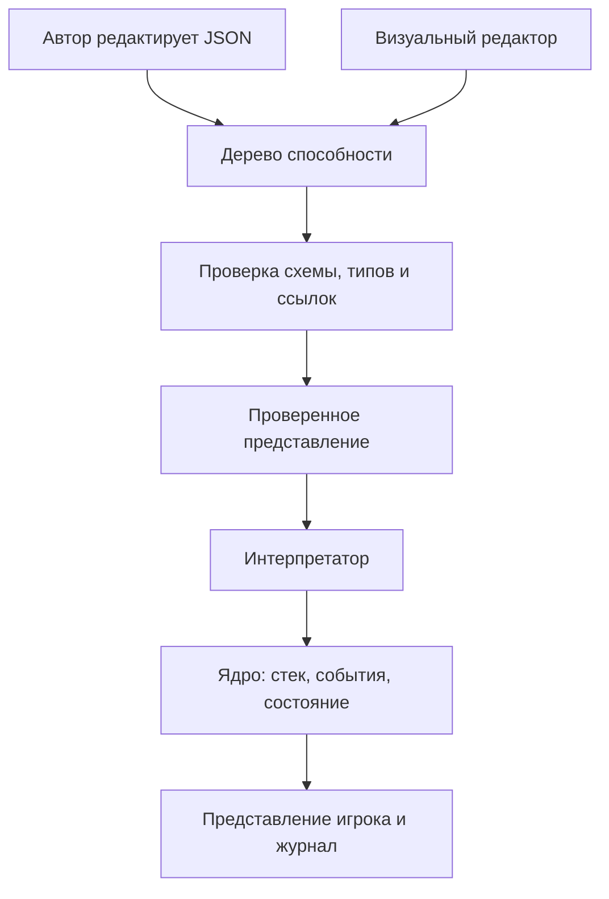
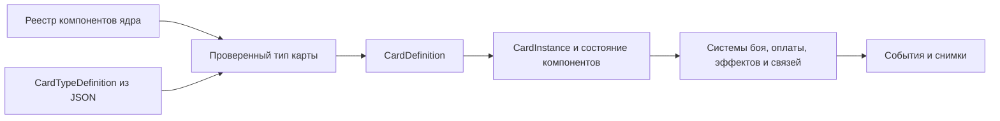

# MagicCards — гейм-дизайнерский план

**Версия:** 0.10 · **Дата:** 16.09.2026 · **Статус:** исходная спецификация; код ещё не реализован.

## 1. Назначение и подтверждённые решения

Этот документ связывает игровой замысел, правила, язык способностей, структуру реализации и проверки. Он служит источником истины для автора игры и разработчика.

**Подтверждено владельцем:**

- Нужна собственная карточная игра с понятным редактором; референсы — Hearthstone и Magic: The Gathering. Универсальность для любых карточных игр не является целью. Импорт чужих форматов возможен отдельными конвертерами.
- Фазы, стек эффектов и ответы соперника входят уже в первый рабочий прототип.
- Приоритет разработки — развитое и проверяемое ядро. Консоль служит первым клиентом и промежуточным результатом; первая публичная версия требует браузерной игры против бота и редактора.
- Вычисления, условия, локальные переменные, счётчики смертей, несколько активаций со стоимостями в ресурсах/жизнях/существах и ауры входят в MVP ядра.
- Постоянная аура и разовая выдача жетонов эффектов при событии — отдельные механизмы. Прикреплённый жетон сохраняет собственный эффект/срок и может давать усиление, ослабление или способность; 7.19.
- На этапе ядра карты редактируются в JSON. Для первой публичной версии обязателен понятный редактор карт и способностей: формы, готовые свойства и вложенные блоки.
- Бой сохраняет атаки игрока и назначение блоков; в v0.10 отдельный компонент attack_target разрешает атаковать, например, Персонажа Силы. Базовое существо его не имеет. Свойства вроде полёта ограничивают блокирование, а не вводят прямую атаку на существо.
- Виды/признаки доступны в необязательных фильтрах. Ограничения взаимодействия должны расширяться через общие правила; полёт — один из примеров.
- Автор может создавать переиспользуемые определения способностей, прикреплять их к совместимым существам/игрокам/заклинаниям и задавать параметры. Библиотека согласуется с общими правилами ядра, 7.17.
- Целевое распространение — GitHub Pages, предложения карт/способностей/колод через PR с проверками и ревью владельца.
- Игра одному против бота обязательна для первой публичной версии. Полноценный сетевой PvP сейчас не требуется.
- Пользователь может сохранять локальные черновики/колоды, импортировать и экспортировать свой формат и испытывать карты до публикации.
- Сначала меняется документация, затем реализация приводится в соответствие с ней.
- План сохраняется в этой заметке MagicCards.md внутри Obsidian.
- Типы карт строятся из компонентов ядра через CardTypeDefinition; основные типы тоже заданы JSON. Наследование используется для шаблонов, возможности проверяются по составу, 7.21.
- Жетоны и их оплата доступны совместимым существам, артефактам, чарам и другим постоянным картам. Чары — отдельная прикреплённая карта с контекстом носителя; возвращение с кладбища и показатель Сила входят в план, 7.22–7.24.
- Экономика переключается в настройках до матча: один автоматически растущий ресурс либо несколько ресурсов из карт колоды. По умолчанию — второй режим, проверочный набор «Свет и Тьма»; оба режима входят в первое ядро. Новые типы ресурсов и карты можно добавлять данными.

**Рабочие допущения v0.10:** TypeScript и браузерный стек; ограниченная модель блоков; числа баланса, размеры колод/руки, правила производства/хранения и стартовые карты ниже. Это предложения для старта, а не ранее утверждённые решения. Их изменения оформляются следующей редакцией.

Описывается собственный профиль правил, а не полная реализация или нормативное изложение MTG.

## 2. Замысел и критерий первого результата

Игрок развивает поле существ, выбирает атаки и блоки, расходует ресурс на угрозы или сохраняет его для ответов. Решения возникают как в свой ход, так и при получении приоритета в чужой.

Цикл автора: **идея карты → описание доступными операциями → сценарий проверки → партия → изменение данных**. Новое сочетание существующих эффектов должно работать без отдельного класса карты или исключения по её id.

Принципы:

1. Журнал объясняет источник, цель и результат каждого эффекта.
2. Правила целей, стоимости, повреждений и реакций едины для всех карт.
3. Сложность способностей складывается из небольшого словаря операций.
4. Ядро работает независимо от UI и воспроизводит партии.
5. Новая механика сначала описывается, затем расширяет общий интерпретатор.

**Критерий MVP ядра E8:** матч проходит в консоли и сценарном раннере; проверены стек/ответы, бой и ограничения по свойствам, фильтры видов, вычисляемые способности, составные стоимости, ауры и последствия смертей; запись воспроизводится. Ручной локальный матч на двоих доступен через последовательную передачу команд. Графический интерфейс не входит в условие готовности ядра.

Включено в ядро: профиль prototype-stack-v1 с rulesetVersion 0.10; существа, быстрые/медленные карты, ресурс, фазы, приоритет, LIFO-стек, триггеры с целями, вычисления/условия/let/foreach, несколько активаций с атомарными составными стоимостями, непрерывные бафы/дебафы и предоставляемые способности, итоги боя/разрешения и отложенные реакции; subtypes/tags/keywords, фильтры, декларативные InteractionRule, временная выдача/подавление keyword и независимые временные непрерывные эффекты; библиотека AbilityDefinition с проверкой носителей, параметрами, привязанными правилами и жизненным циклом выдач; типизированные подписки на вход/смерть/добор/атаку, создание фишек с собственными способностями, настраиваемый лимит поля и отдельные прикрепляемые жетоны эффектов (усиления, ослабления, свойства/способности). Экономика: ResourceDefinition/типизированная оплата, deck_sources по умолчанию и automatic_growth по выбору. Типизация: CardTypeDefinition/компоненты, прикрепляемые чары, жетоны как стоимость, Сила, возврат с кладбища/изгнание и компонент брони. Контент: набор duality (Свет/Тьма, 9 определений и колода 24 карты), прежние 12 core-карт для automatic_growth и отдельные механические fixtures. Инструменты: консоль, JSON-валидация, сценарный раннер, журнал, снимки и replay.

**Критерий первой публичной версии P1:** «Открыть сайт, собрать колоду, сыграть против бота, создать свою карту и испытать её». Дополнительно пользователь экспортирует проверяемый набор для PR. Обязательны B1 (игровой бот), W1 (браузерный стол), W2 (редактор/мастерская) и W3 (публикационный процесс). Подробнее — в 9, 11–13.

После P1: усиление бота, конвертеры востребованных чужих форматов, графический редактор при необходимости, баланс и оформление. Типизированные ресурсы и карты-источники уже входят в ядро по 7.20. Отдельными механическими расширениями остаются гибридные/X-цены и ограничения назначения ресурса, несколько блокирующих, произвольные замены событий, выбор посреди разрешения и рекурсивные effective-ауры. Глубина ранее выбранного ядра сохраняется. Сетевой режим, аккаунты и рейтинги не обязательны для текущей цели.

Сеттинг условно фэнтезийный, имена карт рабочие; иллюстрации ядру не нужны. Целевая длительность человеческой партии 15–25 минут — будущая гипотеза плейтеста, не критерий производительности консоли.

## 3. Базовые правила

Идентификаторы R-* используются в задачах и тестах. Числа хранятся в настройках профиля, а не в UI.

| ID | Область | Правило |
|---|---|---|
| R-01 | Игрок | Два игрока, по 20 текущего и максимального здоровья. Активный игрок — тот, чей ход; обладатель приоритета может быть другим. |
| R-02 | Колода | Ровно 24 карты; максимум две копии одного cardId, кроме карт с play.method = source_deploy из явного unlimitedCopyCardIds пресета. Допустимость определяется CompiledCardType: в deck_sources карты cast/source_deploy, в automatic_growth только cast с совместимой ценой; артефакты/чары/персонажи тоже допустимы. Колоды по умолчанию — 8.2 (Свет/Тьма); старые core 12 × 2 — для automatic_growth. Исходный порядок фиксируется, затем перемешивается генератором матча. |
| R-03 | Старт | Первый игрок определяется генератором. Оба получают по 4 карты. Пересдачи нет. Первый игрок пропускает только обычный добор своего первого хода. |
| R-04 | Экономика | GameConfig выбирает deck_sources (по умолчанию: Свет/Тьма из колоды) или automatic_growth (один ресурс, 0 → +1 в свой READY до 10). Общие ResourcePool/ResourceCost, производство и хранение по 3.2/7.20; режим не меняется внутри матча. |
| R-05 | Зоны | Колода, рука, поле, кладбище, стек и изгнание (exile). У физической карты instanceId, generation пребывания в зоне и ровно одна зона; cardId обозначает общее определение. Способность в стеке не является новой физической картой. |
| R-06 | Лимиты | До 10 карт в руке; занятых unit-слотов на поле каждого игрока — не больше GameConfig.limits.maxCreaturesPerPlayer (совместимое имя настройки; 7.21), по умолчанию 7. Добор в полную руку отправляет карту на кладбище без триггера смерти и card_drawn. Создание фишек ограничивается свободными местами при разрешении, 7.18. |
| R-07 | Существо | Базовая атака, максимальное здоровье, отмеченный урон, повёрнутость и ход входа на поле. Текущее здоровье = максимум минус урон. Порядок входа задаёт стабильный порядок объектов. |
| R-08 | Конец | Здоровье игрока ≤ 0 означает поражение при проверке состояния; обоих одновременно — ничью. После результата стек не разрешается. Сдача доступна игроку, принимающему решение. |
| R-09 | Усталость | Попытки добора из пустой колоды наносят владельцу возрастающий урон: 1, 2, 3 и далее. Счётчики раздельные. Добор нескольких карт выполняет отдельные попытки. |

«Персонаж» — игрок или существо. Колода не содержит ResourceDefinition, AbilityDefinition, EffectTokenDefinition или InteractionRule как игровых карт: type: resource ссылается на типы ресурса через производство. Произвольный порядок допустимых карт задаёт исходный список для перемешивания, а библиотечные ссылки разрешаются до матча. Ограничение 24/2 с явными исключениями для источников — рабочее правило стартового профиля, проверяемое и редактором, и ядром.

Определения карт неизменны в течение матча; повреждения, зона и модификаторы относятся к экземпляру. Исчезнувшую цель нельзя подменить другим экземпляром с тем же cardId.

### 3.1. Настраиваемый лимит поля

GameConfig задаётся при создании матча. Общая настройка для обеих сторон:

```json
{
  "limits": {
    "maxCreaturesPerPlayer": 7
  }
}
```

Значение по умолчанию — 7. Рабочий диапазон первого профиля — целое от 1 до 32; это техническое допущение v0.7, а не подтверждённое ограничение дизайна навсегда. Отсутствующий параметр нормализуется в 7, неверный тип/выход из диапазона отклоняются до создания игры. Пределы R-22/16.8 остаются отдельными техническими ограничениями; повышение вместимости не отключает защиту от циклов.

Эффективный GameConfig после нормализации фиксируется в снимке матча и replay; настройки будущей партии не меняют уже начатую. Изменение лимита посреди матча в первом ядре не поддерживается. Все проверки полного поля, включая розыгрыш существ R-13, create_token, сценарный раннер, UI и допустимые действия бота, читают одну настройку. Существующие тесты без явной настройки используют 7. Занятость считается по фактически находящимся на поле носителям unit-слота, независимо от происхождения/названия типа; карты без slot не занимают этот лимит, 7.21.

### 3.2. Выбор экономики матча

**Подтверждено владельцем v0.9:** оба режима входят в первое ядро; режим по умолчанию — ресурсы из карт колоды. Начальный набор содержит Свет и Тьму и допускает ручное дополнение новыми ресурсами/картами. Названия режимов описывают нашу экономику, а не полное копирование Hearthstone/MTG.

| economy.mode | Получение ресурса | Стартовый набор |
|---|---|---|
| deck_sources (по умолчанию) | Источники приходят из колоды, выкладываются на поле и активируются; автоматического прироста нет | duality: Свет и Тьма, раздел 8.2 |
| automatic_growth | Один выбранный ресурс: в READY своего хода увеличить базовый запас на 1 до 10 и восстановить его | core: исходные 12 карт × 2, без источников |

**Пресет по умолчанию:**

```json
{
  "presetId": "duality_sources_v1",
  "economy": {
    "mode": "deck_sources",
    "enabledResourceIds": ["duality:light", "duality:dark"],
    "sourcePlaysPerTurn": 1
  },
  "deck": {
    "size": 24,
    "maxCopiesPerCard": 2,
    "unlimitedCopyCardIds": ["duality:light_well", "duality:dark_well"]
  },
  "limits": {
    "maxCreaturesPerPlayer": 7
  }
}
```

**Пресет автоматического режима:**

```json
{
  "presetId": "automatic_energy_v1",
  "economy": {
    "mode": "automatic_growth",
    "resourceId": "core:energy",
    "initialCapacity": 0,
    "growthPerTurn": 1,
    "maxCapacity": 10
  },
  "deck": {
    "size": 24,
    "maxCopiesPerCard": 2,
    "unlimitedCopyCardIds": []
  },
  "limits": {
    "maxCreaturesPerPlayer": 7
  }
}
```

GameConfig.economy — размеченное объединение: в automatic_growth нельзя одновременно указать sourcePlaysPerTurn или несколько enabledResourceIds. Его единственный активный ресурс определяется resourceId и должен иметь poolPolicy = owner_turn_start. Для deck_sources обязателен непустой уникальный список известных ResourceDefinition, sourcePlaysPerTurn — целое ≥ 0; рабочий диапазон профиля 0–4, по умолчанию 1. Числа automatic_growth неотрицательны, initialCapacity ≤ maxCapacity, growthPerTurn > 0; базовый максимум ограничен профилем 100. Эти диапазоны — технические допущения первой реализации.

Если экономика не указана при создании новой игры, выбирается полный пресет duality_sources_v1, включая стартовую колоду и её исключения. Нельзя подставить только mode к несовместимой старой колоде. Старые fixtures автоматического ресурса получают явный automatic_energy_v1 при миграции; сохранённые партии не мигрируются незаметно.

Переключение режима доступно до начала матча и требует выбора/проверки подходящей колоды. Оно не меняет способности, бой или цены уже существующих определений: несовместимые колоды отмечаются ошибкой, ресурсные требования не обесцвечиваются автоматически. Текущая партия продолжает использовать сохранённые GameConfig, ResourceDefinition и snapshot независимо от переключателя будущей игры.

Предел копий применяется к каждому cardId, кроме явно перечисленных unlimitedCopyCardIds. Исключение разрешено только для существующих карт с play.method = source_deploy и задаётся пресетом/настройкой матча, а не самой картой. Автор нового источника может использовать до двух копий без исключения или добавить его id в пресет своего набора. Общее число карт по-прежнему ровно 24. В automatic_growth карты с source_deploy и исключения для них запрещены; cast-карты с совместимой ценой, включая новые категории, допустимы.

## 4. Фазы, приоритет и стек

### 4.1. Структура хода — R-10

| Шаг | Действие при входе | Затем |
|---|---|---|
| READY | Сбросить sourcePlaysUsed; применить экономику 3.2/7.20 и owner_turn_start-очистку; развернуть своих существ и resource-источники. В deck_sources автоматического прироста нет. | Без приоритета перейти к UPKEEP. |
| UPKEEP | Выпустить событие начала хода. | Окно приоритета. |
| DRAW | Обычный добор с исключением R-03. | Окно приоритета. |
| MAIN_1 | Нет. | Основная фаза с приоритетом. |
| COMBAT_BEGIN | Открыть CombatScope с новым combatId. | Окно перед атакой. |
| DECLARE_ATTACKERS | Активный игрок одним действием объявляет всех атакующих, включая пустой список. | Окно после объявления. |
| DECLARE_BLOCKERS | Защищающийся одним действием назначает блоки, включая пустой список. | Окно после объявления. |
| COMBAT_DAMAGE | Применить одновременный боевой урон. | Окно после урона. |
| COMBAT_END | Зафиксировать CombatSummary по 7.13, завершить участие в бою, выпустить combat_ended. | Окно приоритета после подготовки триггеров. |
| MAIN_2 | Нет. | Вторая основная фаза. |
| END | Выпустить событие конца хода. | Окно приоритета. |
| CLEANUP | Одновременно снять урон со всех существ и убрать модификаторы и временные непрерывные эффекты «до конца хода». | Проверка состояния и передача хода. |

Объявления и боевой урон не помещаются в стек. Пока игрок редактирует список атакующих/блоков до подтверждения, соперник не действует. Если атакующих нет, после окна DECLARE_ATTACKERS пропускаются блоки и урон, затем наступает COMBAT_END.

В CLEANUP обычного окна нет. Если проверка состояния породила триггеры, поместить их в стек и открыть окно; после его закрытия повторить CLEANUP.

### 4.2. Приоритет — R-11

1. При открытии окна приоритет получает активный игрок после проверок состояния и помещения ожидающих триггеров.
2. Обладатель приоритета может сыграть допустимую карту, активировать способность или выполнить PassPriority. PlayResourceCard и немедленный resource_activated подчиняются своим условиям 7.20.
3. После розыгрыша игрок сохраняет приоритет; серия пасов сбрасывается.
4. Первый пас передаёт приоритет сопернику.
5. Два последовательных паса при непустом стеке разрешают **только верхний элемент**. Затем проверки состояния, триггеры и снова приоритет активному игроку.
6. Два последовательных паса при пустом стеке закрывают окно и переводят игру к следующему шагу.
7. Розыгрыш, принятая активация (включая resource_activated), PlayResourceCard или разрешение сбрасывает серию пасов. Очистка step_end происходит только при закрытии шага, не после каждого разрешения, 7.20.

Пас не завершает весь ход. В MVP нет скрытого автопаса или безусловной кнопки обхода всех окон: возможность ответить должна сохраняться у обоих игроков.

### 4.3. Розыгрыш и цели

**R-12. Скорость и объявление.** Медленные карты и slow-активации играются только активным игроком в MAIN_1/MAIN_2, с приоритетом и пустым стеком. Базовый шаблон types:creature медленный; производный тип может явно задавать fast. Шаблон с play.method = source_deploy выкладывается отдельным PlayResourceCard по 7.20 без обычного cost/стека. Скорость и маршрут разрешения берутся из CompiledCardType, 7.21. Быстрые заклинания играются в любом окне со своим приоритетом, включая чужой ход.

CastCard содержит карту из руки, все обязательные выбранные цели и проверенный PaymentPlan для неоднозначной оплаты. Отсутствующий план может быть построен детерминированным fallback 7.20; UI до отправки показывает итог. Сначала проверяются приоритет, скорость, стоимость, цели и ограничения. Неверная команда ничего не меняет, включая RNG. Принятая CastCard оплачивается и перемещается в стек. PlayResourceCard сюда не относится. Отмена выбора до отправки команды бесплатна; после принятия возврата действия нет.

**R-13. Разрешение.** Верхний StackItem снимается со стека разрешения и исполняется целиком без передачи приоритета между эффектами. Физическая карта до завершения остаётся в зоне стека. При play.resolution = enter_battlefield карта входит на поле; attach — входит с проверенной связью по 7.22; resolve_effects — после программы уходит на кладбище. Отменённая карта уходит на кладбище без эффектов и без возврата стоимости.

При заполненной требуемой slot-группе постоянную карту нельзя объявить. Если место закончилось уже после объявления, при разрешении карта уходит на кладбище без входа и смерти на поле. Прежний случай существа — unit-slot; воскрешение оставляет карту на кладбище по 7.24. Отменённое в стеке существо также не вызывает on_death.

**R-14. Цели.** При разрешении выбранные цели проверяются повторно. Если все обязательные выбранные цели недопустимы, элемент завершается без эффектов. Если сохранилась хотя бы одна, эффекты применяются только к допустимым; существование и пригодность цели проверяются и перед конкретной операцией.

Автоматический селектор «все вражеские существа» вычисляется при выполнении эффекта и не считается выбранной целью. Пустое множество — отсутствие действия. В MVP ручные цели выбираются при объявлении карты/активации и при подготовке адресного триггера через SubmitChoice. Во время PendingDecision приоритет не выдаётся. Выбор посреди самого разрешения отложен.

«Отмена» выбирает ожидающую в стеке карту-заклинание, включая карту существа, но не триггер. Уже разрешающийся элемент недоступен для ответа.

### 4.4. Обязательный пример контрответа

А играет «Искру» и пасует. Б играет «Отмену» на «Искру» и пасует. А играет свою «Отмену» на ответ Б. После двух пасов разрешается только ответ А, отменяя «Отмену» Б. Приоритет снова у А. «Искра» разрешится лишь после следующей пары пасов. Все оплаченные стоимости сохраняются.

## 5. Бой и проверки состояния

**R-15. Атака.** Активный игрок выбирает развёрнутых носителей combat_attacker с атакой > 0 и выполненной готовностью exhaustion. Базовые существа готовы атаковать со следующего собственного хода. Для каждого атакующего указывается защищающийся игрок либо его постоянный объект с attack_target (7.21); базовые существа сами целью атаки не являются. Объявление поворачивает атакующих, кроме vigilance.

**R-16. Блоки.** Защищающийся назначает развёрнутых носителей combat_blocker. Каждый блокирует максимум одного атакующего, каждого атакующего блокирует максимум один объект. Блок не поворачивает и доступен новому существу сразу. Пары проходят InteractionRule(block); получение/потеря keyword после законного объявления пары не отменяет блок. Признак «был заблокирован» сохраняется при уходе блокирующего. При уходе выбранной постоянной цели атаки соответствующие участники удаляются из этого боя без перенаправления урона по 7.21.

**R-17. Урон.** Незаблокированный атакующий наносит урон сохранённому defender; в сохранившейся паре атакующий и блокирующий одновременно наносят урон друг другу. Заблокированный атакующий без оставшегося блокирующего не наносит урон исходному defender. Покинувшие бой/поле участники урон не наносят. Весь COMBAT_DAMAGE — один пакет с сохранёнными значениями; броня и damageable.sink обрабатываются по 7.21.

**R-18. Повреждения.** Для health-компонента существа урон увеличивает markedDamage, лечение уменьшает его до 0; здоровье игрока лечится до максимума. Для другого постоянного объекта с health применяется тот же контракт. Урон health-носителей снимается в CLEANUP. Сила и броня — отдельные показатели по 7.21/7.23 и не восстанавливаются обычным heal/CLEANUP. Destroy отправляет допустимый постоянный объект на кладбище независимо от здоровья/брони.

**R-19. Проверки состояния.** Перед выдачей приоритета, после StackItem/действия шага/оплаты искать поражения игроков и объекты, подлежащие уходу: lethal/zero health, нулевая Сила с onZero: graveyard, недопустимое обязательное прикрепление. На одной волне зафиксировать снимки и переместить найденные объекты одновременно, затем пересчитать до стабильности. Creature_died/DeathRecord создаются только для ушедших с поля на кладбище объектов категории creature. Конец матча останавливает дальнейшее разрешение.

Внутри последовательности одного StackItem обычной проверки смертельного урона нет: «урон → лечение» в одной способности может спасти существо. Явный destroy перемещает его сразу. Эта разница обязательна для тестирования.

Полёт/Захват и другие ограничения по признакам входят в MVP через данные InteractionRule по 7.15. В базовом боевом алгоритме нет отдельной ветки для каждой такой способности. Первый/двойной удар, пробивной урон, несколько блокирующих и переназначение подтверждённых блоков остаются будущими расширениями.

## 6. События и срабатывающие способности

Команда — намерение игрока; событие — произошедший факт; эффект — операция правил; триггер — реакция способности на событие. UI не меняет состояние самостоятельно.

**R-20. Триггеры.** Реакции на события накапливаются во время исполнения и помещаются в общий стек перед ближайшей выдачей приоритета, после проверок состояния. Текущее разрешение они не прерывают. На триггер можно ответить быстрым заклинанием, но «Отмена» MVP его не отменяет.

Сначала помещаются ожидающие способности активного игрока, затем другого. Внутри группы: порядок событий, входа источника на поле, индекса способности в JSON. Из-за LIFO последняя помещённая разрешается первой. Ручного упорядочивания в MVP нет; это упрощение собственного профиля.

**R-21. Смерть источника.** Одновременные смерти фиксируются по снимку до удаления. On_death каждого погибшего вызывается один раз. Уже созданная способность сохраняется после ухода источника, хранит его id, владельца и необходимые данные события. Перемещение из руки, колоды или стека на кладбище смертью не считается.

Условия читают состояние в явно заданный момент. Число погибших определяется по DeathRecord в CombatSummary/ResolutionSummary. Блок afterResolve создаёт отдельный триггер после R-19; он позволяет реагировать на смерти от завершённого разрешения без проверки «смерти» посреди effects. Подробные границы подсчёта — в 7.13.

**R-22. Пределы.** До 64 узлов и глубины 8 на способность, без циклов и произвольного кода. До 1000 операций на внешнюю команду. Дополнительно — до 1000 последовательных разрешений StackItem без нового розыгрыша или смены шага; PassPriority этот счётчик не сбрасывает. Превышение даёт техническую остановку с диагностикой, а не победу или игровую ничью.

### 6.1. Общая модель подписки

Способность вида triggered подписывается на типизированное игровое событие, а не на кнопку интерфейса или произвольное изменение поля. Команды CastCard/ActivateAbility/DeclareAttackers/PassPriority проходят проверку; отклонённая команда не создаёт игровых событий. Одна принятая команда может породить несколько событий. Пример: draw на 3 — три последовательные попытки добора, а не одно событие «взяты три карты».

Контракт triggered: trigger выбирает тип события; condition — чистый Boolean-фильтр события и контекста; targets задаёт выбор при помещении в стек; effects описывает действия при разрешении. Источник, контроллер, параметры, происхождение способности и событие фиксируются при срабатывании. Подписка активна только в области activeZones/activeOnPlayer по 7.21; legacy activeOn нормализуется по 7.17. Обычная способность существа в руке не реагирует на события поля.

Путь исполнения:

1. Операция ядра изменяет состояние и создаёт факт GameEvent с типизированным payload.
2. EventDispatcher выбирает подписки этого типа из предусмотренного событием состояния: после входа/добора/объявления атаки, до удаления — для смерти.
3. Для каждой подписки один раз вычисляется condition. При true создаётся отдельный PendingTrigger с копией контекста. Это ещё не исполнение effects.
4. Текущий ExecutionFrame продолжается. Перед выдачей приоритета проходит R-19, затем pendingTriggers помещаются в стек по R-20; обязательные цели выбираются через PendingDecision/SubmitChoice.
5. При разрешении StackItem повторно проверяются выбранные цели по R-14 и выполняются effects. События этих effects порождают новые pendingTriggers, без рекурсивного вызова обработчиков.

Отсутствующая condition означает true. На одну пару eventId + AbilityBinding/behaviorId создаётся не более одного срабатывания; две независимые per_source-выдачи — разные подписки. Пересчёт аур не создаёт повторную подписку и не проигрывает старые события. Утрата способности после срабатывания не удаляет уже сохранённый PendingTrigger/StackItem; утрата до события не даёт срабатывания.

### 6.2. Каталог событий и данные контекста

Каталог EventDefinition принадлежит версии ruleset. Он задаёт имя trigger, тип payload, момент фиксации, видимость полей и допустимые алиасы. Пользовательская AbilityDefinition выбирает событие из каталога; строка неизвестного события отклоняется. Добавление нового факта игры требует точки публикации в ядре и нового контракта, а комбинация известных событий/условий/эффектов — только JSON набора.

| Trigger | Когда создаётся | Основные поля payload |
|---|---|---|
| creature_entered | На каждое существо, фактически вошедшее на поле, включая фишку | creature: CreatureRef, controller: PlayerRef, creatureSnapshot: CreatureSnapshot, batchId |
| on_enter | Собственный вход любого permanent; канонический алиас permanent_entered с permanent = source | PermanentSnapshot; для старых типов доступна совместимая проекция creature/resource |
| creature_died | На каждую смерть с поля на кладбище, включая фишку | Поля DeathRecord по 7.13, включая isToken и creatureSnapshot |
| on_death | Собственная смерть носителя; алиас creature_died с entityRef = source | Тот же DeathRecord |
| card_drawn | Одна карта фактически взята из колоды в руку | player: PlayerRef, card: CardRef, drawIndex: Integer в данной операции, causeId; закрытый cardSnapshot |
| attackers_declared | Принят весь набор атакующих в этом бою | player, attackers: Collection<CombatantRef>, combatId |
| combatant_attacked / creature_attacked | По факту на атакующего; creature_attacked — проекция только для категории существа | player, attacker: CombatantRef, attackerSnapshot: PermanentSnapshot, defender: PlayerRef или attack_target PermanentRef, combatId |
| damage_applied | Положительный применённый урон по существующему контракту | Источник, получатель, назначенный/применённый урон, связанные frame/combat |
| turn_start / turn_end | UPKEEP / END текущего хода по R-10 | player: PlayerRef, turnId |
| combat_ended | Закрыт CombatScope перед разрешением итоговых реакций | CombatSummary по 7.13 |
| afterResolve | Локальная реакция после завершения frame и его R-19 | ResolutionSummary по 7.13; не глобальная подписка на все разрешения |
| effect_token_added / effect_token_removed | По одному факту на фактически прикреплённый/снятый жетон | host, hostSnapshot, effectToken: EffectTokenSnapshot, reason, batchId; порядок и сроки по 7.19 |
| resource_entered / resource_played / resource_left | Вход/выкладывание/уход карты-источника | ResourceCardRef/ResourceCardSnapshot, игрок и причина; on_enter для resource — алиас resource_entered, 7.20 |
| zone_changed | Успешный переход между зонами, один transitionId | cardBefore/cardAfter, from/to, reason; видимость по исходной и новой зоне |
| permanent_entered / permanent_left | Вход/уход любого permanent | permanent, permanentSnapshot, controller, transitionId, batchId; 7.24 |
| attachment_created / attachment_removed | Создание/разрушение связи чар | attachmentRef/hostRef, оба снимка, reason; 7.22 |
| armor_changed | Фактическое изменение запаса брони | object, previous, current, delta, reason, damageBatchId при уроне |
| resource_gained / resource_spent / resource_expired / resource_refilled | Изменение типизированного пула с разной причиной | player, resourceId, amount либо capacity, предыдущий/новый запас; 7.20 |

В v0.10 on_enter нормализуется в собственный permanent_entered; legacy creature/resource payload доступен как типизированная проекция того же transitionId. Одна подписка на алиас срабатывает один раз, даже если у карты несколько категорий. On_death остаётся собственным creature_died: уход артефакта/чар/чемпиона без категории существа не считается смертью. Две явно разные способности могут независимо подписаться на общий и специальный факт. Подробности проекций — 7.24.

Для пакетного входа сначала создаются все допустимые экземпляры, пересчитываются ауры и активные способности, затем фиксируются снимки всей партии входа. Creature_entered выдаются в порядке instanceId. Новые носители видят другие одновременно вошедшие существа; condition исключает source там, где написано «другое». Возможная смерть вошедшего от нулевого здоровья проверяется по R-19 и не отменяет факт входа.

Для объявления атак сначала атомарно проверяются/фиксируются все атакующие и повороты, затем attackers_declared, затем combatant_attacked в порядке instanceId, с creature_attacked-проекцией для категории существа. Между этими событиями нет ответа или исполнения триггеров. Атака — объявление существа атакующим, а не попадание или нанесение урона: последующее блокирование/уничтожение не отменяет срабатывание. Пустой набор создаёт пакетный факт объявления, но ни одного creature_attacked; «когда вы атакуете хотя бы одним» требует count(attackers) > 0.

Card_drawn в нашем профиле означает успешный переход в руку. Сброс при переполнении руки и усталость из-за пустой колоды не создают card_drawn; это отдельные факты перемещения/урона. Начальная раздача при setup не считается добором для триггеров. При draw на 3 и одном свободном месте будет один card_drawn. Импортёр обязан учитывать это правило, а не обещать тождественность чужому определению добора.

Закрытый cardSnapshot не попадает в публичный журнал/наблюдение бота и соперника. Авторская схема первого ядра разрешает читать его из триггера card_drawn только при обязательной проверке event.player = controller; это проверяется семантически. Чужой добор можно наблюдать по публичному player, но нельзя читать его скрытую карту. Snapshot/replay движка хранит полные данные отдельно от проекции наблюдения. Видимость нового поля входит в контракт EventDefinition.

CreatureSnapshot — неизменяемые entityRef, definitionId, owner, controller, isToken, subtypes, tags, colors, baseKeywords/effectiveKeywords, attack, maxHealth, markedDamage состояние tapped, effectTokens: Collection<EffectTokenSnapshot> и их количество по definitionId на момент события. EntityRef включает generation. Для смерти это состояние до ухода; для входа/атаки — после операции и актуализации аур, до следующих эффектов. Снимок не является целью damage/heal и не требует существования исходного объекта.

Boolean-литералы true/false нормализуются в типизированный Literal так же, как числовые константы.

Read_event принимает только проверенный путь поля выбранного EventDefinition; например creatureSnapshot.isToken или attackerSnapshot.attack. Это статический путь по схеме, не JavaScript и не доступ к произвольным полям GameState. Несуществующее поле/неверный тип отклоняется до матча. Has_subtype/has_tag/has_keyword получают явный режим snapshot для CreatureSnapshot по 7.15.

### 6.3. Условие срабатывания, текущая проверка и сила эффекта

| Задача автора | Где задать | Когда вычисляется |
|---|---|---|
| «Когда другой мой Дракон, не фишка, вошёл» | condition с полями creature_entered | Один раз при событии |
| «Если при исполнении у меня всё ещё есть Дракон» | if внутри effects с текущим selector/filter | При разрешении |
| «Нанести столько, сколько было атаки при объявлении» | amount через read_event attackerSnapshot.attack | Снимок фиксируется при событии, число читается при разрешении |
| «Нанести столько, сколько атаки сейчас» | amount через read_property effective | При соответствующем эффекте; исчезновение ссылки требует Optional/coalesce |
| «Посчитать погибших, даже если фишки уже исчезли» | count/filter/sum по DeathRecord итогового события | По неизменяемым записям; не по текущему кладбищу |

Condition не выполняется второй раз автоматически. Если проверка нужна и при событии, и при разрешении, она явно записывается в обоих местах; редактор может предложить такой шаблон. Фильтр события не равен фильтру выбранной цели: источник события не становится целью, пока автор не указал targets.

**Пример: каждый успешный собственный добор восстанавливает 1 здоровье игроку.** Это inline-способность носителя на поле; библиотечная версия может применяться к creature/player с соответствующим activeOn.

```json
{
  "id": "comfort_on_draw",
  "kind": "triggered",
  "trigger": "card_drawn",
  "condition": {
    "type": "equal",
    "left": { "type": "read_event", "field": "player" },
    "right": { "context": "controller" }
  },
  "effects": [
    { "type": "heal", "target": { "context": "controller" }, "amount": 1 }
  ]
}
```

Три успешных добора дают три срабатывания, которые разрешаются отдельно. Лечение не выполняется внутри операции draw.

**Пример: когда это существо атакует, нанести сопернику урон, равный атаке при объявлении.**

```json
{
  "id": "attack_echo",
  "kind": "triggered",
  "trigger": "creature_attacked",
  "condition": {
    "type": "equal",
    "left": { "type": "read_event", "field": "attacker" },
    "right": { "context": "source" }
  },
  "effects": [
    {
      "type": "damage",
      "target": { "context": "opponent" },
      "amount": {
        "type": "max",
        "left": 0,
        "right": { "type": "read_event", "field": "attackerSnapshot.attack" }
      }
    }
  ]
}
```

Это отдельный урон способности, не боевой пакет. Бонус атаки, полученный в ответ, не меняет сохранённую величину. Уничтожение атакующего в ответ тоже не стирает снимок. Для «удвоенной атаки» тот же read_event вкладывается в multiply с 2. Для силы по числу погибших используются DeathRecord/итоги по 7.13; менять диспетчер событий для таких формул не нужно.

### 6.4. Интерфейс авторства и диагностика

В редакторе triggered строится блоками: «Когда» (событие) → «При каких условиях» (and/or/not и поля этого события) → «Что сделать» → «Как вычислить величину» → «Нужны ли выбранные цели». После смены события несовместимое поле подсвечивается ошибкой, а не молча удаляется. Рядом с полем показано «значение при событии» или «текущее значение при исполнении».

Пример понятной настройки: «Когда существо вошло → другое + моё + Дракон + не фишка → создать Дракона 5/5». Другой пример: «Когда я взял карту → если при исполнении есть раненое своё существо → вылечить выбранное допустимое существо». Для такого шаблона цели всё равно выбираются при помещении в стек и повторно проверяются по R-14; if не переносит выбор в середину effects.

Диагностика связывает команду, eventId, bindingId, результат condition, PendingTrigger, StackItem и эффекты через causeId/frameId. Полный диагностический контекст доступен сценарному раннеру; публичная проекция скрывает секретные поля. Подписки индексируются по типу события, исполнение очереди итеративное; лимиты R-22/16.8 защищают также цепочки «добор → новый добор» и «вход → создание новых существ». Техническая остановка содержит причинную цепочку, а не маскируется под игровую ничью.

## 7. Язык карт и JSON

### 7.1. Что именно мы называем языком

**Card DSL** — небольшой предметный язык для описания игровых способностей. Он определяет доступные конструкции, их типы, правила исполнения и связь с состоянием матча. **JSON** — формат сохранения этих конструкций. **Интерпретатор** — часть движка, которая выполняет описанную способность.

Например, объект с type: damage имеет смысл только потому, что движок знает контракт damage: допустимая цель, целочисленная величина урона, изменение состояния и возникающее событие. Сам JSON эту семантику не задаёт.

Описание способности — дерево операций (**AST**). Вложенный if содержит условие и две ветви, каждая ветвь — список эффектов. Автор может редактировать дерево вручную или собирать его в редакторе.



Редактор и текстовый синтаксис не создают отдельного игрового языка: оба должны преобразовываться в одно представление. В MVP достаточно JSON, валидатора и интерпретатора. Компиляция в проверенное представление означает разрешение ссылок и проверку типов, а не генерацию и запуск JavaScript.

**Архитектура языка включает развитый словарь первого ядра.** Выражения, локальные значения, составные стоимости, ауры и итоги событий входят в MVP и обрабатываются едиными механизмами. Это оставляет место для вычислений без специальной логики в каждом эффекте.

Вычисления, стоимости, ауры и итоги боя ниже обязательны для MVP ядра. Только явно помеченные «следующее расширение» конструкции не входят в его приёмку. Наличие примера не заменяет поддерживаемую capability.

### 7.2. Определение карты, экземпляр и контекст

Определение карты — общие данные: id, название, тип и совместимые с ним поля: скорость/стоимость, текст, характеристики и inline-способности либо ссылки на AbilityDefinition по 7.17. Стоимость — ResourceCost по 7.20; прежнее число нормализуется в generic. У resource нет скорости/обычной цены/характеристик существа, его контракт в 7.20. Для canonical v3 тип и допустимые поля определяет CompiledCardType: ограничения предыдущего предложения относятся к встроенному types:resource, а пользовательский источник может сочетать source_deploy с другими совместимыми компонентами. Экземпляр — конкретная карта или созданная фишка с instanceId, зоной, повреждениями и модификаторами; признак isToken и TokenDefinition описаны в 7.18. Изменение одного экземпляра не меняет остальные копии и исходный JSON.

Каждое исполнение способности получает контекст:

| Имя | Значение | Когда фиксируется |
|---|---|---|
| source | Носитель исполняемой способности: карта/фишка либо PlayerRef по 7.17; ссылка и снимок необходимых данных | Для triggered фиксируется при событии; в остальных случаях при создании элемента стека |
| controller | Игрок, управляющий этим элементом | Для triggered фиксируется при событии; в остальных случаях при создании элемента стека |
| opponent | Другой игрок в текущем профиле на двоих | Относительно controller |
| targets | Именованные выбранные экземпляры или StackItem | При объявлении карты |
| event | Данные события, породившего триггер | В момент события; доступны только соответствующей способности |
| locals | Локальные неизменяемые результаты вычислений | Внутри одного ExecutionFrame |
| sourceSnapshot | Effective-снимок источника | Для активации/разыгранной карты — до оплаты; для triggered — при событии по 6.1–6.2, включая снимок до смерти |
| costReceipt | Платежи и снимки жертв по costId | До применения атомарного платежа |
| capturedLocals | Копия локальных значений родителя | При создании afterResolve/отложенной реакции |
| params | Проверенные параметры библиотечной способности; read_param по 7.17 | При связывании intrinsic-прикрепления или выдаче AbilityInstance; в StackItem копируются |
| attached_to / attachedSnapshot | Исходный носитель чар и его снимок; это не source | При фиксации контекста, по 7.22; Optional обрабатывается явно |
| grantSource/originGrant | Источник выдачи способности, отличный от её носителя source | При выдаче; сохранение по 7.17 |
| candidate | Текущий объект, проверяемый фильтром | Только в области filter |
| attacker/blocker или actor/target | Типизированные роли проверяемого взаимодействия | Только при вычислении InteractionRule соответствующего interaction по 7.15 |

В примерах ссылка на игрока `{ "context": "controller" }` означает игрока, управляющего способностью, независимо от того, чей сейчас ход. Поэтому собственная быстрая карта в чужой ход работает на своего владельца.

Чтение текущего свойства живого объекта и чтение снимка события — разные операции. Например, количество урона в event уже зафиксировано, а текущая атака source могла измениться после ответа соперника. Уход источника с поля не даёт права произвольно подставлять старые значения: контракт конкретного чтения должен явно разрешать снимок либо сообщать об отсутствии объекта.

Типы внутреннего представления:

| Тип | Пример | Зачем различать |
|---|---|---|
| Integer | 3, вычисленная величина урона | Не принимать существо вместо количества |
| Boolean | Цель повреждена | Проверять условия if |
| PlayerRef | controller | Отличать игрока от карты |
| CreatureRef | Выбранное существо | Проверять эффекты характеристик |
| ResourceCardRef | Карта-источник на поле | Отдельный тип без attack/health; tap/destroy/совместимые способности |
| ResourceCardSnapshot | Данные источника до ухода/оплаты | История без выдуманного CreatureSnapshot |
| CharacterRef | Игрок или существо, прежнее объединение | Legacy-селекторы сохраняют область; новый damage использует DamageableRef |
| CardRef | Карта в конкретной зоне и generation | Перемещения, в том числе возвращение с кладбища |
| PermanentRef / PermanentSnapshot | Карта на поле / её неизменяемый снимок | Общие эффекты и события для любых составных типов |
| CombatantRef | Permanent с combat_body | Атака/блокирование независимо от категории существа |
| DamageableRef / HealthRef | Совместимый объект с damageable / health | Различать урон по Силе и восстановление здоровья |
| ExhaustibleRef / TokenHostRef / AbilityHostRef | Объект с нужной структурной capability | Поворот, жетоны, выдача/активация способностей |
| StackItemRef | Ожидающее заклинание | Проверять отмену |
| Collection<T> | Набор существ | Различать одну цель и множество |
| Optional<T> | Объект может отсутствовать | Требовать явной обработки отсутствия |
| CreatureSnapshot | Неизменяемые данные входа, атаки или смерти, включая жетоны эффектов | Читать прошлые характеристики без живого экземпляра; не использовать снимок как цель эффекта |
| EffectTokenSnapshot | Данные конкретного прикреплённого жетона | Различать историю эффекта и существующий экземпляр на носителе |

Это типы DSL, даже если реализация написана на TypeScript. TypeScript сам по себе не проверит JSON, пришедший из набора карт.

**Пример ошибки автора:** draw принимает PlayerRef, поэтому попытка взять карту «для выбранного существа» должна отклоняться до начала партии.

### 7.3. Селекторы, фильтры и выбор целей

Селектор отвечает «какие объекты рассматриваются», фильтр — «какие из них подходят», выбор — «какой объект указал игрок». У этих действий разные моменты исполнения.

**MVP: объявляемая цель.**

```json
{
  "targets": [
    {
      "id": "victim",
      "selector": "enemy_creature",
      "count": 1
    }
  ]
}
```

Движок показывает допустимых вражеских существ. Игрок выбирает одно; команда сохраняет его instanceId под именем victim. При разрешении та же цель проверяется по R-14. Новое существо с тем же cardId её не заменяет.

**MVP: цель с фильтром.**

```json
{
  "targets": [
    {
      "id": "victim",
      "selector": "enemy_creature",
      "count": 1,
      "filter": { "type": "is_damaged" }
    }
  ]
}
```

Так объявляется цель «Добивания». Filter применяется к кандидату. При объявлении и повторной проверке цель должна иметь повреждения. Если ответ «Исцелением» полностью снял их, единственная обязательная цель стала недопустимой и карта не выполняет эффекты.

**MVP: автоматическое множество.**

```json
{
  "type": "damage",
  "target": { "selector": "all_enemy_creatures" },
  "amount": 1
}
```

Здесь игрок ничего не выбирает. Множество фиксируется в начале эффекта при разрешении, урон применяется одним пакетом. Существо, появившееся на поле до этого момента, включается; появившееся позже — нет. Пустой набор означает отсутствие урона.

Словарь селекторов v1: self, friendly_player, enemy_player, friendly_creature, enemy_creature, friendly_character, enemy_character, all_enemy_creatures, pending_spell. Имена friendly_* трактуются относительно controller. Self используется в автоматических эффектах существа; pending_spell — в объявляемой цели с count: 1 и проверкой R-14.

Составные фильтры входят в MVP ядра. Filter — Boolean-выражение по candidate и контексту (локальная переменная item в foreach задаётся отдельно); оно использует сравнения/and/or/not из 7.4. Например, «вражеские существа с атакой меньше атаки источника» — обычный запрос с less и read_property. Для разовых эффектов доступен effective, для непрерывных селекторов аур разрешён только BaseView по 7.7. Дополнительные селекторы: all_friendly_creatures, other_friendly_creatures, all_creatures и character (персонаж любой стороны). Источник исключается по instanceId/generation, а не по cardId.

У любого селектора filter необязателен, в том числе у all_enemy_creatures. Has_subtype/has_tag и has_keyword(base/effective) описаны в 7.15. Селектор сам не проверяет боевую досягаемость и не скрывает существ по keyword; ограничения конкретного действия задаются отдельно.

### 7.4. Значения, условия и локальные переменные — обязательная часть MVP ядра

В MVP ядра включены вычисляемые значения, составные условия, запросы к коллекциям и локальные переменные. Число-константа остаётся краткой записью Literal; новый тип выражения не требует отдельной версии каждого эффекта.

#### Типы, арифметика и ошибки

Числа DSL — знаковые 32-битные целые. Поддерживаются literal, add, subtract, multiply, min, max, abs, negate. Переполнение проверяется; неявного переноса JavaScript, дробных чисел, NaN и Infinity нет. Деление в первом ядре не поддерживается. Damage/heal/draw и стоимости требуют результат ≥ 0; отрицательные значения для бафов/дебафов допустимы в modify_stat.

Логические операции: equal, not_equal, less, less_or_equal, greater, greater_or_equal, and, or, not. And/or вычисляются слева направо с коротким замыканием. If вычисляет только выбранную ветвь. Equal сравнивает значения одного типа; ссылки — по instanceId плюс generation, а не по названию карты.

Контракты выражений:

| Узел | Результат | Семантика |
|---|---|---|
| literal | Integer/Boolean | Явное значение |
| read_property | Тип объявленного свойства | Чтение base/effective/snapshot, без произвольного пути в GameState |
| read_event | Тип поля события | Неизменяемый снимок породившего события |
| local | Тип ранее объявленного имени | Зафиксированное значение в текущем ExecutionFrame |
| count | Integer | Число элементов коллекции |
| exists | Boolean | Есть хотя бы один элемент |
| filter | Collection<T> | Стабильный исходный порядок подходящих элементов |
| sum | Integer | Сумма числового выражения по коллекции; пустая сумма 0 |
| if_value | Общий тип обеих ветвей | Вычисляется только выбранная ветвь |
| coalesce | T | Явное значение вместо отсутствующего Optional<T> |

Лексическая область: let виден последующим узлам своего effects и вложенным блокам. Объявления внутри if/foreach не видны после блока; повторное объявление имени в одной области запрещено. Локальные значения неизменяемы. Состояние одной активации не разделяется с другой.

У read_property явно указывается read:

- base — исходная характеристика текущего экземпляра до модификаторов.
- effective — значение после всех применимых модификаторов сейчас.
- snapshot — данные контекста sourceSnapshot/события/оплаченной жертвы в зафиксированный момент.

Чтение отсутствующего объекта возвращает Optional, а не 0. Его необходимо обработать coalesce/exists или использовать снимок. Валидатор запрещает передать Optional<Integer> напрямую в amount. TypeScript-типы не заменяют проверку загруженного JSON.

#### Пример: урон равен удвоенной атаке источника

Способность существа наносит выбранной цели удвоенную текущую атаку. Если источник покинул поле, применяется снимок его атаки при создании StackItem. Это явная семантика конкретной способности.

```json
{
  "type": "damage",
  "target": { "selected": "victim" },
  "amount": {
    "type": "multiply",
    "left": {
      "type": "coalesce",
      "value": {
        "type": "read_property",
        "object": { "context": "source" },
        "property": "attack",
        "read": "effective"
      },
      "fallback": {
        "type": "read_property",
        "object": { "context": "sourceSnapshot" },
        "property": "attack",
        "read": "snapshot"
      }
    },
    "right": { "type": "literal", "value": 2 }
  }
}
```

Дано: атака 3 при активации. Без ответа получается 6 урона. Если до разрешения источник усилили до 5, получается 10. Если источник уничтожен, используется исходный снимок 3 и получается 6. Усиление до 5, затем уход с поля также даёт 6: fallback — снимок активации, а не автоматически последнее известное значение. Для другого замысла автор фиксирует значение let раньше или выбирает доступный снимок события.

#### Пример: зафиксировать количество, затем изменить поле

```json
{
  "effects": [
    {
      "type": "let",
      "name": "n",
      "value": {
        "type": "count",
        "items": { "selector": "all_enemy_creatures" }
      }
    },
    {
      "type": "destroy",
      "target": { "selector": "all_enemy_creatures" }
    },
    {
      "type": "draw",
      "player": { "context": "controller" },
      "amount": { "type": "local", "name": "n" }
    }
  ]
}
```

Если перед разрешением было три вражеских существа, n = 3, они уничтожаются, затем выполняются три попытки добора. Count после destroy дал бы 0; let намеренно сохраняет прежний результат. Локальное n — число, а не «живой запрос».

Снимок Collection<Ref> сохраняет участников и их порядок, но не делает объекты бессмертными: при обращении к ушедшему экземпляру снова применяется правило Optional. Снимок Collection<DeathRecord> сохраняет сами записи о смертях, а не ссылки на живое поле.

#### Пример: составное условие

```json
{
  "type": "if",
  "condition": {
    "type": "and",
    "items": [
      {
        "type": "greater_or_equal",
        "left": {
          "type": "count",
          "items": { "selector": "all_enemy_creatures" }
        },
        "right": 2
      },
      {
        "type": "less",
        "left": {
          "type": "read_property",
          "object": { "context": "controller" },
          "property": "health",
          "read": "effective"
        },
        "right": 10
      }
    ]
  },
  "then": [
    { "type": "heal", "target": { "context": "controller" }, "amount": 3 }
  ],
  "else": []
}
```

Числа 2, 10 и 3 нормализуются в Literal. Проверяются обе ветви типов при загрузке, но исполняется только нужная ветвь. Этот пример лечит на 3, если у противника минимум два существа, а у владельца меньше 10 здоровья.

#### Обход коллекций и доступный контекст

Foreach входит в ядро: при входе фиксируется конечная коллекция; каждый элемент обрабатывается один раз в порядке instanceId/порядке исходного события. Перемещение карты не добавляет её повторно в обход. Не более 128 элементов одной коллекции обхода; превышение — диагностическая ошибка. Внутри блока доступно item, внутри filter/sum — соответствующий элемент выражения.

Условия и выражения чистые: они не добирают карты, не оплачивают стоимости, не расходуют RNG и не изменяют состояние. Даже exists не должен скрыто создавать игровые объекты.

Ошибку выражения в объявляемой команде обнаруживать до оплаты, когда нужные значения известны. Ошибка во время разрешения останавливает технический прогон с указанием карты, узла и контекста. Транзакция внешней команды не публикует частично выполненное состояние; диагностическая копия и причина сохраняются отдельно. Непредусмотренный отрицательный damage не превращается молча в лечение.


### 7.5. Контракты эффектов

Все изменения состояния проходят через игровые операции ядра. Интерпретатор не присваивает произвольные поля GameState по инструкции из JSON.

| Эффект v1 | Аргументы | Результат и ограничения |
|---|---|---|
| damage | target: DamageableRef или разрешённое множество; amount: Integer ≥ 0 | Урон по R-17–R-19; множество обрабатывается одновременно |
| heal | target: HealthRef; amount: Integer ≥ 0 | Лечение health до максимума; Сила/броня не лечатся, ушедший экземпляр не возвращается |
| draw | player: PlayerRef; amount: Integer ≥ 0 | Последовательные попытки добора с лимитом руки и усталостью; card_drawn только при успешном переходе в руку |
| gain_resource | player: PlayerRef; resources: resourceId → Integer ≥ 0 | Добавить разрешённые типы в пул, resource_gained; сроки по ResourceDefinition/7.20 |
| create_token | tokenRef: TokenDefinition; controller: PlayerRef; amount: Integer ≥ 0 | Создать партию фишек до лимита поля, события входа и жизненный цикл по 7.18 |
| apply_effect_token | definitionId; target: TokenHostRef/множество; amount: Integer ≥ 0 на получателя; duration | Прикрепить независимые жетоны к зафиксированным получателям по 7.19 |
| remove_effect_token | definitionId; target: TokenHostRef/множество; amount: Integer ≥ 0 на получателя | Снять самые ранние экземпляры указанного жетона, без снятия других эффектов, 7.19 |
| destroy | target: PermanentRef или разрешённое множество | Уход с поля на кладбище; DeathRecord только для категории creature, общие события 7.24 |
| modify_attack | target: существо; amount: Integer > 0 | Сокращение положительного modify_stat(attack), действует до выхода получателя с поля |
| modify_stat | target: PermanentRef с соответствующим attack/health-компонентом или их коллекция; stat: attack/max_health; amount: Integer; duration | Знаковый баф/дебаф через вклад модификатора, правила 16.7 и 7.19 |
| create_delayed_trigger | event, scopeId, condition, effects и захватываемый контекст | Однократная подписка до конца текущего боя; сохраняется после ухода источника |
| modify_keyword | target: существо или множество; operation: grant/remove; keyword; duration | Разовый вклад для любого объявленного keyword; remove доминирует над grant, правила 7.16 |
| create_continuous_effect | duration: until_end_of_turn; modifiers | Создать независимый временный источник непрерывных вкладов, включая новых получателей, правила 7.16 |
| grant_ability | target: совместимый AbilityHostRef либо игрок/множество; ability: ref/params либо inline; duration | Создать AbilityInstance, проверить appliesTo и stacking; ограничения выдаваемых continuous по 7.17 |
| suppress_ability | target: совместимый AbilityHostRef либо игрок/множество; definitionId; duration | Маскировать все выдачи данного определения на выбранных incarnation; не отменять уже созданные StackItem, 7.17 |
| counter_spell | target: StackItemRef | Отмена ожидающей карты, разыгранной через cast, включая постоянную; не отменяет триггеры или source_deploy |
| return_to_battlefield | target: CardRef кладбища; controller; optional attachmentHost | Новая incarnation, проверка slot/связи, вход по 7.24 |
| exile_top | player: PlayerRef; amount: Integer ≥ 0 | Изгнать верхние min(amount, размер колоды), без draw/усталости, 7.24 |
| gain_armor / lose_armor | target: носитель armor; amount: Integer ≥ 0 | Явно изменить защитный запас, минимум 0; не лечит health/Силу, 7.21 |

Для массового destroy все выбранные существа перемещаются одним пакетом, их смерти фиксируются по снимку до удаления. Последовательные одиночные destroy — другая последовательность событий.

Массив effects — последовательность. If содержит такие же массивы then/else, поэтому операции композиционны и не требуют специальных вариантов для каждой карты.

**MVP: последовательность для «Архивиста».**

```json
{
  "type": "draw",
  "player": { "context": "controller" },
  "amount": 1
}
```

События операций содержат источник и идентификатор разрешаемого элемента. Damage с amount: 0 не создаёт событие положительного урона; heal, фактически восстановивший 0, не создаёт событие положительного лечения. Диагностический журнал может отдельно показать операцию без изменения состояния.

Результаты effects и записи событий содержат применённый урон, перемещения и ссылки на frame. Урон учитывается полной применённой величиной, включая избыточный; потеря положительного здоровья может считаться отдельным полем и не подменяет damageAmount. «Погиб от урона» определяется после R-19 через ResolutionSummary/CombatSummary, а не проверкой текущего здоровья посреди эффекта.

### 7.6. Как способность проходит через движок

**MVP: полный пример быстрой карты.**

```json
{
  "id": "examples:heated_insight",
  "name": "Пламенное озарение",
  "type": "spell",
  "speed": "fast",
  "cost": 3,
  "text": "Выберите вражеское существо. Если оно повреждено, нанесите ему 4 урона, иначе 2. Затем возьмите карту.",
  "targets": [
    { "id": "victim", "selector": "enemy_creature", "count": 1 }
  ],
  "effects": [
    {
      "type": "if",
      "condition": {
        "type": "is_damaged",
        "target": { "selected": "victim" }
      },
      "then": [
        { "type": "damage", "target": { "selected": "victim" }, "amount": 4 }
      ],
      "else": [
        { "type": "damage", "target": { "selected": "victim" }, "amount": 2 }
      ]
    },
    {
      "type": "draw",
      "player": { "context": "controller" },
      "amount": 1
    }
  ]
}
```

Это учебная карта в пространстве examples, не тринадцатая карта стартовой колоды.

Разбор исполнения:

1. При загрузке проверяются схема, имена, типы и доступность всех операций. Selected victim связывается с объявлением цели.
2. При выборе карты ядро возвращает допустимые цели. UI отправляет CastCard с выбранным instanceId.
3. Ядро проверяет команду, списывает ресурс, перемещает карту в стек и сохраняет контекст. Срабатывания обрабатываются по общим правилам.
4. Соперник получает возможность ответить через протокол приоритета. JSON карты сам приоритет не передаёт.
5. После двух пасов верхний элемент начинает разрешаться. Victim снова проверяется.
6. Если цель допустима, вычисляется is_damaged и применяется 4 или 2 урона; затем выполняется добор.
7. Во время списка effects соперник не отвечает. Даже смертельно повреждённое существо пока не уходит с поля от проверки состояния.
8. Заклинание завершает разрешение и уходит на кладбище; выполняются R-19, затем ожидающие триггеры помещаются в стек по R-20.
9. Если матч продолжается, активный игрок получает приоритет.

Пример состояния: у цели максимум 5 здоровья и отмечено 1 повреждение. Без ответа условие истинно: ещё 4 урона, затем добор, затем смерть на проверке состояния. Если ответ лечением снял повреждение, ветвь наносит 2, затем добор, цель остаётся на поле.

Если цель покинула поле до разрешения, единственная обязательная цель недопустима: не выполняются ни урон, ни добор, стоимость не возвращается. Если сам добор приводит к поражению от усталости, конец матча определяется по общей проверке состояния после элемента.

Текст на карте нужен игроку. Движок исполняет дерево, а не пытается понимать русскую фразу. В MVP соответствие текста и дерева проверяется при ревью.

### 7.7. Способности, составные стоимости и ауры — обязательная часть MVP ядра

Карта может иметь несколько независимых способностей в abilities. У каждой стабильный id в пределах определения карты. StackItem и команда ссылаются на definitionId/instanceId и abilityId; выбор способности не определяется её позицией в массиве или русским текстом.

Поддерживаются четыре формы: effects самой разыгранной карты, activated, triggered и continuous. Прежняя запись trigger: on_death без kind нормализуется в triggered при загрузке, но новые примеры используют явный kind.

#### Активируемые способности и разные стоимости

Активация выполняется по команде ActivateAbility. Следующий контракт относится к обычному kind: activated; ограниченный немедленный kind: resource_activated отдельно описан в 7.20. Fast-активация разрешена при своём приоритете в любом окне; slow — только активному игроку в MAIN_1/MAIN_2 при пустом стеке. Стоимости и targets принадлежат конкретной способности. В одном экземпляре может быть одновременно несколько fast/slow-способностей.

Пример существа с двумя активациями. Первая тратит ресурс и поворачивает источник. Вторая тратит жизни и жертвует другое своё существо, используя его зафиксированную атаку.

```json
{
  "id": "examples:blood_artificer",
  "name": "Кровавый ремесленник",
  "type": "creature",
  "speed": "slow",
  "cost": 3,
  "attack": 2,
  "health": 4,
  "text": "Две активации: 2 ресурса и поворот — 2 урона врагу; 2 жизни и жертва другого своего существа — лечение своему персонажу на атаку жертвы.",
  "keywords": [],
  "abilities": [
    {
      "id": "charged_strike",
      "kind": "activated",
      "speed": "fast",
      "costs": [
        { "type": "spend_resource", "amount": 2 },
        { "type": "tap", "object": { "context": "source" } }
      ],
      "targets": [
        { "id": "victim", "selector": "enemy_character", "count": 1 }
      ],
      "effects": [
        { "type": "damage", "target": { "selected": "victim" }, "amount": 2 }
      ]
    },
    {
      "id": "blood_exchange",
      "kind": "activated",
      "speed": "fast",
      "costs": [
        { "type": "pay_life", "amount": 2 },
        {
          "id": "offering",
          "type": "sacrifice",
          "selector": "friendly_creature",
          "excludeSource": true,
          "count": 1
        }
      ],
      "targets": [
        { "id": "beneficiary", "selector": "friendly_character", "count": 1 }
      ],
      "effects": [
        {
          "type": "heal",
          "target": { "selected": "beneficiary" },
          "amount": {
            "type": "max",
            "left": 0,
            "right": {
              "type": "read_cost",
              "costId": "offering",
              "index": 0,
              "property": "attack"
            }
          }
        }
      ]
    }
  ]
}
```

Read_cost получает effective-характеристику жертвы из CostReceipt до оплаты. Уход ауры во время оплаты не пересчитывает уже сохранённое значение. Read_cost вне соответствующей активации — ошибка контекста.

Перед включением учебной карты в игровой набор текст сверяется с обеими способностями, числом целей и временем чтения атаки жертвы.

**Стоимость — отдельный язык платежей, не произвольный effects.** В первом ядре разрешены spend_resource, pay_life, tap, sacrifice и точные pay_effect_tokens/place_effect_tokens по 7.23. У стоимости нет if с побочными эффектами, ответов соперника и промежуточных триггеров. Количество ресурса/жизней может быть выражением, вычисляемым один раз до оплаты.

| Стоимость | Допустимость | Что происходит |
|---|---|---|
| spend_resource | Весь ResourceCost покрывается exact + generic и проверенным PaymentPlan, 7.20 | Списать actualSpent по типам, записать resource_spent/CostReceipt |
| pay_life | Суммарно хватает текущего здоровья | Здоровье уменьшается; это LifePaid, не DamageApplied |
| tap | Свой развёрнутый ExhaustibleRef на поле; readiness берётся из компонента exhaustion | Объект поворачивается |
| pay_effect_tokens | Полностью хватает заранее существовавших жетонов у выбранного своего TokenHostRef | Резервировать и снять ровно amount; CostReceipt до снятия, 7.23 |
| place_effect_tokens | Пустой маркер на source с конечным usageGroup; допустим лимит копий | Добавить ровно amount как оплату, не исполнять произвольные effects, 7.23 |
| sacrifice | Выбранные свои существа или явно указанные resource-источники на поле; фильтры/количество соблюдены | Существа дают DeathRecord(reason = sacrifice), источники — resource_left; снимки до оплаты, 7.20 |

Готовность для tap-стоимости базового существа — то же ограничение входа, что для атаки; в других типах её задаёт exhaustion.readyDelay. Новое существо можно пожертвовать, но нельзя оплатить его поворотом до следующего собственного хода. У abilities без tap такой задержки нет, если её не задаёт контракт.

Pay_life допускает оплату ровно оставшихся жизней. Все законные стоимости выполняются, после чего R-19 фиксирует поражение; способность не успевает вылечить игрока. Например, при 2 здоровья blood_exchange с ценой 2 законен, но проигрывает матч после оплаты. При 1 здоровья команда незаконна и ничего не меняет.

#### Атомарная оплата и её связь со стеком

1. Проверить право активировать abilityId, скорость, лимиты использования и все объявленные targets.
2. Получить выбор жертв и объектов tap из команды; рассчитать все числовые стоимости на одном исходном снимке.
3. Построить CostPlan: суммарные ресурс/жизни, уникальные объекты, будущие перемещения и CostReceipt.
4. Проверить весь план. Одну карту нельзя пожертвовать дважды или повернуть дважды. Поворот и жертва одного существа в одной стоимости допустимы: сначала оно поворачивается, затем жертвуется.
5. Для обычной activated в одной транзакции создать StackItem способности с sourceSnapshot, targets и CostReceipt; применить повороты, списание ресурса/жизней, заранее зарезервированные снятия/добавления жетонов и usageGroup, затем одновременно жертвы. Все платежи и лимиты проверены до первого изменения; добавленные в этой оплате жетоны не оплачивают её другие компоненты.
6. Пересчитать непрерывные модификаторы и выполнить проверки состояния. Только теперь поместить накопленные триггеры по R-20 поверх активированной способности.
7. Если матч продолжается и нет ожидаемых выборов триггеров, приоритет остаётся у активировавшего игрока.

Нет частичной оплаты, если не хватило последнего компонента. Нет окна ответа между pay_life и sacrifice. После принятия активации вернуть стоимость нельзя, даже если источник уничтожен или эффект лишился цели.

Жертва существа вызывает on_death, поскольку оно уходит с поля по причине sacrifice. Жертва resource-источника вызывает только resource_left, 7.20. Эти триггеры лежат выше оплаченной способности; после пары пасов первыми разрешаются они. Сама способность уже существует и сохраняется после жертвы источника.

Объект может одновременно быть выбранной целью и оплаченной жертвой, если фильтр стоимости это разрешает. Тогда при разрешении цель отсутствует, а платежи остаются. Интерфейс/консоль должны объяснить последствие, но не заменять правило запретом.

Общий usageGroup нескольких активаций описан в 7.23 и не заменяется независимыми лимитами. Необязательный usageLimit поддерживает timesPerTurn. Счётчик привязан к incarnation источника + abilityId; расходуется при успешной оплате, отмена способности его не возвращает. Без лимита повторная активация возможна, если можно снова законно оплатить стоимость.

#### Триггеры, чужие события и выбор целей

Поддерживаются собственные on_enter/on_death, общие creature_entered/creature_died, card_drawn, creature_attacked/attackers_declared, turn_start/turn_end, damage_applied, effect_token_added/effect_token_removed, события resource_* по 7.20, combat_ended и локальный afterResolve. Каталог событий, алиасы, снимки и моменты вычисления — в 6.1–6.4. Начальные и конечные события относятся к ходу; combat_ended — к боевому интервалу; остальные содержат типизированные снимки источника/цели и причин.

Для turn_start/turn_end payload содержит player: PlayerRef активного игрока и turnId. Это позволяет библиотечным реакциям явно выбрать собственный ход по controller носителя.

Новый триггер может иметь condition по снимку event и targets. Condition проверяется один раз при возникновении события. Дополнительное условие, которое должно быть истинно при разрешении, автор выражает через if внутри effects. Так временные моменты не смешиваются.

При подготовке триггера с целью движок создаёт PendingDecision. Владелец способности выбирает допустимую цель командой SubmitChoice, затем StackItem занимает своё заранее определённое место в порядке R-20. Это не передача приоритета и не возможность ответить до завершения постановки всех триггеров.

Если обязательных целей нет, такой триггер не помещается в стек; событие TriggerSkipped объясняет причину. В MVP обязательные выборы имеют count ≥ 1; «можно выбрать 0» вводится отдельно, чтобы не путать отсутствие цели и потерю ранее выбранной цели.

Одновременные триггеры упорядочиваются по R-20. Выборы обрабатываются в порядке помещения, без обхода очереди и ручной перестановки. При сохранении игры сохраняются ожидающий выбор, eventSnapshot, кандидатуры/ограничения и следующая сторона, которая получит приоритет.

#### Ауры: усиления, ослабления, ключевые слова и способности

Continuous-способность регистрирует модификаторы, пока её источник находится в activeZone. Для первого ядра activeZone = battlefield. Аура не создаёт StackItem на каждом пересчёте и не изменяет печатные характеристики карты.

Пример ауры: другим своим существам +1 атаки/+1 максимального здоровья и vigilance; всем вражеским — −1 атаки.

```json
{
  "id": "war_banner",
  "kind": "continuous",
  "activeZone": "battlefield",
  "modifiers": [
    {
      "id": "allied_strength",
      "selector": "other_friendly_creatures",
      "operation": "add_stats",
      "attack": 1,
      "health": 1
    },
    {
      "id": "allied_watch",
      "selector": "other_friendly_creatures",
      "operation": "grant_keyword",
      "keyword": "vigilance"
    },
    {
      "id": "enemy_weakness",
      "selector": "all_enemy_creatures",
      "operation": "add_stats",
      "attack": -1,
      "health": 0
    }
  ]
}
```

Каждый ModifierContribution от способности карты имеет origin = incarnation источника + abilityId + modifierId + incarnation получателя. Независимый ContinuousEffectInstance из 7.16 использует effectInstanceId + modifierId + incarnation получателя. Уход источника ауры удаляет только её вклады; повторный пересчёт не прибавляет их ещё раз. Разово выданный жетон эффекта имеет собственный origin по 7.19 и не удаляется из-за ухода выдавшей карты. Новое подходящее существо получает вклад при входе. Две одинаковые ауры складывают числовые бонусы, но не создают два независимых флага vigilance.

Поддерживаемые операции continuous v1:

- add_stats: знаковые attack/health.
- grant_keyword/remove_keyword: любой keyword из проверенного индекса AbilityDefinition выбранного снимка контента, без отдельного обработчика для каждого имени.
- grant_rule/remove_rule: cannot_attack и cannot_block.
- grant_ability: прежний inline triggered/activated либо ссылка на библиотечную AbilityDefinition. В v0.5 выдаваемое определение может также иметь привязанные interaction_rule и continuous со stat/rule-вкладами; повторная непрерывная выдача/подавление способностей или keyword внутри полученного определения запрещена по 7.17.

Пример другого эффекта ауры: дать другим своим существам дополнительную активацию лечения.

```json
{
  "id": "healing_discipline",
  "kind": "continuous",
  "activeZone": "battlefield",
  "modifiers": [
    {
      "id": "teach_heal",
      "selector": "other_friendly_creatures",
      "operation": "grant_ability",
      "ability": {
        "id": "granted_heal",
        "kind": "activated",
        "speed": "fast",
        "costs": [
          { "type": "tap", "object": { "context": "source" } }
        ],
        "effects": [
          { "type": "heal", "target": { "context": "controller" }, "amount": 1 }
        ]
      }
    }
  ]
}
```

Source полученной способности — получатель, а originGrant хранит происхождение от ауры. Когда аура исчезает, новые активации недоступны; уже созданная способность остаётся в стеке. Два источника дают две способности с разными originGrant, но один поворот существа не оплачивает две активации.

#### Порядок вычисления непрерывных эффектов

В первом ядре применяется фиксированный конвейер. Библиотечные определения и источники активности нормализуются по 7.17; это уточняет порядок v0.4:

1. **BaseView:** печатные характеристики/признаки, включая keywordId intrinsic-ссылок, владелец, зона, повёрнутость и отмеченный урон.
2. **Поставщики:** с учётом масок включить intrinsic continuous и ContinuousEffectInstance; выбрать их получателей и величины по одному BaseView. Effective-чтения здесь запрещены. Учесть уже прикреплённые EffectTokenInstance: их получатель и величины компонентов зафиксированы, новые экземпляры при пересчёте не создаются.
3. **Способности/keyword:** собрать выдачи и подавления, применить маски, объединить unique, получить действующие AbilityInstance и effective keywordId по 7.17.
4. **Вклады:** включить разрешённые stat/rule continuous действующих выданных способностей. Суммировать attack/maxHealth-вклады всех источников; grant/remove_rule сохраняет приоритет remove.
5. **Поведение:** собрать привязанные interaction_rule, активации и подписки по стабильным origin-id. Повторный пересчёт не выпускает on_enter и не дублирует поведение.
6. **EffectiveView:** attack для атаки/урона ограничен снизу 0; maxHealth может стать ≤ 0. Текущее здоровье = maxHealth − markedDamage.
7. Перед выдачей приоритета выполнить R-19 и повторить пересчёт после смертей до стабильности.

Такая модель позволяет предсказуемо тестировать бафы/дебафы. Пример «+1 атаки существам с базовой атакой ≤ 2» допустим. Взаимно зависимые ауры «усиливать, пока итоговая атака < 3» не допускаются в v1; для них позже понадобится отдельная модель зависимостей, а не неограниченный поиск устойчивого состояния.

Эффективные характеристики пересчитываются после изменения фактов, до чтения следующего эффекта. Это ещё не проверка смертей. Например, после destroy источника ауры следующий узел того же StackItem увидит уменьшившееся maxHealth, но обычная смерть от здоровья проверяется только на R-19. Уже явно уничтоженный объект обратно не появляется.

Увеличение maxHealth не снимает markedDamage. Пример: существо 2/2 имеет 1 повреждение; аура +0/+2 делает максимум 4 и текущее здоровье 3. Уход ауры возвращает максимум 2, текущее 1. Существо с 3 повреждениями и максимумом 4 погибнет после снятия этой ауры.

При одновременном уничтожении ауры и получателей события/подписки берутся по снимку перед удалением: выданные триггеры смерти успевают сработать. Если источник ауры ушёл раньше отдельным событием, последующая смерть получателя уже не имеет утраченной выданной способности.

#### Предотвращение и замена событий: описанный следующий этап

Фазы/стек, выражения, активации/стоимости и указанные ауры обязательны в MVP ядра. Произвольные замены «вместо урона лечение» пока не включены в его приёмку: они требуют разрешить конкурирующие замены и предотвращение циклов. Точка расширения остаётся явной:

```text
Предлагаемое событие → будущие замены/предотвращение
                    → применённое событие → триггеры
```

Это единственный статус «следующий этап» в данном подразделе; перечисленные выше активации и ауры больше не отложены ради UI.


### 7.8. Как добавлять новые операции

Расширение имеет четыре уровня:

| Изменение | Пример | Необходимая работа |
|---|---|---|
| Новая композиция | Урон по условию, затем добор | JSON, текст, сценарии карты; ядро не меняется |
| Новая переиспользуемая способность/ограничение | Призрачного блокирует только видящий духов | AbilityDefinition и привязанный InteractionRule в JSON библиотеки, packVersion и сценарий; алгоритм ядра не меняется. Глобальные изменения требуют rulesetVersion |
| Новый общий примитив | Вернуть существо в руку | Контракт, типы, обработчик ядра, схема, описание редактора и проверки |
| Новая модель взаимодействий | Новая зона, действие или замена урона | Сначала правила жизненного цикла/порядка, затем расширение ядра и DSL |

Реестр операций — явная таблица доверенных возможностей движка. Каждая запись содержит стабильный id, категорию, аргументы и типы, доступный контекст, поддерживаемую версию, обработчик, ограничения и метаданные для редактора.

**Проект расширения: карточка контракта return_to_hand.**

| Поле | Предлагаемый контракт |
|---|---|
| Категория | Effect |
| Вход | Один CreatureRef на поле |
| Действие | Переместить карту в руку её владельца |
| Полная рука | Для этого расширения предлагается отправление на кладбище без on_death, поскольку перемещение не является смертью |
| Модификаторы | Снять относящиеся к пребыванию на поле |
| Событие | ZoneChanged с источником, откуда/куда и причиной |
| Метаданные редактора | Блок «Вернуть в руку», вход «существо» |
| Проверки | Обычный возврат, полная рука, исчезнувшая цель, уход источника ауры |

Контракт — предложение для будущей версии, не действующее правило v1. После его принятия та же операция позволит описывать возврат по условию, возврат при событии и возврат множества через ограниченный обход. Не нужны отдельные обработчики каждой карты.

Добавление операции требует:

1. Описать игровое поведение, аргументы, события и граничные случаи.
2. Назначить capability и определить совместимость.
3. Добавить типизированный узел и структурную/семантическую проверку.
4. Реализовать общую операцию ядра через его штатные изменения состояния.
5. Добавить сценарии и метаданные блока редактора.
6. Только затем разрешить ссылку на операцию в наборах.

Реестр можно разделить на доверенные модули basic, combat, zones, modifiers. Модули собираются с приложением и проходят ревью. JSON-набор не загружает произвольный JavaScript и не выбирает файл обработчика на диске или URL.

### 7.9. Проверки, ошибки и ограничения

Три уровня проверки:

| Уровень | Что обнаруживает | Пример |
|---|---|---|
| Структура JSON Schema | Неверные поля, типы, обязательные значения, неизвестные узлы | Damage без amount |
| Семантика DSL | Неверные типы ссылок, отсутствующий target id, недоступный контекст, неподдерживаемая capability | Selected victim без объявления; event у обычного заклинания |
| Игровая проверка | Допустимость конкретного действия в текущем состоянии | Чужой приоритет; цель уже вылечена; ресурс потрачен |

JSON Schema проверяет данные по схеме; наличие в ней if/then/else не исполняет игровые ветви if/then/else нашей карты. Это разные уровни. См. [условную валидацию JSON Schema](https://json-schema.org/understanding-json-schema/reference/conditionals).

**Пример диагностического сообщения:**

```text
Карта: examples:heated_insight
Путь: effects[1].player
Ожидалось: PlayerRef
Получено: CreatureRef из targets.victim
Исправление: выберите controller или другой допустимый PlayerRef.
```

Ошибочный набор отклоняется до матча с полным списком доступных ошибок, без запуска части его карт. Неизвестные поля не игнорируются молча. Ошибка команды сохраняет состояние без изменений. Внутренняя ошибка исполнения — техническая остановка с контекстом, а не обычная недопустимость действия.

Лимиты R-22 применяются и к вложенным ветвям, и к цепочкам триггеров. Foreach входит в MVP с конечным снимком коллекции и лимитами 7.4/16.8; изменения во время обхода не расширяют автоматически исходный список. Неограниченные repeat не поддерживаются. Полноценные циклы while, рекурсия, eval и доступ к внешним системам не входят в язык.

Дополнительно по 7.15: неизвестный keyword/subtype/tag, несуществующая роль interaction, попытка рекурсивного interaction_allowed, effective-запрос в ауре и попытка добавить глобальные правила через обычный card pack отклоняются до матча. Привязанные библиотечные правила допустимы при проверенных hostRole/appliesTo по 7.17. В сообщении указываются id карты/правила и путь JSON. Пустое множество keyword допустимо; неизвестное имя не считается просто отсутствующим признаком.

Данные скрытых зон не попадают в ошибки и представление другого игрока. Возможность DSL читать игровую информацию задаётся правилами конкретного селектора; доступ ядра ко всему GameState не даёт UI такой же доступ.

### 7.10. Версии, наборы и воспроизведение

Различать schemaVersion (формат данных), rulesetVersion (семантика игры), packVersion (контент и баланс) и engineVersion (реализация). Для этой редакции нормативны **schemaVersion = 3, rulesetVersion = 0.10**. Это проектные версии: код и машинные схемы ещё не созданы.

Новый формат CardDefinition использует typeId → CardTypeDefinition из 7.21. Наследование шаблонов разворачивается при загрузке; ContentSnapshot содержит исходные и скомпилированные определения, зависимости, версии и хеши. Манифесты наборов дополнительно допускают cardTypes и typeCategories; отсутствующие списки пусты. Встроенные типы поставляет ruleset, поэтому обычной карте не нужно экспортировать их копии.

**Пример манифеста небольшого учебного набора:**

```json
{
  "schemaVersion": 3,
  "rulesetId": "prototype-stack-v1",
  "rulesetVersion": "0.10",
  "packId": "examples",
  "packVersion": "0.1.0",
  "requires": [
    "effect.damage",
    "effect.draw",
    "control.if",
    "condition.is_damaged"
  ],
  "cards": ["cards/heated_insight.json"],
  "decks": []
}
```

Манифест требует все реально использованные расширяемые узлы: неизвестная capability или пропущенный requires — ошибка набора. Базовые компоненты типов, выбор целей и зоны входят в указанный ruleset. ComponentRegistry хранит capabilityId расширяемого компонента; если он не входит в базовый профиль, набор также объявляет этот capabilityId. Структурное свойство носителя health и требование реализации effect.heal — разные пространства имён.

RulesetManifest задаёт id/version/schemaVersion, requires, встроенные типы/категории, typeAliases, creatureCategoryId, AbilityDefinition/InteractionRule, EventDefinition и globalInteractionRules. CardPackManifest может содержать subtypes/tags/colors, cardTypes/typeCategories, resourceDefinitions, abilityDefinitions, tokenDefinitions, effectTokenDefinitions, interactionRules и dependencies. Пользовательское правило не становится глобальным из-за загрузки. Общий снимок включает объединение требований профиля и наборов.

Форматы 1/2 и ранние примеры этой заметки с type/speed, appliesTo/activeOn читаются явным адаптером 7.21. Он поддерживает только ранее определённые конструкции; новые компоненты, attachment, marker-cost и power_meter требуют schemaVersion 3. Числа нормализуются в Literal, старая числовая цена — в generic. Старый appliesTo сохраняет ограничение области применения, а не открывает способность всем новым типам. Авторский экспорт W2 всегда канонический: typeId и проверенные component/hostRequirements-контракты.

Нормализация выполняется до связывания всего набора. Смешивание typeId с legacy type или несовместимых новых и старых объявлений — ошибка, а не выбор одного значения по приоритету. Допускается импорт ранних JSON-примеров в манифест v3 через явно включённый адаптер; результат и факт миграции видны в диагностике.

Replay сохраняет версии и полный снимок контента, включая типы, категории и обработчики компонентов по версии. Изменение карты, родительского типа или базовой способности не меняет начатую/сохранённую партию. Старый replay не пересчитывается автоматически по новым правилам; неподдерживаемая версия отклоняется. Семантическое изменение существующей операции требует новой rulesetVersion. Новая комбинация известных компонентов меняет packVersion, новый примитив — код/схему/правила и проверки.

Пример отказа: карта требует effect.return_to_hand, которого нет в первом ядре. Набор отклоняется с путём к операции; неизвестный эффект нельзя молча пропустить.


### 7.11. Редактор и дополнительные способы авторства

На этапе E1–E8 автор может менять JSON вручную. **Редактор W2 обязателен для первой публичной версии P1** и позволяет создать обычную карту и переиспользуемую способность без ручного JSON. Основной интерфейс — формы и вложенные блоки; граф со стрелками и текстовый DSL остаются последующими способами представления.

Редактор использует метаданные реестра: damage показывает цель и величину; draw — игрока и количество; if — условие и две ветви. Проверяются types, appliesTo/activeOn, параметры и доступный контекст. Ошибка показывается рядом с полем, а сохранение/запуск проходят тот же валидатор, что загрузка набора.

**Пользовательский путь создания карты:**

1. Выбрать creature/spell, задать стоимость и допустимые характеристики. Поля атаки/здоровья доступны существу.
2. Задать вид и признаки; выбрать готовые способности из библиотеки. Несовместимый с носителем Полёт не предлагается заклинанию.
3. Добавить «При событии», «Активация», «Постоянный эффект» или допустимую часть разрешения заклинания. Переиспользуемую способность можно открыть отдельно и редактировать как AbilityDefinition.
4. Настроить цель и необязательные фильтры: «своё существо → зверь → болотный»; поле количества и повторная проверка имеют общие правила R-14.
5. Выбрать эффект и величину: например, «лечить на 3» либо выражение «удвоенная атака источника». Вложенные блоки предоставляют if/let/снимки/стоимости из ядра с подсказками по их смыслу.
6. Просмотреть карточку, проверить ошибки и нажать «Испытать»: сценарий с заданным полем или партия с ботом по 9.5.

Пример из 7.17 в редакторе: карточка «Полёт» → «Ограничение блокирования» → «Носитель — атакующий» → «Блокирующему нужен Полёт или Захват». Автор может открыть привязанное правило по ссылке или хранить его внутри определения; интерфейс объясняет оба варианта обычными словами, JSON формируется автоматически.

W2 поддерживает структурное отображение всех узлов действующего core-профиля; частые операции имеют простые формы, сложные — вложенные типизированные блоки. Наличие ручного JSON-режима не подменяет возможность создать базовую карту, фильтр и AbilityDefinition через интерфейс.

**Логическая структура примера способности; стрелки показывают порядок, а не требование графического UI W2:**

```text
[Цель: вражеское существо → victim]
                  ↓
       [victim повреждено?]
          да ↙       ↘ нет
    [Урон 4]         [Урон 2]
          ↘           ↙
       [Взять controller 1 карту]
```

Позиции/свёрнутость блоков относятся к данным редактора. Будущий граф — ещё одно представление того же дерева и его ссылок. Позиции блоков, масштаб и свёрнутость сохраняются в отдельных данных редактора; они не меняют игровой результат и не участвуют в исполнении.

Игровое описание можно частично генерировать из поддерживаемых шаблонов поведения. Ручной текст хранится отдельно от полученной подсказки; после изменения effects редактор показывает, что описание нужно сверить. Ни ручной, ни сгенерированный текст не исполняется и не заменяет AST. Неподдерживаемый шаблон текста не приводит к выдуманному описанию.

Важная проверка редактора: JSON → формы/блоки → JSON сохраняет игровую семантику, ids, параметры и связи библиотеки. Отображение неизвестной новой операции старым редактором не должно приводить к её удалению при сохранении: редактирование такого набора блокируется с сообщением о несовместимости.

**Проект расширения: текстовый синтаксис.**

```text
when self enters:
    damage opponent by 2
    draw controller 1
```

Такой текст потребует парсера и преобразуется в тот же AST. Отдельный runtime для текстовых карт не создаётся. Русский игровой текст не исполняется и не является исходником программы.

Готовые языки условий, такие как CEL и JsonLogic, полезны как архитектурные ориентиры: окружение выражений ограничивается приложением, правила можно хранить в структурированном виде. Для проекта рекомендуется собственное типизированное дерево, чтобы условия, эффекты и редактор использовали единый контракт. CEL/JsonLogic не вводятся зависимостями v1. См. [CEL](https://cel.dev/overview/cel-overview?hl=en) и [JsonLogic](https://jsonlogic.com/).

### 7.12. Обязательное ядро и следующие расширения

| Возможность | Статус |
|---|---|
| Фазы, приоритет, стек, ответы, базовый бой | Обязательно в MVP ядра |
| Константы, арифметика, сравнения, and/or/not, if, запросы | Обязательно в MVP ядра |
| Let, filter/count/sum/exists и ограниченный foreach | Обязательно в MVP ядра |
| Несколько активируемых способностей, resource/life/tap/sacrifice | Обязательно в MVP ядра |
| Триггеры с ручными целями, SubmitChoice | Обязательно в MVP ядра |
| Каталог EventDefinition, creature_entered/card_drawn/creature_attacked и снимки | Обязательно в MVP ядра, 6.1–6.4 |
| TokenDefinition/create_token, isToken в смертях, self-жертва | Обязательно в MVP ядра, 7.18 |
| Настройка maxCreaturesPerPlayer, разовый бонус без переучёта новых существ | Обязательно в MVP ядра, 3.1 и 7.19 |
| Жетоны эффектов: stat/keyword/ability, выдача/снятие/подсчёт и сроки | Обязательно в MVP ядра, 7.19 |
| Типы из компонентов, компиляция наследования, категории, hostRequirements и общие ссылки | Обязательно в MVP ядра, 7.21 |
| Прикреплённые чары, attached_to, общие события входа/ухода | Обязательно в MVP ядра, 7.22 |
| Точные платежи жетонами, Сила, общие группы активаций | Обязательно в MVP ядра, 7.23 |
| Возвращение с кладбища и exile_top | Обязательно в MVP ядра, 7.24 |
| Расходуемая броня и выбор атакуемого объекта с attack_target | Обязательно в MVP ядра, рабочие правила 7.21 |
| Перенос жетона между носителями, выбор конкретного экземпляра, универсальные операции над чужими видами counters | Отдельное следующее расширение; базовая выдача жетонов не откладывается |
| Статовые ауры, ключевые слова, запреты и grant_ability | Обязательно в MVP ядра |
| Бафы/дебафы, текущие значения и явные снимки | Обязательно в MVP ядра |
| Виды/tags, необязательные фильтры и base/effective keywords | Обязательно в MVP ядра, 7.15 |
| Декларативные ограничения block/contact; сочетание свойств через AND | Обязательно в MVP ядра, 7.15 |
| Modify_keyword и временные независимые ContinuousEffectInstance | Обязательно в MVP ядра, 7.16 |
| Библиотека AbilityDefinition/AbilityInstance, hostRequirements, params, ref/inline behavior | Обязательно в MVP ядра, 7.17 |
| Grant/suppress_ability, unique/per_source, on_resolve для one_shot | Обязательно в MVP ядра, 7.17 |
| CombatSummary/ResolutionSummary, afterResolve, однократный delayed_trigger | Обязательно в MVP ядра |
| Консоль, fixtures, сценарии, полные партии, replay | Обязательно в MVP ядра |
| Браузерный стол, игровой бот, редактор-форма/блоки, локальная мастерская | После E8, но обязательно для публичного P1 |
| Граф со стрелками, текстовый DSL, конвертеры чужих форматов | После P1 по потребности |
| Статусы заморозки/сна/безмолвия с длительностью и подавлением | Следующий этап по 7.14; запреты и жизненный цикл аур уже предусмотрены ядром |
| Произвольные замены событий и рекурсивные effective-ауры | Отдельная следующая механическая спецификация |
| Два режима экономики, пользовательские типы, источники и exact/generic-оплата | Обязательно в MVP ядра, 3.2/7.20/8.2 |
| Выбор посреди effects, несколько блокирующих, гибридные/X-цены и ограничения расхода | Следующее расширение; не подменять существующими командами |

Карты связываются с обработчиками один раз при загрузке; определения переиспользуются экземплярами. Подписки индексируются по событию, сохраняя R-20. Ауры пересчитываются по детерминированному конвейеру 7.7. Порядок обхода, кэширование и логирование не должны менять результат.

Критерий расширяемости: новую комбинацию описанных возможностей добавляют данными и тестом. Если каждая новая комбинация требует правки ядра, контракт недостаточно общий.

### 7.13. Смерти после атаки, итоги разрешения и отложенные эффекты

Эта возможность обязательна для первого ядра. Её основа — **записи произошедших событий и завершённые интервалы**, а не сравнение количества карт в кладбище до и после действия.

#### Что считается смертью

Каждая смерть создаёт DeathRecord: eventId, entityRef(instanceId, generation), definitionId, owner, controller, isToken, creatureSnapshot (effective-характеристики, subtypes/tags/colors/keywords и остальные поля 6.2 перед уходом), fromZone, toZone, reason, frameId, combatId при наличии и ссылки на связанные события урона. Reason различает destroy, sacrifice, lethal_damage, zero_max_health и aura_cascade.

Возврат в руку, перемещение со стека на кладбище и переполнение руки не являются смертью. Повторно вошедшая та же физическая карта получает новую generation; её новая смерть — новое событие. Старый DeathRecord неизменяем, в том числе после прекращения существования фишки по 7.18. Фишки входят в обычный подсчёт смертей; исключение задаётся явно через isToken. Поэтому «число смертей» и «число уникальных физических карт» различаются; по умолчанию count считает события смерти.

Обычное поле source в DeathRecord не должно выдавать выдуманного единственного убийцу: при совместном уроне и снятии ауры причин может быть несколько. Frame и reason определяют точный выбранный ниже вид подсчёта.

#### Интервал боя и момент фиксации

CombatScope получает новый combatId при входе в COMBAT_BEGIN. Он собирает атакующих/блоки, пакеты урона и все DeathRecord до входа в COMBAT_END, включая смерти от ответов и триггеров в окнах этого боя.

При входе в COMBAT_END ядро закрывает CombatScope, фиксирует неизменяемый CombatSummary, очищает участие в бою и выпускает combat_ended. Все дальнейшие смерти в окне COMBAT_END и от ответов на итоговые способности в этот summary не добавляются. Это предотвращает пересчёт результата собственным эффектом.

Если атакующих не объявили, бой всё равно завершается с пустым attackers; смерти от заклинаний в COMBAT_BEGIN могут быть в deaths. Способность «после того, как вы атаковали» дополнительно требует count(event.attackers) > 0 и event.attackingPlayer = controller.

| Вопрос автора | Поле/фильтр |
|---|---|
| Сколько существ погибло за этот бой от любых причин? | count(event.deaths) |
| Сколько погибло непосредственно от боевого пакета? | count(event.combatDamageDeaths) |
| Сколько вражеских существ погибло за бой? | Filter event.deaths по controller относительно владельца способности |
| Сколько погибло моих атакующих? | DeathRecord.entityRef входит в event.attackers, controller = controller |
| Сколько разных физических карт погибло? | Явная distinct по instanceId; отдельная операция, не неявный count |

CombatDamageDeaths — существа, погибшие в первой волне проверки состояния сразу после COMBAT_DAMAGE из-за markedDamage ≥ положительного maxHealth и получившие положительный урон в этом боевом пакете. Смерти следующих волн от снятия ауры попадают только в deaths с reason = aura_cascade. Существа с maxHealth ≤ 0 считаются zero_max_health. Это проверяемое определение собственного профиля; оно не пытается угадывать единственную причинную карту.

Для общих ResolutionSummary первая волна после элемента аналогично отделяется от каскадов, а список deaths включает все смерти в его effects и всех последующих волнах R-19. Оплата стоимости относится к отдельному PaymentFrame и не считается результатом будущего разрешения способности.

#### Пример: за каждую смерть в бою нанести урон и вылечить

Пассивная способность постоянного источника после **вашего** боя с хотя бы одним атакующим наносит вражескому игроку N урона и лечит выбранного своего персонажа на N. N равно всем смертям за бой, включая ответы, жертвы и каскады аур.

```json
{
  "id": "harvest_after_attack",
  "kind": "triggered",
  "trigger": "combat_ended",
  "condition": {
    "type": "and",
    "items": [
      {
        "type": "equal",
        "left": { "type": "read_event", "field": "attackingPlayer" },
        "right": { "context": "controller" }
      },
      {
        "type": "greater",
        "left": {
          "type": "count",
          "items": { "type": "read_event", "field": "attackers" }
        },
        "right": 0
      }
    ]
  },
  "targets": [
    { "id": "beneficiary", "selector": "friendly_character", "count": 1 }
  ],
  "effects": [
    {
      "type": "let",
      "name": "fallen",
      "value": {
        "type": "count",
        "items": { "type": "read_event", "field": "deaths" }
      }
    },
    {
      "type": "damage",
      "target": { "context": "opponent" },
      "amount": { "type": "local", "name": "fallen" }
    },
    {
      "type": "heal",
      "target": { "selected": "beneficiary" },
      "amount": { "type": "local", "name": "fallen" }
    }
  ]
}
```

Выбор beneficiary выполняется перед помещением триггера в стек; потом соперник может ответить. Можно выбрать самого игрока или своё существо. Если единственная объявленная цель исчезла, R-14 прекращает весь элемент, включая урон сопернику. Если автор хочет независимые результаты, он описывает два самостоятельных триггера либо использует автоматические цели; не обходит правило молчаливым исключением.

Чтобы считать только прямые смерти от боевого урона, заменить поле deaths на combatDamageDeaths. Чтобы наносить урон выбранному вражескому существу, объявить отдельный target с selector enemy_creature и направить damage туда. Это композиция того же языка.

Для подсчёта только вражеских смертей используется обычный filter над неизменяемыми записями:

```json
{
  "type": "count",
  "items": {
    "type": "filter",
    "items": { "type": "read_event", "field": "deaths" },
    "as": "death",
    "where": {
      "type": "equal",
      "left": {
        "type": "read_property",
        "object": { "type": "item", "name": "death" },
        "property": "controller",
        "read": "snapshot"
      },
      "right": { "context": "opponent" }
    }
  }
}
```

#### Пошаговая проверка подсчёта

Дано: источник способности остаётся на поле. Объявлена атака. Одно существо уничтожено ответным заклинанием до DAMAGE; два погибли непосредственно от боевого урона; ещё одно — в следующей волне от исчезновения ауры.

1. На входе COMBAT_END фиксируется deaths = 4, combatDamageDeaths = 2.
2. Способность выбирает своего игрока целью лечения и помещается в стек.
3. Соперник отвечает и уничтожает ещё одно существо.
4. Итоговый триггер всё равно использует 4, поскольку summary уже закрыт.
5. Он наносит 4 урона и лечит на 4 в пределах здоровья; при варианте combatDamageDeaths — 2 и 2.
6. Если источник уничтожен **после** появления триггера, способность остаётся. Если он погиб **до** combat_ended, обычной battlefield-подписки уже нет и триггер не возникает.

Если нужно «объявив атаку, гарантированно выполнить эффект после боя, даже если источник погиб», применяется отложенная подписка: на событии attackers_declared создаётся один delayed_trigger до combat_ended текущего combatId, с зафиксированным controller и sourceSnapshot. Она существует независимо от источника и удаляется после единственного срабатывания. Это входит в ядро как create_delayed_trigger; бессрочные и повторяющиеся отложенные подписки в первом профиле запрещены.

#### После разрешения: урон, затем число погибших

Для «нанесите массовый урон; затем вылечитесь за каждое погибшее существо» вводится блок afterResolve у заклинания или активируемой способности. Основной effects выполняется целиком, затем R-19, затем формируется ResolutionSummary. AfterResolve создаёт **отдельную отвечаемую способность**, а не продолжает прерванное разрешение.

```json
{
  "effects": [
    {
      "type": "damage",
      "target": { "selector": "all_enemy_creatures" },
      "amount": 2
    }
  ],
  "afterResolve": {
    "effects": [
      {
        "type": "heal",
        "target": { "context": "controller" },
        "amount": {
          "type": "count",
          "items": { "type": "read_event", "field": "deaths" }
        }
      }
    ]
  }
}
```

AfterResolve получает event = ResolutionSummary этого элемента, sourceSnapshot и controller; локальные значения завершённого основного frame доступны как неизменяемые capturedLocals. Его собственные let имеют новую область. Блок создаётся только после нормального разрешения родителя, не после отмены или завершения без эффектов из-за всех недопустимых целей, и не после конца матча.

Сначала в общей постановке идут ранее накопленные реакции обычных событий; afterResolve имеет порядковый номер события завершения элемента. Затем ко всем применяется группировка сторон R-20. Поведение относительно других триггеров не зависит от порядка обхода объектов.

DeathRecord жертвы при оплате не входит в этот ResolutionSummary. Смерти от других триггеров, которые разрешатся позднее, также не входят. Если автор хочет посчитать весь бой или ход, он выбирает соответствующий интервал, а не расширяет задним числом завершённое разрешение.

Важный предел: afterResolve не меняет R-19. Существо от обычного смертельного урона не умирает посреди основного effects; для результата смерти используется отдельный следующий элемент с собственным окном ответов.


### 7.14. Статусы: заморозка, сон и подавление способностей — после MVP ядра

По предложению владельца полноценная система временных статусов оставлена для развития. В ядре уже нужны запреты cannot_attack/cannot_block и управляемое включение/исчезновение аур; на их основе статусы добавляются как данные с жизненным циклом. Это не повод создавать отдельные исключения для каждой карты.

Различать три независимых аспекта:

- **Запреты действий:** нельзя атаковать, блокировать или активировать способность.
- **Подавление способностей:** не работают activated/triggered/continuous определённых категорий.
- **Срок действия:** до конкретного шага, пока действует источник, до снятия или указанного события.

Название «сон» само по себе не определяет эти правила. Для собственного профиля предлагаются следующие шаблоны; это проект следующей версии, не уже реализованные механики:

| Статус | Предлагаемое поведение | Что сохраняется |
|---|---|---|
| Заморозка | Cannot_attack до конца следующего собственного хода получателя | Блок, ауры и способности доступны, если отдельно не запрещены |
| Сон | Cannot_attack + cannot_block и запрет активаций до начала следующего собственного хода | Триггеры и ауры по умолчанию продолжают действовать |
| Безмолвие | Подавить activated, triggered и continuous до снятия | Базовая атака/здоровье и возможность боя; чужие числовые бафы/дебафы остаются |

Если нужен сон с отключением ауры, шаблон сна дополнительно включает continuous в suppressAbilities. Ключевые слова подавляются отдельным параметром; отключение ауры автоматически не означает потерю vigilance из другого источника.

**Проект структуры статуса:**

```json
{
  "type": "apply_status",
  "target": { "selected": "victim" },
  "status": {
    "definitionId": "statuses:deep_sleep",
    "prohibitions": ["cannot_attack", "cannot_block"],
    "suppressAbilities": ["activated", "triggered", "continuous"],
    "suppressKeywords": false,
    "duration": {
      "type": "until_next_controller_turn_start"
    }
  }
}
```

Это будущий узел effect.apply_status; набор с ним не допускается в первый core-профиль без новой capability. Duration привязывается при применении к конкретному ближайшему будущему началу хода controller получателя. Если статус наложен в его текущий ход, текущий START уже не подходит. Истечение выполняется на входе READY до выдачи приоритета; порядок повторного включения аур и checkpoint фиксируется вместе с реализацией статусов.

StatusInstance хранит statusInstanceId, definitionId, получателя с generation, источник/владельца применения, appliedAt, expiresAt/условие и категориальные ограничения. Повторное наложение создаёт отдельный экземпляр; по умолчанию длительности не перезаписываются. Пока остаётся хотя бы один запрещающий экземпляр, действие запрещено. Remove_status явно задаёт конкретный экземпляр или все совпадающие definitionId.

Статус прикреплён к пребыванию получателя на поле и снимается при его выходе; повторный вход не наследует его. Срочный статус по умолчанию живёт до своего срока даже после ухода наложившего источника. Связь «только пока источник активен» задаётся отдельной длительностью.

#### Что потребуется от ядра

1. Хранение StatusInstance и обработка сроков как части GameState/replay.
2. Проверка запретов в getLegalActions и execute одинаково; скрыть кнопку в UI недостаточно.
3. Маска suppression до регистрации исходящих continuous-вкладов и подписок.
4. Повторная маска после grant_ability, чтобы чужая аура не вернула запрещённую активацию.
5. Финальные запреты статусов после вычисления правил аур: обычный remove_rule ауры не снимает статус; для этого нужен remove_status.
6. Пересчёт аур и R-19 после применения/снятия/истечения статуса.

Подавление не стирает CardDefinition и не удаляет способности из сохранённой карты. После снятия статуса исходные способности снова доступны. Уже созданный StackItem сохраняется; status.silence не является counter_spell/counter_ability. Триггеры, которые возникли бы во время подавления, не «догоняются» после пробуждения.

Если подавлена continuous-способность источника, все её исходящие вклады удаляются. Пример: аура давала +0/+2 существу с 3 повреждениями и базовым maxHealth 2. При отключении ауры максимум падает до 2; на checkpoint существо погибает. Позднее снятие сна с источника ауру возвращает, но погибшее существо не воскрешает.

Безмолвие получателя не снимает приходящий числовой баф чужой ауры: получатель не является источником этой continuous-способности. При этом выданная ему activated-способность блокируется маской suppression. Визуальное отображение должно различать «способность есть, но подавлена» и «способность отсутствует».

#### Сложность и будущие проверки

Один временный cannot_attack сравнительно прост: хранение срока и общая проверка действия. Подавление аур/подписок сложнее из-за каскадов здоровья, выданных способностей и восстановления. Архитектура 7.7/16 уменьшает объём этой работы, но не делает её только косметическим флагом.

Для этапа статусов нужны отдельные сценарии: несколько наложений и разные сроки; нельзя атаковать, но можно блокировать; подавление/возврат ауры; каскад смерти; сохранение уже созданной способности; отсутствие отложенного «догоняющего» триггера; сон и grant_ability; source ушёл; смена generation; save/load/replay на шаге истечения.


### 7.15. Виды, признаки и декларативные правила взаимодействия

Виды существ, необязательные фильтры по признакам и общие правила ограничений взаимодействия входят в MVP ядра. Полёт/Захват и призрачность/зрение духов — примеры данных этой системы. Ядро не закрепляет все ограничения за полётом.

#### Категории данных

| Поле/система | Что обозначает | Пример |
|---|---|---|
| type | Базовый тип карты, определяющий её устройство | creature, spell, resource |
| subtypes | Вид/племя; существо может принадлежать нескольким | beast, elf, construct |
| tags | Признаки для правил и контентных групп | swamp, forest, undead |
| keywords | Объявленные ключевые способности с правилами поведения | flying, reach, vigilance |
| statuses | Временные экземпляры с длительностью/подавлением | Сон, заморозка; отдельная следующая подсистема 7.14 |

«Болотной зверь» в примерах — subtypes содержит beast **и** tags содержит swamp. Названия и регистр текста не участвуют в логике; подписи локализуются отдельно. Если автору нужен самостоятельный вид swamp_beast, он явно объявляет его в реестре и выбирает has_subtype, без догадок по названию.

**Пример определения летающего болотного зверя:**

```json
{
  "id": "examples:marsh_drake",
  "name": "Болотный дракончик",
  "type": "creature",
  "speed": "slow",
  "cost": 3,
  "attack": 2,
  "health": 3,
  "subtypes": ["beast"],
  "tags": ["swamp"],
  "keywords": ["flying"],
  "text": "Полёт.",
  "abilities": []
}
```

Subtypes/tags — множества без повторений. В текущем профиле они не изменяются во время матча и читаются из BaseView; это стабильная основа фильтров аур. Keywords разделяются на base и effective: полёт может быть напечатан, выдан или подавлен модификатором.

Для совместимости отсутствующие subtypes/tags нормализуются в пустые массивы. Keywords у существа по умолчанию также пусты. Свойства нельзя выводить из строки name/text или называть летящим объект только потому, что картинка показывает крылья.

Subtypes и tags объявляются контентными словарями набора со стабильными id, displayName и описанием. Дополнительные значения не требуют кода, если правила используют уже существующие предикаты. Полностью квалифицированные id наборов допускаются для предотвращения коллизий; короткие beast/swamp в примерах — встроенные id профиля. Неизвестные ссылки и дубликаты отклоняются.

Keywords объявляются через AbilityDefinition.keywordId выбранного снимка контента, включая пользовательские библиотеки по 7.17. Ограничение на существующих предикатах можно добавить JSON-правилом; новая операция или новый этап игры потребует кода. Декоративный тег не получает поведение автоматически: ниже явно разделены идентификатор способности, правило и точка его применения.

#### Необязательный фильтр у любого селектора

Сначала selector определяет широкое множество по типу/зоне/стороне. Затем filter сужает его. Без filter селектор сохраняет прежнее значение. Один и тот же Predicate AST используется для объявляемых targets и автоматических множеств.

Основные предикаты:

| Узел | Аргументы | Что проверяет |
|---|---|---|
| has_subtype | object, subtype | Принадлежность виду из subtypes |
| has_tag | object, tag | Наличие признака tags |
| has_keyword | object, keyword, read | Наличие base/effective-способности |
| is_damaged | object или неявный кандидат фильтра | Наличие отмеченных повреждений |
| and/or/not | Вложенные предикаты | Сочетание условий |
| interaction_allowed | interaction, participants | Выполнение ограничений указанного взаимодействия; не полная допустимость команды |

Внутри filter доступен `{ "context": "candidate" }`. Это текущий проверяемый объект, не источник способности. В обычном condition/effects candidate недоступен, если его не создал filter; валидатор должен обнаружить такую ошибку.

У прежнего краткого `{ "type": "is_damaged" }` внутри target.filter сохраняется неявный candidate. Новый общий синтаксис рекомендует явную ссылку object. Для обычного чтения has_subtype/has_tag/has_keyword объект имеет тип CreatureRef; исчезнувшая incarnation возвращает false, а не подставляет снимок. В v0.7 дополнительно разрешён CreatureSnapshot с обязательным read: snapshot; предикат читает сохранённые subtypes/tags/effectiveKeywords, не ищет объект на поле. Read: snapshot с CreatureRef, либо base/effective с CreatureSnapshot — ошибки типов. Если нужны именно печатные keywords снимка, это отдельное явное чтение поля baseKeywords, без подмены режима. У not поле item содержит один предикат; у and/or поле items содержит массив предикатов. Has_keyword требует read: effective для текущих целей/боевых проверок. Чтение base оставляется для правил, которым важна печатная способность.

**Пример: лечение только своих болотных зверей.**

```json
{
  "id": "marsh_heal",
  "kind": "activated",
  "speed": "fast",
  "costs": [{ "type": "spend_resource", "amount": 1 }],
  "targets": [
    {
      "id": "patient",
      "selector": "friendly_creature",
      "count": 1,
      "filter": {
        "type": "and",
        "items": [
          {
            "type": "has_subtype",
            "object": { "context": "candidate" },
            "subtype": "beast"
          },
          {
            "type": "has_tag",
            "object": { "context": "candidate" },
            "tag": "swamp"
          }
        ]
      }
    }
  ],
  "effects": [
    { "type": "heal", "target": { "selected": "patient" }, "amount": 3 }
  ]
}
```

Болотный зверь подходит, лесной зверь и болотный эльф — нет. Умение летать на этот фильтр не влияет. Полностью здоровый болотный зверь — законная цель; если нужны только повреждённые, автор добавляет is_damaged. Выбор и повторная проверка R-14 используют один предикат.

**Пример: найти всех вражеских существ, которые сейчас не летают.**

```json
{
  "selector": "all_enemy_creatures",
  "filter": {
    "type": "not",
    "item": {
      "type": "has_keyword",
      "object": { "context": "candidate" },
      "keyword": "flying",
      "read": "effective"
    }
  }
}
```

Само all_enemy_creatures не скрывает летающих и не проверяет способность источника добраться до них. Это позволяет той же выборке обслуживать массовое лечение/урон, счётчики и ауры. Ограничение досягаемости применяется только там, где конкретное действие или способность его требует.

#### Свойство и правило поведения — отдельные данные

AbilityDefinition по 7.17 описывает переиспользуемую способность и её behaviors. KeywordDefinition — индекс keywordId → abilityRef и подпись; поведение в нём не дублируется. Для ограничений используются InteractionRule с when/require, подключённые через behavior и hostRole носителя. Ниже показаны тела шаблонов правил; полная цепочка «карта → способность → правило» приведена в 7.17.

В первом ядре обязательная точка применения — **block**, проверка пары атакующий/блокирующий. Пользователь подтвердил бой через атаку игрока и назначение блоков. Автоматического нападения на выбранное вражеское существо в этой модели нет.

**Два шаблона привязанных правил: полёт и призрачность.** Их подключение к действующим носителям определяет 7.17; сам факт загрузки шаблона не включает глобальное ограничение.

```json
[
  {
    "id": "rules:flying_block_restriction",
    "interaction": "block",
    "when": {
      "type": "has_keyword",
      "object": {
        "context": "attacker"
      },
      "keyword": "flying",
      "read": "effective"
    },
    "require": {
      "type": "or",
      "items": [
        {
          "type": "has_keyword",
          "object": {
            "context": "blocker"
          },
          "keyword": "flying",
          "read": "effective"
        },
        {
          "type": "has_keyword",
          "object": {
            "context": "blocker"
          },
          "keyword": "reach",
          "read": "effective"
        }
      ]
    },
    "reasonCode": "BLOCK_REQUIRES_FLYING_OR_REACH"
  },
  {
    "id": "rules:spectral_block_restriction",
    "interaction": "block",
    "when": {
      "type": "has_keyword",
      "object": {
        "context": "attacker"
      },
      "keyword": "spectral",
      "read": "effective"
    },
    "require": {
      "type": "has_keyword",
      "object": {
        "context": "blocker"
      },
      "keyword": "spirit_sight",
      "read": "effective"
    },
    "reasonCode": "BLOCK_REQUIRES_SPIRIT_SIGHT"
  }
]
```

Первая запись означает: если атакующий имеет flying, блокирующему нужен flying **или** reach. Вторая: если атакующий имеет spectral («Призрачность»), блокирующему нужен spirit_sight («Зрение духов»). Второе правило использует тот же интерпретатор и не требует новой ветки в алгоритме боя.

Поля InteractionRule:

| Поле | Контракт |
|---|---|
| id | Стабильный id определения правила; у inline-rule квалифицируется через definition/behavior. Привязанный экземпляр дополнительно содержит носителя/origin |
| interaction | Зарегистрированная точка применения с типизированными ролями |
| when | Boolean: когда ограничение действует; всегда присутствует |
| require | Boolean: что должно быть выполнено, если when истинно |
| reasonCode | Стабильный код отказа; текст объяснения хранится отдельно |

Взаимодействие block связывает роли attacker/blocker с двумя текущими CombatantRef на поле; право атаковать/блокировать проверяется отдельно. Старые CreatureRef подходят через компоненты своего типа. Предикаты могут использовать has_keyword, has_subtype, has_tag, сравнения характеристик и and/or/not. Роли объявлены контрактом взаимодействия; источник заклинания не подставляется вместо атакующего автоматически.

**Общий алгоритм** evaluateInteraction:

1. Проверить существование, generation, зону и тип участников согласно interaction. Отсутствующий обязательный участник даёт отказ с причиной, без подстановки снимка.
2. Получить один согласованный EffectiveView для проверки всех правил этой пары.
3. Выбрать явные globalInteractionRules данного interaction и привязанные правила активных AbilityInstance, у которых hostRole совпадает с участником пары. Не включать неиспользованные шаблоны из каталога. Для каждого выбранного правила вычислить when.
4. Если when истинно, вычислить require. Все применимые require должны быть истинны.
5. Вернуть allowed и список violatedRuleIds/reasonCodes. Если применимых ограничений нет — allowed = true. Не менять состояние, не расходовать ресурс или RNG.

Правила соединяются через **AND**, альтернативы внутри конкретного правила — через явный OR. Успех одного правила не отменяет отказ другого. Порядок записей не меняет законность; диагностика сортируется по rule id, hostRef и origin. В MVP нет отдельной операции «безусловно разрешить вопреки всем запретам».

Окончательная допустимость объявления блока = базовые проверки команды **AND** evaluateInteraction(block). Базовые проверки проверяют шаг, сторону, участие в объявленной атаке, развёрнутость блокирующего, cannot_block и лимит одной пары. Сам evaluateInteraction не заменяет проверки всей команды и не объявляет блок. Ограничения cannot_attack/cannot_block из 7.7 остаются абсолютными для соответствующего объявления.

| Атакующий | Блокирующий | Результат проверки свойств |
|---|---|---|
| Без ограничивающих keyword | Наземный, flying или reach | Разрешено |
| flying | Без flying/reach | Отказ по rules:flying_block_restriction |
| flying | Только reach | Разрешено; reach не делает существо летающим |
| spectral | Только flying | Отказ по rules:spectral_block_restriction |
| flying + spectral | Только flying | Отказ по rules:spectral_block_restriction |
| flying + spectral | reach + spirit_sight | Разрешено |
| flying + spectral | Только spirit_sight | Отказ по rules:flying_block_restriction |

Здесь «разрешено» относится к свойствам пары; повёрнутое существо или cannot_block всё равно не может объявить блок. Два существа с одинаковой Бдительностью не получают особого права блокировать друг друга. Универсальная проверка «есть хоть один общий keyword» не используется.

Для полёта взята семантика блокирования из [официального справочника MTG](https://magic.wizards.com/en/keyword-glossary). Призрачность и правила сочетания выше — спецификация нашей игры. «Нелетающий» означает отсутствие effective flying, а не второй синхронизируемый флаг. Аналогично можно проверить отсутствие любого другого keyword.

#### Ограничения фильтра и действия не смешиваются

All_enemy_creatures всегда означает всех существ противника в соответствующей зоне. Наличие flying, spectral или других признаков само по себе не исключает их из damage/heal. Фильтр становится ограничением только там, где он указан в карте или в правилах конкретного действия.

Если автору нужно «лечение только существ, с которыми возможен контакт», это отдельное именованное взаимодействие contact с ролями actor/target, а не вызов правил объявления блоков. Контракт contact требует две текущие ссылки CombatantRef на поле; проверяет только ограничения контакта, без фазы боя, повёрнутости или cannot_block. В первом профиле для примера задаётся следующее правило:


```json
{
  "id": "rules:spectral_contact_restriction",
  "interaction": "contact",
  "when": {
    "type": "has_keyword",
    "object": {
      "context": "target"
    },
    "keyword": "spectral",
    "read": "effective"
  },
  "require": {
    "type": "has_keyword",
    "object": {
      "context": "actor"
    },
    "keyword": "spirit_sight",
    "read": "effective"
  },
  "reasonCode": "CONTACT_REQUIRES_SPIRIT_SIGHT"
}
```

**Объявляемая цель способности, требующей такого контакта:**


```json
{
  "id": "patient",
  "selector": "friendly_creature",
  "count": 1,
  "filter": {
    "type": "interaction_allowed",
    "interaction": "contact",
    "participants": {
      "actor": {
        "context": "source"
      },
      "target": {
        "context": "candidate"
      }
    }
  }
}
```

Такую цель можно использовать у heal. Обычный heal без этого фильтра продолжает лечить призрачных существ. Этот пример contact не вводит ограничения по полёту: если они нужны именно контакту, автор добавляет ещё одну запись с interaction: contact, ролями actor/target и нужными предикатами. Даже совпадающие требования block/contact хранятся как явные правила своих взаимодействий.

Если источник контактной способности исчез к разрешению, interaction_allowed возвращает false. SourceSnapshot не заменяет живого участника. Повторная проверка выбранной цели подчиняется R-14. Это осознанное свойство способности с таким фильтром; обычные способности переживают источник по своим существующим контрактам.

Interaction_allowed разрешён в разовых запросах/выборе целей, но запрещён внутри when/require других InteractionRule и внутри непрерывных фильтров аур. Первое исключает рекурсию проверок, второе — зависимость членства ауры от изменяемого ею EffectiveView. Произвольный вызов команды из предиката невозможен.

#### Что добавляется данными, а что требует расширения ядра

| Задача автора | Изменение |
|---|---|
| Новый вид болотного зверя, тег пустыни | Словарь subtypes/tags и фильтр карты; тот же has_subtype/has_tag |
| «Призрачного блокирует только видящий духов» | Описания keywords и правило block из существующих предикатов |
| «Блокировать можно только существом с атакой не меньше 3» | When/require с read_property и сравнением; без новой ветки боя |
| Временно дать/убрать любой объявленный keyword | Modify_keyword либо модификатор ауры, один общий обработчик |
| Новое действие «нырнуть», другая зона, несколько блокирующих | Новый контракт действия/состояния и точка применения, затем код, схема и сценарии |
| Новый порядок урона, например первый удар | Изменение шагов/пакетов боя; одного имени keyword недостаточно |

Возможность расширения ограничена существующими примитивами и точками применения. Мы заранее делаем общими данные признаков и проверку ограничений; универсального исполнения ещё не описанной механики из её названия нет.

**Где лежат данные.** В снимке контента разделены карты, AbilityDefinition, словари признаков и InteractionRule. Предлагаемые каталоги: cards/, abilities/, traits/, rules/. Ruleset определяет глобальные правила и реестр доступных операций; манифест набора перечисляет файлы пользовательской библиотеки и точные версии её зависимостей по 7.17. Эти файлы появятся при реализации; примеры пока находятся в заметке.

Пользовательский набор может добавить способность и привязанное правило на готовых предикатах. Оно действует через носителя, не переопределяя глобальные правила партии. Такой контент меняет packVersion; изменение глобальных правил или контрактов примитивов требует rulesetVersion. Встроенные короткие keywordId: vigilance, flying, reach, spectral, spirit_sight; свои имена квалифицируются namespace набора.

Добавить InteractionRule на существующих предикатах — изменить JSON библиотеки и сценарии без изменения алгоритма ядра. Существующая семантика vigilance задана R-15 и подключается через доверенный builtin core:vigilance. Библиотека не загружает произвольные обработчики.

Загрузка проверяет id, типы носителей/ролей, ссылки и capabilities. При начале матча фиксируется полное замыкание definitions и версия правил; replay использует тот же снимок. Правила индексируются по interaction и активным носителям. При небольшом настраиваемом лимите поля (по умолчанию 7) не нужен отдельный обработчик каждой комбинации свойств.

### 7.16. Временная выдача и подавление ключевых способностей

Общие modify_keyword и grant_keyword/remove_keyword работают с любым объявленным keyword: flying, reach, spectral, spirit_sight или следующим описанным признаком. Ниже полёт используется как наглядный пример пользовательского запроса. Эта механика входит в модификаторы MVP ядра и не требует готовой общей системы сна/безмолвия. Исходный JSON не изменяется: ядро создаёт вклад с происхождением и длительностью.

#### Разовый эффект до конца хода

**Заклинание: существа, которые сейчас летают, теряют полёт до конца текущего общего хода.**

```json
{
  "id": "examples:grounding_wave",
  "name": "Приземляющая волна",
  "type": "spell",
  "speed": "fast",
  "cost": 2,
  "text": "Все летающие существа теряют полёт до конца хода.",
  "effects": [
    {
      "type": "modify_keyword",
      "target": {
        "selector": "all_creatures",
        "filter": {
          "type": "has_keyword",
          "object": { "context": "candidate" },
          "keyword": "flying",
          "read": "effective"
        }
      },
      "operation": "remove",
      "keyword": "flying",
      "duration": { "type": "until_end_of_turn" }
    }
  ]
}
```

Участники фиксируются при исполнении эффекта. Каждый получает вклад до CLEANUP текущего turnId. Существо, вошедшее позже, не затронуто. Существо, которое в момент эффекта было наземным, тоже не затронуто и позднее может получить flying. Эти ограничения должны соответствовать тексту карты.

Для уже затронутого существа новый grant(flying) до истечения remove не возвращает полёт: в нашем профиле remove имеет приоритет над grant. После истечения подавления вычисляются все оставшиеся источники; если хотя бы один выдаёт flying или он есть в базовом определении, полёт снова доступен.

Если затронутая карта ушла и вернулась, новая generation не наследует старый вклад. Исходное определение карты и другие экземпляры не меняются.

Modify_keyword принимает operation: grant/remove, зарегистрированный keyword, target-множество/ссылку и одну из длительностей 16.7. Это общий эффект: аналогично можно временно выдать reach или убрать vigilance. Снятие ключевого слова не подавляет остальные способности существа.

**Тот же эффект для другого свойства:** выбранное в targets.victim вражеское существо теряет spectral до конца хода. Поле operation: grant вместо remove выдало бы указанный keyword. Выбор цели объявляется отдельно обычным targets-контрактом.

```json
{
  "type": "modify_keyword",
  "target": {
    "selected": "victim"
  },
  "operation": "remove",
  "keyword": "spectral",
  "duration": {
    "type": "until_end_of_turn"
  }
}
```

Никакой специальной операции remove_flying или remove_spectral в DSL нет. После снятия spectral правило rules:spectral_block_restriction перестаёт ограничивать новые блоки этого существа, но другие применимые правила продолжают действовать.

#### Аура: никто не может иметь полёт, пока источник на поле

```json
{
  "id": "grounding_field",
  "kind": "continuous",
  "activeZone": "battlefield",
  "modifiers": [
    {
      "id": "suppress_flying",
      "selector": "all_creatures",
      "operation": "remove_keyword",
      "keyword": "flying"
    }
  ]
}
```

Здесь намеренно **нет фильтра effective flying**. Запрет на flying применяется ко всем существам, в том числе новым и получившим flying позднее. Если выбирать только тех, кто «сейчас летает», а затем убирать им полёт, сама аура могла бы выключать основание собственного фильтра и создавать колебания.

Все существа — допустимая стабильная область действия по BaseView. Для «только враги» используется all_enemy_creatures; для «только болотные звери» добавляется фильтр subtypes/tags. Подавление не зависит от текущего flying, поэтому общий конвейер 7.7 остаётся детерминированным.

Уход источника удаляет только его suppress_flying-вклады. Два источника подавления требуют ухода обоих. Подавление continuous самого источника будущим статусом имеет тот же эффект отключения ауры; уже существующие другие источники полёта сохраняются и проявляются после снятия подавления.

#### Непрерывный запрет от заклинания до конца хода

Третий вариант — **«до конца хода существа не могут иметь полёт»**, включая тех, кто появится позднее. Для этого используется create_continuous_effect: зарегистрированный временный поставщик модификаторов, который живёт независимо от физической карты заклинания.

```json
{
  "type": "create_continuous_effect",
  "duration": { "type": "until_end_of_turn" },
  "modifiers": [
    {
      "id": "ground_all",
      "selector": "all_creatures",
      "operation": "remove_keyword",
      "keyword": "flying"
    }
  ]
}
```

Экземпляр хранит effectInstanceId, controller, sourceSnapshot, createdFrameId, expiresTurnId и проверенные modifier-программы. Он создаётся один раз при разрешении и использует тот же механизм вкладов, что аура. Смена зоны заклинания после разрешения его не отменяет; CLEANUP удаляет поставщик и его вклады. Повторное разрешение создаёт второй независимый источник.

В первом ядре create_continuous_effect поддерживает только until_end_of_turn; произвольные условия существования вводятся отдельной спецификацией. Операции его modifiers и ограничения BaseView совпадают с 7.7. Controller временного поставщика фиксирован при создании; friendly/enemy вычисляются относительно него. SourceRef не переопределяется случайным существом и не продлевает срок эффекта; чтение source после ухода требует явного snapshot/fallback по 7.4. Для other_friendly_creatures исключается только исходная incarnation, если она всё ещё на поле. Self у поставщика от обычного заклинания не является CreatureRef и отклоняется типовой проверкой. Выданные через него способности получают стабильный originGrant; после истечения новые активации недоступны, уже созданные остаются в стеке.

| Вариант | Уже находящиеся существа | Новые существа | Прекращение |
|---|---|---|---|
| Modify_keyword с фильтром flying | Только летающие при разрешении | Не затрагиваются | CLEANUP или выход получателя |
| Continuous карты на поле | Все подходящие | Включаются при входе | Уход/отключение источника |
| Create_continuous_effect | Все подходящие | Включаются при входе | CLEANUP |

Различие фиксируется в тексте карты и проверках. Один и тот же флаг flying не заставляет эти три жизненных цикла работать одинаково.

#### Когда проверяются свойства и что происходит с объявленными блоками

Ограничения block проверяются при подтверждении DeclareBlockers по текущему EffectiveView. Потеря/получение flying, spectral, reach или spirit_sight **до** этого момента меняет доступные пары. Вся декларация проверяется атомарно; незаконная пара отклоняет команду целиком.

После законного объявления приобретение/потеря этих keyword не отменяет существующую пару. Например, наземное существо успело законно заблокировать наземного атакующего; затем атакующий получил полёт — блок остаётся. Если flying-блокирующий после объявления потерял flying, он тоже продолжает блокировать. Подтверждённый «был заблокирован» сохраняется, даже если сам блокирующий покинет поле по R-16.

Это выбранная семантика объявления боя; она соответствует принципу [MTG 506.4a–b](https://media.wizards.com/2026/downloads/MagicCompRules%2020260619.pdf). Для явно выводящего из боя будущего эффекта нужен отдельный контракт. Generic InteractionRule ограничивает объявление, а не непрерывно разрывает уже созданную связь.

Для обычных адресных способностей с has_keyword/interaction_allowed фильтр проверяется при объявлении и разрешении. Поэтому target «летающее существо» может стать недопустимым после приземления, а target «болотный зверь» остаётся допустимым. Автоматическое множество вычисляется при начале конкретного эффекта.

Будущая система статусов может использовать те же вклады для заморозки полёта, но должна отдельно определять запреты атаки и подавление других способностей. Remove flying сам по себе не означает сон, запрет атаковать игрока или отключение аур.


### 7.17. Библиотека способностей: определение, носитель и подключаемое поведение

**Уточнение v0.10:** таблица appliesTo/activeOn ниже описывает совместимость раннего формата. Для новых определений нормативны hostRequirements, activeZones и activeOnPlayer из 7.21; перечисление creature/resource/spell не ограничивает новые составные типы. Все требования к телу, происхождению, маскам и стеку сохраняются. Встроенные Полёт и Регенерация ниже уже показаны в новой форме.

В MVP ядра автор может создавать отдельные **AbilityDefinition** и подключать их к картам по ссылке. В будущем редактор показывает определение как «карточку способности»: название, допустимые носители, параметры и подробное поведение. Такая карточка является ресурсом библиотеки. Ей не назначаются цена розыгрыша, место в колоде, зона или повреждения. Физическая карта заклинания/существа при необходимости выдаёт способность из этой библиотеки своим эффектом.

Определение переиспользуется, а каждый источник выдачи создаёт отдельную запись **AbilityInstance**. Одна и та же Регенерация может находиться у разных существ с разными параметрами; правка одного runtime-экземпляра не переписывает библиотеку.

#### Как читать behaviors, kind и ref

Ранее предложенный фрагмент читается буквально: **«список поведения этой способности включает правило взаимодействия; само правило нужно найти в библиотеке по указанному id»**.


```json
{
  "behaviors": [
    {
      "kind": "interaction_rule",
      "ref": "rules:flying_block_restriction"
    }
  ]
}
```

| Часть | Человеческое значение |
|---|---|
| behaviors | Что делает данная способность; массив, потому что поведение может состоять из нескольких частей |
| kind: interaction_rule | Эта часть проверяет допустимость взаимодействия, например блокирования |
| ref | Ссылка на другое определение внутри загруженного снимка контента |
| rules:flying_block_restriction | Уникальный id правила; по нему загрузчик находит JSON с условиями |

Ref не является URL, именем JavaScript-функции или командой. Двоеточие отделяет пространство имён от имени. Названия flying_block_restriction или any_other_name сами ничего не исполняют: смысл находится в определении, на которое ссылаются.

Первоначальный короткий фрагмент объяснял ссылку, но не был полным контрактом: он не задавал локальный id поведения и роль носителя. В формате v0.5 для interaction_rule обязательны **id и hostRole**, как в полном примере ниже. Недостающая запись не допускается валидатором.

#### Полный пример: карта → способность → правило

**1. Карта существа содержит ссылки на способности:**

```json
{
  "id": "examples:library_drake",
  "name": "Дракончик из библиотеки",
  "type": "creature",
  "speed": "slow",
  "cost": 3,
  "attack": 2,
  "health": 3,
  "subtypes": [
    "beast"
  ],
  "tags": [
    "swamp"
  ],
  "keywords": [],
  "text": "Полёт. В начале вашего хода лечит себе 1 повреждение.",
  "abilities": [
    {
      "id": "flight",
      "ref": "abilities:flying"
    },
    {
      "id": "recovery",
      "ref": "abilities:regeneration",
      "params": {
        "amount": 1
      }
    }
  ]
}
```

Flight/recovery — локальные id прикреплений внутри карты; ref — глобальные id определений. Они решают разные задачи: несколько прикреплений одного определения должны различаться. Свой локальный id обязателен у нового формата ссылок; прежние встроенные тела abilities также уже имеют id.

**2. Определение Полёта связывает способность с поведением:**

```json
{
  "id": "abilities:flying",
  "name": "Полёт",
  "stacking": "unique",
  "keywordId": "flying",
  "parameters": {},
  "behaviors": [
    {
      "id": "air_block",
      "kind": "interaction_rule",
      "hostRole": "attacker",
      "ref": "rules:flying_block_restriction"
    }
  ],
  "hostRequirements": {
    "all": [
      "permanent",
      "combat_body",
      "ability_host"
    ]
  },
  "activeZones": [
    "battlefield"
  ]
}
```

В v0.10 hostRequirements требует постоянного носителя с combat_body и ability_host; activeZones ограничивает работу полем. Обычное одноразовое заклинание не удовлетворяет требованиям; карта бойца в руке или стеке не участвует в ограничениях блокирования. Stacking: unique означает один действующий набор поведения Полёта независимо от числа источников выдачи. KeywordId сохраняет возможность спросить has_keyword(flying) и использовать старое сокращение keywords.

HostRole: attacker означает: **это правило проверяется лишь в парах, где носитель данной способности является атакующим**. Оно не накладывает полёт на всех остальных существ. Для правила защиты от контакта носитель мог бы занимать роль target; для ограничения собственного блокирования — blocker.

**3. В библиотеке находится само условие:**

```json
{
  "id": "rules:flying_block_restriction",
  "interaction": "block",
  "when": {
    "type": "has_keyword",
    "object": {
      "context": "attacker"
    },
    "keyword": "flying",
    "read": "effective"
  },
  "require": {
    "type": "or",
    "items": [
      {
        "type": "has_keyword",
        "object": {
          "context": "blocker"
        },
        "keyword": "flying",
        "read": "effective"
      },
      {
        "type": "has_keyword",
        "object": {
          "context": "blocker"
        },
        "keyword": "reach",
        "read": "effective"
      }
    ]
  },
  "reasonCode": "BLOCK_REQUIRES_FLYING_OR_REACH"
}
```

При проверке блока движок связывает attacker с носителем Полёта и blocker с предложенным защитником. When проверяет применимость, require — необходимое условие. Здесь защитнику нужен flying или reach. Носитель не получает копию каждого подходящего защитника и не хранит список разрешённых cardId.

**Пример результата:** у существа А есть abilities:flying. Существо Б без flying/reach не может объявить блок А. Получив reach от другой способности, Б становится подходящим блокирующим при выполнении остальных правил боя. Автор Б не добавляет отдельную проверку «нельзя блокировать А».

#### Когда использовать ref, а когда писать правило прямо здесь

Для небольшой уникальной способности можно заменить ref на **rule** и разместить то же условие внутри behavior:


```json
{
  "id": "air_block",
  "kind": "interaction_rule",
  "hostRole": "attacker",
  "rule": {
    "id": "rules:flying_block_restriction",
    "interaction": "block",
    "when": {
      "type": "has_keyword",
      "object": {
        "context": "attacker"
      },
      "keyword": "flying",
      "read": "effective"
    },
    "require": {
      "type": "or",
      "items": [
        {
          "type": "has_keyword",
          "object": {
            "context": "blocker"
          },
          "keyword": "flying",
          "read": "effective"
        },
        {
          "type": "has_keyword",
          "object": {
            "context": "blocker"
          },
          "keyword": "reach",
          "read": "effective"
        }
      ]
    },
    "reasonCode": "BLOCK_REQUIRES_FLYING_OR_REACH"
  }
}
```

Ровно один из ref/rule обязателен. Загрузчик нормализует оба варианта в одинаковый проверенный узел. У встроенного rule его id локален для AbilityDefinition/behavior; у отдельного ресурса id глобален в каталоге правил. Само поле ref никогда не содержит условие.

Отдельный ресурс удобен, если правило переиспользуется или его хочется редактировать отдельно. Если оно нужно только Полёту, разрешено хранить rule прямо в AbilityDefinition: автору не обязательно создавать третий файл. Даже в этом варианте правило не копируется в каждую карту существа.

Загрузка файла InteractionRule лишь добавляет определение в каталог. **Правило начинает действовать через активный behavior носителя.** В RulesetManifest отдельно перечислены globalInteractionRules — только они применяются глобально без такого носителя. Один id нельзя одновременно подключить глобально и как привязанное поведение: это ошибка конфигурации, исключающая двойную проверку/неснимаемое ограничение.

В v0.5 примеры flying/spectral/contact_spectral из 7.15 являются шаблонами привязанных правил: flying использует hostRole attacker; spectral — attacker для block и target для contact. Они исключены из глобального списка. Все применимые ограничения продолжают соединяться через AND; hostRole сужает область, а не отменяет чужое require.

#### Допустимый носитель, зона и цель эффекта

| Носитель | Проверяемый тип | Допустимые состояния activeOn в первом профиле |
|---|---|---|
| Карта существа | creature | battlefield; остальные зоны не активируют прикреплённое поведение MVP |
| Карта-источник | resource | battlefield; ResourceCardRef и совместимое поведение по 7.20 |
| Игрок | player | in_game; это состояние игрока, а не новая карточная зона |
| Карта заклинания | spell | stack; выполнение on_resolve только при разрешении самой карты |

Тип берётся из определения объекта. Существо в стеке не становится spell только из-за того, что «Отмена» может выбрать ожидающую карту существа по R-14. Слово character в DSL означает объединение player/creature; в appliesTo перечисляются конкретные типы. У activeOn должна быть запись для каждого разрешённого типа и не должно быть лишних записей.

AppliesTo — объявление автора, которое проверяется по телу. Валидатор не верит записи player, если behavior читает creature.attack или использует tap. Он проверяет каждый допустимый тип отдельно. Source в библиотечной способности — её **носитель**; источник наложившего заклинания/ауры хранится отдельно в grantSource/originGrant. Для игрока source имеет PlayerRef, controller — сам этот игрок. Для существа и заклинания сохраняются прежние правила controller и явных sourceSnapshot.

**Носитель и получатель эффекта — разные роли.** Полёт нельзя прикрепить к spell. Однако spell может иметь эффект grant_ability, выбирающий creature и выдающий ему abilities:flying. В этом случае проверка appliesTo относится к существу-получателю. Неправильное прикрепление в JSON отклоняется до матча; динамически исчезнувший/неподходящий получатель обрабатывается по R-14 и контракту эффекта.

PlayerDefinition/config может содержать abilities тем же форматом ссылок. У игрока нет generation карточной зоны: AbilityInstance.host хранит PlayerRef. Временная выдача игроку допускается, если выполняется appliesTo; permanent_on_instance для игрока означает до конца матча. Новых героев, портретных карт или дополнительных зон это само по себе не вводит.

#### Поведение собирается из прежнего DSL

| Kind внутри behaviors | Контракт |
|---|---|
| interaction_rule | Привязанная проверка пары, hostRole и ровно один ref/rule; без изменения состояния |
| continuous | Modifiers по 7.7: статы, ключевые слова, запреты или выдача способностей в разрешённых слоях |
| activated | Прежние speed/costs/targets/effects и optional limits; каждый behavior — отдельная активация |
| resource_activated | Ограниченное немедленное производство: costs + productionOptions, без targets/effects; только при приоритете, 7.20 |
| triggered | Прежние trigger/condition/targets/effects; события/стек по R-20 и снимки по R-21 |
| on_resolve | Программа effects как часть разрешения своей карты spell; правила ниже |
| builtin | Ссылка ref на явно поддерживаемый обработчик ядра и его capability, например core:vigilance с capability builtin.vigilance |

Пустой behaviors допустим для способности-маркера: например, reach и spirit_sight проверяются правилами других носителей через has_keyword. Такой keyword всё равно имеет AbilityDefinition, ограничение носителя и общий жизненный цикл.

Builtin не загружает код из набора. Он нужен уже определённым правилам вроде R-15, которые меняют автоматическое действие; произвольная строка новой механики не становится обработчиком. Новый код появляется только через реестр операций 7.8.

У нового continuous-behavior область активности наследуется от activeOn. Старое activeZone в inline-способности поддерживается адаптером и должно совпадать с областью, если указано вместе с новым определением. Self для игрока внутри такой непрерывной программы означает игрока, но add_stats применяется к PermanentRef с соответствующим attack/health-компонентом; эта операция не меняет максимум жизни PlayerRef. Старый appliesTo player для такого тела по-прежнему незаконен. Лечение игрока поддерживается через обычный heal.

**Регенерация с параметром для существа или игрока:**

```json
{
  "id": "abilities:regeneration",
  "name": "Регенерация",
  "stacking": "per_source",
  "parameters": {
    "amount": {
      "type": "Integer",
      "min": 1,
      "max": 5,
      "default": 1
    }
  },
  "behaviors": [
    {
      "id": "recover",
      "kind": "triggered",
      "trigger": "turn_start",
      "condition": {
        "type": "equal",
        "left": {
          "type": "read_event",
          "field": "player"
        },
        "right": {
          "context": "controller"
        }
      },
      "effects": [
        {
          "type": "heal",
          "target": {
            "context": "source"
          },
          "amount": {
            "type": "read_param",
            "name": "amount"
          }
        }
      ]
    }
  ],
  "hostRequirements": {
    "all": [
      "health",
      "ability_host"
    ]
  },
  "activeZones": [
    "battlefield"
  ],
  "activeOnPlayer": true
}
```

В событии turn_start поле player имеет PlayerRef активного игрока, turnId — id начавшегося хода. Это явный контракт payload; condition сравнивает его с controller носителя. Read_param читает Integer из неизменяемых параметров прикрепления. Существо лечит свои повреждения, игрок восстанавливает здоровье до своего максимума по R-18. Начало чужого хода не запускает эту реакцию.

Parameters первого ядра описывают Integer с обязательными min/max и необязательным default. Неизвестный параметр, отсутствие обязательного или выход за пределы отклоняются при связывании/выдаче. Params содержат значения, не код и не произвольный AST. Это исключает замену безопасного параметра на новый селектор или операцию. Другие типы параметров получают отдельные контракты при расширении.

**Стойкость как характеристика, принадлежащая способности:**

```json
{
  "id": "abilities:steadfast",
  "name": "Стойкость",
  "appliesTo": [
    "creature"
  ],
  "activeOn": {
    "creature": [
      "battlefield"
    ]
  },
  "stacking": "per_source",
  "parameters": {},
  "behaviors": [
    {
      "id": "extra_health",
      "kind": "continuous",
      "modifiers": [
        {
          "id": "health_bonus",
          "selector": "self",
          "operation": "add_stats",
          "attack": 0,
          "health": 2
        }
      ]
    }
  ]
}
```

Она прибавляет 2 к maxHealth через ModifierContribution, не меняя CardDefinition.health и markedDamage. Снятие этого экземпляра способности удаляет его health_bonus; checkpoint может обнаружить смерть по прежним R-19. Две выдачи от разных источников дадут +4, поскольку stacking = per_source.

**Способность для заклинания — дополнительный добор:**

```json
{
  "id": "abilities:insight",
  "name": "Озарение",
  "appliesTo": [
    "spell"
  ],
  "activeOn": {
    "spell": [
      "stack"
    ]
  },
  "stacking": "per_source",
  "parameters": {},
  "behaviors": [
    {
      "id": "draw_extra",
      "kind": "on_resolve",
      "effects": [
        {
          "type": "draw",
          "player": {
            "context": "controller"
          },
          "amount": 1
        }
      ]
    }
  ]
}
```

У spell с такой ссылкой сначала выполняются корневые effects карты, затем on_resolve-behaviors в порядке прикреплений и behaviors. Это один StackItem и один общий ExecutionFrame: между частями нет приоритета и обычного checkpoint смерти. Суммарный ResolutionSummary охватывает всё разрешение карты. Корневой afterResolve карты использует этот общий итог; локальный afterResolve внутри on_resolve в v0.5 запрещён, чтобы не вводить неописанную промежуточную границу.

On_resolve может объявить targets: загрузчик объединяет их с корневыми targets карты в её CastCard. Имена получают префикс attachmentId/behaviorId; selected внутри поведения остаётся локальным. Ручной выбор посреди разрешения не появляется. Общая R-14 применяется ко всем обязательным выбранным целям карты, поэтому потеря единственной цели может отменить также безадресный добор. Condition внутри effects использует прежний if.

У on_resolve нет собственной speed/costs: оплачивается карта по R-12. Неявной повторной оплаты/дополнительного StackItem нет. Отмена карты и неразрешившаяся по R-14 карта не выполняют on_resolve. Локальные let разных behavior не пересекаются; каждое получает свою область имён в общем frame.

Пример «Усиленное заклинание меняет урон всех других эффектов» из обсуждения **не является готовым примитивом**: для него нужен контракт изменения чужой программы/урона. Библиотека переиспользует уже описанный DSL, а не делает каждое словесное название исполняемым. Озарение выше реализуется имеющимся draw и имеет однозначное место в разрешении.

#### Выдача, повторения и потеря способности

Новое разовое действие **effect.grant_ability** использует тот же план выдачи, что operation: grant_ability внутри continuous. В эффекте target — creature/player или разрешённое множество, ability — ссылка с params либо прежнее встроенное тело, duration — одна из 16.7. Локальный id внутри ability не нужен при временной выдаче: уникальный origin создаёт ядро.

**Заклинание выдаёт существу Полёт до конца хода:**

```json
{
  "type": "grant_ability",
  "target": {
    "selected": "recipient"
  },
  "ability": {
    "ref": "abilities:flying"
  },
  "duration": {
    "type": "until_end_of_turn"
  }
}
```

Targets.recipient должен быть заранее объявлен как creature. Временная выдача способностей заклинаниям, уже ожидающим в стеке, не включается: их проверенная программа фиксируется при объявлении, как прежде. Spell получает библиотечную способность из своего определения карты.

**Аура выдаёт Регенерацию другим своим существам:**

```json
{
  "id": "regeneration_aura",
  "kind": "continuous",
  "activeZone": "battlefield",
  "modifiers": [
    {
      "id": "teach_regeneration",
      "selector": "other_friendly_creatures",
      "operation": "grant_ability",
      "ability": {
        "ref": "abilities:regeneration",
        "params": {
          "amount": 1
        }
      }
    }
  ]
}
```

В effect.grant_ability способность проверяется по типу каждого допустимого получателя до создания записи; одно применение создаёт стабильные разные origin для разных получателей. В течение повторного пересчёта ауры origin остаются прежними.

Носитель выданной Регенерации — получатель, а не источник ауры. Две такие ауры дают две независимые реакции лечения по per_source. Собственный turn_start проверяется относительно controller получателя. Уход одной ауры удаляет только её выдачи; новый получатель включается по BaseView. Пересчёт не создаёт ещё один экземпляр при неизменном origin.

| Stacking | Повторное присутствие | Снятие |
|---|---|---|
| unique | Все источники хранятся, но для одного host/definitionId действует один набор behaviors; параметры у unique запрещены в v0.5 | Удалить один источник; пока остаётся другой, способность продолжает работать |
| per_source | Разный origin даёт отдельный набор behaviors с собственными параметрами; повтор того же origin идемпотентен | Удалить только указанный экземпляр и его вклады |

Две одинаковые intrinsic-ссылки уникальной способности считаются ошибкой автора, включая смешение keywords: flying и явной ссылки на abilities:flying. Несколько внешних выдач unique законны. Это позволяет заметить случайный дубль в контенте, сохраняя нормальную игру аур/заклинаний.

Для unique представитель происхождения выбирается стабильно по порядку создания, затем origin-id; после его исчезновения оставшийся источник становится представителем без повторного on_enter или «получения заново». Уже созданный StackItem сохраняет прежние origin/params/sourceSnapshot и не переназначается.

KeywordId необязателен. Если он указан, definition обязано иметь stacking unique, пустые parameters и проверяемые hostRequirements для всех своих behaviors; legacy appliesTo дополнительно сохраняет старое ограничение области. Это сохраняет булеву семантику keywords. Не всякая библиотечная способность обязана быть keyword: Стойкость и Регенерация выше работают без него.

Прежние grant_keyword/remove_keyword и modify_keyword сохраняются как сокращения выдачи/маскирования соответствующей уникальной AbilityDefinition. При remove_keyword(flying) все текущие источники Полёта у получателя остаются записаны, но способность не действует; новые выдачи тоже не обходят маску по 7.16. После истечения маски восстанавливается одно эффективное поведение от оставшихся источников. Ref-вариант выдачи не может обойти этот запрет.

Для адресного подавления определения, в том числе без keywordId, используется эффект **suppress_ability**: target, definitionId для всех совпадений и duration. Он создаёт маску подавления, а не удаляет исходное определение. Повторный пересчёт ауры не обходит маску подавленного экземпляра. Duration и область получателей работают как у modify_keyword; маска definitionId захватывает также позднейшие выдачи того же определения этой incarnation. Выбор отдельного источника выдачи для маскирования оставлен расширению; автоматическое удаление вкладов ушедшего источника уже работает по origin. Новая generation не наследует маски.

**Пример: подавить все выдачи Стойкости выбранному существу до конца хода:**

```json
{
  "type": "suppress_ability",
  "target": {
    "selected": "victim"
  },
  "definitionId": "abilities:steadfast",
  "duration": {
    "type": "until_end_of_turn"
  }
}
```


Снятие/подавление выданной способности работает для совместимого AbilityHostRef/игрока по hostRequirements; у one_shot в стеке программа уже зафиксирована. Исчезнувший источник выдачи и истечение её срока удаляют сам экземпляр независимо от масок. Уже произошедшее лечение не отменяется; уже созданный StackItem/pendingTrigger остаётся по R-20/R-21. После восстановления не запускаются пропущенные события. Полные категории сна/безмолвия и их сложные сроки по-прежнему отложены по 7.14.

#### Пересчёт, происхождение и пределы зависимостей

AbilityInstance хранит instanceId способности, definitionId или id нормализованного inline-определения, hostRef, params, grantSourceRef/sourceSnapshot выдачи, origin, createdSequence и duration. Intrinsic-instance принадлежит конкретной incarnation карты; выдача ауры дополнительно привязана к её provider-id и modifier-id. Для активации идентификатор behavior формируется из attachment/ability-instance + локального behaviorId; это устраняет коллизии двух Регенераций/активаций.

Обновлённый конвейер v0.5:

1. Построить BaseView и intrinsic AbilityInstance; применить маски их отключения. В BaseView входят печатные keywordId явных intrinsic-ссылок, поэтому keywords-сокращение и полная ссылка равнозначны и для base-фильтров.
2. Активные intrinsic continuous-поставщики и ContinuousEffectInstance вычисляют по одному BaseView выдачи/подавления keyword и способностей, а также свои обычные вклады. Существующие EffectTokenInstance добавляют фиксированные компоненты по 7.19; они не создаются заново и не считаются intrinsic.
3. Собрать выданные AbilityInstance, применить все маски к intrinsic и выданным, объединить unique и получить итоговые effective keywordId.
4. Включить привязанные interaction_rule и остальные behaviors действующих экземпляров. Разрешённые выданные continuous дают дополнительные stat/rule-вклады по BaseView.
5. Рассчитать числовые характеристики, grant/remove_rule и подписки как в 7.7; затем R-19 на штатной границе. Перед чтением следующего effects пересчитать значения без внеочередной проверки смерти.

Чтобы этот порядок не требовал поиска устойчивого состояния, действуют проверяемые ограничения:

- Ауры выбирают получателей и величины по BaseView, включая фильтры; effective и interaction_allowed в них запрещены.
- Определение, выдаваемое через grant_ability или keyword, может содержать triggered/activated/interaction_rule и continuous **только со stat/rule-модификаторами**. Такой continuous не выдаёт/не подавляет keyword или другие способности. Библиотечные ауры с такими выдачами допустимы как intrinsic, но не как полученная от другой ауры/эффекта способность.
- Маски suppress_ability в v0.5 — разовые эффекты; continuous-модификатор, подавляющий другую произвольную способность, не вводится. Remove_keyword у ауры остаётся допустимым, поскольку keyword-definition не может сама выдавать/снимать keyword.
- Ссылки на правила разрешаются до партии; правило не содержит вызова другого interaction_allowed. Вложенное включение AbilityDefinition в behaviors не поддерживается; повторное использование идёт через прикрепления/grant, а не рекурсивное разворачивание библиотек.
- Эффекты активируемых/срабатывающих способностей могут выдавать другие способности позднее через стек; это отдельные действия, охватываемые бюджетом R-22, а не рекурсивный пересчёт одного слоя.

Каждый вклад полученного continuous привязан к AbilityInstance и modifierId. Потеря способности удаляет её исходящие вклады, затем возможен каскад смерти. Чужой баф, у которого этот объект только получатель, не удаляется. InteractionRule блокирования проверяется при декларации; потеря/выдача способности после законного блока не меняет правило R-16.

Будущая маска категорий статусов 7.14 распространяется на kind поведения внутри определения: отключение triggered убирает реакции, continuous — его исходящие вклады. Подавление самого keywordId дополнительно выключает всё определение keyword. Это проект стыковки со статусами, не реализация apply_status в MVP.

#### Пользовательские наборы, версии и совместимость

Пространства abilities: и rules: в примерах принадлежат встроенной учебной библиотеке профиля. В пользовательском наборе, например swamp_pack, ресурсы получают собственные id swamp_pack:flying_variant и swamp_pack:block_variant; префикс не выбирает обработчик. Зависимость на встроенную библиотеку фиксируется rulesetVersion, на стороннюю — dependencies.

CardPackManifest v0.5 получает списки файлов **abilityDefinitions** и **interactionRules**. Второй список содержит доступные по ссылке шаблоны, не глобальные изменения боя. Имена собственных ресурсов принадлежат namespace набора; неизвестная ссылка/неподключённая зависимость/дубликат id — ошибка. Manifest.dependencies явно перечисляет packId/packVersion используемых библиотек, без плавающей версии; snapshot включает полное разрешённое замыкание зависимостей. Дубли id не переопределяются порядком загрузки.

Пользовательский keywordId имеет namespace набора; короткие flying/reach/vigilance/spectral/spirit_sight — встроенные алиасы ruleset. KeywordDefinition становится записью индекса: id, displayName и abilityRef. Она выводится из AbilityDefinition.keywordId, а не редактируется параллельно как второе определение поведения. Каждому keywordId соответствует ровно одна definition.

Ruleset по-прежнему определяет фазы, типы ролей, глобальные запреты и доверенные операции. Пользователь может создать AbilityDefinition/привязанное правило на существующих примитивах без изменения rulesetVersion; меняется packVersion. Изменение globalInteractionRules или семантики примитива требует новой rulesetVersion. Набор не добавляет новые builtin-обработчики или глобальные правила самовольно.

Совместимость прежних примеров:

| Прежняя запись | Нормализация v0.5 |
|---|---|
| keywords: [flying] | Intrinsic-ссылка на встроенную abilities:flying с детерминированным локальным id |
| Inline activated/triggered/continuous в abilities | Локальное AbilityDefinition с одним behavior; сохраняется прежний локальный id команды |
| Inline ability в grant_ability | Выдача нормализованного локального определения; сохраняется originGrant |
| Grant/remove keyword | Общая выдача/маска AbilityDefinition через индекс keywordId |
| InteractionRule flying/spectral из 7.15 | Определение шаблона, подключённое через behavior соответствующего keyword; не самостоятельное глобальное правило |

Сокращения не создают второй параллельный механизм. Полная ссылка и keywords-форма должны давать одинаковые base/effective признаки, блоки и подавление. При загрузке фиксируются исходный формат, адаптер, defs и resolved bindings. Уже начатая партия не подхватывает правки библиотеки; старые replay используют свои definitions и ruleset.

Новые capabilities: library.abilities, behavior.interaction_rule, behavior.on_resolve, expression.read_param, effect.grant_ability, effect.suppress_ability. Старые kind triggered/activated/continuous сохраняют ранее объявленные возможности. Лимиты R-22 применяются к **разрешённой программе с учётом ref**, а не только к короткой ссылке. Максимум 32 behaviors на definition, 64 активных источника способностей на одного носителя, 4096 AbilityInstance на матч и 256 шаблонов привязанных правил на один снимок контента; runtime-лимиты учитываются вместе с 16.8.

Проверки и будущий редактор используют один реестр типов. При выборе носителя spell редактор предлагает только совместимые definitions, а загрузчик повторяет проверку независимо от UI. В debug видны definition, параметры, носитель, источник выдачи, активность/маска и порождённые вклады. Недоступный блок объясняется конкретным behavior и правилом, а не сообщением «неправильная карта».


### 7.18. Фишки, создание существ и подписки на вход

Фишки включены в первый вариант ядра E8. TokenDefinition — шаблон создаваемого постоянного объекта: typeId и разрешённые компоненты/характеристики/виды/способности. Прежние шаблоны существ используют legacy type или types:creature. CardInstance и экземпляр фишки используют общую модель существа на поле; отдельный движок боя, аур или способностей для фишек не создаётся. Отличия — isToken, способ появления и жизненный цикл вне поля.

#### Шаблон, экземпляр и операция create_token

TokenDefinition имеет id, name, typeId и данные, требуемые его CompiledCardType. Для прежних фишек существ это attack, health, subtypes/tags/colors, keywords и abilities. Для других постоянных типов отсутствующие health/attack не выдумываются. One_shot и обязательный attachment без заранее указанного host в create_token не поддерживаются; это проверяемое ограничение операции. Пустые коллекции можно опустить; они нормализуются так же, как у карты. Поля стоимости, скорости розыгрыша и корневые spell-effects отсутствуют. Шаблон не является допустимой позицией колоды. AbilityDefinition для фишки проверяется по её компонентам/hostRequirements; isToken — происхождение, не особый набор разрешённых способностей.

Colors — дополнительное множество идентификаторов цвета, по умолчанию пустое; красный в примере — встроенный red. Цвет не выводится из рисунка/названия и не выдаёт поведения. Colors отделён от ResourceDefinition/цены по 7.20: красный цвет не производит ресурс и не задаёт требования к оплате. Как subtypes/tags, colors в первом ядре неизменяемы в матче и входят в снимки. Другие значения объявляются словарём набора; неизвестные значения и дубликаты отклоняются. Проверки принадлежности цвету могут быть отдельным последующим предикатом; эти примеры требуют только сохранения цвета.

```json
{
  "id": "tokens:red_dragon_5_5",
  "name": "Дракон",
  "type": "creature",
  "subtypes": ["dragon"],
  "colors": ["red"],
  "attack": 5,
  "health": 5,
  "abilities": [
    { "id": "flight", "ref": "abilities:flying" }
  ]
}
```

```json
{
  "type": "create_token",
  "tokenRef": "tokens:red_dragon_5_5",
  "controller": { "context": "controller" },
  "amount": 1
}
```

TokenRef — статическая ссылка на проверенный TokenDefinition в ContentSnapshot. Controller — PlayerRef, amount — Integer-выражение ≥ 0, вычисляемое один раз в начале операции. Вычисленный 0 означает отсутствие создания и игровых событий; отрицательное число/переполнение — ошибка DSL. Выражение amount может читать параметры, снимок события или число записей смерти, как damage/heal. Произвольное имя шаблона из строки выражения не исполняется.

Операция определяет свободные места по зафиксированному GameConfig.limits.maxCreaturesPerPlayer и текущему полю. Создаётся min(amount, свободные места); не требуется предварительно иметь место для объявления способности/заклинания с этим эффектом. Занятость проверяется при исполнении каждого create_token. Несозданные экземпляры не получают id, не входят на поле и не умирают. Результат операции хранит requestedCount, createdCount, omittedCount и createdRefs; при нехватке места причина field_capacity отображается в журнале, но не считается ошибкой команды.

Все создаваемые одним эффектом экземпляры входят одной партией. Движок назначает уникальные instanceId/generation, isToken = true, owner = controller создания, controller, enteredTurn/enteredSequence, нулевые markedDamage, tapped = false и отдельные привязки способностей. Затем пересчитывает непрерывные эффекты, фиксирует события по 6.2 и продолжает текущий frame. События не прерывают создание/разрешение. Новые экземпляры учитываются аурами сразу; обычный R-19 завершает frame, а не вставляется отдельно после каждого созданного существа.

Создание фишки не является розыгрышем карты и не создаёт карту в стеке/руке/колоде. Фишка вызывает creature_entered/on_enter и подчиняется обычной готовности: в свой первый ход на поле не атакует и не платит tap, но может блокировать, жертвоваться и активировать способности без tap при наличии приоритета.

#### Пример 1: другой мой Дракон, не фишка, вошёл

Это inline-способность существа на поле. Для переиспользования её тело помещается в behaviors отдельной AbilityDefinition.

```json
{
  "id": "dragon_arrival",
  "kind": "triggered",
  "trigger": "creature_entered",
  "condition": {
    "type": "and",
    "items": [
      {
        "type": "not_equal",
        "left": { "type": "read_event", "field": "creature" },
        "right": { "context": "source" }
      },
      {
        "type": "equal",
        "left": { "type": "read_event", "field": "controller" },
        "right": { "context": "controller" }
      },
      {
        "type": "equal",
        "left": { "type": "read_event", "field": "creatureSnapshot.isToken" },
        "right": false
      },
      {
        "type": "has_subtype",
        "object": { "type": "read_event", "field": "creatureSnapshot" },
        "subtype": "dragon",
        "read": "snapshot"
      }
    ]
  },
  "effects": [
    {
      "type": "create_token",
      "tokenRef": "tokens:red_dragon_5_5",
      "controller": { "context": "controller" },
      "amount": 1
    }
  ]
}
```

«Другое» сравнивает instanceId/generation, не название или definitionId. Вторая копия того же определения подходит. Два подходящих входа дают два независимых PendingTrigger. Созданный фишечный Дракон публикует тот же факт входа, но не проходит isToken = false. Это предотвращает именно самоповтор данной способности; другие цепочки всё равно ограничиваются R-22.

Если носитель и другой подходящий Дракон вошли одновременно, новая активная подписка видит другого по правилам пакетного входа. Если другой Дракон или носитель ушёл после срабатывания, сохранённая способность всё равно создаёт фишку: здесь нет выбранной цели, которая должна остаться на поле.

#### Пример 2: пожертвовать Ученицу Драконов

Расширение стоимости sacrifice: selector: self однозначно означает самого носителя (в данном примере CreatureRef; ResourceCardRef дополнительно разрешён по 7.20) и count: 1; выбор игрока не нужен. Для этой формы id обязателен для CostReceipt, excludeSource недопустим, источник этого примера должен быть своим существом на поле; для ресурсного носителя действуют события ухода по 7.20. Другие формы sacrifice и их фильтры сохраняются.

```json
{
  "id": "offer_self",
  "kind": "activated",
  "speed": "fast",
  "costs": [
    {
      "id": "pupil",
      "type": "sacrifice",
      "selector": "self",
      "count": 1
    }
  ],
  "effects": [
    {
      "type": "create_token",
      "tokenRef": "tokens:red_dragon_5_5",
      "controller": { "context": "controller" },
      "amount": 1
    }
  ]
}
```

Двоеточие разделяет оплату и эффект: жертва происходит в атомарной оплате до окна ответа. Оплаченный StackItem существует до обработки смертей стоимости; собственный on_death Ученицы, если он есть, помещается выше по R-20. Оплата освобождает место, но к моменту разрешения его могут занять другие эффекты. Нехватка места не возвращает жертву. Контроллер элемента и sourceSnapshot сохранены до оплаты, поэтому исчезновение Ученицы не ломает создание.

#### Пример 3: смерть Яйца и Дракон со своей активацией

```json
{
  "id": "hatch",
  "kind": "triggered",
  "trigger": "on_death",
  "effects": [
    {
      "type": "create_token",
      "tokenRef": "tokens:red_dragon_2_2",
      "controller": { "context": "controller" },
      "amount": 1
    }
  ]
}
```

```json
{
  "id": "tokens:red_dragon_2_2",
  "name": "Дракон",
  "type": "creature",
  "subtypes": ["dragon"],
  "colors": ["red"],
  "attack": 2,
  "health": 2,
  "abilities": [
    { "id": "flight", "ref": "abilities:flying" },
    { "id": "fire", "ref": "abilities:fire_breathing" }
  ]
}
```

```json
{
  "id": "abilities:fire_breathing",
  "name": "Огненное дыхание",
  "appliesTo": ["creature"],
  "activeOn": { "creature": ["battlefield"] },
  "stacking": "unique",
  "parameters": {},
  "behaviors": [
    {
      "id": "breathe",
      "kind": "activated",
      "speed": "fast",
      "costs": [
        { "type": "spend_resource", "amount": 1 }
      ],
      "effects": [
        {
          "type": "modify_stat",
          "target": { "context": "source" },
          "stat": "attack",
          "amount": 1,
          "duration": "until_end_of_turn"
        }
      ]
    }
  ]
}
```

Source реакции hatch — умершее Яйцо; source активации breathe — конкретный созданный Дракон. Определение abilities:fire_breathing переиспользуется, но его привязки/состояние не разделяются между фишками. Stacking: unique предотвращает дубли самой способности на одном носителе, а не повторную активацию: три оплаты и три разрешения дают +3 к атаке этого Дракона до CLEANUP текущего хода. Бонусы остальных Драконов не меняются. Стоимость 1 — generic по 7.20: в automatic_growth это energy, в deck_sources — любой активный ресурс; тематическая цена требует явного resourceId.

Смерть Яйца от жертвы, destroy или смертельного урона подходит. Уход в руку не смерть. Контроллер on_death и снимок носителя берутся до ухода. Утрата способности до смерти исключает срабатывание; потеря источника после срабатывания не мешает разрешению.

#### Смерть и сохранение контекста фишки

При уходе фишки категории creature с поля на кладбище создаются обычный DeathRecord и соответствующие реакции; прочие фишки создают permanent_left без смерти существа. Запись содержит isToken = true, definitionId шаблона, entityRef уходящей incarnation, owner/controller, creatureSnapshot до удаления, причину, frame/combat и связи урона. Все существующие счётчики смертей по умолчанию учитывают такие записи. «Не фишка» — явный фильтр isToken = false.

После фиксации событий фишка вне поля прекращает существовать при ближайшем R-19. Удаление экземпляра не удаляет DeathRecord, CostReceipt, PendingTrigger, sourceSnapshot или ссылки в итогах. Повторной смерти при техническом удалении нет. Runtime хранит isToken как системный неизменяемый признак; автор карты не может подменить его тегом или отредактировать эффектом.

Фишку, уже покинувшую поле, нельзя вернуть, выбрать целью операции над существом на поле или переместить повторно даже до технического удаления. Для будущего возврата в руку/изгнания: создаётся факт ухода из зоны, затем прекращение существования, но не creature_died. Такие операции не добавляются данным расширением. Запись смерти остаётся доступна для «число погибших Драконов», суммы атаки погибших и условий isToken после исчезновения всех соответствующих экземпляров.

Пример сценария: в одном бою умерли обычный Дракон 3/3 и две фишки 5/5 и 2/2. CombatSummary.deaths содержит три записи; count = 3, фильтр isToken = false даёт 1, сумма snapshot.attack Драконов = 10. В кладбище может оставаться одна карта — это не меняет итог.

#### Загрузка, настройка и проверка

CardPackManifest получает tokenDefinitions (список путей по аналогии с abilityDefinitions) и необязательный словарь colors. Имена tokens: в примерах — встроенные; пользовательские определения имеют namespace своего набора. В ContentSnapshot входит полное замыкание ссылок карты → способности → шаблоны фишек → их способности с версиями зависимостей. Обход использует visited-set: допустимая ссылка на собственный шаблон через триггер не означает рекурсивное разворачивание JSON. Реальные игровые цепочки исполняются только через очередь и ограничиваются R-22.

Валидатор проверяет тип шаблона/характеристики, разрешение всех ref, совместимость appliesTo, области activeOn, поля событий, типы выражений, источники snapshot и допустимость self-жертвы. При одной ошибке набор не запускается частично. Добавленные capabilities: effect.create_token, content.token_definitions, event.creature_entered, event.card_drawn, event.creature_attacked, expression.event_snapshot и cost.sacrifice_self; конкретный набор объявляет только используемые возможности, ruleset — поддерживаемый каталог.

Редактор позволяет выбрать существующий шаблон или создать его той же формой существа без стоимости/скорости. «Испытать» показывает requested/created/omitted, цепочку событий и состояние каждой фишки. Экспорт для PR включает используемые локальные шаблоны и способности либо зафиксированные зависимости; импорт собственного набора сохраняет ссылки. Бот использует общие допустимые действия фишек, включая breathe и sacrifice; отдельного набора правил ему не нужно.

### 7.19. Постоянная аура и разовая выдача жетонов эффектов

**Уточнение владельца v0.8:** нужны обе механики. Аура постоянно влияет на подходящих существ, пока действует её источник. Отдельная срабатывающая способность при входе существа один раз выдаёт выбранному множеству существ сохраняющиеся эффекты. Эти эффекты могут быть усилениями, ослаблениями или предоставлять другое поведение; они не сводятся к разовому присваиванию attack/health.

Для второй механики вводятся **жетоны эффектов**: EffectTokenDefinition — описание, EffectTokenInstance — конкретное прикрепление к существу. Это термин модели нашего проекта, не обещание полной совместимости со всеми видами counters в MTG.

| Механизм | Что происходит | Новые существа после разрешения | Уход источника |
|---|---|---|---|
| Постоянная аура | Активный источник поддерживает непрерывные вклады на подходящих получателях | Попадают под ауру, если подходят | Вклады ауры снимаются |
| On_enter → apply_effect_token | Способность в стеке один раз прикрепляет жетоны к конкретным получателям | Ранее выданных жетонов не получают | Уже выданные жетоны сохраняются до своего срока/снятия |
| Жетон эффекта на существе | Пока прикреплён, поддерживает свои характеристики/свойства/способности только на своём носителе | Сам по себе не ищет других получателей | Зависит от своего носителя, а не от карты, выдавшей жетон |
| Фишка существа → create_token | Создаёт отдельное существо по TokenDefinition | Это новый участник поля | Имеет собственный жизненный цикл и может умереть |

«Разовый» означает однократность **выдачи**, а не мгновенное исчезновение результата. Сам полученный жетон может действовать до конца хода или до ухода носителя с поля. Термин «постоянная аура» обозначает непрерывную работу при активном источнике, а не бессрочное изменение карты после его ухода.

#### Модель и виды жетонов

EffectTokenDefinition хранится в библиотеке набора. Канонические поля: id, name, hostRequirements, components. В v0.10 носителем может быть любой постоянный объект с effect_token_host и совместимыми компонентами, в том числе артефакт, чары или источник. Прежние appliesTo: ["creature"] в примерах — явное ограничение конкретного legacy-определения, не ограничение ядра. Одноразовая карта вне battlefield и игрок не получают этот жизненный цикл автоматически. Пустой components разрешён для видимого маркера, который сами правила могут посчитать. Определение само по себе ничего не выдаёт: нужна операция apply_effect_token.

| Компонент | Поля | Действие на носителя |
|---|---|---|
| stat | id, kind: stat, stat: attack/max_health, amount: Integer | Постоянный вклад указанной величины, пока жив жетон |
| keyword | id, kind: keyword, operation: grant/remove, keyword | Выдача или подавление ключевой способности по тем же правилам приоритета remove |
| ability | id, kind: ability, ref, params (необязательно) | Прикрепление проверенной AbilityDefinition к носителю жетона |

У всех компонентов цель — только hostRef жетона: в них нет selector, произвольного effects и своей duration. Это не область действия ауры. Для реакции вроде «в начале своего хода потерять 1 здоровье» компонент ability ссылается на triggered-поведение; для разового прямого урона рядом с выдачей используются обычные effects способности. Возможности предоставленной AbilityDefinition и пределы её continuous остаются ровно по 7.17.

В первой версии amount компонента — целая константа определения; params компонента ability — проверенные значения параметров AbilityDefinition. Это исключает неявное повторное чтение изменившейся атаки выдавшего существа при пересчёте жетона. Число выдаваемых жетонов в apply_effect_token может быть обычным Integer-выражением DSL, например по снимку события или числу смертей.

EffectTokenInstance содержит effectTokenId, definitionId, hostRef(instanceId + generation), applierRef, applierController, applierSnapshot, createdFrameId, createdSequence, duration и expiresTurnId при необходимости. Applier — источник выдачи; он хранится для истории, но не нужен для продолжения действия. HostRef — получатель. Каждая копия жетона имеет свой id и сроки, даже если определения одинаковы.

Три разных id: TokenDefinition создаёт существо, AbilityDefinition описывает поведение, EffectTokenDefinition описывает прикрепляемый жетон. Префиксы tokens:, abilities: и effect_tokens: в примерах — имена ресурсов встроенного профиля; пользовательский набор использует своё пространство имён. Жетон эффекта не занимает место на поле и не может атаковать/блокировать/умереть как существо.

#### Пример: вошедшее существо выдаёт жетон +1/+1 другим своим существам

```json
{
  "id": "effect_tokens:strength",
  "name": "Усиление +1/+1",
  "appliesTo": ["creature"],
  "components": [
    { "id": "power", "kind": "stat", "stat": "attack", "amount": 1 },
    { "id": "vitality", "kind": "stat", "stat": "max_health", "amount": 1 }
  ]
}
```

```json
{
  "id": "arrival_blessing",
  "kind": "triggered",
  "trigger": "on_enter",
  "effects": [
    {
      "type": "apply_effect_token",
      "definitionId": "effect_tokens:strength",
      "target": { "selector": "other_friendly_creatures" },
      "amount": 1,
      "duration": "permanent_on_instance"
    }
  ]
}
```

Читать: «Когда носитель способности вошёл на поле, поставить в стек реакцию. При её разрешении выдать по одному жетону Усиления каждому другому своему существу».

Пример: на поле есть A и B, затем входит C с arrival_blessing. При разрешении A и B получают по жетону +1/+1, C — нет. После этого входит D: старых жетонов он не получает. C погибает: жетоны A и B остаются. Если у C вместо такой реакции была бы аура, D попал бы под неё, а после ухода C её вклады исчезли бы у всех.

Получатели фиксируются при разрешении apply_effect_token. Если D вошёл в ответ до разрешения — он попадёт в множество. Это обычная семантика on_enter + effects в стеке. Формулировка «те, кто был на поле именно в момент входа» потребовала бы явного снимка коллекции при событии; текущий пример её не подразумевает.

Target принимает TokenHostRef или конечное Collection<TokenHostRef>, полученное селектором/сохранённой локальной переменной/выбранными целями. Чтобы выдать жетоны двум выбранным существам, способность объявляет targets с count: 2 и затем использует selected; выбор и повторная проверка подчиняются R-14. На каждую сохранившуюся подходящую incarnation выдаётся amount экземпляров жетона; это количество на получателя, а не общая квота на всё множество.

#### Ослабления и другие эффекты

**Жетон ослабления -1/-1:**

```json
{
  "id": "effect_tokens:weakness",
  "name": "Ослабление -1/-1",
  "appliesTo": ["creature"],
  "components": [
    { "id": "power", "kind": "stat", "stat": "attack", "amount": -1 },
    { "id": "vitality", "kind": "stat", "stat": "max_health", "amount": -1 }
  ]
}
```

Та же операция с target: all_enemy_creatures разово прикрепляет ослабления к вражеским существам. Будущие вражеские существа их автоматически не получают. Снижение max_health может вызвать смерть на R-19; не создаёт события damage само по себе.

**Жетон Регенерации:**

```json
{
  "id": "effect_tokens:regeneration",
  "name": "Дар регенерации",
  "appliesTo": ["creature"],
  "components": [
    {
      "id": "recovery",
      "kind": "ability",
      "ref": "abilities:regeneration",
      "params": { "amount": 1 }
    }
  ]
}
```

Пока жетон на носителе, тот имеет библиотечную способность восстановления по 7.17. Source этой способности — получатель жетона, controller — контроллер получателя по обычным правилам AbilityInstance; applier не подменяет эти значения. Два жетона с per_source-Регенерацией дают две независимые подписки. Жетон можно аналогично составить из бонуса характеристик и ссылки на активируемую способность.

**Жетон подавления Полёта до конца хода:**

```json
{
  "id": "effect_tokens:grounded",
  "name": "Приземление",
  "appliesTo": ["creature"],
  "components": [
    {
      "id": "flight_mask",
      "kind": "keyword",
      "operation": "remove",
      "keyword": "flying"
    }
  ]
}
```

При выдаче задаётся duration: until_end_of_turn. Маска действует только на получивших этот жетон; новые летающие существа её не получают. Пока маска есть, она подавляет также позднее выданный Полёт на своём носителе по общим правилам remove. При истечении возвращаются только ещё существующие источники Полёта. Это не глобальная аура «никто не летает».

#### Выдача, накопление, снятие и сроки

Apply_effect_token принимает definitionId, target, amount: Integer ≥ 0, duration. Amount вычисляется один раз до создания, получатели фиксируются один раз. Коллекция обрабатывается в порядке instanceId, копии — по порядку создания. 0 не создаёт жетоны или игровые события; отрицательное значение/неизвестное определение — ошибка. Весь набор копий регистрируется до пересчёта/публикации событий; R-19 остаётся на штатной границе frame, реакций между компонентами одного жетона нет.

Основной режим — независимые экземпляры: два жетона +1/+1 дают +2/+2. Суммарный виджет «Усиление ×2» не объединяет их id/сроки. Жетоны +1/+1 и -1/-1 сохраняются как два отдельных экземпляра, хотя их числовые вклады компенсируются. Автоматическое взаимное удаление, как в отдельных чужих правилах, не вводится. Для повторяющихся ключевых способностей по-прежнему применяется unique/per_source самой AbilityDefinition, а не произвольное суммирование флагов.

Поддерживаемые сроки жетона:

- permanent_on_instance — до ухода конкретного получателя с поля или явного снятия жетона;
- until_end_of_turn — до CLEANUP текущего общего хода или более раннего ухода получателя/снятия.

Уход выдавшей карты ни в одном из этих режимов жетон не снимает. Until_source_leaves для apply_effect_token в этой версии не поддерживается: непрерывную зависимость от присутствия источника автор задаёт существующей аурой. Возврат получателя на поле с новой generation не возвращает старые жетоны.

Remove_effect_token принимает target: TokenHostRef/Collection<TokenHostRef>, definitionId и amount: Integer ≥ 0 на каждого получателя. Снимает min(amount, доступное число) самых ранних экземпляров этого определения по createdSequence/effectTokenId. Можно снять чужой жетон на допустимой цели. Не затрагивает иные определения, обычные modify_stat, intrinsic-способности или ауры. Нулевое снятие не создаёт событий. Точный выбор отдельного id с разным сроком и перенос между носителями — отдельное будущее расширение; существующее правило «самые ранние» явно показывает редактор.

Read_effect_token_count — чистое Integer-выражение с object: TokenHostRef/PermanentSnapshot (включая прежние CreatureRef/CreatureSnapshot), definitionId и read: effective/snapshot. Для живого CreatureRef effective означает количество фактически прикреплённых жетонов, независимо от маски предоставляемой ими способности; исчезнувшая incarnation даёт 0. Для CreatureSnapshot read: snapshot читает сохранённые counts. Несовместимые режимы/типы отклоняются. Это чтение предназначено для condition/effects и снимков; в BaseView-селекторах/величинах continuous оно запрещено, как другие effective-зависимости 7.17.

```json
{
  "type": "remove_effect_token",
  "definitionId": "effect_tokens:weakness",
  "target": { "context": "source" },
  "amount": 1
}
```

```json
{
  "type": "read_effect_token_count",
  "object": { "context": "source" },
  "definitionId": "effect_tokens:strength",
  "read": "effective"
}
```

Удаление/истечение жетона удаляет сразу все его вклады и выданные им AbilityInstance по origin; уже созданные PendingTrigger/StackItem сохраняются. При смерти носителя сначала фиксируются CreatureSnapshot/DeathRecord и действующие подписки до удаления. Затем удаляются жетоны носителя; они не создают дополнительные смерти. Поэтому способность on_death, выданная жетоном, может сработать на смерть носителя. Снятая ранее способность — не может.

Подавление выданной способности через suppress_ability маскирует её поведение, но не удаляет жетон и его независимые stat-компоненты. После снятия маски оставшаяся привязка снова активна без повторной выдачи жетона/события входа. Полный сон/заморозка по 7.14 остаётся отдельной механикой; прикрепления не вводят её неявно.

Max_health-компонент изменяет максимум при прежнем markedDamage. Это не лечение. Снятие положительного health-компонента может привести к смерти по R-19, а не к damage-событию. Все временные жетоны и другие модификаторы истекают в общем CLEANUP одновременно со снятием повреждений до checkpoint.

#### События и контекст

В EventDefinition добавляются effect_token_added и effect_token_removed. Они создаются по одному на фактически добавленный/снятый экземпляр, а не на попытку/нулевое действие. Payload: host: TokenHostRef уходящей или текущей incarnation, hostSnapshot: PermanentSnapshot, effectToken: EffectTokenSnapshot, reason: applied/dispelled/expired/host_left/payment/power_damage, batchId, causeId. Для added reason = applied; для removed — причина удаления, включая payment/power_damage по 7.23; place_effect_tokens публикует added с reason: payment.

EffectTokenSnapshot хранит effectTokenId, definitionId, hostRef, applierRef/controller, createdSequence и срок. CreatureSnapshot получает effectTokens: Collection<EffectTokenSnapshot> и counts по definitionId. После смерти носителя его DeathRecord содержит эти данные даже при удалении экземпляров/фишки. История доступна формулам вида «за каждый жетон Усиления на погибшем существе…» через read_effect_token_count в режиме snapshot.

При добавлении сначала применяются все копии и пересчитываются вклады, затем публикуются added со снимком после всей операции. При обычном снятии/истечении запоминается снимок до операции, удаляется весь выбранный пакет, затем по состоянию после удаления собираются подписки removed с сохранённым снимком; способность, предоставленная только снятым жетоном, не реагирует на собственное снятие. Для host_left смерть/on_death уже обработаны по снимку до ухода; removed не возвращает уходящему носителю потерянные подписки. Другие активные подписчики могут реагировать. Реакции помещаются в стек по R-20, не исполняются посреди удаления.

#### Архитектура, загрузка и редактор

Жетоны являются новым явным источником уже существующих ModifierContribution, Keyword-масок и AbilityInstance. Отдельного интерпретатора боя/эффектов для них нет. Origin каждого компонента — effectTokenId + componentId + host incarnation; каждый повторный пересчёт восстанавливает тот же вклад/привязку, не создаёт новый жетон и не накапливает бонус.

В конвейере 7.7/7.17 после BaseView учитываются прикреплённые жетоны: их keyword/ability-компоненты участвуют на стадии выдач/масок, stat-компоненты — в сумме характеристик. Они не становятся intrinsic: BaseView-фильтры аур не начинают видеть временно выданные ими keywords как печатные. Ограничения выданных continuous из 7.17 обязательны и для ability-компонентов. Неявная выдача жетонов при пересчёте запрещена; её делает только effects через стек.

CardPackManifest получает effectTokenDefinitions — список файлов библиотеки. В ContentSnapshot входит полное замыкание refs и версии; валидатор проверяет appliesTo, уникальные componentId, типы/значения, известные keywords/AbilityDefinition и допустимость выданного поведения. Ссылки разрешаются с visited-set, без рекурсивного разворачивания. Capabilities: content.effect_tokens, effect.apply_effect_token, effect.remove_effect_token, expression.effect_token_count, event.effect_token_added, event.effect_token_removed — каждый набор объявляет используемые возможности.

В редакторе есть отдельные варианты: «Постоянная аура» и «При событии → Выдать жетон эффекта». Для жетона выбираются шаблон, получатели/фильтры, количество на получателя и срок. На существе видны название, число копий, срок и источник выдачи. Шаблон создаётся формой компонентов «характеристика», «ключевая способность», «способность из библиотеки»; JSON генерируется автоматически. Экспорт/PR включает определения и зависимости.

Жетоны эффектов входят в E8, а формы/индикаторы — в W2/W1 для P1. Modify_stat/modify_keyword/grant_ability остаются низкоуровневыми операциями и прежним картам не меняют семантику; они не получают жетоны задним числом и не считаются read_effect_token_count. Для нового явно именованного усиления/ослабления, которое нужно показывать, считать или снимать целиком, автор выбирает EffectTokenDefinition.


### 7.20. Типы ресурсов, источники и оплата в двух режимах

#### Определение ресурса и запас игрока

ResourceDefinition — данные пользовательского набора: id, name, optional icon и poolPolicy. Идентификатор квалифицируется пространством имён; видимое название/цвет значка не участвуют в оплате. «Свет», «Тьма», «Металл» и «Вера» для движка — одинаково допустимые определения. Добавление ресурса с поддерживаемой политикой не требует нового enum или ветки кода.

ResourcePool игрока — отображение resourceId → Integer ≥ 0. Отсутствующая запись означает 0; неизвестный или отключённый в режиме id не означает новый тип и отклоняется. Источники на поле и накопленный запас — разные данные: уход источника не отнимает уже произведённое. Числа проверяются на переполнение int32; рабочий предел одновременно активных типов в профиле — 32.

PoolPolicy входит в неизменяемое определение:

| Значение | Правило |
|---|---|
| step_end | Остаток у обоих игроков очищается при закрытии игрового шага |
| owner_turn_start | Остаток очищается в READY владельца ресурса перед автоматическим восстановлением, если оно включено |
| persistent | Остаток сохраняется между шагами и ходами до расхода |

Свет/Тьма стартового набора имеют step_end. Это точное правило нашего профиля: границы — шаги таблицы R-10, а не произвольно названные «фазы» интерфейса. Два паса при непустом стеке только разрешают верхний элемент и запас не очищают. Два паса при пустом стеке закрывают шаг и очищают соответствующий запас; ресурсы, произведённые в MAIN_1, нельзя перенести через переход в COMBAT_BEGIN. Автоматические переходы и конец повторного CLEANUP применяют ту же границу; очистка не является оплатой и не расходует приоритет. Смена владельца хода не добавляет скрытого восстановления в deck_sources.

В automatic_growth используется core:energy с owner_turn_start: начальная capacity = 0, в первый собственный READY становится 1, затем 2 и т. д. до 10. После очистки pool[energy] устанавливается в новую capacity. Ресурс сохраняется в чужой ход до следующего собственного READY. Capacity — величина обычного восстановления, не жёсткий потолок всех эффектов: явный gain_resource может временно дать больше; следующий READY снова устанавливает capacity. Только выбранный resourceId допустим в этом режиме.

PoolPolicy отвечает лишь за хранение единиц. Она не поворачивает/разворачивает источники, не производит ресурс сама и не определяет стоимость карт. Политики пользовательского ресурса выбираются из этого каталога; произвольный скрипт очистки нельзя загрузить через JSON. Изменение политики — новая версия набора/snapshot, а новый вид политики — расширение ядра.

#### Стоимость карты и способность оплаты

Вместо единственного числа нормативная форма цены — ResourceCost:

```json
{
  "cost": {
    "resources": {
      "duality:light": 2,
      "duality:dark": 1
    },
    "generic": 1
  }
}
```

Требуются именно 2 Света и 1 Тьма, затем ещё 1 единица любого активного ресурса. Всего 4, одна единица не оплачивает два требования. Generic — вид требования, не самостоятельный ресурс; отсутствие resources/generic нормализуется в пустое отображение/0. В cost карты значения — неотрицательные целые константы, нули удаляются при нормализации.

У активируемой способности та же структура внутри spend_resource:

```json
{
  "type": "spend_resource",
  "resources": { "duality:dark": 1 },
  "generic": 2
}
```

Здесь значения допускают Integer-выражения по 7.4 и вычисляются один раз до оплаты. Жизни, tap и sacrifice остаются другими компонентами costs; не превращаются автоматически в ResourceDefinition. Пустой платёж легален, отрицательные значения/неизвестные id — ошибка. Несколько spend_resource суммируются по типам и generic до проверки; жизнь или конкретная карта не могут закрыть недостающий Свет.

Для уже написанных примеров numeric cost: N нормализуется в generic: N, а spend_resource с прежним amount: N — в generic: N. Одновременные amount и resources/generic отклоняются. Это не конвертация тематических цен: существующая цена с explicit light/dark не превращается в energy при переключении режима. В исходном automatic_energy_v1 generic расходуется единственным energy и поведение старых карт сохраняется. Эта нормализация записывается в snapshot текущей rulesetVersion; старые replay продолжают прежние правила.

PaymentPlan в CastCard/ActivateAbility фиксирует actualSpent: отображение id → количество. Сначала зарезервировать суммы всех точных требований; generic оплачивается только остатком. План игрока проверяется по всему CostPlan: хватит каждого ресурса, exact покрыт, сумма остаточных оплат равна generic, ничего лишнего не списано. Нет частичной оплаты. CostReceipt хранит требования, реальные списания по типам, ресурсный режим и остальные платежи.

Если вариантов несколько, UI показывает предлагаемый план и позволяет выбрать другой до отправки команды. Предложение по умолчанию: exact, затем generic из оставшихся ресурсов в лексикографическом порядке стабильного id. Это детерминированный fallback, не обязательная стратегия бота. Бот может выбрать другой допустимый план, чтобы сохранить ресурс для ответа. Ядро не перечисляет все распределения для проверки одного плана.

Пример: в запасе 2 Света + 1 Тьма, цена 1 Свет + generic 1. Законны списания {light: 2} и {light: 1, dark: 1}; {dark: 2} не покрывает точный Свет. Источник ещё не повёрнут — не единица в запасе: обещанное будущей активацией производство оплатой не считается.

#### Карта type: resource и её выкладывание

Карта resource — физический постоянный источник на battlefield. У неё id/name/type/abilities, owner/controller, incarnation, tapped, enteredTurn/enteredSequence. Нет attack/health, creature keywords, поля speed или обычного cost розыгрыша. Дополнительные расходы активаций задаются в abilities. Карта приходит в руку обычным добором и учитывается в лимите руки/размере колоды.

В deck_sources она выкладывается отдельной командой PlayResourceCard из собственной руки: только активный игрок в MAIN_1/MAIN_2, при своём приоритете и пустом стеке. При успешном действии расходуется один sourcePlay из sourcePlaysPerTurn, карта сразу входит на поле развёрнутой. Действие не создаёт StackItem и не является CastCard; «Отмена» не может выбрать эту карту как ожидающую в стеке. Все on_enter-реакции, если есть, всё равно идут в стек по R-20 после действия/R-19. Приоритет сохраняет actor.

Счётчик успешных выкладываний сбрасывается в собственный READY. Неверная команда ничего не расходует. Первая такая карта может производить ресурс в тот же ход: ограничение готовности tap/атаки относится к существам, не к resource. В READY разворачиваются свои существа и свои resource-карты. Источники не занимают maxCreaturesPerPlayer, не атакуют/блокируют, не получают damage/heal и не входят в all_creatures/character. Рабочая техническая граница — 128 resource-карт на поле на игрока; это не обычный балансный лимит.

ResourceCardRef — отдельный тип ссылки, ResourceCardSnapshot — снимок id/definitionId/owner/controller/zone/tapped и активных прикреплений без выдуманных характеристик существа. Селекторы friendly_resource, enemy_resource, all_friendly_resources, all_enemy_resources используются только в совместимых эффектах. Destroy расширяется на ResourceCardRef: источник перемещается на кладбище и выпускает resource_left, но не DeathRecord/creature_died. Сам источник не считается погибшим существом для ранее описанных счётчиков.

Self-жертва в обычной activated-способности допустима также для resource-носителя: CostReceipt сохраняет ResourceCardSnapshot, событие — уход источника, не смерть существа. Прежний sacrifice с selector: friendly_creature по-прежнему выбирает только существ. Другие массовые жертвы ресурсов требуют явного resource-селектора и тех же проверок количества/владения. Ни одна из этих операций не отнимает остаток пула автоматически.

AbilityDefinition расширяет appliesTo/activeOn на resource: battlefield. Разрешены совместимые activated/triggered/continuous и новый resource_activated. Source.resource нельзя читать как CreatureRef.attack; валидатор проверяет тело для каждого заявленного носителя. Полёт v0.10 проверяет permanent/combat_body/ability_host; обычный источник без боевых компонентов не подходит. Grant/suppress_ability могут работать с resource при совместимом определении и ResourceCardRef; общий жизненный цикл сохраняется. В v0.10 носители EffectTokenDefinition проверяются структурно по 7.21; TokenDefinition тоже задаёт совместимый постоянный typeId по 7.18. Нельзя выводить допустимость из имени resource.

#### Немедленная ресурсная активация и обычная способность

Kind resource_activated — узкое исключение из обычного стека. Поля: id, costs, productionOptions и optional usageLimit. ProductionOptions — непустой список вариантов с уникальным id и resources: отображением разрешённых resourceId в положительные целые константы. Каждый вариант производит хотя бы одну единицу. Выбранный productionOptionId передаётся в ActivateAbility; для единственного варианта выбор однозначен.

Свойств effects, targets, on_resolve и speed здесь нет. Допустимые costs для этого быстрого пути — tap собственного source и/или spend_resource; должна быть положительная цена или конечный usageLimit. Сложные цены с жизнями/жертвами, формулы производства, добор/урон/выбранные цели используют обычный activated/triggered/effects со стеком. Это ограничение первой реализации сохраняет атомарную оплату и не переносит произвольную программу в немедленное действие.

Resource_activated исполняется только при наличии приоритета и отсутствии PendingDecision. Проверить выбранный вариант и всю цену, оплатить, добавить выбранные ресурсы своему controller, пересчитать и выполнить R-19, собрать триггеры. StackItem не создаётся, ответа между tap и получением ресурса нет. Приоритет остаётся actor, счётчик пасов сбрасывается. Triggered-реакции на производство, если есть, лежат в обычном стеке и не исполняются внутри этой активации.

Такую способность может иметь creature или resource. У существа tap ограничен готовностью; у resource — нет. В качестве источника производства может выступать также карта заклинания через обычный gain_resource. UI может помочь выбрать/активировать источники перед оплатой, но CastCard не запускает их скрыто в середине платежа. Каждая уже принятая активация — отдельное действие: неудачный последующий CastCard не откатывает её, ресурс остаётся до штатного расхода/очистки.

Фиксированное совместное производство задаётся одним вариантом с несколькими ключами. Альтернативы — несколькими вариантами:

```json
{
  "id": "produce",
  "kind": "resource_activated",
  "costs": [
    { "type": "tap", "object": { "context": "source" } }
  ],
  "productionOptions": [
    { "id": "light", "resources": { "duality:light": 1 } },
    { "id": "dark", "resources": { "duality:dark": 1 } }
  ]
}
```

Это Свет **или** Тьма за одну активацию. Один вариант с resources: {light: 1, dark: 1} дал бы оба одновременно. Повторно повернуть уже повёрнутый источник нельзя. Конвертация ресурс → другой ресурс допустима через положительный spend_resource и выбранное производство, с общей проверкой всей цены. Бесконечные прибыльные комбинации не останавливаются угадыванием баланса: действуют лимиты команд/событий и диагностические остановки.

Обычная операция для программ способностей:

```json
{
  "type": "gain_resource",
  "player": { "context": "controller" },
  "resources": { "duality:dark": 2 }
}
```

Значения gain_resource — Integer-выражения ≥ 0, вычисленные один раз до изменения пула; 0 не создаёт положительного события. Player — PlayerRef. Она исполняется в текущем frame и не делает весь родительский activated немедленным. Поэтому «пожертвовать существо → получить Тьму» работает через обычный CostPlan/StackItem, а количество можно вычислить по CostReceipt или DeathRecord.

Read_resource — чистое Integer-выражение с player: PlayerRef и resourceId: известный активный id; возвращает текущий запас. Для количества на момент события используются поля event, не текущее чтение. Как другие effective-зависимости, read_resource не используется в BaseView-селекторах/величинах continuous. Изменение цен карт, ограничения «этот ресурс только на существ», X-стоимости и гибридная цена «Свет или Тьма за один символ» — отдельные расширения; точные типизированные цены, generic и выбор производства уже обязательны.

#### События, очистка и воспроизведение

| Событие | Когда | Payload |
|---|---|---|
| resource_entered | Источник вошёл на поле | resource: ResourceCardRef, controller, resourceSnapshot |
| resource_played | Успешный PlayResourceCard из руки | player, resource, resourceSnapshot, sourcePlaysUsed |
| resource_left | Источник ушёл с поля | resource уходящей incarnation, resourceSnapshot до ухода, fromZone/toZone, reason |
| resource_gained | Положительное производство по одному типу | player, resourceId, amount, balanceBefore/balanceAfter, source/cause |
| resource_spent | Реальная положительная оплата по одному типу | player, resourceId, amount, balanceBefore/balanceAfter, paymentId/cause |
| resource_expired | Очистка ненулевого запаса | player, resourceId, amount, reason: step_end/owner_turn_start |
| resource_refilled | Автоматическое восстановление в READY | player, resourceId, capacity, balanceBefore/balanceAfter |

GameEvent по-прежнему содержит eventId/frameId/causeId. При нескольких типах события публикуются в лексикографическом порядке id после атомарного изменения всего вектора. Resource_played идёт после resource_entered; это два разных факта, намеренно выбранные отдельными подписками. On_enter для resource — алиас resource_entered; для creature сохраняется алиас creature_entered, без дубля собственного входа. Определение с appliesTo на оба типа должно типизироваться для обоих payload. On_death для resource отклоняется; нужен resource_left.

Resource_gained относится только к gain_resource/производству; resource_refilled — отдельный факт установки capacity, не положительная разница, выдаваемая за обычное производство. Очистка/восстановление не являются оплатой. Для resource_expired подписки фиксируются при очистке, но не открывают ответ внутри перехода: входят в pendingTriggers нового шага перед его первым приоритетом. При переходе через READY они ждут UPKEEP вместе с автоматическими фактами; временные источники/подписки следующего шага не получают прошлое событие задним числом. Носитель on_enter источника берётся по состоянию после входа, уход — по снимку до удаления.

Триггер «получить ресурс после его расхода» не может оплатить уже объявляемую карту: исходный CostPlan должен быть целиком законен до resource_spent. Ресурс, произведённый в ответе, доступен только после исполнения производства и до границы его poolPolicy. Числа разных типов никогда не сливаются в один счётчик.

GameState хранит pool, automaticCapacity (только в automatic_growth) и sourcePlaysUsed отдельно по игрокам. Ruleset/ContentSnapshot фиксируют ResourceDefinition и включённые типы, GameConfig — режим и настройки. Save/load/replay сохраняет ещё выбранные productionOptionId/PaymentPlan и все состояния источников. Переключение режима будущей партии не меняет сохранённую.

#### Наборы, совместимость и редактор

CardPackManifest получает resourceDefinitions. Пресеты могут храниться отдельными JSON с GameConfig и id рекомендуемых колод. Валидатор проверяет definitions/refs, poolPolicy, совместимость стоимости/производства с выбранным режимом, type: resource, исключения копий, ресурсные способности и источник оплаты. Набор-библиотека может содержать определения для разных режимов; проверка активных ресурсов применяется к выбранной колоде и полному замыканию реально используемых способностей/шаблонов, а не запрещает хранить другую библиотеку рядом.

Capabilities: content.resources, economy.deck_sources, economy.automatic_growth, ability.resource_activated, effect.gain_resource, cost.typed_resources, expression.read_resource, events.resources. Режимы поддерживаются одной реализацией пула/платежей/способностей; различаются политикой READY и разрешением PlayResourceCard. Пользователь не добавляет новый режим произвольной строкой: новые типы ресурсов — данные, новые экономические правила — версия ядра.

Редактор показывает режим перед матчем; при смене предлагает совместимую колоду и объясняет конкретные несовместимые требования. Для цены — строки «тип → количество» и отдельное «любых ресурсов»; для источника — «все указанные вместе» либо «один выбранный вариант». На столе запас по каждому типу отделён от развёрнутых/повёрнутых источников и оставшихся выкладываний. Формы не выводят тип ресурса из цвета карты.

Бот использует тот же список команд и допустимые PaymentPlan; должен учитывать типы для будущих ответов, выбирать производство до платежа, выкладывать источники и не сжигать запас при ненужном переходе шага. Поиск не получает закрытый порядок колоды. Случайные прогоны E8 проводятся отдельно для обоих режимов; P1 требует рабочего бота по умолчанию на duality и поддержки переключения.

### 7.21. Типы карт из компонентов: архитектура и границы

**Решение v0.10:** основные типы тоже задаются данными CardTypeDefinition. Пользователь может собрать новый тип из уже реализованных компонентов и назначить typeId карте. Названия «Существо», «Артефакт», «Чары», «Мгновенное заклинание» не являются ветками игрового интерпретатора. Источник истины — скомпилированные компоненты, их конфигурация и правила выбранного профиля.

Это композиция с ограниченным наследованием шаблонов. Полиморфизм означает, что damage обрабатывает любой подходящий DamageableRef, плата жетоном — любой совместимый TokenHostRef, а система боя — носителей боевых компонентов. Иерархия классов вида ArtifactCreatureEnchantmentCard для каждого сочетания не нужна.

#### Анализ вариантов и подтверждённые ориентиры

| Подход | Что даёт | Решение для проекта |
|---|---|---|
| Закрытый enum типов и switch по каждому | Удобен при заранее фиксированной игре; новый тип требует кода | Не основной механизм типов |
| Дерево классов с наследованием | Общие поля родителя; быстро усложняется при сочетании ролей | Не создавать классы под каждое сочетание |
| Компоненты + системы + JSON-шаблоны | Повторное использование действий по возможностям; новые сочетания — данные | Основной подход |
| Произвольные пользовательские скрипты | Неограниченное расширение поведения и столь же сложный контроль исполнения | Не входит в формат наборов; остаётся типизированный DSL |

Проверенные источники на 16.09.2026:

- [Unity Entities: ECS concepts](https://docs.unity3d.com/Packages/com.unity.entities@1.0/manual/concepts-intro.html) разделяет идентичность объекта, компоненты с данными и обрабатывающие системы. Для нашего небольшого пошагового поля достаточно этого архитектурного принципа; установка Unity или полноценного производительного ECS не требуется.
- [Godot: Resources](https://docs.godotengine.org/en/stable/tutorials/scripting/resources.html) показывает отделение повторно используемых данных от объектов поведения и совместное использование загруженных ресурсов. Практический вывод для нас: определения нельзя мутировать при изменении конкретной карты.
- [XMage: CardType](https://raw.githubusercontent.com/magefree/mage/master/Mage/src/main/java/mage/constants/CardType.java) использует enum с известными типами MTG. Это пример реализации фиксированной предметной модели, а не свидетельство невозможности нашей композиции.
- [Официальное описание Aura](https://magic.wizards.com/en/keyword-glossary) различает выбор цели при розыгрыше и существование прикреплённой карты на поле. Для нашего проекта эти этапы получают отдельный AttachmentBinding в 7.22.

Выбор композиции — архитектурный вывод для наших требований, не готовая спецификация, взятая из перечисленных движков.

#### Четыре уровня модели

1. **ComponentDefinition в коде ядра:** стабильный id, схема конфигурации, зависимости, конфликты, предоставляемые capabilities, требуемые поля экземпляра, обработчики/порядок систем и схема снимка.
2. **CardTypeDefinition в наборе:** id/name, optional extends, категории, play и набор components. Определяет форму карты, но не содержит произвольного исполняемого кода.
3. **CardDefinition:** typeId, название, цена и конкретные значения attack/health/armor/power, способности и параметры прикрепления — только если они разрешены собранным типом.
4. **CardInstance:** EntityRef, typeId/definitionId, зоны/контроль и независимое состояние компонентов. У разных экземпляров одного определения отдельные повреждения, жетоны, броня, Сила и связи.

CompiledCardType вычисляется один раз при загрузке. Во время матча тип не пересобирается из текущего текста JSON; способности/маски меняют доступность действий и effective-значения существующими системами. Замена самого typeId посреди матча — отдельная следующая механика, не неявный побочный эффект keyword.



#### Компоненты первого ядра

Имена ниже — id доверенного реестра. Пользователь комбинирует их; новый неизвестный id не приобретает поведения автоматически.

| Компонент | Данные/возможность | Зависимости и ограничения |
|---|---|---|
| abilities | Хранить AbilityInstance, активировать/подписываться | Для permanent — поведение поля; для one_shot — on_resolve; тело проверяется отдельно |
| effect_tokens | Принимать/считать/оплачивать совместимые жетоны | В этой версии только permanent на battlefield; имя типа не ограничивает |
| exhaustion | Tapped и разворот в READY, tap-стоимость | Permanent; readyDelay: controller_turn_start либо none |
| health | Health/maxHealth/markedDamage, уход при ≤ 0 | Permanent; карта задаёт health; не означает автоматическое право атаковать |
| attack | Значение attack | Permanent; само наличие числа не разрешает атаку |
| combat | canAttack/canBlock/canBeAttacked | Attack/block требуют health + attack + damageable + exhaustion + slot; canBeAttacked требует damageable |
| damageable | Принимать damage; sink: health либо power | Требуется ровно указанный компонент-получатель; при наличии обоих sink задаётся явно |
| armor | Расходуемый защитный запас armor | Требует damageable; это поглощение урона, не постоянное уменьшение каждого удара |
| battlefield_slot | Группа занятости unit | Для атакующих/блокирующих и категории creature; использует maxCreaturesPerPlayer как существующий лимит unit |
| attachment_host | Разрешать прикрепление подходящих чар | Permanent; это только разрешение быть носителем, не автоматический баф |
| attachment | Связь карты с одним hostRef | Permanent с play.resolution = attach; параметры 7.22 |
| power_meter | Отдельная Сила через markerId и initialFrom: power | Требует effect_tokens; нулевой показатель обрабатывается по конфигурации 7.23 |

Permanent/one_shot/source_deploy и скорость получаются из play, а не из названия компонента. Play.method = cast использует цену/стек. Play.method = source_deploy использует PlayResourceCard и лимит экономики. Play.resolution = enter_battlefield / attach / resolve_effects задаёт место карты после разрешения. Для source_deploy разрешён только enter_battlefield. One_shot определяется resolve_effects: исполнить программу и уйти на кладбище.

Для canAttack/canBlock редактор добавляет/показывает зависимости, а загрузчик проверяет их независимо от UI. Тип с canAttack: true без health/attack/exhaustion/slot отклоняется. Артефакту без этих компонентов нельзя незаметно приписать 0/0 и затем уничтожить проверкой существ.

#### Примеры базовых типов

Следующий массив — определения библиотеки типов; каждый объект может храниться отдельным JSON-файлом. Абстрактный types:permanent не назначается картам напрямую.

```json
[
  {
    "id": "types:permanent",
    "name": "Объект поля",
    "abstract": true,
    "categories": [],
    "play": { "method": "cast", "timing": "slow", "resolution": "enter_battlefield" },
    "components": {
      "abilities": {},
      "effect_tokens": {},
      "attachment_host": {}
    }
  },
  {
    "id": "types:creature",
    "name": "Существо",
    "extends": "types:permanent",
    "categories": ["categories:creature"],
    "components": {
      "health": {},
      "attack": {},
      "exhaustion": { "readyDelay": "controller_turn_start" },
      "damageable": { "sink": "health" },
      "battlefield_slot": { "group": "unit" },
      "combat": { "canAttack": true, "canBlock": true, "canBeAttacked": false }
    }
  },
  {
    "id": "types:artifact",
    "name": "Артефакт",
    "extends": "types:permanent",
    "categories": ["categories:artifact"],
    "components": {
      "exhaustion": { "readyDelay": "none" }
    }
  },
  {
    "id": "types:spell",
    "name": "Заклинание",
    "categories": ["categories:spell"],
    "play": { "method": "cast", "timing": "slow", "resolution": "resolve_effects" },
    "components": { "abilities": {} }
  },
  {
    "id": "types:instant",
    "name": "Мгновенное заклинание",
    "extends": "types:spell",
    "play": { "method": "cast", "timing": "fast", "resolution": "resolve_effects" }
  },
  {
    "id": "types:enchantment",
    "name": "Прикрепляемые чары",
    "extends": "types:permanent",
    "categories": ["categories:enchantment"],
    "play": { "method": "cast", "timing": "slow", "resolution": "attach" },
    "components": {
      "attachment": { "hostCount": 1, "onInvalid": "graveyard" },
      "exhaustion": { "readyDelay": "none" }
    }
  },
  {
    "id": "types:resource",
    "name": "Источник ресурса",
    "extends": "types:permanent",
    "categories": ["categories:resource"],
    "play": { "method": "source_deploy", "timing": "slow", "resolution": "enter_battlefield" },
    "components": { "exhaustion": { "readyDelay": "none" } }
  },
  {
    "id": "types:champion",
    "name": "Персонаж Силы",
    "extends": "types:permanent",
    "categories": ["categories:champion"],
    "components": {
      "power_meter": { "markerId": "markers:power", "initialFrom": "power", "onZero": "graveyard" },
      "damageable": { "sink": "power" },
      "combat": { "canAttack": false, "canBlock": false, "canBeAttacked": true }
    }
  },
  {
    "id": "examples:living_artifact",
    "name": "Артефакт-существо",
    "extends": "types:creature",
    "categories": ["categories:creature", "categories:artifact"],
    "components": { "armor": {} }
  }
]
```

Тип living_artifact наследует бой/здоровье существа, относится к двум категориям и добавляет броню. Отдельного класса для него нет. У конкретной карты задаются typeId: examples:living_artifact, attack, health, armor и способности. Обычный types:artifact может держать жетоны и использовать способности, но не становится бойцом.

Обычные заклинания ограничены не просто своим ходом, а MAIN_1/MAIN_2 при пустом стеке по R-12. Instant разрешён в любом окне со своим приоритетом, но не во время чужого выбора или внутри разрешения. Чары по умолчанию slow; пользовательский производный тип быстрых чар меняет play.timing, сохраняя attachment. Поэтому скорость, пребывание на поле и прикрепление — разные настройки.

#### Наследование и категории без скрытой логики

Extends — один родитель, максимум четыре перехода; циклы/неизвестные ссылки отклоняются. Сначала разрешить родителя, затем components дочернего типа добавляют новые ключи или **целиком заменяют конфигурацию одноимённого компонента**. RemoveComponents явно удаляет перечисленные ключи; после удаления заново проверяются все зависимости. Play при переопределении задаётся целиком. Categories при наличии заменяет список родителя целиком; отсутствие наследует его. Массивы не склеиваются неявно. Name/id не наследуются, abstract по умолчанию false.

Runtime-наследования классов и цепочек поиска полей нет: сохраняется плоский CompiledCardType и происхождение настроек для редактора. Изменение базового типа пересобирает и проверяет зависимые определения при загрузке нового набора; начатые матчи остаются на snapshot.

Categories — пользовательские типовые классификации; subtypes — прежние виды вроде dragon; tags — дополнительные признаки. Они не заменяют компоненты. Правила профиля задают именованные запросы: например creatureCategoryId = categories:creature для creature_entered/creature_died/селекторов существ. Категория creature требует permanent + health + attack + unit-slot; выключать canAttack/canBlock можно. Новые категории добавляются данными. Назвать объект «Дракон» недостаточно: subtype dragon указывается явно.

**Как читать categories и extends.** Поле categories всегда содержит **ссылки на определения категорий** и объявляет принадлежность данного типа к ним. Оно не определяет компоненты и не меняет смысл при наличии extends. Префиксы categories: и types: — части разных id, а не указание наследования друг от друга.

Определения категорий находятся отдельно в каталоге typeCategories профиля/набора. Например, фрагмент такого каталога:

```json
[
  { "id": "categories:creature", "name": "Существо" },
  { "id": "categories:artifact", "name": "Артефакт" }
]
```

Ссылка categories:artifact законна, если категория существует в загруженном каталоге или разрешённой зависимости. Ей не обязательно присутствовать у родительского типа. Неизвестная ссылка — ошибка загрузки; само упоминание id не создаёт категорию.

В примере examples:living_artifact:
- extends: types:creature наследует настройки play и компоненты существа;
- categories: [categories:creature, categories:artifact] явно задаёт полный итоговый список: объект считается и существом, и артефактом для фильтров/правил;
- components.armor добавляет броню. Категория artifact сама её не даёт и не подмешивает компоненты types:artifact.

Это не множественное наследование. Категория отвечает «к каким группам относится карта», компоненты — «какое устройство и возможности у неё есть», extends — «из какого шаблона взять настройки».

| Запись в дочернем типе с extends: types:creature | Итоговые категории |
|---|---|
| categories отсутствует | Наследуется [categories:creature] |
| categories: [categories:creature, categories:artifact] | Ровно две указанные категории |
| categories: [categories:artifact] | Только artifact; боевые компоненты родителя сохраняются |
| categories: [] | Нет категорий; компоненты родителя сохраняются, допустимость проверяется профилем |

Категории не добавляют возможностей автоматически, но могут участвовать в игровых правилах. Например, профиль требует нужные компоненты у категории creature и по этой категории отбирает creature_died. Поэтому боец только с категорией artifact сохраняет право участвовать в бою и занимает unit-слот, но не считается существом для такого триггера. Добавление creature проверяет совместимость, а не достраивает компоненты молча.

Общий battle-unit slot требуется всем атакующим/блокирующим независимо от категории; нельзя обойти вместимость поля, назвав бойца артефактом. Поле настройки maxCreaturesPerPlayer сохраняется как совместимый псевдоним предела unit-слотов. Артефакт без боя и Персонаж Силы без атаки/блока его не занимают; общий технический предел постоянных объектов — 256 на игрока.

#### Полиморфные требования способностей и эффектов

CompiledCardType предоставляет capabilities: permanent, one_shot, source_deploy, ability_host, effect_token_host, exhaustible, health, attack, combat_body (health + attack), combat_attacker, combat_blocker, attack_target, damageable, armor, attachment_host, attachment, power_meter. Наличие capability означает поддержку механизма, а не законность действия прямо сейчас: повёрнутость, болезнь призыва, маски и приоритет проверяются отдельно.

Новая форма AbilityDefinition/EffectTokenDefinition:

```json
{
  "id": "markers:gold",
  "name": "Золото",
  "hostRequirements": {
    "all": ["permanent", "effect_token_host"]
  },
  "components": []
}
```

Жетон Золота подходит существу, артефакту, чарам или источнику с нужными компонентами. Stat-компонент жетона дополнительно требует соответствующий health/attack; keyword/ability-компоненты — совместимость своего определения. Универсальность носителя не разрешает добавить maxHealth объекту без health.

HostRequirements содержит all, optional none и optional anyOf (массив таких же простых требований без рекурсивного anyOf). Дополнительный typeFilter с has_category/has_type нужен, если автор хочет ограничить именно категорию, а не устройство. Старый appliesTo остаётся адаптером категорий creature/resource, one_shot для spell и отдельного PlayerRef; он не расширяется сам на все похожие объекты. Нельзя указать обе формы сразу. Для AbilityDefinition новая форма содержит activeZones (явный список карточных зон) и activeOnPlayer: true, если нужна работа на игроке in_game; по умолчанию activeOnPlayer = false. У пустого маркера области активности нет: срок задаёт EffectTokenInstance. Игрок остаётся отдельным объектом с health, damageable и ability_host, без карточного typeId. Inline-способность наследует законную область от типа: permanent → battlefield, one_shot → stack. HostRequirements проверяются и для игрока, и для каждого разрешённого сочетания компонентов; эффект tap требует exhaustible, которого у игрока нет. Legacy activeOn адаптируется в эти поля без расширения множества допустимых носителей.

Полёт в библиотеке профиля получает hostRequirements all: [permanent, combat_body, ability_host]; правило block не меняется. Регенерация требует health и ability_host и может применяться к совместимому игроку/объекту поля. Существующие тесты недопустимого Полёта на обычном заклинании сохраняются: у него нет нужных компонентов.

Has_type сравнивает точный итоговый typeId, а не имя/родителя extends; поиск семейств делается через явные categories. Тип наследует компоненты родителя, но это не неявная принадлежность всем его именам.

Новые предикаты has_type(object, typeId), has_category(object, categoryId), has_capability(object, capability) проверяют определение/собранную структуру; для снимка требуется read: snapshot, для live — read: base. Они не разрешают действия и не читают скрытые карты. Тип карты на кладбище проверяется по её CardDefinition/CompiledCardType. Общие селекторы friendly_permanent/enemy_permanent/all_permanents и graveyard_card получают filter; прежние creature-селекторы — именованные запросы профиля по категории и зоне.

Damage принимает DamageableRef; heal — HealthRef. Destroy/sacrifice — PermanentRef с проверками зоны/владения; tap — ExhaustibleRef; жетоны — TokenHostRef. Это типы проверенных ссылок, не новые дубли экземпляров. Legacy CharacterRef/CreatureRef и resource-селекторы сохраняют прежние области; например enemy_character не начинает выбирать артефакты/персонажей Силы незаметно. Для нового эффекта выбирается enemy_damageable (вражеский игрок и его постоянные объекты с damageable) либо фильтр подходящих permanent. Для лечения произвольного носителя используется health-фильтр; friendly_permanent/enemy_permanent обозначают выбор одной цели из соответствующих объектов battlefield, all_permanents — коллекцию.

Базовые значения attack/health/armor/power — целые числа ≥ 0 в предусмотренных компонентами полях; отсутствие обязательного поля — ошибка, а не 0 по умолчанию. Начальные маркеры power должны помещаться в технические лимиты. Отрицательные effective-значения от модификаторов обрабатываются существующим конвейером и R-19. Все permanent-компоненты несовместимы с одноразовым resolve_effects; lifecycle определяется play.resolution. Play.method = source_deploy требует enter_battlefield, slow и exhaustion для базовых productionOptions, а не прикрепление или одноразовое разрешение.

#### Броня и атака Персонажа Силы

Броня — не здоровье и не тег. Armor хранит целый неотрицательный расходуемый запас. Gain_armor/lose_armor с amount ≥ 0 меняют его явно, без исцеления. По умолчанию в CLEANUP броня не восстанавливается. Указание armor без компонента — ошибка; аура не должна пересоздавать потраченную броню при каждом пересчёте. Stat-компонент жетона не принимает armor; для выдачи брони нужен разовый эффект или triggered-способность с gain_armor.

Для пакета урона каждому получателю суммируется назначенный урон, поглощается min(armor, сумма), остаток направляется в health либо power. Поглощение распределяется по исходным записям пакета в стабильном порядке их id, чтобы сохранить источник/причины; никакого ответа между записями нет. ArmorChanged фиксирует поглощение, DamageApplied хранит assigned/absorbed/applied; старые положительные damage-триггеры используют applied. Полностью поглощённый урон не создаёт положительный damage_applied. Обычное destroy броню не проверяет.

В DeclareAttackers каждая запись содержит attacker и defender: PlayerRef либо вражеский PermanentRef с attack_target. По умолчанию старые команды без defender выбирают игрока. Базовые существа не получают canBeAttacked; бой с ними всё ещё через блоки. Types:champion допускает атаку на себя — это явная настройка нового типа, а не следствие имени «персонаж».

Защищающийся игрок назначает блоки по прежним правилам 1:1 для атак на себя и свои объекты. Незаблокированный удар идёт в сохранённого defender, заблокированный — в блокирующего. Если defender покидает поле до урона, соответствующие атакующие/их блокирующие удаляются из этого боя без перенаправления урона игроку; уже произошедшие события объявления остаются. Keyword-досягаемость по-прежнему ограничивает блоки. Изменение здоровья/Силы цели проходит через её damageable.sink.

#### Загрузка, миграция, масштабирование

Вводится schemaVersion 3, rulesetVersion 0.10. CardPackManifest получает cardTypes и typeCategories, полное замыкание extends/refs входит в ContentSnapshot. Canonical CardDefinition использует typeId. Совместимые старые поля type/speed нормализуются по таблице aliases **из ruleset**, а не по проверке названия в движке: creature → types:creature; resource → types:resource; spell + fast → types:instant; spell + slow → types:spell. Совместимое speed в старой карте подтверждает выбранный шаблон; противоречие отклоняется. TypeId и legacy type вместе запрещены.

Старые schemaVersion 1/2 принимаются только явным адаптером ранее поддержанных конструкций; новые компоненты/поля требуют 3. Исходный формат и нормализованная программа записываются отдельно. Переход не меняет старые replay. Карты duality/core сохраняют числовые характеристики/цены/поведение через aliases; новые fixtures используют typeId.

Один ComponentRegistry проверяет типы, строит поля редактора и связывает обработчики. Игровые системы выбирают объекты по capability/zone, а именованные запросы — по категориям профиля. UI/бот не содержат независимого списка «какие имена типов умеют атаковать». Новый тип на существующих компонентах меняет packVersion; новый компонент/новый алгоритм брони, боя, времени или зоны требует кода, capability и rulesetVersion.

Затраты — перенос текущих ограничений с enum на требования, валидатор комбинаций, проекции снимков, обобщение целей, bindings и больше сценариев взаимодействия. Это существенная архитектурная работа, но она дешевле до первого кода. Не требуется полная ECS-библиотека, runtime-JavaScript от автора, множественное наследование или универсальность для любых игр. Минимальные типы/операции проверяются вместе с E1–E8; необязательные новые механики не возникают от одной галочки с неизвестным названием.

### 7.22. Чары как прикреплённая карта

**Уточнение владельца:** мгновенные и обычные одноразовые заклинания выполняют программу и уходят на кладбище; чары остаются прикреплёнными к выбранному объекту и имеют контекст носителя. Артефакты, существа и чары могут иметь жетоны/активации при наличии соответствующих компонентов.

Термин «аура» в предыдущих разделах означает непрерывное действие. Тип «Чары» — самостоятельная физическая карта с attachment. Чары могут содержать continuous-ауру, triggered/activated-способность, жетоны или разовый on_enter; эти возможности не тождественны. Жетон эффекта принадлежит носителю как EffectTokenInstance, а чары сохраняют свою карточную идентичность, владельца, зону, цену и отдельные способности.

#### Объявление и жизнь прикрепления

CardTypeDefinition с attachment и play.resolution = attach требует у карты attachTo: selector + optional filter. Допустимы объекты на battlefield с attachment_host; фильтр может ограничить сторону, typeId, категорию, subtype или структурную capability. Карта из руки/колоды не может быть носителем постоянных чар в первом ядре, даже если её определение когда-нибудь может выйти на поле.

При CastCard загрузчик добавляет одну обязательную цель с локальным именем attachmentHost, определённую attachTo. Не допускается коллизия с пользовательским target id. Цель выбирается до оплаты и повторно проверяется при разрешении. При её отсутствии/недопустимости чары уходят со стека на кладбище, не входят на поле и не публикуют on_enter. Если у чар есть другие цели, потеря attachmentHost всё равно делает размещение невозможным: это обязательное условие существования карты, а не только общее правило «хотя бы одна цель осталась».

При успехе карта входит на battlefield вместе с AttachmentBinding {attachmentRef, hostRef, createdSequence}; обе ссылки включают generation. Затем пересчитываются способности/вклады и фиксируются вход/прикрепление. В момент собственного on_enter чары уже имеют attached_to. Отдельного окна между входом и созданием связи нет.

Одна карта чар прикреплена к одному носителю; несколько чар на одном носителе допустимы. Если эффект должен повлиять сразу на нескольких существ, автор использует continuous-селектор или разовую выдачу жетонов, а не одну карту с неопределённым множеством хозяев. Чары на чарах допустимы при подходящем attachment_host/filter; self-ссылка, цикл и глубина цепочки свыше 16 отклоняются. Переприкрепление активных чар в этой версии не вводится.

Уход чар удаляет только их связь и исходящие непрерывные вклады/выдачи. Носитель остаётся, его собственные жетоны и уже применённые разовые эффекты сохраняются. Уход носителя разрушает связь; при следующем R-19 чары с onInvalid: graveyard отправляются на кладбище владельца. Они не следуют за картой в руку/изгнание и не находят её новую generation.

AttachTo для поддержания связи проверяется по BaseView и структурным категориям/capabilities. Effective-запросы, которые зависели бы от собственных вкладов этих чар, запрещены: нельзя создать цикл «прикреплены, только пока дают себе подходящий признак». После изменения зоны/контроля или другой значимой базовой характеристики проверка повторяется. Неактивные вклады потерявших законный host чар удаляются до дальнейшего чтения, а физический уход оформляется на R-19.

#### Контекст и происхождение

| Поле | Значение |
|---|---|
| source | Сама карта чар, когда исполняется её способность |
| controller | Контроллер способности чар, зафиксированный обычным способом |
| attached_to | Optional<PermanentRef> носителя чар с точной generation |
| attachedSnapshot | Неизменяемый снимок носителя при фиксации контекста события/StackItem |
| grantSource | Если чары выдали способность носителю — ссылка на чары; source выданной способности уже носитель |

Attached_to не является другой записью source. Для прямого эффекта чар «вылечить зачарованное существо» используется target: {context: attached_to}. Для continuous используется selector: attached_host; его допустимые capability берутся из attachTo. Если ссылка пропала до исполнения, операция над live-целью пропускается по правилам Optional/целей; snapshot нельзя лечить.

У StackItem чар фиксируется ссылка на исходного носителя, а не поиск будущего AttachmentBinding. После снятия чар уже созданная способность может воздействовать на того же ещё существующего носителя, если её контракт/цели это допускают. Повторно вошедшая карта не подменяет ссылку. AttachedSnapshot доступен для формул, когда нужен прошлый показатель; текущее чтение явно использует живую ссылку.

#### Пример: чары, дающие Регенерацию носителю

```json
{
  "id": "examples:renewal_enchantment",
  "name": "Чары восстановления",
  "typeId": "types:enchantment",
  "cost": { "resources": { "duality:light": 1 }, "generic": 1 },
  "attachTo": {
    "selector": "friendly_permanent",
    "filter": {
      "type": "and",
      "items": [
        {
          "type": "has_capability",
          "object": { "context": "candidate" },
          "capability": "health",
          "read": "base"
        },
        {
          "type": "has_capability",
          "object": { "context": "candidate" },
          "capability": "ability_host",
          "read": "base"
        }
      ]
    }
  },
  "abilities": [
    {
      "id": "teach_recovery",
      "kind": "continuous",
      "modifiers": [
        {
          "id": "recovery",
          "selector": "attached_host",
          "operation": "grant_ability",
          "ability": {
            "ref": "abilities:regeneration",
            "params": { "amount": 1 }
          }
        }
      ]
    }
  ]
}
```

В профиле 0.10 abilities:regeneration использует hostRequirements health + ability_host по 7.21. Носитель получает свою подписку; чары остаются источником выдачи. После ухода чар новая Регенерация не срабатывает, но уже созданный триггер сохраняется. У самих чар может быть отдельный жетон Золота и активация его расхода — для этого не нужно превращать их в существо.

Если вместо continuous здесь указать on_enter → apply_effect_token, это будет однократная выдача жетона носителю. Уход чар тогда не снимает жетон, если его duration не истекла. Редактор показывает оба варианта разными блоками.

#### События и контрольные точки

AttachmentCreated содержит attachmentRef, hostRef и снимки обеих карт после создания связи. AttachmentRemoved — те же исходные ссылки/снимки и reason: attachment_left / host_left / host_invalid. Пока нет переприкрепления, каждое прикрепление удаляется один раз. Эти события доступны как attachment_created/attachment_removed; они не заменяют permanent_entered/permanent_left или creature_died.

Если чары и носитель уходят одновременно, снимки и подписки берутся до общего удаления. On_death выданного существа ещё срабатывает; обычные несущественные чары не создают creature_died. При отдельном более раннем уходе чар выданной подписки к смерти носителя уже нет. Цепочки чар обрабатываются волнами R-19 с общим бюджетом.

В редакторе «тип Чары» открывает поле допустимого носителя и показывает source/attached_to раздельно. Валидатор проверяет, что действия над attached_to допустимы для **всех** объектов, разрешённых фильтром, или требуют явной проверки capability. «Можно наложить на любую карту» не даёт права читать attack у артефакта без attack.

### 7.23. Жетоны как стоимость, Сокровище Дракона и показатель Сила

#### Точная оплата жетонами

Эффект remove_effect_token по 7.19 снимает доступное количество. **Стоимость pay_effect_tokens требует ровно указанное количество**, иначе вся команда отклоняется до поворота, списания ресурсов и других платежей.

Поля: id платежа, type: pay_effect_tokens, object: TokenHostRef, definitionId, amount: Integer > 0. Object должен быть своим постоянным объектом на поле; source — частый случай, но допускается выбранный своим cost-selector TokenHostRef. Для первого формата такой выбор задаётся costs как selector + count: 1 + optional filter вместо object, не через игровые targets. Остальные параметры совпадают с точной оплатой. Одновременные object и selector запрещены.

CostPlan резервирует конкретные effectTokenId по createdSequence/id на снимке до оплаты. Повторное использование одного жетона в двух платежах запрещено; одинаковые требования суммируются до резервирования. Компоненты снимаемых жетонов могут давать характеристики/способности, поэтому sourceSnapshot/CostReceipt фиксируются **до** снятия и возможной гибели. Уже созданный StackItem не зависит от сохранения жетона/источника.

Для положительной стоимости Силы вводится place_effect_tokens: id, object: source, definitionId, amount > 0. В этой версии она добавляет только пустой маркер (components: []) на самого носителя и разрешена в обычной activated со связанным конечным usageGroup. Это положительный платёж, а не произвольный effects в costs: нельзя добавить таким способом жетон с лечением/вложенной программой или обойти лимит активаций. При превышении лимита числа жетонов вся активация недопустима.

Снятие требует жетонов, существовавших до оплаты: добавляемые place_effect_tokens не финансируют pay_effect_tokens той же команды. Нет промежуточных окон или исполнения триггеров. Сначала проверить весь CostPlan; при фиксации создать StackItem с контекстом до оплаты, применить обычные платежи, снятия и добавления жетонов, затем жертвы и R-19. События жетонов накапливаются и помещают реакции выше оплаченной способности по R-20. Снятие бафа может привести к смерти, но не вернуть уже оплаченные компоненты.

Это не resource_activated: стоимости жетонами и подобные программы используют обычный стек. Тип носителя определяется capabilities, а не списком «артефакт/существо». Игроки и одноразовые карты вне battlefield пока не являются TokenHostRef; будущий иной жизненный цикл должен быть описан отдельно.

#### Полный пример Сокровища Дракона

Используется markers:gold из 7.21. Это локальный маркер карты, не ResourcePool игрока и не фишка существа.

```json
{
  "id": "examples:dragon_treasure",
  "name": "Сокровище Дракона",
  "typeId": "types:artifact",
  "cost": { "generic": 3 },
  "abilities": [
    {
      "id": "collect_gold",
      "kind": "triggered",
      "trigger": "creature_entered",
      "condition": {
        "type": "and",
        "items": [
          {
            "type": "equal",
            "left": { "type": "read_event", "field": "controller" },
            "right": { "context": "controller" }
          },
          {
            "type": "has_subtype",
            "object": { "type": "read_event", "field": "creatureSnapshot" },
            "subtype": "dragon",
            "read": "snapshot"
          }
        ]
      },
      "effects": [
        {
          "type": "apply_effect_token",
          "definitionId": "markers:gold",
          "target": { "context": "source" },
          "amount": 1,
          "duration": "permanent_on_instance"
        }
      ]
    },
    {
      "id": "spend_gold",
      "kind": "activated",
      "speed": "fast",
      "costs": [
        { "type": "tap", "object": { "context": "source" } },
        {
          "id": "gold",
          "type": "pay_effect_tokens",
          "object": { "context": "source" },
          "definitionId": "markers:gold",
          "amount": 1
        }
      ],
      "effects": [
        { "type": "draw", "player": { "context": "controller" }, "amount": 1 }
      ]
    }
  ]
}
```

Каждый свой вошедший Дракон, включая фишки, создаёт отдельное срабатывание: условий «другой» и «не фишка» в тексте нет. Пока триггер добавления Золота не разрешился, нового жетона ещё нет и им нельзя платить. При 0 золота активация незаконна; при 1 снимается ровно 1 и источник поворачивается до окна ответа. Уничтожение Сокровища в ответ не отменяет добор.

Те же тела способностей можно прикрепить к существу или чарам с abilities/effect_tokens/exhaustion. При этом source означает именно новый носитель, а жетоны хранятся на нём. У существа действует задержка tap, у стандартного артефакта/чар — readyDelay: none. У чар это не переносит жетоны на attached_to автоматически.

#### Сила — отдельный показатель карты

Название согласовано владельцем: **Сила**, не жизнь и не атака. Компонент power_meter связывает показатель с пустым маркером markers:power. Это один источник истины: отображаемая Сила равна числу таких жетонов на карте; отдельная рассинхронизируемая переменная текущей Силы не хранится.

```json
{
  "id": "markers:power",
  "name": "Сила",
  "hostRequirements": { "all": ["permanent", "effect_token_host", "power_meter"] },
  "components": []
}
```

Начальная Сила берётся из CardDefinition.power при каждой новой incarnation на battlefield и создаётся до снимка входа. Это инициализация, не исполнение place_effect_tokens и не поток effect_token_added за каждую стартовую единицу. Возвращение с кладбища даёт начальное значение, а не старые жетоны. Для шаблона types:champion onZero: graveyard: при нуле карта уходит на кладбище в R-19; это permanent_left, не смерть существа, если у типа нет категории creature.

Сила может быть добавлена или оплачена способностями, а damageable.sink: power теряет по одному жетону на единицу прошедшего урона. Потеря не уходит ниже 0. Избыточный урон остаётся в DamageApplied.applied для общих событий, фактически снятое число жетонов записывается отдельно. Обычное heal Силу не восстанавливает; на то нужна явная операция выдачи маркеров. Урон по health и изменение Силы не смешиваются.

#### Общий лимит активаций и пример персонажа

CardDefinition.activationGroups объявляет именованные ограничения. Каждая activated указывает usageGroup. Ключ runtime-счётчика: source incarnation + groupId + turnId; это общий лимит всех способностей группы, независимо от индекса, выдачи/подавления или того, какую выбрали раньше. При успешной оплате счётчик расходуется; не возвращается после исчезновения цели/источника/отмены результата. Удаление и повторная выдача способности в ту же incarnation его не сбрасывают.

Существующий usageLimit.timesPerTurn на abilityId сохраняется; при наличии обеих форм должны выполняться оба ограничения. Group задан на CardDefinition.activationGroups и имеет timesPerTurn; членство библиотечного behavior связывается с группой явно при прикреплении. Неизвестный groupId или невозможность проверить конечность place_effect_tokens отклоняются.

В примере используется X = 3 как конкретная стартовая величина для проверяемого сценария. Это рабочее число, не ранее заданное владельцем значение.

```json
{
  "id": "examples:power_keeper",
  "name": "Хранитель Силы",
  "typeId": "types:champion",
  "cost": { "resources": { "duality:light": 1, "duality:dark": 1 }, "generic": 2 },
  "power": 4,
  "activationGroups": {
    "power": { "timesPerTurn": 1 }
  },
  "abilities": [
    {
      "id": "insight",
      "kind": "activated",
      "speed": "slow",
      "usageGroup": "power",
      "costs": [
        {
          "id": "grow",
          "type": "place_effect_tokens",
          "object": { "context": "source" },
          "definitionId": "markers:power",
          "amount": 2
        }
      ],
      "effects": [
        { "type": "draw", "player": { "context": "controller" }, "amount": 2 }
      ]
    },
    {
      "id": "banish",
      "kind": "activated",
      "speed": "slow",
      "usageGroup": "power",
      "costs": [
        {
          "id": "spend",
          "type": "pay_effect_tokens",
          "object": { "context": "source" },
          "definitionId": "markers:power",
          "amount": 10
        }
      ],
      "targets": [
        { "id": "victim", "selector": "player", "count": 1 }
      ],
      "effects": [
        {
          "type": "exile_top",
          "player": { "selected": "victim" },
          "amount": 3
        }
      ]
    }
  ]
}
```

+2 добавляется при оплате, две карты берутся при разрешении. Повторно активировать другую способность группы в этот общий ход нельзя; speed: slow ограничивает активации своим ходом/основной фазой/пустым стеком. При 9 Силы −10 незаконно. При ровно 10 платёж законен, Сила становится 0 и карта уходит в R-19 до разрешения своей способности, но StackItem сохраняется и может изгнать карты. При проигрыше самого игрока действует прежняя остановка матча.

Базовый шаблон champion можно атаковать по 7.21. Это рабочая конфигурация первого примера; пользовательский тип с той же Силой может выключить canBeAttacked. Сам power_meter не даёт права атаковать/блокировать и не делает карту существом. Числа начальной Силы, цены и X — параметры плейтеста.

### 7.24. Возвращение с кладбища и изгнание

#### Общие ссылки на карты в зонах

В список зон добавляется exile: открытая зона изгнания. Каждая физическая карта по-прежнему находится ровно в одной зоне; каждое перемещение меняет generation. Стековая способность, жетон эффекта и AttachmentBinding не являются дополнительными физическими картами.

CardRef выбирает существующую карту в конкретной зоне. Graveyard_card рассматривает карты кладбищ с optional фильтром владельца/категории/типа; graveyard_creature_card — сокращение по категории creature. По умолчанию последний допускает кладбища обоих игроков; «только ваше» требует явного owner/controller-фильтра относительно context.controller. Характеристики карты в кладбище читаются из определения/проверенного типа, а не из бывшего EffectiveView поля. Если нужны старые значения, используется отдельный DeathRecord.

Общий карточный EntitySnapshot, включая PermanentSnapshot, теперь содержит typeId, categories, структурные capabilities и сериализуемые данные присутствующих компонентов. CreatureSnapshot/ResourceCardSnapshot — проверенные проекции для прежнего DSL. Смерть существа определяется переходом battlefield → graveyard плюс категорией creature по профилю; никакой другой переход не становится смертью от того, что у карты есть health.

#### Некромант: return_to_battlefield

Операция return_to_battlefield принимает target: CardRef из graveyard и controller: PlayerRef; целевое определение должно иметь постоянный жизненный цикл. Выбор и повторная проверка цели подчиняются R-14. Не платится цена возвращаемой карты; оплачивается только заклинание/активация, вызвавшая эффект.

```json
{
  "id": "examples:necromancers_call",
  "name": "Зов Некроманта",
  "typeId": "types:spell",
  "cost": { "resources": { "duality:dark": 2 }, "generic": 2 },
  "targets": [
    { "id": "fallen", "selector": "graveyard_creature_card", "count": 1 }
  ],
  "effects": [
    {
      "type": "return_to_battlefield",
      "target": { "selected": "fallen" },
      "controller": { "context": "controller" }
    }
  ]
}
```

Это конкретное заклинание; тот же effects используется в активируемой способности существа-Некроманта. После объявления соперник может переместить выбранную карту с кладбища; новая карта/новая generation не подменяет цель. При отсутствии подходящих целей заклинание с обязательной целью не объявляется.

При разрешении:

1. Проверить zone/generation и пригодность типа для входа.
2. Проверить занятость его slot-группы. При нехватке места оставить карту в кладбище, без входа, смерти и возврата оплаты.
3. Сохранить owner, назначить указанный controller, увеличить generation и построить свежее состояние компонентов из CardDefinition.
4. Сбросить прежние повреждения/поворот/жетоны/временные вклады, инициализировать начальную броню/Силу, если предусмотрены типом. Обычное существо входит развёрнутым, но с новой готовностью по правилу входа.
5. Пересчитать действующие ауры и опубликовать вход; готовые on_enter идут через pendingTriggers/R-20.

Возвращённый Дракон вызывает Сокровище Дракона. Возвращённое существо получает текущие ауры, но старые чары и жетоны к новой incarnation не прикрепляются. При последующей смерти карта идёт на кладбище владельца, а в DeathRecord сохраняется контроллер перед уходом.

Для постоянного типа с обязательным attachment операция требует заранее выбранный attachmentHost: PermanentRef и проверяет attachTo. Без предоставленного подходящего host такой объект не является допустимой целью данной формы возвращения. Сам graveyard_creature_card — запрос по зоне/категории; связанный с return_to_battlefield валидатор целей дополнительно исключает типы, требующие обязательного прикрепления, если у операции нет attachmentHost; типичная карта существа не требует host. Выбирать его в середине разрешения запрещено. Это ограничение контракта операции, а не проверка имени пользовательского типа.

Фишка, покинувшая поле, не может быть возвращена даже до технического удаления её runtime-записи. Некромант перемещает существующую физическую карту, не создаёт копию по definitionId и не вызывает её cast/on_resolve как будто она разыграна из руки.

#### Изгнать верхние X карт колоды игрока

Exile_top принимает player: PlayerRef и amount: Integer-выражение ≥ 0. Значение вычисляется один раз перед операцией. С начала текущего массива колоды перемещается min(amount, доступные карты), без перемешивания и без расхода RNG. Порядок сохраняется в записи события; карты открываются в зоне exile.

```json
{
  "type": "exile_top",
  "player": { "context": "opponent" },
  "amount": 3
}
```

Для целевого игрока используется selected из объявленных targets; селектор player означает любого игрока, enemy_player — только соперника. Для X, вычисленного по событию/жетонам, amount использует прежние read_event/read_effect_token_count и арифметику. Неограниченный пользовательский выбор X в этой версии не вводится: конкретный пример Силы задаёт 3, другие карты задают константу или определённую формулу.

При двух картах в колоде и X = 3 изгоняются две. Пустая колода не создаёт усталость от этого эффекта: усталость вызывается попыткой draw, не отсутствием карт само по себе. Нет card_drawn, creature_died или событий входа. Отрицательное X/переполнение — ошибка DSL; X = 0 не создаёт перемещений. Закрытая колода не просматривается авторским селектором «выбрать любую карту»; exile_top не является поиском по ней.

#### События и результаты перемещений

ZoneChanged — общий факт с cardRef до/после перехода, owner/controller, fromZone/toZone, reason и cause/frame. В DSL используется zone_changed с проекцией видимости: при скрытом перемещении информация не раскрывается без правила эффекта; exile_top открывает реально изгнанные карты. Зоны graveyard/exile открыты.

Permanent_entered/permanent_left — факты входа/ухода любого постоянного объекта. Существующие creature_entered/creature_died и resource_entered/resource_left становятся именованными проекциями по categories/play из 7.21. Внутренний переход записывается один раз, проекции ссылаются на тот же transitionId. Каждая подписка выбирает один trigger и срабатывает один раз; две намеренно разные способности на общую и частную проекции могут обе сработать. On_enter для нового типа нормализуется в собственный permanent_entered; legacy-примеры сохраняют конкретную проекцию без дубля.

PermanentSnapshot фиксируется до ухода или после полного входа/создания связи, в зависимости от события. DeathRecord сохраняется только для соответствующих смертей существ. Обычный артефакт, чары или Персонаж Силы, ушедший с поля, даёт permanent_left, но не увеличивает creature-death счётчик. Компоненты и жетоны ушедшей карты сохраняются в снимке, а runtime-прикрепления очищаются.

## 8. Проверочный набор

Числа баланса — стартовое предложение. А/З = атака / максимальное здоровье. Следующая таблица — сохранённый набор core для automatic_growth: по две копии строки, 12 × 2 = 24 карты. Основной набор по умолчанию deck_sources описан в 8.2. Пользовательские колоды выбирают совместимые с режимом карты по R-02.

| cardId | Название | Цена | Тип, скорость, А/З | Способность |
|---|---|---:|---|---|
| core:recruit | Новобранец | 1 | Существо, slow, 1/2 | Без способностей. |
| core:sentinel | Дозорный | 2 | Существо, slow, 2/3 | Vigilance: не поворачивается при атаке. |
| core:healer | Лекарь | 3 | Существо, slow, 2/3 | On_enter: вылечить своему игроку 2 здоровья. |
| core:archivist | Архивист | 3 | Существо, slow, 1/3 | On_enter: взять 1 карту. |
| core:ember_bearer | Носитель углей | 2 | Существо, slow, 2/1 | On_death: нанести вражескому игроку 1 урон. |
| core:spark | Искра | 2 | Заклинание, fast | Нанести выбранному вражескому персонажу 3 урона. |
| core:mend | Исцеление | 1 | Заклинание, fast | Вылечить выбранному своему персонажу 3 здоровья. |
| core:rally | Воодушевление | 2 | Заклинание, fast | Дать выбранному своему существу +2 атаки до выхода с поля. |
| core:execution | Добивание | 3 | Заклинание, slow | Уничтожить выбранное повреждённое вражеское существо. |
| core:searing_bolt | Обжигающий разряд | 3 | Заклинание, fast | Если выбранное вражеское существо при разрешении повреждено, нанести 4 урона, иначе 2. |
| core:ember_rain | Дождь углей | 4 | Заклинание, slow | Всем вражеским существам 1 урон одним пакетом. |
| core:counterspell | Отмена | 2 | Заклинание, fast | Отменить выбранную ожидающую карту-заклинание, включая существо; триггеры не являются целью. |

Две симметричные колоды проверяют правила; различные архетипы и баланс — следующая редакция после плейтеста.

Контрольные комбинации:

- Искра → Отмена → Отмена на ответ: LIFO и новая выдача приоритета после каждого разрешения.
- Воодушевление после блоков меняет предстоящий урон; после DAMAGE не меняет уже нанесённый.
- Добивание → Исцеление: полное снятие повреждений делает цель недопустимой.
- Удалённый блокирующий не открывает урон игроку от уже заблокированного атакующего.
- Массовая смерть Носителей углей порождает отдельные элементы стека в порядке R-20.
- Исцеление в ответ Обжигающему разряду может изменить ветвь условия.

Тестовые определения вне колод проверяют turn_start/turn_end, «урон → лечение» и ограничитель циклов.

### 8.1. Отдельные механические fixtures ядра

Исходная колода core из 24 карт сохраняется для простых партий в automatic_growth. Приёмка развитого ядра дополнительно требует следующие определения из examples; они не добавляются автоматически в базовую колоду.

| Определение | Параметры | Обязательная механика |
|---|---|---|
| examples:blood_artificer | Существо, slow, цена 3, 2/4 | Две активации из 7.7: ресурс/tap и life/sacrifice |
| examples:war_banner_source | Существо, slow, цена 3, 1/4 | Continuous war_banner из 7.7 |
| examples:healing_mentor | Существо, slow, цена 3, 1/3 | Continuous healing_discipline, выдающая активацию другим своим существам |
| examples:harvest_keeper | Существо, slow, цена 4, 2/4 | Harvest_after_attack из 7.13 с выбором своего персонажа |
| examples:variable_mage | Существо, slow, цена 3, 2/3 | Fast-активация ценой 1 ресурс, цель enemy_character; damage = удвоенная атака по правилу effective/coalesce в 7.4 |
| examples:plague_pulse | Заклинание, slow, цена 4 | 2 урона всем вражеским существам; afterResolve лечит controller по числу DeathRecord |
| examples:marsh_drake | Существо, slow, цена 3, 2/3 | Beast + swamp + flying, полное определение в 7.15 |
| examples:marsh_healer | Существо, slow, цена 2, 1/3 | Активируемая marsh_heal из 7.15, лечение только болотных зверей |
| examples:reach_guard | Существо, slow, цена 2, 1/3 | Keyword reach без flying |
| examples:spectral_drake | Существо, slow, цена 4, 2/3 | Flying + spectral; обе независимые проверки блокирования |
| examples:spirit_guard | Существо, slow, цена 3, 1/4 | Reach + spirit_sight; противодействие двум ограничениям |
| examples:grounding_wave | Заклинание, fast, цена 2 | Modify_keyword по текущим летающим, 7.16 |
| examples:grounding_source | Существо, slow, цена 3, 1/4 | Continuous grounding_field из 7.16 |
| examples:grounding_weather | Заклинание, fast, цена 3 | Create_continuous_effect из 7.16 до конца хода, включая новых получателей |
| examples:library_drake | Существо, slow, цена 3, 2/3 | Ссылки на Полёт и Регенерацию с параметром, 7.17 |
| examples:steadfast_guard | Существо, slow, цена 2, базовые 1/2 | Abilities:steadfast; эффективное здоровье 4, пока способность действует |
| examples:insight_spell | Заклинание, fast, цена 2 | Без корневых effects; ссылка abilities:insight даёт один draw в своём разрешении |
| examples:wing_gift | Заклинание, fast, цена 1 | Цель friendly_creature; grant_ability(flying) до конца хода, 7.17 |
| examples:suppress_steadfast | Заклинание, fast, цена 1 | Цель enemy_creature; suppress_ability(steadfast) до конца хода, 7.17 |

Варианты тестовых определений проверяют отрицательный maxHealth, несколько выданных способностей, delayed_trigger после гибели источника и недопустимую циклическую ауру. Варианты признаков включают болотного эльфа, лесного зверя, существо без необязательных массивов и контактное лечение с фильтром 7.15. Они проверяют фильтрацию независимо от баланса. Каждый сценарий явно задаёт используемые определения и снимок контента. Баланс этой библиотеки не является задачей первого ядра.


Дополнительные fixtures v0.7: dragon_arrival + оба TokenDefinition, Ученица с offer_self, Яйцо с hatch, abilities:fire_breathing, comfort_on_draw, attack_echo и arrival_blessing. Они проверяют совместную работу с базовыми аурами/подписками и не меняют автоматически состав исходной колоды из 12 карт. JSON-фрагменты 6.3/7.18/7.19 — тела способностей и шаблоны; раннер оборачивает их в полные определения тестовых карт с явными характеристиками. Сценарии T-103–T-123 обязательны для E8. В v0.8 arrival_blessing использует apply_effect_token; добавлены effect_tokens:strength/weakness/regeneration/grounded и T-127–T-139 для E8. Прежний пример двух низкоуровневых modify_stat остаётся допустимым DSL, но больше не определяет эту проверочную карту.

### 8.2. Основной набор «Свет и Тьма» для deck_sources

Это стартовый проверочный контент, а не итоговый баланс. В deck_sources обе стороны по умолчанию берут одинаковую колоду duality:starter: 24 карты, 10 источников и 14 остальных карт. В automatic_growth остаётся исходная колода core из раздела 8. Выбор режима не подменяет определения под тем же cardId: duality и core — разные id, и их снимки независимы.

| cardId | Копий | Цена/производство | Проверяемая роль |
|---|---:|---|---|
| duality:light_well | 5 | Поворот: 1 Свет | Базовый источник, исключение лимита копий |
| duality:dark_well | 5 | Поворот: 1 Тьма | Базовый источник, исключение лимита копий |
| duality:light_guard | 2 | 1 Свет + 1 любой | Страж 2/3 с vigilance |
| duality:light_healer | 2 | 1 Свет + 2 любых | Существо 2/3, on_enter лечит игрока на 2 |
| duality:dark_acolyte | 2 | 1 Тьма + 1 любой | Существо 2/1, on_death наносит сопернику 1 |
| duality:twilight_drake | 2 | 1 Свет + 1 Тьма + 1 любой | Дракон 3/3 с Полётом |
| duality:light_mend | 2 | 1 Свет | Быстрое лечение своего персонажа на 3 |
| duality:dark_spark | 2 | 1 Тьма + 1 любой | Быстрый урон 3 вражескому персонажу |
| duality:twilight_counter | 2 | 1 Свет + 1 Тьма | Быстрая отмена ожидающей карты |

Пять копий каждого базового источника разрешены только явным списком unlimitedCopyCardIds в пресете 3.2. Для остальных карт максимум две копии. Начальная рука/пропуск первого добора/отсутствие пересдачи пока сохраняются по R-03. Плохая ресурсная рука возможна; раннер не подтасовывает перемешивание. Сценарии используют заданные руки/пулы, а статистика полных партий отдельно фиксирует нехватку источников/нужного типа. Пересдача и изменение пропорций — последующее балансное решение, не скрытая часть генератора.

#### Определения ресурсов

Каждый объект следующего массива при реализации сохраняется отдельным файлом. Core:energy принадлежит базовому профилю и нужен второму режиму; манифест duality включает только light/dark.

```json
[
  {
    "id": "duality:light",
    "name": "Свет",
    "poolPolicy": "step_end"
  },
  {
    "id": "duality:dark",
    "name": "Тьма",
    "poolPolicy": "step_end"
  },
  {
    "id": "core:energy",
    "name": "Энергия",
    "poolPolicy": "owner_turn_start"
  }
]
```

#### Полные определения девяти карт

Следующий массив — компактная запись содержимого девяти самостоятельных файлов CardDefinition; загрузчик манифеста читает отдельный объект из каждого указанного файла. Здесь нет скрытого наследования поведения по названию или необходимости вручную дописывать эффекты. Отсутствующие optional tags/keywords/abilities нормализуются по общим правилам; resource-карты проверяются отдельной ветвью схемы.

```json
[
  {
    "id": "duality:light_well",
    "name": "Источник Света",
    "type": "resource",
    "abilities": [
      {
        "id": "produce",
        "kind": "resource_activated",
        "costs": [
          {
            "type": "tap",
            "object": {
              "context": "source"
            }
          }
        ],
        "productionOptions": [
          {
            "id": "one",
            "resources": {
              "duality:light": 1
            }
          }
        ]
      }
    ]
  },
  {
    "id": "duality:dark_well",
    "name": "Источник Тьмы",
    "type": "resource",
    "abilities": [
      {
        "id": "produce",
        "kind": "resource_activated",
        "costs": [
          {
            "type": "tap",
            "object": {
              "context": "source"
            }
          }
        ],
        "productionOptions": [
          {
            "id": "one",
            "resources": {
              "duality:dark": 1
            }
          }
        ]
      }
    ]
  },
  {
    "id": "duality:light_guard",
    "name": "Страж Света",
    "type": "creature",
    "speed": "slow",
    "cost": {
      "resources": {
        "duality:light": 1
      },
      "generic": 1
    },
    "attack": 2,
    "health": 3,
    "keywords": [
      "vigilance"
    ],
    "abilities": []
  },
  {
    "id": "duality:light_healer",
    "name": "Целитель Света",
    "type": "creature",
    "speed": "slow",
    "cost": {
      "resources": {
        "duality:light": 1
      },
      "generic": 2
    },
    "attack": 2,
    "health": 3,
    "abilities": [
      {
        "id": "arrival_heal",
        "kind": "triggered",
        "trigger": "on_enter",
        "effects": [
          {
            "type": "heal",
            "target": {
              "context": "controller"
            },
            "amount": 2
          }
        ]
      }
    ]
  },
  {
    "id": "duality:dark_acolyte",
    "name": "Послушник Тьмы",
    "type": "creature",
    "speed": "slow",
    "cost": {
      "resources": {
        "duality:dark": 1
      },
      "generic": 1
    },
    "attack": 2,
    "health": 1,
    "abilities": [
      {
        "id": "farewell",
        "kind": "triggered",
        "trigger": "on_death",
        "effects": [
          {
            "type": "damage",
            "target": {
              "context": "opponent"
            },
            "amount": 1
          }
        ]
      }
    ]
  },
  {
    "id": "duality:twilight_drake",
    "name": "Сумеречный дракон",
    "type": "creature",
    "speed": "slow",
    "cost": {
      "resources": {
        "duality:light": 1,
        "duality:dark": 1
      },
      "generic": 1
    },
    "attack": 3,
    "health": 3,
    "subtypes": [
      "dragon"
    ],
    "abilities": [
      {
        "id": "flight",
        "ref": "abilities:flying"
      }
    ]
  },
  {
    "id": "duality:light_mend",
    "name": "Исцеление Светом",
    "type": "spell",
    "speed": "fast",
    "cost": {
      "resources": {
        "duality:light": 1
      },
      "generic": 0
    },
    "targets": [
      {
        "id": "patient",
        "selector": "friendly_character",
        "count": 1
      }
    ],
    "effects": [
      {
        "type": "heal",
        "target": {
          "selected": "patient"
        },
        "amount": 3
      }
    ]
  },
  {
    "id": "duality:dark_spark",
    "name": "Тёмная искра",
    "type": "spell",
    "speed": "fast",
    "cost": {
      "resources": {
        "duality:dark": 1
      },
      "generic": 1
    },
    "targets": [
      {
        "id": "victim",
        "selector": "enemy_character",
        "count": 1
      }
    ],
    "effects": [
      {
        "type": "damage",
        "target": {
          "selected": "victim"
        },
        "amount": 3
      }
    ]
  },
  {
    "id": "duality:twilight_counter",
    "name": "Сумеречное отрицание",
    "type": "spell",
    "speed": "fast",
    "cost": {
      "resources": {
        "duality:light": 1,
        "duality:dark": 1
      },
      "generic": 0
    },
    "targets": [
      {
        "id": "spell",
        "selector": "pending_spell",
        "count": 1
      }
    ],
    "effects": [
      {
        "type": "counter_spell",
        "target": {
          "selected": "spell"
        }
      }
    ]
  }
]
```

#### Колода и манифест

DeckDefinition v0.9 использует id, name и cards: [{cardId, count}]. Count — положительное целое. Разворачивание entries идёт в порядке массива, затем копии данной записи подряд; дубликаты cardId между entries отклоняются. Expanded-список проверяется по GameConfig.deck и передаётся прежнему перемешиванию. Старый явный список из 24 id поддерживается отдельной legacy-формой и даёт тот же ExpandedDeck с сохранением исходного порядка; он не сортируется и не преобразуется в сгруппированные entries.

```json
{
  "id": "duality:starter",
  "name": "Свет и Тьма — проверочная",
  "cards": [
    {
      "cardId": "duality:light_well",
      "count": 5
    },
    {
      "cardId": "duality:dark_well",
      "count": 5
    },
    {
      "cardId": "duality:light_guard",
      "count": 2
    },
    {
      "cardId": "duality:light_healer",
      "count": 2
    },
    {
      "cardId": "duality:dark_acolyte",
      "count": 2
    },
    {
      "cardId": "duality:twilight_drake",
      "count": 2
    },
    {
      "cardId": "duality:light_mend",
      "count": 2
    },
    {
      "cardId": "duality:dark_spark",
      "count": 2
    },
    {
      "cardId": "duality:twilight_counter",
      "count": 2
    }
  ]
}
```

```json
{
  "schemaVersion": 3,
  "rulesetId": "prototype-stack-v1",
  "rulesetVersion": "0.10",
  "packId": "duality",
  "packVersion": "0.1.0",
  "requires": [
    "content.resources",
    "economy.deck_sources",
    "ability.resource_activated",
    "effect.gain_resource",
    "cost.typed_resources",
    "events.resources",
    "effect.heal",
    "effect.damage",
    "effect.counter_spell",
    "library.abilities",
    "behavior.interaction_rule",
    "interaction.rules",
    "condition.has_keyword",
    "builtin.vigilance",
    "event.creature_entered"
  ],
  "resourceDefinitions": [
    "resources/light.json",
    "resources/dark.json"
  ],
  "cards": [
    "cards/light_well.json",
    "cards/dark_well.json",
    "cards/light_guard.json",
    "cards/light_healer.json",
    "cards/dark_acolyte.json",
    "cards/twilight_drake.json",
    "cards/light_mend.json",
    "cards/dark_spark.json",
    "cards/twilight_counter.json"
  ],
  "decks": [
    "decks/duality_starter.json"
  ]
}
```

Paths в манифесте — планируемые файлы пакета, не утверждение об уже созданных файлах на диске. Requires перечисляет используемые операции и возможности, включая нормализованные библиотечные Полёт/vigilance и производство; валидатор дополнительно проверяет фактическое замыкание разрешённых определений. Точные встроенные способности vigilance/flying и их InteractionRule поставляет указанный ruleset 0.10; произвольные сторонние зависимости фиксируются отдельно. Манифест использует schemaVersion 3, а старые type/speed-примеры нормализуются по 7.21; машинная схема пока не реализована.

#### Как вручную дополнить набор

1. Добавить ResourceDefinition в resources/ и путь в resourceDefinitions, если нужен новый тип; выбрать poolPolicy из поддерживаемых.
2. Создать обычный JSON карты: источник с productionOptions, существо/заклинание с typed cost или способность с gain_resource. Добавить путь в cards.
3. Для нового активного типа добавить id в enabledResourceIds собственного пресета. Для более двух копий базового источника добавить его cardId в unlimitedCopyCardIds; количество всех карт сохранить равным 24.
4. Изменить entries колоды, добавить fixture с начальным состоянием/командами и независимыми ожидаемыми значениями. Проверить загрузчик, оплату, воспроизведение и партию.
5. Повысить packVersion и экспортировать пакет с пресетом/зависимостями. Работающий старый матч остаётся на своём snapshot.

Для добавления третьего ресурса (например forge:metal) не меняются switch/case ядра, расчёт цены и структура пула. Редактор использует те же определения; ручной JSON остаётся полноценным способом авторства.

#### Обязательные ресурсные fixtures

- **Два типа:** запас {light: 1, dark: 1} оплачивает twilight_counter; {light: 2} не оплачивает его.
- **Выбор generic:** {light: 2, dark: 1}, цена light: 1 + generic: 1; проверить обе законные оплаты и сохранённый остаток.
- **Режим:** первая READY даёт energy = 1 только в automatic_growth; в deck_sources оба запаса остаются 0 до производства.
- **Источники:** выложить light_well в MAIN_1, немедленно повернуть, сыграть light_mend на законную цель; повторное выкладывание в этот ход и повторный tap отклоняются.
- **Смена шага:** неизрасходованные light/dark очищаются при переходе, energy в автоматическом режиме сохраняется. Первая пара пасов с непустым стеком ничего не очищает.
- **Альтернативы:** отдельный examples:dual_source использует два productionOptions из 7.20 и не входит в стартовую колоду; один tap даёт ровно выбранный тип.
- **Совместное производство:** другой fixture с одним вариантом {light: 1, dark: 1} выдаёт два ресурса вместе; это не тот же dual_source.
- **Пользовательский тип:** forge:metal с persistent, источник и карта ценой 2 металла загружаются отдельным сценарием без изменения ядра; остаток переживает переход хода.
- **Полный цикл:** play source → produce → cast → ответ с другим PaymentPlan → replay; журнал связывает реальные списания с их причинами.

### 8.3. Проверочный пакет составных типов v0.10

Это отдельные механические fixtures, а не незаметная замена утверждённой стартовой колоды duality. В пакет входят девять типов из 7.21, категории, markers:gold/markers:power, Сокровище Дракона, Чары восстановления, Хранитель Силы и возвращающее заклинание из 7.24. Все внешние ссылки фиксируются зависимостями на профиль и duality. Сценарии задают нужное поле/руку/пул явно.

TypeCategoryDefinition имеет id и name; это классификатор без кода. Базовые categories:creature/artifact/spell/enchantment/resource/champion определяет профиль. Пользовательские категории идут в typeCategories своего манифеста. Определение с abstract: true нельзя использовать как typeId реальной карты/фишки.

**Конкретная карта производного типа:**

```json
{
  "id": "examples:armored_construct",
  "name": "Бронированный конструкт",
  "typeId": "examples:living_artifact",
  "cost": { "generic": 3 },
  "attack": 2,
  "health": 3,
  "armor": 2,
  "abilities": []
}
```

Она занимает unit-слот, атакует и блокирует, подпадает под категории существа и артефакта, может носить чары и Золото. Две копии используют одно определение, но расходуют броню и получают жетоны независимо.

Второй fixture использует тот же код abilities Сокровища Дракона на types:creature с attack: 1/health: 3; третий — на types:enchantment с attachTo. Меняются обязательные поля карты, тип и адрес прикрепления; тело collect_gold/spend_gold не меняется. Проверяется, что Золото лежит на source каждой версии, а не переносится автоматически на носителя чар.

Для новых примеров манифест требует фактически используемые узлы, в том числе effect.apply_effect_token, cost.pay_effect_tokens, cost.place_effect_tokens, effect.return_to_battlefield, effect.exile_top, effect.gain_armor, effect.lose_armor и condition.has_capability там, где они используются. Имена capability регистрируются вместе со схемами E1; базовые компоненты 7.21 входят в ruleset. Нельзя считать приведённый список полным манифестом всех примеров: загрузчик выводит полный список по AST/refs и сравнивает с requires.

Проверяются обе экономики с совместимыми ценами; наличие нового типа не меняет режим источников. Числа цен, брони, начальной Силы и X = 3 — параметры этих fixtures, а не обещание баланса.

## 9. Игровой результат: браузер, бот и мастерская карт

### 9.1. Два этапа готовности

**MVP ядра E8:** проверяемый матч в консоли и сценарном раннере; разработчик может воспроизвести сложный случай, проверить библиотеку способностей и получить журнал/replay. Проверочный бот помогает автоматическим прогонам.

**Первая публичная версия P1:** пользователь открывает сайт, собирает допустимую колоду, играет против бота, создаёт карту/способность в редакторе, испытывает свой набор и экспортирует файлы для PR. Для P1 обязательны E8, B1 и W1–W3. Графический редактор со стрелками, сетевой PvP и конвертеры чужих форматов не входят в этот порог.

Глубина ядра из 7.12 сохраняется. Консоль — первый клиент и средство проверки, а публичная версия требует полноценного пользовательского цикла. Простая графика допустима; отсутствие игрового соперника или доступного редактора не считается выполненным P1.

### 9.2. Консоль и браузерный стол

Консоль позволяет начать локальную партию, посмотреть состояние/стек/допустимые действия, разыграть карту, выбрать способность и оплату, объявить атаки/блоки, ответить на PendingDecision, передать приоритет, сохранить и воспроизвести матч. Подробный интерфейс — в 16.9. Оба клиента используют execute/getLegalActions и один профиль правил.

Для ручного матча на двоих за одним устройством сохраняется режим передачи управления с сокрытием чужой руки. В одиночном режиме одна сторона принадлежит человеку, другая — боту; приоритет и обязательные выборы переключают управляющего автоматически, без экрана передачи компьютера боту. Автоматического пропуска возможностей ответа человека нет.

Браузер показывает здоровье/ресурс, руки/поле, ход/фазу, приоритет, стек и цели, доступные способности, атаки/блоки и объяснения событий. Отказ действия содержит причину. Клавиатурные/кнопочные выборы достаточны для P1; drag-and-drop, сложные анимации и иллюстрации не обязательны.

GitHub Pages публикует статические HTML/CSS/JavaScript; выбранная архитектура позволяет выполнять клиент, ядро, редактор и бота в браузере без собственного игрового сервера. Это вывод для нашего проекта из [модели GitHub Pages](https://docs.github.com/en/pages/getting-started-with-github-pages/what-is-github-pages). Сетевая игра не является текущей целью.

### 9.3. Бот: проверочный, игровой, улучшенный

| Уровень | Назначение | Граница готовности |
|---|---|---|
| Проверочный, E8 | Выбирать допустимые команды с отдельным seed, находить ошибки/циклы | Автоматические прогоны не требуют человека; сбои фиксируются как technical_error, не как результат игры |
| Первый игровой, B1 | Играть против человека: оценивать атаки/блоки, лечение, жертвы, ресурс и ответы | Проходит тактические сценарии, отвечает на все виды решений и завершает партии поддерживаемыми колодами |
| Улучшенный, после P1 | Анализировать несколько продолжений и взаимодействие ответов | Отдельные измерения качества; глубокий поиск не является условием P1 |

B1 использует общие игровые команды, включая PlayResourceCard, ActivateAbility с выбором производства/PaymentPlan, DeclareBlockers, SubmitChoice и PassPriority. Он должен принимать решения при чужом ходе и при собственном триггере с целью. Нельзя считать бота готовым, если он играет только карты в основной фазе, а ответы/стоимости/выборы передаёт человеку.

**BotDecisionContext** содержит playerId бота, допустимое представление getPlayerView, публичный стек/журнал, свою руку, текущие ActionTemplate либо PendingDecision, decisionId/revision, policyVersion, seed и бюджет выбора. Чужая рука, порядок обеих колод, rngState матча и полные debug-снимки в него не передаются. Известная библиотека карт не означает знания порядка/состава скрытой руки. Контент боту доступен в той же мере, что каталогу пользователя; значение имеет то, какие экземпляры где находятся.

Список действий и разрешённые варианты целей/стоимостей выдаёт общий API. Кандидаты команд собираются ограниченным детерминированным генератором с проверкой целого объявления; отдельная эвристика бота не подменяет законность блока, оплаты или цели. GetDebugView запрещён для игрового бота. При одинаковом BotDecisionContext и policy seed решение не зависит от скрытых данных реального матча.

**Начальная эвристика B1:**

1. Найти очевидное немедленное завершение партии в свою пользу и избежать заведомо проигрышной оплаты жизнями.
2. Оценить урон игроку, сохранение своих существ, выгодность разменов, снятие опасных аур и фактическое лечение, ограниченное максимумом.
3. Сопоставить пользу с ресурсом, поворотом и ценностью жертв; нулевое полезное действие не обязано превосходить пас.
4. При наличии стека оценить доступные ответы и риск текущего верхнего эффекта; не тратить «Отмену» на собственную пользу без основания.
5. Объявлять атаки/блоки целиком с учётом действующих способностей и уже известных последствий; проверять достаточность всей оплаты.
6. Учитывать выбранную экономику: выкладывать нужные источники, выбирать вариант производства, сохранять редкий тип для ответа и не выдавать обещанное производство за уже доступный пул. Обязательные тактические проверки обоих режимов — 7.20/8.2.

Это эвристика, а не обещание оптимальной игры. Оценки строятся по общим операциям/параметрам/признакам, без таблицы исключений по cardId. Автор пользовательской карты не обязан писать собственный AI-скрипт. Для неизвестной боту сложной композиции действует законный резервный выбор; качество таких решений может быть ниже. Публичные стартовые колоды подбираются для первого игрового бота, а сложные fixtures продолжают проверять ядро независимо от силы соперника.

B1 не получает полное состояние реального матча для поиска. Если позже появится симуляция скрытых продолжений, она строится из наблюдения и явно созданных гипотез, не из подсмотренной колоды. Первый вариант может использовать локальные оценки известных последствий без полноценного поиска.

### 9.4. Выполнение бота, бюджет и воспроизведение

Общий модуль bot/policy не зависит от DOM или Node.js. В консоли его вызывает адаптер раннера; в браузере для вычислений используется Web Worker, обменивающийся сериализуемыми сообщениями. Worker выполняет работу отдельно от основного потока интерфейса; [контракт Web Workers](https://developer.mozilla.org/en-US/docs/Web/API/Web_Workers_API/Using_web_workers) используется как техническая основа.

Координатор отправляет боту decisionId и revision текущего состояния. Ответ содержит те же идентификаторы и одну команду. Перед execute координатор проверяет актуальность ответа и право бота действовать. Запоздалый ответ после новой партии/загрузки/смены решения отбрасывается. Worker не записывает GameState напрямую.

PolicyConfig задаёт предел кандидатов/оценок; начальная рабочая настройка — до 256 кандидатов на решение, а не полный перебор всех комбинаций. Конкретный бюджет CPU уточняется на W1 по измерениям. При исчерпании числа оценок берётся лучший уже проверенный кандидат. Если кандидат ещё не найден, резервная политика завершает законный обязательный выбор: пас при приоритете, пустая допустимая декларация, детерминированный допустимый вариант цели/стоимости. Она не выбирает Concede автоматически.

Рабочая граница текущей игры не содержит «обязан атаковать/блокировать», поэтому пустая декларация допустима; новый подобный примитив потребует обновить резервную политику. Если сам API не может предоставить решение существующего обязательного выбора, фиксируется техническая ошибка с диагностикой, а не бесконечное ожидание или выдуманная команда.

Policy seed отделён от rngState матча, как в 16.9. При равных оценках порядок и policy seed дают воспроизводимый выбор. Основной предел — количество работы, а таймер служит аварийным ограничителем зависания. Срабатывание таймера/перезапуск worker и выбранная резервная команда записываются в диагностике; повтор фактической партии определяется записанными командами, не повторным запуском таймера.

Replay хранит обычные команды обеих сторон; policyVersion/seed/config — дополнительная информация. Изменение эвристики не переписывает уже сыгранную партию. Save/load сохраняет игровой snapshot; незавершённый расчёт worker можно отменить и запросить заново по сохранённому решению.

### 9.5. Черновики, колоды и кнопка «Испытать»

Мастерская хранит локальные DraftCard, DraftAbility, DraftDeck и DraftScenario с версиями и зависимостями. Это данные клиента, отдельные от GameState и официального опубликованного набора. Адаптер browser/storage сохраняет их локально; импорт/экспорт файла обязателен. Ошибка сохранения показывается явно, исходный черновик остаётся доступен для экспорта. Синхронизация аккаунтов не требуется.

Пользователь выбирает допустимые карты из опубликованного каталога и своих проверенных наборов. Колода проверяется по R-02 и привязывается к снимку definitions. Импортированный набор, который не прошёл валидацию, доступен только для исправления и не участвует в обычной партии.

«Испытать» предлагает два режима:

- **Сценарий:** задать поле, руки, фазу и ресурс через форму; выполнить действия и проверить выбранные утверждения.
- **Партия с ботом:** выбрать свои/тестовые колоды, создать из проверенного черновика отдельный снимок и начать матч.

При запуске фиксируются карта, библиотечные способности, правила и колоды. Изменение открытого черновика не меняет уже начатый тестовый матч; для нового поведения запускается новый тест. После завершения сохраняются журнал/replay и возможность вернуться к редактированию.

Из записанного сценария можно экспортировать fixture, команды и assertions по 16.9. Ожидаемый результат автор проверяет и указывает явно: наблюдавшееся поведение не становится автоматически эталоном, иначе ошибка ядра могла бы закрепиться как «правильный» тест.


## 10. Техническая опора

Рабочий стек ядра: TypeScript + Node.js, JSON Schema, Vitest. Браузерные React/Vite относятся к следующему клиенту. Версии зависимостей фиксируются при начале реализации; правила не зависят от рендерера.

Подсистемы:

- content/card-types: ComponentRegistry, CardTypeDefinition, наследование/категории, CompiledCardType и метаданные редактора.
- engine/components: общие системы боевого тела, брони, Силы и способностей; состояние компонентов хранится на конкретной incarnation.
- engine/attachments: AttachmentBinding, допустимость носителя, контекст attached_to и каскады снятия.
- engine/state: экземпляры, зоны, очередь стека и состояния выбора.
- engine/rules: фазы/приоритет, бой, проверки состояния и стоимости.
- engine/interactions: чистый evaluateInteraction, типизированные роли, индекс декларативных ограничений и причины отказов; без веток по конкретному keyword.
- engine/dsl: типы, связывание AST, выражения и интерпретатор.
- engine/abilities: AbilityDefinition bindings, AbilityInstance, параметры, маски, происхождение, unique/per_source и нормализация старых записей.
- engine/events: события, pendingTriggers, summary интервалов и delayedTriggers.
- engine/modifiers: BaseView, вклады, EffectiveView, ContinuousEffectInstance и индекс предоставленных способностей.
- content: определения, схемы, capability-реестр, словари видов/признаков, KeywordDefinition как индекс, AbilityDefinition и каталоги привязанных правил, RulesetManifest/InteractionRule, нормализация версий.
- bot: независимая политика выбора, генерация кандидатов по разрешённому API, оценки, резервный выбор и отдельный seed.
- cli: тонкий клиент ядра и диагностический вывод.
- web: браузерный стол, редактор, мастерская, coordinator/worker и локальное хранилище; адаптеры ядра, не отдельные правила.
- scenarios: fixtures, последовательности команд и проверки промежуточных состояний.

Обязательные модели: ComponentDefinition, CardTypeDefinition, CompiledCardType, TypeCategoryDefinition, AttachmentBinding, PermanentRef, PermanentSnapshot, CombatantRef, DamageableRef, HealthRef, ExhaustibleRef, TokenHostRef, AbilityHostRef, GameState, GameConfig, EconomyConfig, ResourceDefinition, ResourcePool, ResourceCost, PaymentPlan, ResourceCardRef, ResourceCardSnapshot, CardDefinition, TokenDefinition, EffectTokenDefinition, EffectTokenInstance, EffectTokenSnapshot, CardInstance, CreatureSnapshot, EventDefinition, EventDispatcher, PendingTrigger, EntityRef, StackItem, ExecutionFrame, PendingDecision, Command, GameEvent, DeathRecord, CombatSummary, ResolutionSummary, CostPlan, CostReceipt, ModifierContribution, ContinuousEffectInstance, AbilityDefinition, AbilityInstance, AbilityBinding, AbilitySuppression, KeywordDefinition, InteractionRule, BoundInteractionRule, InteractionVerdict, RulesetSnapshot, ContentSnapshot, ReplayRecord. Клиентские модели P1: BotDecisionContext/BotDecision, DraftCard/DraftAbility/DraftDeck/DraftScenario, ExportBundle; будущий импортёр использует ImportReport. Подробные поля/инварианты — в 7 и 16.

Контракт ядра:

- createGame(config, contentSnapshot, seed) создаёт законное начальное состояние.
- getLegalActions(state, playerId) возвращает ActionTemplate: действия, необходимые поля выбора и ограничения, без перебора декартова произведения всех жертв/целей.
- execute(state, command) возвращает новое состояние и упорядоченные события либо IllegalCommand; технический отказ помечается отдельно.
- getPendingDecision(state, playerId) возвращает доступный выбор нужной стороны.
- getPlayerView(state, playerId) формирует публичное представление со скрытием чужих закрытых зон.
- getDebugView(state) предназначен только для консоли/тестов с открытой диагностикой.
- validateContent(manifest, definitions, rulesetSnapshot) проверяет схемы, типы носителей/ролей, параметры, словари, зависимости, ссылки, версии и capabilities.
- compileCardTypes(definitions, componentRegistry) возвращает плоские типы, зависимости и ошибки несовместимых компонентов.
- bindAbility(attachment, hostCapabilities, contentSnapshot) возвращает проверенный план behaviors; один контракт используется загрузкой intrinsic и runtime-выдачей.
- validateRuleset(manifest, definitions) связывает KeywordDefinition/InteractionRule с доверенными предикатами и контрактами ролей.
- evaluateInteraction(view, interaction, participants, contentSnapshot) возвращает InteractionVerdict = allowed + violations по 7.15/7.17: глобальные правила плюс активные привязки нужных носителей. Используется боем и фильтрами без изменения состояния.
- replay(record) проверяет совместимость и воспроизводит команды, включая SubmitChoice.
- validateDeck(deck, contentSnapshot, ruleset) проверяет R-02, типы и доступность всех карт.
- getDecisionContext(state, playerId) формирует разрешённое наблюдение, ActionTemplate/PendingDecision и токен актуальности без скрытых данных; одинаково обслуживает человека и бота.
- getSelectionOptions(state, playerId, partialCommand) возвращает только разрешённые варианты выбора по правилам DSL; конечная команда всё равно целиком проверяется execute.

Команды: CastCard, PlayResourceCard, ActivateAbility, PassPriority, DeclareAttackers, DeclareBlockers, SubmitChoice, Concede. ActivateAbility.source допускает AbilityHostRef в разрешённой зоне либо PlayerRef, если определение разрешает такого носителя; tap/sacrifice и другие операции дополнительно проверяют свои конкретные типы. Для активации используются abilityId, targets и costChoices. Объявления целиком проверяются до изменения состояния. EndTurn не подменяет окна ответов.

Стабильное состояние, исходный seed, версии и принятые команды полностью определяют результат. Реестр операций и нормализация определений фиксируются при загрузке. Матч не подхватывает обновлённую карту посреди игры.

Первичная структура реализации:

```text
README.md
AGENTS.md
schemas/
cards/core/
cards/examples/
abilities/
rules/
traits/
rulesets/prototype-stack-v1/
decks/
src/engine/
src/content/
src/cli/
tests/rules/
tests/cards/
tests/scenarios/
tests/replay/
fixtures/
```

На B1/W1/W2 добавляются src/bot, src/web, src/web/editor, src/web/storage и worker/coordinator; на W3 — публикационная сборка. Ядро не импортирует Node.js filesystem или DOM; загрузка ресурсов выполняется адаптерами. Сериализуемые сообщения worker содержат BotDecisionContext, а не копию полного закрытого GameState. Исходные карты и колоды не редактируются через генерируемые файлы. Нормативный документ — эта заметка; README/AGENTS ссылаются на неё без второй независимо редактируемой копии.

Git уже инициализирован, на последней проверке main без коммитов. Перед кодом проверить актуальное состояние, настройки и выбрать рабочую ветку. Хранилище Obsidian автоматически не перемещать.

## 11. Этапы реализации с приоритетом ядра

Все этапы кода пока **не начаты**. E8 — проверка ядра; P1 — первая публичная игра с ботом и редактором. Это разные критерии завершения одной разработки.

| Этап | Результат | Условие завершения |
|---|---|---|
| E0 | Спецификация 0.10 | Контракты ядра, библиотека способностей, события/фишки/лимит поля/жетоны эффектов/оба режима экономики/составные типы/чары/Сила/перемещения, E8/P1, бот, мастерская, колоды и PR описаны; конвертеры/сеть не расширяют первый выпуск |
| E1 | Типы, схемы, состояние и каркас CLI/раннера | ComponentRegistry/CardTypeDefinition/CompiledCardType/categories, AbilityDefinition/TokenDefinition/EffectTokenDefinition/ref/inline, EventDefinition, GameConfig/EconomyConfig, ResourceDefinition/ResourceCost/PaymentPlan, hostRequirements/activeZones/activeOnPlayer/params, legacy-нормализация, каталоги/dependencies, команды, RNG, fixtures и assertions |
| E2 | Фазы, стек, приоритет и базовая экономика | Два паса, ответы, скорости, READY/границы хранения обоих режимов, PlayResourceCard, маршруты enter_battlefield/attach/resolve_effects, общий frame on_resolve, имена целей и повторная проверка; неверные команды атомарны |
| E3 | Бой, InteractionRule и checkpoint | Чистые предикаты признаков, AND ограничений, атомарные декларации, фиксация блоков, выбор defender по attack_target, броня/health/power, одновременный урон и общие волны ухода; без UI |
| E4 | Выражения, фильтры и триггеры | Арифметика, let/filter/count/sum/foreach, фильтры видов/keyword/contact, eventSnapshot, zone_changed/permanent_entered и проекции, вход/добор/атака, return_to_battlefield/exile_top, create_token и адресные триггеры с SubmitChoice |
| E5 | Активации, производство и стоимости | Несколько abilityId, CostPlan/Receipt/PaymentPlan, exact/generic, resource_activated/productionOptions/gain_resource, resource/life/tap/sacrifice (включая self), pay/place_effect_tokens, общие usageGroup, лимиты и снимки оплаченных объектов |
| E6 | Ауры и экземпляры способностей | Grant/suppress_ability, keyword-адаптеры, unique/per_source, EffectTokenDefinition/Instance, apply/remove/count, события и сроки жетонов, разрешённые выданные continuous, AttachmentBinding/attached_to, маски, происхождение и каскады |
| E7 | Итоги событий и отложенные реакции | CombatSummary/ResolutionSummary, фильтрация смертей фишек после их удаления, afterResolve и delayed_trigger |
| E8 | Приёмка первого ядра | CLI, fixtures/core/duality/composable-types, сценарии обоих режимов и составных типов, replay и по 100 прогонов проверочного бота на каждый режим с разбором остановок |
| B1 | Первый игровой бот | Все виды решений по ActionTemplate, составные типы/чары/Сила, оба режима экономики/выбор платежа, тактические fixtures, положенная информация, policy seed/бюджет и резервный выбор; сценарии 9.3–9.4 |
| W1 | Браузерный матч против бота | Стол/стек/выборы, визуализация компонентов/связей/Силы, переключатель экономики до матча, пулы/источники/лимит выкладываний, coordinator и worker, save/load; человек сохраняет все окна ответа |
| W2 | Редактор и мастерская | Конструктор типов из компонентов с объяснением зависимостей, формы/блоки карт, ResourceDefinition/ResourceCost/productionOptions, TokenDefinition, EffectTokenDefinition и AbilityDefinition; различение ауры и выдачи жетона, типизированные поля событий/снимки, настройка лимита матча, колоды, локальные черновики, «Испытать», импорт/экспорт своего формата и round-trip |
| W3 | Публикационный процесс | Экспорт для PR, автоматические проверки, ревью владельца, согласованная сборка Pages и проверка подпути |
| P1 | Приёмка первой публичной версии | Полный цикл «сайт → колода → бот → своя карта → испытание → экспорт для PR» без ручного JSON для обычной карты |
| I1 | Импортёр чужого формата после P1 | Поддерживаемая версия источника, преобразование в черновик, отчёт о потерях/адаптации и проверки |

Порядок E1 → E2 → E3 → E4 → E5 → E6 → E7 → E8. Минимальные чистые предикаты признаков/and/or для InteractionRule реализуются к E3; E4 расширяет их до полного словаря выражений и фильтров способностей. Проверки и CLI-поддержка каждой возможности делаются вместе с ней. B1/W1–W3 не являются условиями E8, но обязательны для P1. После E8: B1 → W1 → W2 → W3 → P1; формы можно разрабатывать по уже стабильным метаданным одновременно с интеграцией клиента. I1 и графический редактор не блокируют P1. Новую механику нельзя переносить за E8 только потому, что её неудобно показать в текущем UI.

По осмотру 13.09.2026 найдены Obsidian и новый Git-репозиторий; кода пока нет. Регистрацию MagicCards и команды перепроверить перед реализацией. Установка, сборка, тесты, линт и деплой выполняются только по commands общего реестра. Регистрация — отдельная задача; в этой сессии реестр других проектов не меняется. Push в main, merge и релизы запрещены правилами каталога.

## 12. План проверок

Ниже будущие проверки, **не отчёт о выполненных тестах**.

| ID | Сценарий | Ожидаемый результат |
|---|---|---|
| T-01 | Повтор при одинаковом seed/контенте/командах | Совпадают раздача, события и состояние. |
| T-02 | Неверный приоритет, стоимость, цель, декларация | Отказ без изменений зон, стека, ресурса и RNG. |
| T-03 | Первые ходы и полный цикл фаз в explicit automatic_energy_v1 | Правильные добор, ресурс в чужой ход, восстановление и порядок R-10; режим не выбирается новым default неявно. |
| T-04 | Два паса с пустым/непустым стеком | Следующий шаг / ровно один верхний элемент; затем приоритет активному. |
| T-05 | Скорости и несколько своих розыгрышей | Медленная карта ограничена; быстрая допустима в ответ; приоритет после розыгрыша сохраняется. |
| T-06 | Искра → Отмена → контрответ | Правильные LIFO, зоны, ресурс и новые окна. |
| T-07 | Недопустимые цели до разрешения | Все недопустимы — нет эффектов; частично допустимы — обработка сохранённых. |
| T-08 | Новое/повёрнутое существо, vigilance | Атаки ограничены; новый блокирующий допустим; vigilance не поворачивает. |
| T-09 | Повторные блоки и несколько блокирующих | Вся неверная декларация отклонена. |
| T-10 | Удаление блокирующего и усиление после блоков | Нет прохода заблокированного урона в игрока; учитывается усиление до DAMAGE. |
| T-11 | Боевой и массовый смертельный урон | Одновременные смерти, каждый on_death ровно один раз. |
| T-12 | Урон → лечение в одном / разных элементах | Проверки состояния происходят между элементами, а не между обычными эффектами. |
| T-13 | CLEANUP и постоянный бонус | Урон снят; бонус атаки сохранён. |
| T-14 | Триггеры обеих сторон, погибший источник | Порядок R-20; уже созданная способность сохраняется. |
| T-15 | Существо отменено / поле заполнилось | Нет входа/on_death; стоимость не возвращается. |
| T-16 | Полная рука, пустая колода, летальный урон обоим | Верны переполнение, усталость, ничья и остановка стека. |
| T-17 | Условная карта, ответ лечением | Условие вычислено при разрешении, обе ветви проверены. |
| T-18 | Дубликаты, битые ссылки, неизвестные узлы, глубина | Адресная ошибка до матча. |
| T-19 | Циклические реакции с пасами | Ограничитель всей цепочки выдаёт техническую остановку. |
| T-20 | Баланс изменён после экспорта | Replay использует снимок; несовместимая версия отклонена. |
| T-21 | Передача приоритета, блоки и выбор через CLI/API | Решения доступны нужному actor; PendingDecision не выдаёт приоритет; обычное представление скрывает чужую руку. |
| T-22 | Начало/конец хода и исключение CLEANUP | Триггеры нужной стороны, переход только после закрытия окна. |
| T-23 | 100 партий с фиксированными seed | Нет исключений/нарушений зон/технических остановок; превышение 500 общих ходов — незавершённый тест, не ничья. |
| T-24 | После ядра, этап W3: статическая сборка в подпути | Работают ресурсы/JSON; отсутствие картинки заменяется заглушкой; не входит в приёмку ядра. |

Дополнительные проверки языка по разделу 7:

| ID | Сценарий | Ожидаемый результат |
|---|---|---|
| T-25 | Полные корректные JSON-примеры MVP и явно отрицательные/неполные варианты | Полные примеры соответствуют своим схемам; отсутствующие аргументы и неизвестные поля отклоняются с путём ошибки. Помеченный короткий фрагмент 7.17 не принимается как полное определение. |
| T-26 | Selected без объявления, CreatureRef вместо PlayerRef, event вне триггера | Семантический валидатор отклоняет контент до матча. |
| T-27 | Пламенное озарение: цель повреждена / вылечена в ответ / исчезла | Урон 4 или 2 и один добор; при исчезнувшей единственной цели нет обоих эффектов. Проверки смертей после всего элемента. |
| T-28 | Неподдерживаемая capability и используемая, но не объявленная операция | Набор целиком отклоняется до матча; сообщение указывает отсутствующую возможность. |
| T-29 | Две копии одного определения, контекст controller в чужой ход, нулевой урон | Экземпляры независимы; сторона не подменена активным игроком; нулевой урон не вызывает событие положительного урона. |

Выражения, снимки, выборы триггеров, стоимости и ауры проверяются core-сценариями ниже. Round-trip форм/блоков обязателен на W2 для P1. Произвольный выбор посреди effects и конкурирующие замены событий остаются отдельными механическими расширениями.


Обязательные сценарии развитого ядра:

| ID | Сценарий | Ожидаемый результат |
|---|---|---|
| T-30 | Атака источника 3 → 5 до разрешения; источник затем отсутствует | Формула из 7.4 даёт 6 без ответа, 10 с живым усиленным источником, 6 по fallback снимка активации после его ухода. |
| T-31 | Let count = 3; уничтожение коллекции; последующий draw | Добор 3; новое count после удаления = 0; переменная другой активации независима. |
| T-32 | And/or, if_value, Optional и переполнение | Короткое замыкание; одна ветвь вычисления; необработанный Optional отклонён; ошибка арифметики не публикует частичный результат. |
| T-33 | Несколько способностей одного источника | ActivateAbility выбирает точный abilityId; стоимости, цели, счётчики и события двух способностей не смешиваются. |
| T-34 | Не хватает ресурса/жизней/жертв в составной стоимости | Ни один компонент не оплачен; CostPlan отклонён; RNG и committed-events неизменны. |
| T-35 | Здоровье 2, цена 2 жизни; затем эффект лечения | Все законные платежи выполнены; R-19 фиксирует поражение до эффекта; LifePaid не создаёт damage-триггер. |
| T-36 | Tap и sacrifice одного объекта; повторная жертва | Один tap + одна жертва законны; одна карта дважды в sacrifice или tap отклоняется атомарно. |
| T-37 | Жертва источника и жертва существа под аурой | StackItem сохраняется; CostReceipt содержит атаку до оплаты; потеря ауры не меняет снимок. |
| T-38 | On_death от платежа и оплаченная способность | Смертельные триггеры помещаются поверх способности; ответов между компонентами платежа нет. |
| T-39 | Источник уничтожен после активации; цель исчезла; usageLimit | Стоимость не возвращается; способность без исчезнувшей обязательной цели исполняется; потерявшая все цели прекращается; лимит уже израсходован. |
| T-40 | Новый источник с tap-стоимостью и без неё | Tap до следующего собственного хода недоступен; обычная активация без tap и sacrifice доступны при прочих выполненных условиях. |
| T-41 | Две ауры +1/+1; повторный пересчёт; одна ушла | Бонус +2/+2, затем +1/+1; повторный пересчёт не накапливает дополнительные вклады. |
| T-42 | Новый получатель, выход/повторный вход, баф/дебаф разных сторон | Членство ауры актуально; generation сменена; вклад не остаётся на старой цели; стороны фильтруются правильно. |
| T-43 | Снятие health-ауры при отмеченном уроне | Повреждения сохранены; каскадные смерти по волнам R-19; on_damage не возникает от снижения maxHealth. |
| T-44 | Grant/remove vigilance и cannot_attack/cannot_block | Срабатывает порядок слоёв, remove доминирует; после его ухода оставшийся grant восстанавливается. |
| T-45 | Grant_ability от двух аур; источник ауры ушёл | Две различимые способности; утраченные нельзя активировать; уже созданный StackItem остаётся; подписки не дублируются. |
| T-46 | Одновременная смерть источника ауры и получателя с выданным on_death | Подписки взяты до удаления и срабатывают; если аура ушла раньше отдельным событием, поздней смерти выданного триггера нет. |
| T-47 | Аура читает effective-характеристику для собственного членства | Набор отклонён до матча; разрешённый BaseView-запрос даёт стабильный результат без итерационного цикла. |
| T-48 | Бой: 1 смерть от ответа, 2 от боевого пакета, 1 каскадная | Deaths = 4, combatDamageDeaths = 2; фильтр стороны использует controller в записи смерти. |
| T-49 | После CombatSummary соперник убивает ещё существо | Ранее созданный итоговый эффект по-прежнему наносит/лечит 4; нулевая исходная смертность остаётся 0. |
| T-50 | Нет атакующих; источник итоговой способности погиб до/после события | Условие факта атаки не выполнено без атакующих; ранняя смерть источника убирает обычный триггер, поздняя не отменяет уже созданный. |
| T-51 | Delayed_trigger от объявления атаки; источник погиб | Подписка переживает источник, срабатывает один раз на свой combatId и удаляется; следующий бой её не повторяет. |
| T-52 | AfterResolve после массового урона, отмены, оплаты и каскада аур | Summary включает эффекты/волны текущего разрешения, исключает платежи и позднейшие триггеры; отменённый/неразрешившийся родитель не создаёт afterResolve. |
| T-53 | Триггер с целью, отсутствие целей, старый SubmitChoice, сохранение ожидания | Корректное PendingDecision; без целей TriggerSkipped; старый ответ отклонён; save/load/replay сохраняют порядок и resumePriority. |
| T-54 | Foreach меняет исходное поле; лимиты коллекций/модификаторов/цепочек | Список обхода фиксирован; нет повторного обхода новых объектов; лимиты дают technical_error с диагностикой. |
| T-55 | Один seed при разном логировании и кэшировании; сохранение аур/платежей/выборов | Контрольный вектор RNG и итоговые события совпадают; replay восстанавливает те же summary, CostReceipt и EffectiveView. |
| T-56 | Subtype beast и tag swamp; отсутствующие массивы; несколько видов | Фильтр лечения требует оба признака: болотный зверь подходит, лесной зверь/болотный эльф — нет; пустые массивы нормализуются, дубликаты отклоняются. |
| T-57 | All_enemy_creatures с filter и без него; выбранная и автоматическая цель | Без filter включены flying/spectral; явный фильтр одинаково проверяет каждый candidate; base/effective не смешиваются. |
| T-58 | Матрица flying/reach/наземный, повёрнутость и cannot_block | Результаты 7.15 соблюдены; reach не даёт flying; успешное правило признаков не обходит базовые запреты команды. |
| T-59 | Flying + spectral и перестановка InteractionRule | Требуются оба ограничения: reach + spirit_sight проходит, каждый признак отдельно не проходит; порядок не меняет законность. |
| T-60 | Добавить пользовательский keyword и привязанное block-правило в новую версию набора | Комбинация работает через неизменный интерпретатор без ветки по cardId/keyword и без смены ruleset; старый снимок контента не меняется. |
| T-61 | Обычное лечение/урон и явный contact-фильтр; источник ушёл | Обычные эффекты не ограничены block; contact учитывает свои правила и живые роли; исчезнувший источник делает контактную цель недопустимой. |
| T-62 | Выдать/убрать flying, reach, spectral перед/после DeclareBlockers | До декларации меняются допустимые пары; после законного объявления блок сохраняется; незаконная декларация не меняет ничего. |
| T-63 | Grounding_wave; новый grant и новый получатель; уход/возврат | Снимок только текущих летающих; поздний grant подавлен у затронутого, новые получатели не затронуты; новая generation не наследует вклад. |
| T-64 | Две grounding-ауры, новые существа, grant и уход одного источника | Фильтр по BaseView без обратной связи; remove держится, пока активен хоть один источник; после обоих восстанавливаются оставшиеся выдачи. |
| T-65 | Временный непрерывный эффект, выход заклинания, новый получатель и CLEANUP | Поставщик независим от карты в кладбище; включает новых получателей; истекает один раз одновременно со снятием повреждений. |
| T-66 | Выбранная flying-цель теряет keyword в ответ; фильтр болотного зверя | Первый фильтр перепроверяется по effective и отклоняет цель; второй не меняется из-за полёта. |
| T-67 | Неизвестный id/keyword/роль, рекурсивный interaction_allowed, effective-аура, глобальные правила в card pack | Все отклоняются до матча с путём JSON; привязанные шаблоны card pack допустимы по 7.17; неизвестное interaction не считается разрешённым. |
| T-68 | Save/load/replay с несколькими suppress/grant и ContinuousEffectInstance | Совпадают effective keywords, происхождение/сроки вкладов, отказы InteractionRule и снимок ruleset; RNG не зависит от проверки признаков. |
| T-69 | Полный ref и inline-rule Полёта; короткий неполный пример | Полные варианты одинаково ограничивают блок носителя; отсутствие id/hostRole или одновременные ref/rule отклоняются до партии. |
| T-70 | Неиспользованный шаблон и активный носитель правила | Сам загруженный шаблон не меняет бой; правило действует только при совпадении hostRole с носителем, не влияет на посторонние пары. |
| T-71 | AppliesTo/activeOn: Полёт у spell, ложное player у stat-способности | Неверные прикрепления отклоняются; заклинание, выдающее Полёт законному creature, допустимо; player/in_game не создаёт карточную зону. |
| T-72 | Keywords flying против явной AbilityDefinition; оба сразу | Раздельные варианты равнозначны по base/effective, правилам и подавлению; двойное intrinsic unique — ошибка контента. |
| T-73 | Регенерация amount 1/3, default, чужой ход и player | Параметры независимы; событие своего хода создаёт нужный heal; неподходящий тип/параметр/значение отклоняется. |
| T-74 | Unique от двух источников; suppress keyword; один источник ушёл | Поведение одно, происхождений два; маска блокирует также ref-выдачу; после её истечения работает оставшийся источник без повторного on_enter. |
| T-75 | Две выдачи per_source и повторный пересчёт той же ауры | Два набора behaviors с разными origin, параметры/активации различимы; повтор пересчёта не добавляет третий. |
| T-76 | Стойкость +2 maxHealth, подавление, чужая health-аура, checkpoint | Уходит только собственный бонус Стойкости; markedDamage и чужой вклад сохранены; смерть по R-19 без нового damage-события. |
| T-77 | Выданная реакция создала StackItem; способность подавлена/истекла | Созданный элемент сохраняет params/sourceSnapshot/origin; новые реакции отсутствуют; после восстановления пропущенные события не догоняются. |
| T-78 | On_resolve: корневые эффекты, два модуля, цели с одинаковыми локальными id | Один StackItem/frame, порядок определён, нет промежуточных пасов/checkpoint; цели разделены префиксами и выбраны при CastCard. |
| T-79 | On_resolve после counter/R-14, локальный afterResolve и собственные costs | Отменённая/неразрешившаяся карта не исполняет модули; неподдерживаемые поля отклонены; общий корневой afterResolve видит итог карты. |
| T-80 | Выдаваемый continuous со статами против повторной выдачи keyword/ability | Статовый вариант допустим; повторная непрерывная выдача/подавление из полученной способности отклоняется до партии; нет цикла активности. |
| T-81 | Пользовательская библиотека, зависимости, чужой id, неизвестный ref, builtin | Только точное разрешённое замыкание ссылок; конфликты/неподдерживаемые обработчики отклонены; пользовательский шаблон не становится глобальным. |
| T-82 | Save/load/replay библиотечных способностей и смена библиотеки на диске | Сохраняются definitions, params, маски, origin/unique-представитель и привязанные правила; старый матч использует прежний снимок. |
| T-83 | Пользовательская колода и неизменность core-колод automatic_growth | 24 доступные creature/spell с совместимыми ценами, не более 2 одного cardId; 23/25 карт, третья копия, неизвестный id и AbilityDefinition вместо карты отклоняются. Core 12 × 2 сохранены для explicit automatic_energy_v1; новый default проверяется отдельно. |
| T-84 | Бот получает приоритет, выбор триггера, атаку/блок и составную оплату | Для каждого вида решения формируется законная команда без помощи человека и без обхода фаз/стоимостей. |
| T-85 | Очевидный летальный ход, выгодный блок, лечение полной цели, цена всех жизней | На заданных тактических fixtures B1 выбирает полезный ход/защиту, не тратит ресурс на нулевое лечение и не проигрывает ненужной оплатой; ожидание задано вручную. |
| T-86 | Разные скрытые руки/колоды при одинаковом BotDecisionContext | Один policy seed даёт одинаковое решение; чужие карты и rngState отсутствуют в сообщениях worker; getDebugView не вызывается. |
| T-87 | Бюджет исчерпан, резервный выбор, обязательный SubmitChoice | Берётся проверенный кандидат либо законный fallback; обязательный выбор завершается, нет бесконечных пасов вместо выбора и автоматической сдачи. |
| T-88 | Worker отвечает после новой партии/загрузки/смены revision | Устаревшая команда отбрасывается; актуальная проходит execute целиком; UI и worker не меняют состояние в обход ядра. |
| T-89 | Сохранение/replay с ботом, смена policyVersion, аварийный таймер | Записанные команды воспроизводят прежний матч; стратегия и таймер заново не определяют историю; seed матча не смешан с policy seed. |
| T-90 | Создание существа, болотного фильтра и формулы урона через формы | Карта получается без ручного JSON; типы/контекст корректны, ошибка возле нужного поля, экспорт проходит общий валидатор. |
| T-91 | Создание AbilityDefinition, ref/inline-rule и несовместимый носитель | Редактор раскрывает поведение/роль; spell не получает Полёт, но выдаёт его выбранному существу; используются общие правила 7.17. |
| T-92 | JSON → формы/блоки → JSON; неизвестный узел; ручной текст | Семантика/ids/params/ссылки сохранены; неизвестные узлы не удаляются; изменение поведения помечает текст для сверки. |
| T-93 | Черновик/колода после перезагрузки, неудачное сохранение и импорт | Успешно сохранённое восстанавливается; ошибка видна и доступен экспорт; невалидный импорт не уничтожает прежний черновик. |
| T-94 | «Испытать» со сценарием и ботом; черновик изменён во время партии | Оба режима используют проверенный ContentSnapshot; текущий матч сохраняет исходное поведение, следующий тест берёт новую редакцию. |
| T-95 | Экспорт fixture/команд/assertions из мастерской | Раннер воспроизводит сценарий; ожидаемые утверждения выбраны автором, наблюдавшийся результат не записывается автоматически как истина. |
| T-96 | PR с картой/AbilityDefinition, отсутствующей зависимостью или неверным сценарием | Неполный набор не проходит проверки; изменение общей способности проверяет её пользователей; успешная автоматика не заменяет ревью владельца. |
| T-97 | Публикация в подпути и частично недоступное обновление | Загружаются JSON/worker/ресурсы нужной версии; из смешанного/неполного контента новая партия не запускается; старый snapshot сохранён. |
| T-98 | «Предложить карту», перенос в чистую локальную среду | Экспорт содержит свой набор/сценарии и точные зависимости; не требует токена сайта; пакет загружается без неопубликованных черновиков автора. |
| T-99 | Размышление бота и управление интерфейсом | Worker выполняет вычисления; интерфейс остаётся доступным, отмена/новая партия прерывают устаревший запрос, окна ответа человека сохраняются. |
| T-100 | Сквозная приёмка P1 | Открыть сайт, собрать допустимую колоду, завершить матч с ботом, создать/испытать карту через формы и экспортировать проверяемый PR-пакет. |
| T-101 | После P1/I1: поддерживаемый импорт и несовпадающая семантика | Известные узлы преобразуются с отчётом; иное событие/стоимость/длительность требуют адаптации, смысл не меняется молча. |
| T-102 | После P1/I1: частичный импорт, неизвестный код/операция | Черновик и ImportReport сохранены; неполная карта не считается готовой и не попадает в игровой манифест; исходный код не исполняется. |
| T-103 | Предел поля по умолчанию 7 и явные значения 3/10 | R-13, create_token, допустимые действия, CLI/бот используют GameConfig; восьмое существо разрешено только при соответствующем лимите. |
| T-104 | Неверный лимит и save/load с другими настройками клиента | 0, дробь, строка и значение выше профиля отклоняются; нормализованный лимит матча восстановлен из replay, не из текущего UI. |
| T-105 | Create_token amount 0/3 при двух свободных местах | Создано 0/2; в последнем случае requested=3, created=2, omitted=1; только два события входа, без фиктивной смерти третьего. |
| T-106 | Два одновременных нефишечных Дракона и источник реакции в одной партии входа | Каждый другой подходящий вход создаёт отдельный триггер; собственный вход исключён по incarnation; созданные фишки не запускают условие nontoken. |
| T-107 | Свой/чужой, Дракон/другой вид, фишка/карта, одинаковые definitionId | Четыре условия входа независимы; другая копия того же определения подходит; изменение поля после события не меняет condition. |
| T-108 | Self-жертва Ученицы, собственный on_death и заполнение места ответом | Платёж атомарен; death-триггер выше активации; создание при полном поле даёт 0, стоимость не возвращается, StackItem переживает источник. |
| T-109 | Яйцо умерло от урона/destroy/sacrifice; уход не через смерть | Первые три причины создают hatch один раз, уход без смерти — нет; фишка 2/2 имеет свои Полёт и breathe. |
| T-110 | Две фишки с breathe, три активации одной, CLEANUP | Только выбранный носитель становится 5/2; unique не ограничивает число оплат; в конце хода возвращается 2/2; source каждой привязки свой. |
| T-111 | Смерть обычного Дракона и двух фишек, затем удаление фишек | DeathRecord остаются: count=3, nontoken=1, сумма атак 3+5+2=10; итог не читается из текущего кладбища, повторной смерти нет. |
| T-112 | Снимок погибшей фишки, переиспользование названия/definitionId новым экземпляром | isToken/subtypes/controller/характеристики читаются из старой записи; новый экземпляр не подменяет entityRef и не является целью по старой ссылке. |
| T-113 | Новая фишка под статовой аурой и запретом Полёта | Получает те же вклады/правила, что обычная карта; исчезновение ауры пересчитывает её свойства без повторного входа. |
| T-114 | Arrival_blessing выдаёт жетоны, новое существо до/после разрешения, уход источника | Вошедшее до разрешения получает собственный EffectTokenInstance, после — нет; жетон +1/+1 остаётся после ухода источника, учитывается read_effect_token_count и не считается лечением. |
| T-115 | Смерть/подавление подписчика до события и после PendingTrigger | До события реакции нет; после срабатывания сохранённый контекст разрешается, снимок не теряется и не перечитывается из мёртвого source. |
| T-116 | Три успешных добора, полная рука, усталость, начальная раздача | Три успеха создают три card_drawn; переполнение, пустая колода и setup не создают их; реакции не прерывают draw-frame. |
| T-117 | Объявлены два атакующих и пустой набор; последующее блокирование | Один пакетный факт на декларацию, два/ноль creature_attacked; поворот уже отражён в снимках; блок не отменяет реакции на объявление. |
| T-118 | Attack_echo, усиление или уничтожение атакующего в ответ | Урон равен сохранённой атаке при объявлении; отдельный пример effective-чтения учитывает изменение и явно обрабатывает отсутствие source. |
| T-119 | Алиасы on_enter/on_death и многократный пересчёт подписок | Один факт не дублируется нормализацией; одна binding/behavior реагирует один раз; независимые per_source-выдачи обе срабатывают. |
| T-120 | Неизвестный event/путь поля, снимок вместо цели, отсутствующий ref или неправильный носитель | Набор отклонён до матча; пути типизируются по EventDefinition, snapshot-режим не применяется к живой ссылке и наоборот. |
| T-121 | Цепь добор → добор или вход → фишка, включая ссылку шаблона на себя | Загрузка ссылок конечна с visited-set; исполнение через очередь, достижение R-22 — воспроизводимая technical_error с цепочкой причин. |
| T-122 | Событие чужого добора и экспорт наблюдения бота/публичного лога | Публичен player, закрытые карта/снимок не доступны; чтение cardSnapshot без допустимой собственной проверки отклонено; полный replay отделён от наблюдения. |
| T-123 | Пакетный вход под аурами с последующей немедленной смертью; replay | Вход и смерть фиксируются отдельно по правильным снимкам; нет окна/триггера посреди пакета; после save/load те же id, порядок и счётчики. |
| T-124 | W2: форма события и смена trigger | Редактор предлагает типизированные поля/снимки, различает condition и if; несовместимое поле показано ошибкой, JSON round-trip сохраняет смысл. |
| T-125 | W2/W3: карта с двумя шаблонами фишек и библиотечными способностями | Экспорт/импорт и PR-проверка включают полное замыкание зависимостей; в чистом окружении все ссылки разрешаются без неопубликованных черновиков. |
| T-126 | B1/W1: нестандартный лимит поля и активации созданной фишки | UI отображает все допустимые места, бот получает тот же GameConfig и видимые события, выбирает законные breathe/sacrifice; сохранение воспроизводимо. |
| T-127 | Два жетона +1/+1 на A и один на B; десять пересчётов | Разные effectTokenId, бонусы +2/+2 и +1/+1; повторный расчёт не создаёт копий и не публикует added. |
| T-128 | Одновременно аура +1/+1 и выданный жетон +1/+1, затем уход источника | Уходит только вклад ауры; жетон и его +1/+1 остаются, read_effect_token_count=1. |
| T-129 | По одному жетону +1/+1 и -1/-1, затем снять ослабление | Вклады сначала компенсируются, но оба жетона существуют; remove снимает weakness целиком, strength остаётся. |
| T-130 | Два жетона с разными сроками, remove amount 1, CLEANUP | Снимается самый ранний; срок оставшегося не меняется. Until_end_of_turn истекает в общем пакете с модификаторами/очисткой урона; permanent остаётся. |
| T-131 | Два дара Регенерации, подавление способности, снятие одного жетона | Две per_source-привязки, source=носитель; подавление сохраняет жетоны/count, снимаются только привязки удалённого жетона; старый StackItem не отменяется. |
| T-132 | Приземление на A, затем новый летающий B и выдача Полёта A | B не затронут; remove подавляет также новый Полёт A; после истечения маски остающиеся grant снова действуют. |
| T-133 | On_death предоставлен жетоном; смерть обычного существа и фишки | Снимок до удаления сохраняет жетоны и подписку; on_death срабатывает; удаление жетона не создаёт отдельной смерти, PendingTrigger переживает удаление фишки. |
| T-134 | Read_effect_token_count по смерти и по исчезнувшей живой ссылке | Snapshot хранит исходное число, effective по отсутствующему носителю даёт 0; режимы типов проверены до матча. |
| T-135 | Apply/remove на несколько получателей, amount 0 и нехватка снимаемых копий | На каждого действует отдельное количество; 0 не создаёт событий, снимается только доступное; порядок id/событий воспроизводим. |
| T-136 | Снятие health-жетона при отмеченном уроне и выход/повторный вход получателя | R-19 обнаруживает смерть без damage/heal-события; новая generation не получает старые жетоны. |
| T-137 | Added/removed подписки и способность от снимаемого жетона | Added собирается после выдачи, removed после снятия со снимком до операции; снятая ability не реагирует на собственное снятие; нет исполнения посреди компонентов. |
| T-138 | Неизвестные refs, недопустимый компонент/носитель, рекурсивная continuous-выдача | Набор отклонён с указанием пути; ruleset/capabilities/замыкание refs проверены, запреты 7.17 не обходятся жетоном. |
| T-139 | Лимиты жетонов и save/load с источником, уже покинувшим поле | Нет тихой потери копий: превышение даёт technical_error; допустимый replay сохраняет id, host, сроки, происхождение и те же вклады/подписки. |
| T-140 | W1/W2: выбор ауры или выдачи жетона, отображение нескольких копий | Автор видит два разных механизма; на носителе видны жетоны, количество и сроки, карточка не превращает разовую выдачу в ауру. |
| T-141 | W2/W3: экспорт набора с жетоном, выдающим способность из библиотеки | Полное замыкание EffectTokenDefinition → AbilityDefinition входит в пакет/зависимости; round-trip сохраняет компоненты и семантику. |
| T-142 | Новая игра без выбора и explicit automatic_growth | Default использует duality_sources_v1/duality:starter без автоприроста; второй режим использует core:energy и core 12 × 2. |
| T-143 | Первые READY, чужой ход и верхняя граница автоматического режима | Capacity 0→1→2…10, очистка/установка пула только в READY владельца; явный gain_resource может превысить capacity до следующего восстановления. |
| T-144 | Несовместимая колода/конфигурация и переключение перед игрой | Два режима не смешиваются; источники в automatic, отключённые типы в reachable-cost/production и смешанные поля economy отклоняются до матча. |
| T-145 | Свет/Тьма в основном наборе | Из 9 JSON-карт разворачивается 24: 5+5 источников и 7×2 остальных. Только перечисленные источники обходят maxCopies=2; новый spell не может получить исключение. |
| T-146 | PlayResourceCard, второй источник и чужой ход | Первое законное выкладывание бесплатно/без StackItem, сразу можно tap; незаконное не меняет RNG/счётчик; второй сверх лимита и выкладывание в чужой ход запрещены. |
| T-147 | Источники на заполненном поле существ | Источник не занимает maxCreaturesPerPlayer и не является целью creature/character-эффектов; общий READY разворачивает обе категории. |
| T-148 | Существо и resource с одной ресурсной активацией | Новое существо не платит tap до готовности; новый resource может. Повторный tap обоих отклоняется; ресурсная способность соблюдает appliesTo. |
| T-149 | Immediate production, priority и реакция resource_gained | Tap/получение атомарны без StackItem, актор сохраняет приоритет; ресурсный триггер получает обычный стек, не исполняется внутри платежа. |
| T-150 | ProductionOptions: альтернативные типы и совместный набор | Выбран один объявленный вариант; light OR dark даёт 1, вариант light AND dark даёт 2 вместе; неизвестный mode/id не оплачивается. |
| T-151 | Точный ресурс + generic с альтернативными законными PaymentPlan | Резерв exact до generic, единица не считается дважды; остатки/CostReceipt соответствуют выбору, fallback детерминирован по id. |
| T-152 | Несколько spend_resource и нехватка одного типа | Общая цена суммируется; нет частичного tap/жертв/списаний; чужой тип не покрывает exact, невидимое производство из неповёрнутого источника не учитывается. |
| T-153 | Обычная activated с жертвой/жизнями и gain_resource | Создаёт StackItem и разрешается по R-19/R-20; наличие gain_resource не превращает её в немедленную. В resource_activated такие неподдерживаемые поля отклоняются. |
| T-154 | Два паса на непустом и пустом стеке | После одного разрешения light/dark сохраняются; при закрытии шага step_end очищается у обоих игроков. Resource_expired не открывает ответ посреди перехода. |
| T-155 | Пользовательский persistent-ресурс и owner_turn_start | Третий тип добавляется JSON/пресетом; persistent переносится через ход, owner_turn_start очищается только у владельца, сторонний READY его не трогает. |
| T-156 | Источник уничтожен или пожертвован после производства | Resource_left есть, DeathRecord нет, creature-death счётчики не растут; ранее произведённый запас остаётся до расхода/очистки. |
| T-157 | On_enter resource и creature, resource_played/resource_entered | Алиас типизируется для носителя и не дублирует факт; resource не получает on_death/attack-поля; две разные подписки на played/entered могут обе сработать. |
| T-158 | Gain/spend/expire/refill на нескольких типах, нулевые величины | Разные события/причины, порядок по id; 0 не публикует положительный gain/spend/expire; refill не считается обычным производством. |
| T-159 | После производства CastCard отклонён | Уже принятая предыдущая активация не откатывается: источник повёрнут, запас сохранён; сама неверная CastCard ничего не меняет. |
| T-160 | Смена настроек клиента, save/load/replay | Экономика, ресурсы/политики, порядок колоды, источники, capacity, sourcePlaysUsed, выбор производства и оплаты воспроизводятся из снимка. |
| T-161 | Legacy cost:N и spend_resource.amount; explicit light-cost | Числа нормализуются в generic; старое поведение core в automatic сохранено; typed light не превращается в energy, смешанный формат цены отклоняется. |
| T-162 | Неизвестные ResourceDefinition/policy/ref и технические лимиты | Загрузка/команда отклоняются без частичного исполнения, int32 переполнение диагностируется; библиотеки вне текущей колоды могут хранить иные совместимые с их режимом определения. |
| T-163 | Пересекающиеся условия ресурса, производства и грантов | Подавление/снятие совместимой ability у resource меняет доступные активации, не стирает пул; flying/health/EffectToken creature не выдаются resource. |
| T-164 | По 100 прогонов E8 каждого режима с фиксированными seed | Партии/replay детерминированы; ресурсное голодание, зависания и лимиты отчётливо различены; незавершённые прогоны не засчитываются победами. |
| T-165 | B1: нужный источник, сохранение ресурса на ответ и отсутствие авторостa | Бот играет duality законно, выбирает производство и PaymentPlan по наблюдаемой руке/полю; не ждёт автопополнения в deck_sources, не расходует редкий тип без причины в заданном fixture. |
| T-166 | W1/W2: переключатель экономики и несовместимая колода | Режим выбирается до матча; предлагается подходящий deck, показаны точные ошибки; текущая партия и её snapshot не меняются. |
| T-167 | W2: новый ресурс/источник/typed-cost и выбор AND/OR | Формы и ручной JSON дают одинаковое состояние; автор видит количество каждого типа, generic и вариант производства, без догадок по цвету. |
| T-168 | W2/W3: экспорт набора/пресета и импорт в чистую среду | ResourceDefinition, source-карты, колоды, пресет и зависимости входят в bundle; нет ссылок на неопубликованные файлы, оба режима доступны после импорта. |
| T-169 | Новый тип из известных компонентов | Собирается без ветки по typeId в ядре; две копии разделяют определение, но не здоровье/броню/жетоны. |
| T-170 | CanAttack без health/attack/damageable/exhaustion/unit-slot | Загрузка отклоняется с путём и перечнем отсутствующих зависимостей. |
| T-171 | Extends, замена компонента, removeComponents | Получается плоский тип; циклы, глубина > 4 и удаление обязательной зависимости отклоняются. |
| T-172 | Неизвестный компонент и abstract typeId | Оба отклоняются; ни название типа, ни неизвестный флаг не создают поведение. |
| T-173 | Артефакт-существо и боец без категории creature | Оба занимают unit-слот; только первый с нужной категорией попадает в creature-фильтры/DeathRecord. |
| T-174 | Миграция core/duality через typeAliases | Параметры базовых карт сохраняются; новый формат экспортирует typeId; старый replay не мигрирует семантику. |
| T-175 | Жетоны на существе, артефакте и чарах | Одинаковая программа кладёт/платит Золото на source; отсутствие effect_token_host или нужного stat-компонента отклоняется. |
| T-176 | Сокровище и вход своего Дракона/фишки/чужого Дракона | Первые два создают по одному триггеру, третий — ни одного; золото доступно только после разрешения. |
| T-177 | Оплата Золотом при нуле и двух пересекающихся платежах | Нет частичного поворота/оплаты; один effectTokenId не расходуется дважды. |
| T-178 | Оплата снимает усиливающий жетон и убивает носителя | Снимки до платежа сохраняются, R-19 убирает носителя, оплаченная способность остаётся в стеке. |
| T-179 | Place_effect_tokens и расход добавленного той же оплатой | Добавление разрешено только пустому маркеру/себе/конечной группе; новый жетон не финансирует другие costs этой команды. |
| T-180 | Чары: цель выбрана, затем стала незаконной | Чары со стека уходят на кладбище без входа; никакой связи/ауры не возникает. |
| T-181 | Чары: source, attached_to и выданная Регенерация | Source собственной способности — чары; source выданной — носитель; grantSource — чары; снимки не смешиваются. |
| T-182 | Уход чар после создания триггера | Новые вклады/подписки исчезают; уже созданный триггер сохраняет исходную ссылку и может разрешиться на живом носителе. |
| T-183 | Уход носителя и возврат той же карты | Чары уходят по R-19; старая связь не перескакивает на новую generation, повторный вход не восстанавливает жетоны. |
| T-184 | Цепочка чар, self/cycle и предел глубины | Законная цепочка работает; недопустимые связи отклоняются; каскады уходов детерминированы. |
| T-185 | Continuous чары и on_enter с разовым жетоном | Новый подходящий объект получает непрерывный эффект; старый разовый жетон не выдаётся повторно и не исчезает от ухода выдавшего источника. |
| T-186 | Одновременный уход носителя, чар и существа с жетонами | Подписки/снимки фиксируются до удаления; один переход и одна проекция каждого нужного события без дублирования. |
| T-187 | Возвращение чужой карты существа с кладбища | Владелец сохраняется, контроллер новый, generation новая, обычный вход/ауры/задержка готовности; не оплата цены карты. |
| T-188 | Возвращение при полном поле или исчезнувшей цели | При полном unit-лимите карта остаётся в кладбище; исчезнувшая цель не подменяется; стоимость не возвращается. |
| T-189 | Возвращение типа с обязательным attachment | Без заранее выбранного законного attachmentHost объект не входит; эффекты не запрашивают неописанный выбор посреди исполнения. |
| T-190 | Exile_top: 0, меньше карт, чем N, и закрытая колода | Изгоняется min(N, размер), без draw/fatigue/RNG; история скрытой части не раскрывается заранее. |
| T-191 | Сила +2 и разные способности одной usageGroup | Сила добавляется до ответа, карты — при разрешении; общий лимит расходуется, подавление/повторная выдача его не сбрасывают. |
| T-192 | Сила −10 при 9 и ровно 10 | При 9 полный отказ; при 10 источник уходит при нуле, способность в стеке сохраняется. |
| T-193 | Инициализация и повторный вход Силы/брони | Начальные значения новые, прошлые маркеры не возвращаются; инициализация Силы не создаёт N effect_token_added. |
| T-194 | Атака игрока/attack_target и запрет прямой атаки обычного существа | Только разрешённые цели; блоки прежние 1:1, ключевые слова ограничивают блокирование. |
| T-195 | Атакуемый объект ушёл до урона | Участники соответствующей атаки удалены из боя, урон не перенаправлен игроку; история объявления остаётся. |
| T-196 | Броня и несколько источников одновременного урона | Поглощение распределяется стабильно по id, остаток попадает в health/power; полностью поглощённое не даёт положительного damage_applied. |
| T-197 | Персонаж с health и power / нулём health у не-существа | Damageable.sink задан однозначно; лечебные эффекты не меняют Силу; уход по health не создаёт смерть существа без нужной категории. |
| T-198 | Снимки, фильтры и replay составных типов | Type/category/capability доступны по разрешённым снимкам; скрытые карты не раскрываются, сохранение/повтор восстанавливают связи, жетоны и счётчики. |
| T-199 | W2: конструктор типа и обязательные поля | Выбор боя показывает зависимости, подтверждённые изменения сохраняются явно; обычная карта создаётся без ручного JSON. |
| T-200 | B1: новый тип, жетоны и чары | Бот выбирает допустимые действия через общий ActionTemplate, не читает скрытые данные и умеет платить маркерами/выбирать defender. |
| T-201 | W1: Сила, броня и несколько чар | Видны отдельные показатели/связи/источники способностей, сохранение и загрузка совпадают с консолью. |
| T-202 | W2/W3: экспорт зависимого типа | Bundle замкнут по extends/категориям/жетонам/способностям; импорт в чистую среду даёт тот же контент. |
| T-203 | W3: правка родительского типа в PR | Проверяются все транзитивные пользователи; старый матч использует собственный snapshot, а ошибочный набор не публикуется. |

Для каждой карты — «дано → действие → результат»; для условий обе ветви, для ответов изменение состояния до разрешения. Полные партии не доказывают баланс.

**Приёмка MVP ядра:** E1–E8 завершены; T-01–T-23, T-25–T-83, T-103–T-123, T-127–T-139, T-142–T-164 и T-169–T-198 пройдены. Наборы core/duality и механические fixtures 8.1–8.3 работают из JSON; сложные сценарии проходят в консоли/раннере, snapshot/replay повторяет состояния и события. Все технические остановки и незавершённые прогоны разобраны, а не засчитаны победами/ничьими. Браузер, графика и T-24 не блокируют приёмку; T-24 выполняется на W3.

**Приёмка первой публичной версии P1:** E8, B1 и W1–W3 завершены; дополнительно пройдены T-24, T-84–T-100, T-124–T-126, T-140–T-141, T-165–T-168 и T-199–T-203. Бот отвечает на все виды решений и проходит зафиксированные тактические fixtures; редактор создаёт обычные карты/способности без ручного JSON; тест/экспорт/PR-процесс воспроизводимы. Оценка силы/баланса продолжается после выпуска. T-101–T-102 относятся к I1 и не блокируют E8/P1.

## 13. Наборы сообщества, публикация и импорт

### 13.1. От локальной карты до PR

Первый публичный процесс:

1. Создать карту или переиспользуемую способность в мастерской.
2. Проверить типы/ссылки/параметры и испытать карту в сценарии либо партии с ботом.
3. Нажать «Предложить карту»: получить файлы JSON, зависимости/манифест, проверочный сценарий и инструкцию для GitHub.
4. Добавить экспортированные файлы в PR к проекту. Пользователь делает это через GitHub; приложение не требует GitHub-токен в браузере.
5. Автоматические проверки подтверждают формат, ссылки, поддерживаемые операции и сценарии. Владелец рассматривает смысл карты и баланс.
6. После принятия изменений выполнить публикационную сборку и обновить официальный набор сайта.

Экспортировать можно также колоду, CardTypeDefinition/TypeCategoryDefinition и AbilityDefinition. Зависимости включаются файлами собственного набора либо точными ссылками на уже доступные версии; нельзя получить работающий только в черновиках одного браузера PR. Локальный namespace не переопределяет встроенные id.

До одобрения пользователь может играть со своим проверенным локальным набором. Статус «локальный» виден в каталоге и матче; он не выдаётся за официальный контент. Публикация требует действия владельца, а не только успешного теста против бота.

Запуск автоматических проверок привязывается к событию [pull_request GitHub Actions](https://docs.github.com/en/actions/reference/workflows-and-actions/events-that-trigger-workflows#pull_request).

Проверки PR: схемы/типы/версии, замыкание ссылок, уникальные id, лимиты DSL, соответствие сценариев правилам и регрессии затронутых операций. При правке общей AbilityDefinition или родительского CardTypeDefinition проверяется всё транзитивное множество зависимых типов, карт, фишек и сценариев. Бот помогает обнаружить ошибки, но победа/поражение в нескольких партиях не доказывает баланс.

Новая AbilityDefinition/привязанное правило на поддерживаемых операциях меняет packVersion. Изменение глобальной семантики или примитива требует документации и rulesetVersion. Само добавление карты не расширяет код автоматически.

### 13.2. GitHub Pages и обновления контента

Сайт и проверенные JSON публикуются одной сборкой. GitHub Actions может собирать и публиковать артефакт Pages; процесс описан в [официальной документации](https://docs.github.com/en/pages/getting-started-with-github-pages/using-custom-workflows-with-github-pages). Проверки PR и публикация принятой редакции — разные стадии; конкретные команды определяются на W3 через реестр проекта.

Манифест публикации фиксирует версии приложения/правил/наборов и пути ресурсов. Клиент сначала получает манифест и проверяет совместимость всей загрузки. Если часть файлов отсутствует или не соответствует версии, новая партия не создаётся из частично обновлённого набора; предлагается повторить загрузку. Сохранённые партии/replay используют свои ContentSnapshot.

Для проектного URL GitHub Pages учитывается подпуть репозитория, в том числе у JSON, изображений и скрипта worker. На W3 проверяется реальный статический маршрут; конфигурация Vite берётся из [официального руководства](https://vite.dev/guide/static-deploy#github-pages). Непосредственная запись репозитория со страницы и автоматическое создание PR не обязательны для P1: экспорт и понятная инструкция обеспечивают первый процесс.

Эта спецификация описывает будущий выпуск. Она не является поручением сейчас пушить в main, сливать PR или публиковать сайт; текущие правила рабочего каталога сохраняются.

### 13.3. Конвертация чужих карт после стабилизации формата

Универсальный движок для всех карточных игр не является целью. Возможен отдельный импортёр конкретного исходного формата/версии, который переводит поддерживаемое описание в наш DSL. Создание импортёров не блокирует P1.

| Элемент источника | Возможность переноса |
|---|---|
| Название, описание, вид и базовые числа | Сопоставление полей и проверка допустимых значений |
| Ключевая способность с совпадающими правилами | Ссылка на нашу AbilityDefinition после проверки семантики |
| Поддерживаемое событие/цель/условие/эффект | Преобразование в AST с проверочным сценарием |
| Цветная мана, другая зона, другой способ боя | Требуется адаптация; нельзя молча заменить смысл |
| Произвольный код Java/Python или неизвестный эффект | Автоматический перенос не гарантируется; явный отказ/ручная работа |

Сходство названия не означает совпадения поведения: проверяются момент срабатывания, цели и повторная проверка, стоимость, длительность, взаимодействие с подавлением, стеком и смертью. Например, «При розыгрыше» и «При входе на поле» нельзя объединить без анализа исходных правил.

Импортёр создаёт **черновик и ImportReport** со статусом каждого узла: «перенесено», «нужна адаптация», «не поддерживается». Отчёт содержит исходный id/путь, целевой путь, выполненное преобразование и причину ограничения. Полностью перенесённая карта ещё проходит наш валидатор и сценарии; это не утверждение совместимости всех карт исходной игры.

Частичный результат не попадает в игровой манифест как готовая карта. Если автор сознательно меняет механику, редактор сохраняет её как адаптированную карту с собственным id/описанием и отметкой решения. Неподдерживаемые данные сохраняются в отчёте/черновике для исправления, а не удаляются молча. Исполнение кода из импортированной карты не используется как обход ограничений DSL.

Импорт своего JSON в мастерскую обязателен уже на W2; конвертация чужого формата — отдельный последующий этап I1. У каждого импортёра свои поддерживаемые версии, словарь сопоставлений и набор положительных/отрицательных проверок.

### 13.4. Дальнейшее развитие

После P1: плейтест и баланс колод, улучшение решений бота, первый востребованный импортёр, затем при необходимости графический редактор и дополнительные механики. Формы, локальные черновики, импорт/экспорт своего формата и игра с ботом уже входят в P1.

Статусы по 7.14, несколько блокирующих, произвольный выбор посреди effects, замены событий и рекурсивные ауры требуют отдельных правил и проверок. Универсальность не служит основанием включать их раньше потребности конкретных карт. Сетевой PvP и сервер остаются возможным отдельным направлением, без обязательств в текущем плане.


## 14. Изменения документа и реализации

1. Описать желаемое поведение и конкретный пример.
2. Сначала изменить нужные R-*, карты, границы MVP или контракт языка.
3. Поднять версию, обновить журнал, отметить совместимость карт/replay.
4. Добавить или изменить T-* с ожидаемым результатом.
5. Привести код и JSON в соответствие.
6. Выполнить разрешённые реестром проверки, записать фактический результат в задаче/PR.
7. Сослаться на версию документа и затронутые R-*/T-*.

Ошибка кода против записанного правила исправляется регрессионным тестом и кодом; правило не переписывается под ошибку. Баланс меняется одновременно в таблице и JSON. Идея в чате сама по себе не заменяет сохранённую редакцию.

Шаблон задачи: **цель → версия и R-* → изменения ядра/данных/UI → T-* → совместимость → критерий завершения**. «Реализовано» отмечается после проверки.

При росте документа разделы можно перенести в отдельные заметки со ссылками. Переносить нормативный текст, не оставлять две независимые копии; обновить ссылки README/AGENTS.

## 15. Решения и история

| ID | Статус | Решение и причина |
|---|---|---|
| D-01 | Подтверждено | Документация раньше изменения поведения: нужна сохраняемая спецификация. |
| D-02 | Подтверждено | Стек/ответы в MVP; вариант простых ходов без ответов не выбран. |
| D-03 | Уточнено владельцем в v0.6 | JSON остаётся основой; консольное ядро — E8, браузерный матч против бота и понятный редактор обязательны для первого публичного P1. |
| D-04 | Подтверждено | Заполнить заметку MagicCards.md в Obsidian. |
| D-05 | Допущение v0.3 | TypeScript + Node.js для ядра/CLI; React/Vite возможны на W1. Ядро независимо от UI. |
| D-06 | Уточнено v0.9 | Блоки один к одному сохранены; прежнее допущение единственной автоматической экономики заменено двумя режимами с default deck_sources по D-35. |
| D-07 | Допущение | Фиксированный порядок триггеров; ручной порядок требует дополнительных решений игрока. |
| D-08 | Допущение | Снимок в replay; текущие карты не обеспечивают повтор после изменения баланса. |
| D-09 | Архитектурная рекомендация v0.2 | Собственный типизированный AST в JSON, единый интерпретатор и доверенный реестр операций; редактор и будущий текстовый синтаксис используют тот же контракт. |
| D-10 | Архитектурная рекомендация v0.3 | Явный словарь возможностей; расширенный состав MVP ядра отражён в 7.12; неизвестные операции не исполняются частично. |
| D-11 | Подтверждено владельцем | Глубина ядра важнее визуального MVP; выражения/let, итоги смертей, составные активации и ауры обязательны. |
| D-12 | Рабочее правило v0.3 | Стоимости атомарны; life отдельно от damage; снимки жертв фиксируются до платежа. |
| D-13 | Рабочее правило v0.3 | Итоги боя/разрешения неизменяемы после закрытия; счётчики не берутся из текущего кладбища. |
| D-14 | Рабочее правило v0.3 | Ауры вычисляются слоями по BaseView, с явным происхождением; effective-рекурсивные зависимости отклоняются. |
| D-15 | Отложено по предложению владельца | Полноценные статусы/сроки/подавление — следующий этап; модель и последствия описаны в 7.14. |
| D-16 | Подтверждено владельцем | Сохранить атаки игрока и блоки; виды/признаки доступны фильтрам, поведение не привязывается исключительно к полёту. |
| D-17 | Архитектурная рекомендация v0.4 | Ограничения InteractionRule задаются JSON профиля; AND между правилами, явный OR внутри; полёт и призрачность проверяют общий алгоритм. |
| D-18 | Рабочее правило v0.4 | Выдача/снятие любого keyword через вклады; разовое множество, аура поля и независимый временный источник имеют явно разные сроки/участников. |
| D-19 | Рабочее правило v0.4 | Свойства проверяются при объявлении блока; последующие изменения сами по себе не отменяют законную пару. |
| D-20 | Подтверждено владельцем v0.5 | Создаваемые пользователем определения способностей входят в документ; совместимость с носителем и остальным ядром проверяется до матча. |
| D-21 | Уточнение архитектуры v0.5 | AbilityDefinition — единый источник поведения; keywords и inline-способности нормализуются в ту же модель. Связанные правила действуют через hostRole носителя; только явные globalInteractionRules глобальны. |
| D-22 | Рабочее правило v0.5 | Unique/per_source и происхождение определяют повторные выдачи; подавление маскирует активность, сохраняя созданные StackItem и произошедшие эффекты. |
| D-23 | Рабочее правило v0.5 | On_resolve spell — часть исходного frame; выданные continuous не порождают новых непрерывных выдач/масок способностей. |
| D-24 | Подтверждено владельцем v0.6 | Универсальность не цель; собственная игра/редактор, чужие форматы возможны через отдельные импортёры с отчётом о совместимости. |
| D-25 | Подтверждено владельцем v0.6 | Игра одному требует игрового бота; проверочная случайная политика не подменяет соперника P1. Сетевой PvP не обязателен. |
| D-26 | Целевой процесс v0.6 | GitHub Pages, локальная мастерская, формы/блоки и испытание карт; PR с проверками и ревью владельца публикует официальный контент. |
| D-27 | Уточнено v0.9 | Колода содержит 24 позиции, максимум 2 одного cardId с явными исключениями источников пресета; core 12 × 2 — проверка automatic_growth, duality — основной набор deck_sources. |
| D-28 | Подтверждено владельцем v0.7 | Смерть фишки сохраняет полный контекст в DeathRecord, включая isToken; удаление экземпляра не удаляет историю/реакции. |
| D-29 | Подтверждено владельцем v0.7 | Create_token создаёт столько существ, сколько помещается при разрешении; максимальное количество задаётся настройкой матча. Значение по умолчанию 7 сохранено. |
| D-30 | Подтверждено владельцем v0.7 | Фишки используют обычные ауры/способности; разовый эффект при входе не распространяется на будущих получателей; ссылки и совместимость проверяются при загрузке. |
| D-31 | Архитектурное уточнение v0.7 | Единые типизированные события, condition при событии, targets при помещении в стек, эффекты/текущие проверки при разрешении; отдельный код для каждой карты не требуется. |
| D-32 | Рабочие допущения v0.7, уточнено v0.8 | Диапазон настройки поля 1–32; card_drawn только для перехода в руку, setup не добор. Прежнее откладывание модели прикреплённых эффектов заменено D-33 и 7.19. Это проектные детали, а не дословно утверждённые владельцем правила. |
| D-33 | Уточнено владельцем v0.8 | Постоянная аура и разовая выдача сохраняющихся усилений/ослаблений/других эффектов — отдельные механики. Для второй введены явные жетоны эффектов, обязательные для первого ядра. |
| D-34 | Архитектурное решение v0.8 | EffectTokenDefinition/Instance использует общие вклады и AbilityInstance, фиксированного носителя и независимый срок. Жетон не является фишкой существа и не превращается в область ауры. Независимые копии, FIFO-снятие, ограничения компонентов и технические лимиты — рабочие детали реализации. |
| D-35 | Подтверждено владельцем v0.9 | Оба режима экономики переключаются в настройках до матча: automatic_growth и deck_sources. По умолчанию — источники из колоды; первый набор Свет/Тьма можно вручную расширять. |
| D-36 | Архитектурное решение v0.9 | ResourceDefinition, ResourcePool и ResourceCost/PaymentPlan общие; тип ресурса — данные, generic — требование цены, источник — отдельная карта resource. Имена/цвета не задают поведение. |
| D-37 | Рабочий пресет v0.9 | Duality: 10 источников + 14 остальных карт, исключения копий только для двух источников, один источник из руки за свой ход, light/dark очищаются в step_end; эти числа/сроки — допущения первого плейтеста. |
| D-38 | Рабочий контракт v0.9 | Немедленный resource_activated ограничен tap/spend и фиксированными productionOptions при приоритете; сложные эффекты/цены сохраняют обычный стек. Переход режимов не перекрашивает цены и не меняет старые replay. |
| D-39 | Требование владельца | Жетоны и их оплата не ограничены артефактами: совместимые существа, чары и другие permanent используют общие операции. |
| D-40 | Требование владельца | Одноразовые slow/fast-заклинания уходят после разрешения; прикрепляемые чары остаются на выбранном носителе, имеют его контекст и могут выдавать способности. |
| D-41 | Требование и проект решения | Основные типы карт собираются из возможностей ядра. Рекомендуемая реализация — композиция компонентов и плоская компиляция одиночного наследования шаблонов; новый примитив требует кода. |
| D-42 | Подтверждено владельцем | Возвращение карты существа с кладбища поддерживается; показатель аналога planeswalker называется «Сила», а не здоровье/атака. |
| D-43 | Рабочие настройки v0.10 | Сила хранится пустыми маркерами, +/− оформлены costs, группа по умолчанию 1 активация в свой ход; стандартный champion атакуем и уходит при нуле. Числа 4/2/10/X=3 и цены в примерах требуют плейтеста. |
| D-44 | Рабочие правила v0.10 | Броня расходуется до health/power и не восстанавливается в cleanup; чары имеют одного носителя, каскадный уход и не переприкрепляются. Runtime-смена типа и множественное наследование не входят в первый код. |

Источники контекста:

- [Аналитика движка карточной игры](https://chatgpt.com/c/6aa5aa3a-f984-83eb-8b93-e017af932e93) — замысел и варианты архитектуры.
- [Открыть чаты локально](https://chatgpt.com/c/6aa5b842-f534-83eb-a0a3-5819b008dd1c) — документация рядом с кодом.
- Ответы владельца в текущей задаче — выбор стека, локального матча и заметки.
- Переданная владельцем выдержка из бокового обсуждения — собственная игра без требования универсальности, понятный редактор, GitHub Pages/PR и обязательный бот для игры одному; рекомендации согласованы с E8/P1 этой редакции.

Предложения ассистента из прошлых обсуждений не становятся автоматически утверждёнными требованиями.

**0.1 · 13.09.2026:** создан исходный план: правила фаз/стека/боя, JSON, 12 карт, E0–E6, T-01–T-24, порядок сопровождения документации. Код, тесты и публикация ещё не выполнены.

**0.2 · 13.09.2026:** раздел 7 развёрнут в 12 подразделов с JSON-примерами и разбором исполнения; описаны типы/контекст, селекторы, выражения, эффекты, триггеры, будущие ауры/замены/выбор, реестр, валидация, совместимость и редактор. Уточнены E1/E4, добавлены T-25–T-29 и D-09–D-10. Стартовая колода и R-* сохранены; примеры расширений не включены в MVP. Код и машинные схемы ещё не созданы.

**0.3 · 13.09.2026:** по приоритету владельца MVP перенесён на развитое консольное ядро. Вычисления/условия/let, несколько активаций, атомарные ресурс/жизни/tap/sacrifice, ауры, выдача способностей и итоговые реакции на смерти включены в обязательную реализацию. Добавлены 7.13 (итоги смертей), 7.14 (будущие статусы), 8.1, механика ядра 16, этапы E1–E8/W1–W3 и T-30–T-55. Уточнены R-05/R-10/R-12/R-14 и события; машинные версии спроектированы как schemaVersion 2 / rulesetVersion 0.3. Код и тесты пока не реализованы.

**0.4 · 13.09.2026:** добавлены 7.15–7.16: словари subtypes/tags/keywords, общий filter, декларативные ограничения block/contact, примеры полёта и призрачности, сочетание требований и временное подавление произвольного keyword. Уточнены блоки, архитектура, версии ruleset, этапы и fixtures; добавлены T-56–T-68 и D-16–D-19. Приоритетом остаётся консольное ядро, полноценные статусы отложены. Это обновление документа; код, схемы и исполняемые тесты ещё не созданы.

**0.5 · 13.09.2026:** добавлен 7.17 с полным разбором behaviors/kind/ref и цепочкой карта → AbilityDefinition → InteractionRule, альтернативой inline-rule, проверками носителя/зоны/параметров, unique/per_source и источников. Полёт унифицирован с библиотечными способностями; добавлены Стойкость, Регенерация, on_resolve заклинания, grant/suppress_ability. Согласованы слои аур, цели/стек/снимки, пользовательские наборы и глобальные правила; добавлены T-69–T-82. Эскиз «усилить все эффекты заклинания» не принят как готовый примитив. Код и исполняемые тесты ещё не реализованы.

**0.6 · 13.09.2026:** включена переданная выдержка бокового обсуждения. Разделены готовность ядра E8 и публичная версия P1: браузер, игровой бот B1, формы/блоки W2, локальные наборы/колоды, «Испытать» и экспорт для PR. Уточнены R-02 (24 карты, максимум 2 копии) и rulesetVersion 0.6; описаны честное наблюдение бота, worker/бюджет/replay, публикационный процесс и будущие импортёры с отчётом. Добавлены T-83–T-102 и D-24–D-27; конвертеры, граф со стрелками и сетевая игра не блокируют P1. Код, тесты и публикация ещё не выполнены.

**0.7 · 15.09.2026:** согласованы фишки и сохранение контекста их смерти, настраиваемая вместимость поля и проверка зависимостей. Добавлены 3.1, 6.1–6.4, 7.18–7.19: каталог событий и подписки, моменты вычисления, create_token/TokenDefinition, три примера Драконов, реакции на добор/атаку, разовый бонус против ауры и отдельной будущей модели счётчиков. Уточнены R-06, снимки/алиасы событий, схема этапов и приёмка; добавлены T-103–T-126, D-28–D-32. RulesetVersion = 0.7, проектный schemaVersion = 2; код, JSON Schema и исполняемые тесты ещё не созданы.

**0.8 · 15.09.2026:** исправлена трактовка замечания владельца: вместо сведения разового усиления только к modify_stat раздел 7.19 задаёт явные EffectTokenDefinition/Instance. Постоянная аура поддерживает область получателей, а on_enter разово выдаёт сохраняющиеся жетоны конкретным существам. Добавлены компоненты stat/keyword/ability, примеры усиления/ослабления/Регенерации/Приземления, выдача/снятие/подсчёт, сроки, события, снимки смерти и правила интеграции без отдельного интерпретатора. Согласованы каталог событий, модели, конвейер, E6/E8/W2, проверки T-127–T-141 и решения D-33–D-34; rulesetVersion = 0.8, проектный schemaVersion = 2. Код и исполняемые тесты ещё не созданы.

**0.9 · 15.09.2026:** по запросу владельца экономика стала переключаемой: deck_sources по умолчанию и automatic_growth. Добавлены 3.2/7.20/8.2: ResourceDefinition/пулы/политики, typed/generic-цены и PaymentPlan, resource-карты и PlayResourceCard, ограниченное немедленное производство, обычный gain_resource, события и совместимость режима. Приведены полный набор Свет/Тьма, колода 24 карты, манифест и инструкция ручного дополнения; core 12 × 2 сохранён для автоматического режима. Уточнены R-02/R-04/R-10, модели, этапы/бот/редактор, D-35–D-38 и T-142–T-168. RulesetVersion = 0.9, проектный schemaVersion = 2; код, отдельные JSON-файлы набора и исполняемые тесты ещё не созданы.

**0.10 · 16.09.2026:** добавлены 7.21–7.24 и 8.3: типы из компонентов, шаблоны/категории/hostRequirements, броня, attack_target, настоящие прикрепляемые чары с attached_to, общие платежи жетонами, Сокровище Дракона, Сила/usageGroup, возвращение с кладбища и exile_top. Согласованы общие ссылки, зоны, события/проекции, стоимости и checkpoint; добавлены T-169–T-203, D-39–D-44 и 16.10. Новый канонический формат schemaVersion = 3, rulesetVersion = 0.10, legacy-примеры имеют явную миграцию. Все этапы кода и исполняемые тесты ещё не начаты.

## 16. Механика исполнения ядра

Этот раздел нормативен для первого консольного прототипа. Он связывает DSL с фазами, стеком, стоимостями, аурами, событиями и воспроизведением. Это спецификация будущего кода, не описание уже работающего движка.

### 16.1. Состояние и неизменяемые определения

GameState хранит attachmentBindings, состояния установленных компонентов по incarnation, общие activationGroup-счётчики, нормализованный GameConfig, игроков (pool по resourceId, automaticCapacity в автоматическом режиме, sourcePlaysUsed), экземпляры и зоны, текущий ход/шаг, activePlayerId, priorityPlayerId, passes, stack, pendingTriggers, pendingDecision, combatScope, delayedTriggers, modifierContributions, continuousEffectInstances, effectTokenInstances, abilityInstances, abilitySuppressions, usageCounters и rngState.

ComponentRegistry содержит доверенные схемы и обработчики; CardTypeDefinition/TypeCategoryDefinition и плоские CompiledCardType входят в ContentSnapshot. CardInstance хранит typeId/definitionRef и runtime-компоненты своего типа. Отсутствующий health не заменяется выдуманным нулём; общие операции требуют подходящую capability. Armor — отдельный запас, Сила — количество markers:power. При новой generation связанные с прежним пребыванием на поле состояния/прикрепления очищаются; при входе значения инициализируются из определения до событий.

ResourceDefinition хранится в ContentSnapshot со своей poolPolicy; runtime-пул не хранится в определении. CardDefinition/TokenDefinition хранятся в ContentSnapshot по одному экземпляру определения; создание существа не копирует и не меняет шаблон. CardInstance ссылается на CardDefinition либо TokenDefinition и имеет общие instanceId, generation, isToken, owner, controller, zone, enteredTurn; markedDamage, tapped и другие поля существуют только в соответствующих runtime-компонентах. Локальные модификаторы привязаны к incarnation. Обычная карта получает isToken = false; create_token устанавливает true и не позволяет менять происхождение эффектом. Новая generation назначается при каждой смене зоны; ссылка цели содержит обе части и не «находит» вернувшуюся карту автоматически. Owner не меняется; смена controller пока не реализуется эффектом, но различие предусмотрено в снимках.

StackItem чар дополнительно хранит исходные attached_to/attachedSnapshot; у выданной способности source — получатель, grantSource — поставщик. StackItem содержит itemId, kind, controller, sourceRef/sourceSnapshot, abilityId, definitionId/behaviorId, params, originGrant, targets, CostReceipt, проверенную программу, контекст события и executionStatus. После снятия верхнего элемента его исполнение хранится в ExecutionFrame до завершения. Физическая карта заклинания пока остаётся в зоне stack; срабатывающая способность отдельной карты не создаёт.

RulesetSnapshot содержит версии контрактов ComponentRegistry, typeAliases, creatureCategoryId, проверенные словари keywords, EventDefinition и InteractionRule с версиями/capabilities. Эффективный GameConfig фиксируется рядом со снимками в replay и совпадает при загрузке партии. ContentSnapshot дополнительно хранит CardTypeDefinition/CompiledCardType/TypeCategoryDefinition и subtypes/tags/colors, ResourceDefinition, TokenDefinition, EffectTokenDefinition, AbilityDefinition, каталоги шаблонов InteractionRule и resolved dependencies наборов. BoundInteractionRule содержит ссылку на шаблон, AbilityInstance/behaviorId, hostRole и hostRef; область действия вычисляется из активных носителей. Базовые признаки CardDefinition неизменны; effective keywords вычисляются из определения и вкладов. ContinuousEffectInstance хранится в состоянии со своим id, controller, sourceSnapshot, createdFrameId, expiresTurnId и modifier-программами. Это самостоятельный источник, не новая карта и не StackItem.

Кэш EffectiveView не является самостоятельным источником истины. Его можно пересчитать по базовому состоянию и ModifierContribution. В replay сериализуются данные и версии; кэши, функции и UI-объекты не сериализуются.

### 16.2. Команды и транзакция

Разрешённые внешние команды: CastCard, PlayResourceCard, ActivateAbility, PassPriority, DeclareAttackers, DeclareBlockers, SubmitChoice, Concede. У каждой actorId и идентификаторы требуемых объектов; проверки не доверяют предварительному списку UI.

Путь команды:

```text
Проверка формы и actor
  → проверка текущего режима/приоритета
  → проверка и расчёт целей/стоимостей
  → работа в транзакционной копии состояния
  → исполнение действия и запись событий
  → пересчёт аур и проверки состояния
  → постановка триггеров / PendingDecision
  → фиксация нового состояния и пакета событий
```

IllegalCommand возвращает исходное состояние, тот же RNG и код причины. До фиксации никаких событий в пользовательский журнал не публикуется. Ошибка интерпретатора сохраняет исходное стабильное состояние и диагностическую копию незавершённого frame; матч помечается technical_error, не победой/ничьей.

PendingDecision — законная точка фиксации. В этом состоянии доступен SubmitChoice нужного игрока или Concede; обычные карты/активации/пасы отклоняются. Уточнение выбора не меняет значения уже оплаченных стоимостей. Невалидный ответ оставляет pendingDecision неизменным.

### 16.3. Стоимости и выдача приоритета

CostPlan рассчитывается полностью до изменения состояния; CostReceipt хранит ResourceCost, actualSpent по типам из PaymentPlan, суммы остальных платежей, выбранные effectTokenId/их снимки для pay_effect_tokens, addedTokenIds для place_effect_tokens, usageGroup и снимки объектов до оплаты. Неповёрнутый источник не считается доступным ресурсом пула; активации производства принимаются отдельными командами до объявления оплаты (7.20). Для каждого sacrifice указано соответствие costId → выбранные жертвы. Суммирование одинаковых ресурсов обязательно, чтобы две цены по 2 не прошли при доступных 3.

Для обычной activated после оплаты сначала обрабатываются последствия жертв и потери аур; потом их триггеры. StackItem оплаченной способности существует до этой обработки. Resource_activated не создаёт StackItem: её разрешённые платежи и выбранное производство выполняются одной командой, затем R-19/R-20 по 7.20. Триггерная цель может потребовать SubmitChoice, но это не открывает ответа между компонентами стоимости.

После собственного CastCard/ActivateAbility/PlayResourceCard приоритет возвращается тому же actor, после разрешения элемента или открытия нового шага — активному игроку. Ожидаемые выборы временно откладывают выдачу; поле resumePriorityPlayerId сохраняет правильного получателя.

### 16.4. Разрешение и контрольные точки

При второй последовательной передаче приоритета:

- Если stack непуст, снять один верхний элемент, повторно проверить targets и исполнить его до конца.
- Если stack пуст, закрыть окно, выполнить step_end-очистку пула по 7.20 и автоматическое действие следующего шага; pendingTriggers перехода дождутся штатного приоритета.
- Нельзя разрешать сразу весь stack одной скрытой операцией без промежуточного окна.

Обычные эффекты одного frame последовательны. Изменившееся поле делает кэш аур грязным; перед следующим чтением получить актуальный EffectiveView. Но уходы по накопленному урону/нулевому здоровью/нулевой Силе и недопустимым attachment проверяются только на checkpoint после frame/действия шага/оплаты, как R-19. Выход явной операцией destroy/перемещением происходит в самой операции; его последствия также стабилизируются на checkpoint.

Цикл checkpoint:

1. Пересчитать EffectiveView.
2. На одном снимке определить проигравших игроков и все permanent, подлежащие уходу: lethal_damage/zero_max_health у health, нулевая Сила с onZero: graveyard, недопустимая обязательная связь чар. При нескольких причинах сохранять полный набор причин, а ведущую выбирать по фиксированному порядку lethal_damage → zero_max_health → zero_power → invalid_attachment.
3. До удаления зафиксировать PermanentSnapshot и активные подписки; переместить объекты одной волной. Создать zone_changed/permanent_left, DeathRecord только при переходе battlefield → graveyard для категории существа, снять связи/жетоны прежних incarnation. Уход фишки учитывается в истории до её удаления из игры. Зафиксировать поражения; при результате матча не продолжать разрешение и постановку триггеров.
4. Если матч не окончен, отключить потерявшие носителя вклады чар, пересчитать ауры и повторить поиск уходов. Чары на покинувшем поле носителе уйдут следующей волной, если не были включены в текущую; ссылки на его новую generation не восстанавливаются.
5. Когда состояние стабильно, закрыть нужный ResolutionSummary и подготовить триггеры/отложенные реакции.
6. Завершить их постановку, при необходимости через PendingDecision, затем выдать приоритет.

Проверки повторяются, потому что уход одной ауры может убить другое существо, снять чары и убрать вторую ауру. В одной волне вся история и список подписок фиксируются до удаления; эффекты уходящих источников не теряются из прошлых снимков. Отсутствие явного цикла в AST не гарантирует конечности взаимодействия карт, поэтому бюджет охватывает и эту обработку.

### 16.5. События, снимки и порядок

Проекции перехода имеют общий transitionId, но собственные eventId для порядка. Алиас on_enter связывается ровно с одним каноническим permanent_entered и нужным представлением payload; он не подписывается параллельно на все проекции. Прямые разные подписки на общий/специальный trigger остаются независимыми. GameEvent содержит eventId, type, turnId, phaseId, frameId, causeId, combatId при наличии и типизированный payload по EventDefinition (6.2). Для событий автоматического шага без StackItem frameId относится к системному frame этого шага; причина указывает системную операцию. EventDispatcher индексирует AbilityBinding/behaviorId по типу и области активности. PendingTrigger сохраняет снимок события и носителя, контроллера, параметры и происхождение при срабатывании, а не восстанавливает их из текущего поля при последующем помещении в стек. Идентификаторы монотонны и не расходуют RNG. Текстовый журнал — представление событий, а не данные, по которым ядро определяет правила.

DamageApplied хранит assigned/absorbed/applied, объекты и источник; для power отдельно фиксируется actualMarkersRemoved. ArmorChanged и события маркеров отражают фактическое изменение запаса. DamageApplied хранит сведения о положительном прошедшем уроне; LifePaid и HealthHealed отдельные типы. Повреждения от стоимости не маскируются под damage. Нулевой урон не порождает положительный damage-триггер.

DeathRecord и CostReceipt сохраняют нужные effective-характеристики до ухода; CombatSummary/ResolutionSummary — полные неизменяемые списки подходящих событий. Фишка удаляется из runtime при R-19 после фиксации ухода, но её записи и ожидающие реакции сохраняются; повторное перемещение вне поля запрещено (7.18). Текущее кладбище не используется как замена истории: карта могла уйти оттуда, погибнуть повторно или попасть туда вообще не из поля.

Подписки проверяются по состоянию, предусмотренному конкретным событием. При входе на поле сначала применить перемещение и пересчитать EffectiveView, затем собрать permanent_entered, совместимые creature/resource-проекции и собственные алиасы on_enter по состоянию после всей партии входа (6.2/7.24). Новая аура может дать вошедшему существу способность, но не создаёт повторные on_enter у уже находящихся на поле получателей. Для одновременной смерти — снимок до удаления, в том числе предоставленные аурой способности. Набор сработавших определений копируется в pendingTriggers и больше не зависит от того, сохранилась ли подписка.

Внутри одной группы порядка R-20 используются eventId, enteredSequence носителя, индекс прикрепления/behavior и originGrant как завершающий ключ. Для player enteredSequence задаётся стабильным порядком игроков при createGame; активная сторона по-прежнему предшествует другой. Это даёт стабильность и для одинаковых способностей от двух аур. Пользовательские тексты/имена не участвуют в порядке.

### 16.6. Выборы и сохранение исполнения

Для выбора целей триггера PendingDecision содержит decisionId, playerId, kind = trigger_targets, конкретное pendingTriggerId, правила количества/фильтра, eventSnapshot и resumePriorityPlayerId. SubmitChoice обязан ссылаться на текущий decisionId; старый ответ не принимается.

При выдаче выбора состояние стабильно; пока он не принят, соперник не выполняет обычные команды. Поэтому список кандидатов можно перепроверять без промежуточной оплаты. После всех выборов публикуется состояние со стеком и положенным приоритетом.

Консоль показывает один выбор за раз и может сохранить такой матч. Replay содержит ответы SubmitChoice наравне с другими командами. Не использовать замыкания/Promise UI как единственное представление ожидания.

Произвольный выбор в середине effects оставлен следующим расширением. ExecutionFrame уже хранит программу, позицию, locals и контекст, чтобы такое расширение не потребовало переноса правил в UI. В MVP требуемые ручные решения выполняются при объявлении, оплате и постановке триггеров.

### 16.7. Ауры, бафы, дебафы и жетоны эффектов

EffectTokenInstance по 7.19 — явный независимый источник вкладов с фиксированным hostRef. Все компоненты одного экземпляра создаются/снимаются вместе, по origin effectTokenId + componentId + hostRef; выход applier не снимает их. Порядок расчёта задан в 7.7/7.17. Удаление жетона снимает только его вклады/привязки, а не меняет CardDefinition и не отматывает уже произошедшие эффекты. События added/removed создаются при изменении состава экземпляров, а не при пересчёте. Для истории ухода PermanentSnapshot (и его CreatureSnapshot/DeathRecord-проекция) хранит EffectTokenSnapshot до ухода, независимо от последующего удаления носителя/фишки.

Разовые modify_stat и modify_keyword создают ModifierContribution с duration = until_source_leaves / until_end_of_turn / permanent_on_instance. Для обычного положительного modify_attack прежнее сокращение означает permanent_on_instance: эффект действует до выхода **получателя** с поля. Until_source_leaves требует источник на поле и привязан к конкретной incarnation; уход и повторный вход его не восстанавливают. Использование этой длительности с обычным заклинанием вне поля отклоняется семантическим валидатором.

Для temporary until_end_of_turn запоминается текущий turnId. Он снимается в CLEANUP этого общего хода, даже если эффект сыгран в ход соперника. Снятие повреждений и истечение этих модификаторов выполняются одновременно до checkpoint.

Until_end_of_turn для create_continuous_effect удаляет самого поставщика и все его вклады в том же CLEANUP. Его область заново включает подходящих новых существ по BaseView. Modify_keyword фиксирует получателей единожды и создаёт отдельные вклады, привязанные к их generation. Истечение remove_keyword восстанавливает только реально оставшиеся базовые/выданные признаки; отдельное событие on_enter не возникает.

Continuous-вклады вычисляются заново по 7.7; они не являются тысячами повторных modify_stat. Тест обязателен: десять одинаковых пересчётов дают те же характеристики, что один.

Положительный health-модификатор увеличивает максимум, а не стирает отмеченный урон. Отрицательный может привести к zero_max_health или lethal_damage без нового DamageApplied. Соответственно, on_damage не срабатывает от самого дебафа.

Флаги cannot_attack/cannot_block имеют силу независимо от атаки, повёрнутости и vigilance. Remove_rule удаляет именно указанное ограничение из вычисленного набора в фиксированном слое; окончательный результат затем используется getLegalActions и проверкой команды. Имена абсолютных запретов имеют контракт в реестре; парные ограничения по признакам задаются InteractionRule. Remove_rule(cannot_block) не удаляет InteractionRule и не освобождает от его require. После вычисления EffectiveView проверка block видит итоговые keyword. Временное подавление keyword отключает behaviors его AbilityDefinition, но не другие независимо прикреплённые определения или уже созданные StackItem. Адресная suppress_ability по 7.17 может маскировать определение без keywordId.

### 16.8. Детерминизм и пределы

PRNG первого ядра: xorshift32 над uint32, seed 0 нормализуется в 1. Шаг: x ^= x << 13; x ^= x >>> 17; x ^= x << 5; после операций — uint32. Для seed 1 первые значения: 270369, 67634689, 2647435461, 307599695, 2398689233. Это контрольный вектор, не криптографический генератор.

Выбор индекса из n использует отбрасывание значений ≥ floor(2^32 / n) × n, затем modulo n. Перемешивание — Fisher–Yates от последнего элемента к индексу 1. Первый игрок выбирается одним вызовом nextIndex(2), затем перемешивается колода игрока 1, потом игрока 2; добор выполняется с начала массива. Этот порядок является частью rulesetVersion.

InstanceId/eventId/stackItemId выдаются монотонными отдельными счётчиками. Операции выбора игрока RNG не расходуют. Изменение визуализации, логирования или обхода подписок не должно менять случайность. AbilityInstance, EffectTokenInstance и маски получают монотонные id; повторный пересчёт сохраняет id при том же origin и не расходует RNG.

Помимо R-22: 128 участников foreach, 64 модификатора на одну способность, не более 4096 активных вкладов, 64 жетонов эффектов на одном носителе и 1024 в матче, 256 независимых ContinuousEffectInstance, 128 InteractionRule на одно взаимодействие и 256 ожидающих триггеров. Каждая проверенная вершина выражения, шаг обхода, попытка добора, создание/удаление жетона и его компонента, применение эффекта, проверка InteractionRule и волна checkpoint учитываются в бюджете внешней команды. Превышение — technical_error с диагностикой, а не зависание.

Лимиты — конфигурация тестового профиля, версия входит в replay. При автоматическом прогоне превышение 500 общих ходов или 100000 внешних команд учитывается как незавершённая партия, не игровая ничья.

### 16.9. Сценарный раннер и диагностическая консоль

Первый клиент ядра — Node.js-консоль. Установочные и запускные команды задаются в реестре при реализации; приведённые ниже слова — проект интерфейса консоли, не готовые shell-команды.

Консоль предоставляет: show state, show stack, show legal, show choices, show events, show modifiers <instance>, cast, activate, pass, attackers, blockers, choose, concede, save, load, replay. Представление обычной стороны скрывает чужую руку; debug full явно показывает обе стороны для проверки. Show abilities <host> выводит definitionId, behaviorId, params, источники, stacking и маски; show rule <id> раскрывает when/require и привязку носителя.

Каждый шаг выводит actor, текущую фазу/приоритет, стоимость, StackItem, изменения характеристик с происхождением аур, новые события и причину запрета. Запрос активации содержит abilityId, а не номер карты на экране. Show legal показывает структуру возможной команды и её ограничения; перечислять все комбинации нескольких целей/жертв заранее не нужно.

В раннере можно загрузить fixture с конкретной фазой/полем/руками/ресурсом. Loader проверяет инварианты, пересчитывает ауры и требует стабильного состояния. Нестабильные fixtures допускаются только в отдельно помеченных тестах checkpoint. Сохранение партии и тестовый fixture — разные форматы.

Формат сценария: fixture, commands, assertions. Assertions проверяют конкретные поля, содержимое стека, события и промежуточные кадры, а не только последнюю победу.

```json
{
  "scenarioId": "core:life_cost_is_atomic",
  "fixture": "fixtures/artificer-no-life.json",
  "commands": [
    {
      "type": "ActivateAbility",
      "actorId": "p1",
      "source": { "instanceId": "artificer-1", "generation": 1 },
      "abilityId": "blood_exchange",
      "targets": { "beneficiary": { "playerId": "p1" } },
      "costChoices": {
        "offering": [{ "instanceId": "recruit-1", "generation": 1 }]
      }
    }
  ],
  "assertions": [
    { "type": "command_error", "code": "INSUFFICIENT_LIFE" },
    { "type": "state_unchanged" },
    { "type": "no_committed_events" }
  ]
}
```

Ранние fixtures с единственным скалярным ресурсом мигрируются явно в automatic_energy_v1 и pool[core:energy]; новые fixtures обязательно задают presetId/economy и типизированный пул. Смена default не должна менять смысл существующего сценария.

Fixture задаёт p1 с 1 здоровьем, живого ремесленника, подходящую жертву и свой приоритет. Тест доказывает, что жертва не исчезла при неоплачиваемой цене. Формат fixture и набор assertion-операций фиксируются схемами на E1; пример не предполагает уже существующий файл.

Проверочный бот E8 выбирает законные команды с воспроизводимой отдельной случайностью политики; его задача — автоматические проверки ядра. Seed политики хранится отдельно от seed матча, выборы записываются как обычные команды. Для публичного P1 дополнительно обязателен игровой B1 по 9.3–9.4; обучение и глубокий поиск не требуются, но одной случайной политики недостаточно.

### 16.10. Конвейер составных типов и граница кода

```text
ComponentRegistry (код, схемы, требования, системы)
  → чтение CardTypeDefinition и typeCategories
  → разворачивание extends / removeComponents
  → проверка зависимостей, конфликтов и правил категорий
  → CompiledCardType без runtime-наследования
  → проверка CardDefinition, жетонов, способностей и attachTo
  → неизменяемый ContentSnapshot
  → CardInstance со своим состоянием компонентов
  → общие команды / системы по capabilities
  → журнал переходов, проекции событий, checkpoint и стек
  → PlayerView / ActionTemplate / интерфейс / бот
```

Порядок систем задаёт ядро и ruleset, а не порядок ключей components в JSON. Добавление компонента не позволяет автору запустить callback в произвольной точке: обработчики выбираются из реестра. Системы боевого урона/жизни/жетонов/прикреплений работают через общие операции и единый журнал переходов. Одна смена зоны не должна повторно исполняться обработчиками каждой категории.

Загрузчик разделяет статические требования и runtime-проверки. Он доказывает, что тип поддерживает tap и что целевая область heal содержит health; execute проверяет наличие объекта, законный приоритет, повёрнутость, запас и занятые места. Filter с has_capability уточняет тип candidate. При Optional attached_to операция требует явную проверку существования либо объявленный контракт пропуска отсутствующей live-ссылки.

Редактор типов показывает доступные компоненты, обязательные поля и зависимости до создания карты. При включении canAttack предлагает добавить health/attack/damageable/exhaustion/unit-slot; после подтверждения автора сохраняет явную конфигурацию. Если существующий JSON неполон, валидатор выдаёт ошибку, а не незаметно добавляет компоненты. Для автора обычной карты достаточно выбрать готовый тип, заполнить открывшиеся поля и собрать способности.

Бот и UI используют ActionTemplate/метаданные тех же компонентов. Новый тип с известными возможностями сразу получает допустимые действия, но качество тактики для необычной комбинации требует отдельного сценария: структурная поддержка не гарантирует сильного бота.

Приёмка архитектуры: добавить новый types-пакет с броневым артефактом-существом и чары с оплатой Золотом, не меняя dispatch по id типов в engine. Затем намеренно удалить обязательный компонент и получить локализованную ошибку загрузки. Новая физика времени/новая зона/новый способ расчёта урона остаются расширением ядра с обновлением документации и тестов.

