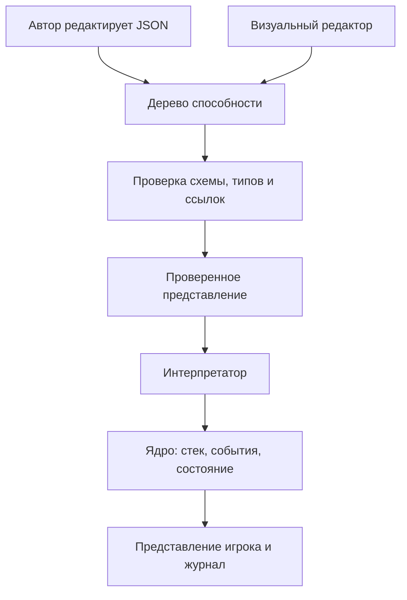

# MagicCards — гейм-дизайнерский план

**Версия:** 0.3 · **Дата:** 13.09.2026 · **Статус:** исходная спецификация; код ещё не реализован.

## 1. Назначение и подтверждённые решения

Этот документ связывает игровой замысел, правила, язык способностей, структуру реализации и проверки. Он служит источником истины для автора игры и разработчика.

**Подтверждено владельцем:**

- Нужен расширяемый движок собственной карточной игры с перспективой редактора; референсы — Hearthstone и Magic: The Gathering.
- Фазы, стек эффектов и ответы соперника входят уже в первый рабочий прототип.
- Приоритет первого прототипа — развитое и проверяемое ядро. Первый клиент может быть консольным; визуальный браузерный стол переносится за приёмку ядра.
- Вычисления, условия, локальные переменные, счётчики смертей, несколько активаций со стоимостями в ресурсах/жизнях/существах и ауры входят в MVP ядра.
- Карты сначала редактируются в JSON; визуальный редактор появляется позже.
- Целевое распространение — GitHub Pages, предложения карт и колод через PR.
- Сначала меняется документация, затем реализация приводится в соответствие с ней.
- План сохраняется в этой заметке MagicCards.md внутри Obsidian.

**Рабочие допущения v0.3:** TypeScript и браузерный стек; автоматически растущий ресурс без земель; ограниченная модель блоков; числа баланса и стартовые карты ниже. Это предложения для старта, а не ранее утверждённые решения. Их изменения оформляются следующей редакцией.

Описывается собственный профиль правил, а не полная реализация или нормативное изложение MTG.

## 2. Замысел и критерий первого результата

Игрок развивает поле существ, выбирает атаки и блоки, расходует ресурс на угрозы или сохраняет его для ответов. Решения возникают как в свой ход, так и при получении приоритета в чужой.

Цикл автора: **идея карты → описание доступными операциями → сценарий проверки → партия → изменение данных**. Новое сочетание существующих эффектов должно работать без отдельного класса карты или исключения по её id.

Принципы:

1. Журнал объясняет источник, цель и результат каждого эффекта.
2. Правила целей, стоимости, повреждений и реакций едины для всех карт.
3. Сложность способностей складывается из небольшого словаря операций.
4. Ядро работает независимо от UI и воспроизводит партии.
5. Новая механика сначала описывается, затем расширяет общий интерпретатор.

**MVP ядра готов:** матч проходит в консоли и сценарном раннере; проверены стек/ответы, бой, вычисляемые способности, составные стоимости, ауры и последствия смертей; запись воспроизводится. Ручной локальный матч на двоих доступен через последовательную передачу команд. Графический интерфейс не входит в условие готовности ядра.

Включено: профиль prototype-stack-v1 с rulesetVersion 0.3; существа, быстрые/медленные карты, ресурс, фазы, приоритет, LIFO-стек, триггеры с целями, вычисления/условия/let/foreach, несколько активаций с атомарными составными стоимостями, непрерывные бафы/дебафы и предоставляемые способности, итоги боя/разрешения и отложенные реакции. Контент: 12 базовых карт плюс отдельные механические fixtures. Инструменты: консоль, JSON-валидация, сценарный раннер, журнал, снимки и replay.

После MVP ядра: браузерный стол, редактор-форма/граф, сетевой режим, баланс и оформление. Отдельными механическими расширениями остаются земли/цветная мана, несколько блокирующих, произвольные замены событий, выбор посреди разрешения и зависимые от effective-характеристик рекурсивные ауры. Вычисления, активируемые способности и описанные ауры больше не исключаются из MVP ради UI. Произвольные скрипты, аккаунты и рейтинги в ядро не входят.

Сеттинг условно фэнтезийный, имена карт рабочие; иллюстрации ядру не нужны. Целевая длительность человеческой партии 15–25 минут — будущая гипотеза плейтеста, не критерий производительности консоли.

## 3. Базовые правила

Идентификаторы R-* используются в задачах и тестах. Числа хранятся в настройках профиля, а не в UI.

| ID | Область | Правило |
|---|---|---|
| R-01 | Игрок | Два игрока, по 20 текущего и максимального здоровья. Активный игрок — тот, чей ход; обладатель приоритета может быть другим. |
| R-02 | Колода | По 24 карты: две копии каждого определения раздела 8. Исходный порядок фиксируется, затем колоды перемешиваются генератором матча. |
| R-03 | Старт | Первый игрок определяется генератором. Оба получают по 4 карты. Пересдачи нет. Первый игрок пропускает только обычный добор своего первого хода. |
| R-04 | Ресурс | Начальный максимум 0; в начале своего хода +1 к максимуму до 10 и восстановление доступного ресурса. Остаток сохраняется между фазами и в чужой ход до следующего собственного восстановления. |
| R-05 | Зоны | Колода, рука, поле, кладбище, стек. У физической карты instanceId, generation пребывания в зоне и ровно одна зона; cardId обозначает общее определение. Способность в стеке не является новой физической картой. |
| R-06 | Лимиты | До 10 карт в руке и 7 существ на своём поле. Добор в полную руку отправляет карту на кладбище без триггера смерти. |
| R-07 | Существо | Базовая атака, максимальное здоровье, отмеченный урон, повёрнутость и ход входа на поле. Текущее здоровье = максимум минус урон. Порядок входа задаёт стабильный порядок объектов. |
| R-08 | Конец | Здоровье игрока ≤ 0 означает поражение при проверке состояния; обоих одновременно — ничью. После результата стек не разрешается. Сдача доступна игроку, принимающему решение. |
| R-09 | Усталость | Попытки добора из пустой колоды наносят владельцу возрастающий урон: 1, 2, 3 и далее. Счётчики раздельные. Добор нескольких карт выполняет отдельные попытки. |

«Персонаж» — игрок или существо. Определения карт неизменны в течение матча; повреждения, зона и модификаторы относятся к экземпляру. Исчезнувшую цель нельзя подменить другим экземпляром с тем же cardId.

## 4. Фазы, приоритет и стек

### 4.1. Структура хода — R-10

| Шаг | Действие при входе | Затем |
|---|---|---|
| READY | Восстановить ресурс, развернуть своих существ. | Без приоритета перейти к UPKEEP. |
| UPKEEP | Выпустить событие начала хода. | Окно приоритета. |
| DRAW | Обычный добор с исключением R-03. | Окно приоритета. |
| MAIN_1 | Нет. | Основная фаза с приоритетом. |
| COMBAT_BEGIN | Открыть CombatScope с новым combatId. | Окно перед атакой. |
| DECLARE_ATTACKERS | Активный игрок одним действием объявляет всех атакующих, включая пустой список. | Окно после объявления. |
| DECLARE_BLOCKERS | Защищающийся одним действием назначает блоки, включая пустой список. | Окно после объявления. |
| COMBAT_DAMAGE | Применить одновременный боевой урон. | Окно после урона. |
| COMBAT_END | Зафиксировать CombatSummary по 7.13, завершить участие в бою, выпустить combat_ended. | Окно приоритета после подготовки триггеров. |
| MAIN_2 | Нет. | Вторая основная фаза. |
| END | Выпустить событие конца хода. | Окно приоритета. |
| CLEANUP | Одновременно снять урон со всех существ и убрать модификаторы «до конца хода», когда они появятся в профиле. | Проверка состояния и передача хода. |

Объявления и боевой урон не помещаются в стек. Пока игрок редактирует список атакующих/блоков до подтверждения, соперник не действует. Если атакующих нет, после окна DECLARE_ATTACKERS пропускаются блоки и урон, затем наступает COMBAT_END.

В CLEANUP обычного окна нет. Если проверка состояния породила триггеры, поместить их в стек и открыть окно; после его закрытия повторить CLEANUP.

### 4.2. Приоритет — R-11

1. При открытии окна приоритет получает активный игрок после проверок состояния и помещения ожидающих триггеров.
2. Обладатель приоритета может сыграть допустимую карту или выполнить PassPriority.
3. После розыгрыша игрок сохраняет приоритет; серия пасов сбрасывается.
4. Первый пас передаёт приоритет сопернику.
5. Два последовательных паса при непустом стеке разрешают **только верхний элемент**. Затем проверки состояния, триггеры и снова приоритет активному игроку.
6. Два последовательных паса при пустом стеке закрывают окно и переводят игру к следующему шагу.
7. Розыгрыш или разрешение сбрасывает серию пасов.

Пас не завершает весь ход. В MVP нет скрытого автопаса или безусловной кнопки обхода всех окон: возможность ответить должна сохраняться у обоих игроков.

### 4.3. Розыгрыш и цели

**R-12. Скорость и объявление.** Медленные карты и slow-активации играются только активным игроком в MAIN_1/MAIN_2, с приоритетом и пустым стеком. Все существа медленные. Быстрые заклинания играются в любом окне со своим приоритетом, включая чужой ход.

Команда содержит карту из руки и все обязательные выбранные цели. Сначала проверяются приоритет, скорость, стоимость, цели и ограничения. Неверная команда ничего не меняет, включая RNG. Принятая карта оплачивается и перемещается в стек. Отмена выбора до отправки команды бесплатна; после принятия возврата действия нет.

**R-13. Разрешение.** Верхний StackItem снимается со стека разрешения и исполняется целиком без передачи приоритета между эффектами. Физическая карта до завершения остаётся в зоне стека. Существо входит на поле; заклинание после эффектов уходит на кладбище. Отменённая карта уходит на кладбище без эффектов и без возврата стоимости.

При полном поле существо нельзя объявить. Если поле заполнилось уже после объявления, при разрешении карта уходит на кладбище без входа и смерти на поле. Отменённое в стеке существо также не вызывает on_death.

**R-14. Цели.** При разрешении выбранные цели проверяются повторно. Если все обязательные выбранные цели недопустимы, элемент завершается без эффектов. Если сохранилась хотя бы одна, эффекты применяются только к допустимым; существование и пригодность цели проверяются и перед конкретной операцией.

Автоматический селектор «все вражеские существа» вычисляется при выполнении эффекта и не считается выбранной целью. Пустое множество — отсутствие действия. В MVP ручные цели выбираются при объявлении карты/активации и при подготовке адресного триггера через SubmitChoice. Во время PendingDecision приоритет не выдаётся. Выбор посреди самого разрешения отложен.

«Отмена» выбирает ожидающую в стеке карту-заклинание, включая карту существа, но не триггер. Уже разрешающийся элемент недоступен для ответа.

### 4.4. Обязательный пример контрответа

А играет «Искру» и пасует. Б играет «Отмену» на «Искру» и пасует. А играет свою «Отмену» на ответ Б. После двух пасов разрешается только ответ А, отменяя «Отмену» Б. Приоритет снова у А. «Искра» разрешится лишь после следующей пары пасов. Все оплаченные стоимости сохраняются.

## 5. Бой и проверки состояния

**R-15. Атака.** Активный игрок выбирает развёрнутых существ с атакой > 0, находящихся под его контролем с начала текущего хода. Они атакуют защищающегося игрока. Объявление поворачивает их, кроме vigilance («Бдительность»). Новое существо может блокировать сразу, атаковать — со следующего собственного хода.

**R-16. Блоки.** Защищающийся назначает только развёрнутых существ. Каждый блокирует максимум одного атакующего, каждого атакующего блокирует максимум одно существо. Блок не поворачивает. Подтверждённый атакующий сохраняет признак «был заблокирован», даже если блокирующий исчез до урона.

**R-17. Урон.** Незаблокированные атакующие наносят урон игроку. В сохранившихся парах существа одновременно наносят урон друг другу. Заблокированный атакующий без оставшегося блокирующего не наносит урон игроку. Покинувшие поле участники урон не наносят. Участники и значения атаки фиксируются при входе в COMBAT_DAMAGE после ответов; весь боевой урон — один пакет.

**R-18. Повреждения.** Урон увеличивает отмеченные повреждения существа; лечение уменьшает их до 0. Здоровье игрока лечится до максимума. Урон существ снимается в CLEANUP каждого хода. Постоянный бонус атаки действует до выхода с поля и не лечит. Destroy сразу отправляет существо на кладбище независимо от здоровья.

**R-19. Проверки состояния.** Перед выдачей приоритета, после завершения каждого StackItem и действия шага проверять поражения и смерти. Существа с уроном ≥ максимального здоровья одновременно отправляются на кладбище. Повторять до стабильного состояния. Конец матча останавливает дальнейшее разрешение.

Внутри последовательности одного StackItem обычной проверки смертельного урона нет: «урон → лечение» в одной способности может спасти существо. Явный destroy перемещает его сразу. Эта разница обязательна для тестирования.

Первый/двойной удар, пробивной урон, полёт, несколько блокирующих и переназначение подтверждённых блоков не входят в MVP.

## 6. События и срабатывающие способности

Команда — намерение игрока; событие — произошедший факт; эффект — операция правил; триггер — реакция способности на событие. UI не меняет состояние самостоятельно.

**R-20. Триггеры.** Реакции на события накапливаются во время исполнения и помещаются в общий стек перед ближайшей выдачей приоритета, после проверок состояния. Текущее разрешение они не прерывают. На триггер можно ответить быстрым заклинанием, но «Отмена» MVP его не отменяет.

Сначала помещаются ожидающие способности активного игрока, затем другого. Внутри группы: порядок событий, входа источника на поле, индекса способности в JSON. Из-за LIFO последняя помещённая разрешается первой. Ручного упорядочивания в MVP нет; это упрощение собственного профиля.

**R-21. Смерть источника.** Одновременные смерти фиксируются по снимку до удаления. On_death каждого погибшего вызывается один раз. Уже созданная способность сохраняется после ухода источника, хранит его id, владельца и необходимые данные события. Перемещение из руки, колоды или стека на кладбище смертью не считается.

Условия читают состояние в явно заданный момент. Число погибших определяется по DeathRecord в CombatSummary/ResolutionSummary. Блок afterResolve создаёт отдельный триггер после R-19; он позволяет реагировать на смерти от завершённого разрешения без проверки «смерти» посреди effects. Подробные границы подсчёта — в 7.13.

**R-22. Пределы.** До 64 узлов и глубины 8 на способность, без циклов и произвольного кода. До 1000 операций на внешнюю команду. Дополнительно — до 1000 последовательных разрешений StackItem без нового розыгрыша или смены шага; PassPriority этот счётчик не сбрасывает. Превышение даёт техническую остановку с диагностикой, а не победу или игровую ничью.

## 7. Язык карт и JSON

### 7.1. Что именно мы называем языком

**Card DSL** — небольшой предметный язык для описания игровых способностей. Он определяет доступные конструкции, их типы, правила исполнения и связь с состоянием матча. **JSON** — формат сохранения этих конструкций. **Интерпретатор** — часть движка, которая выполняет описанную способность.

Например, объект с type: damage имеет смысл только потому, что движок знает контракт damage: допустимая цель, целочисленная величина урона, изменение состояния и возникающее событие. Сам JSON эту семантику не задаёт.

Описание способности — дерево операций (**AST**). Вложенный if содержит условие и две ветви, каждая ветвь — список эффектов. Автор может редактировать дерево вручную или собирать его в редакторе.



Редактор и текстовый синтаксис не создают отдельного игрового языка: оба должны преобразовываться в одно представление. В MVP достаточно JSON, валидатора и интерпретатора. Компиляция в проверенное представление означает разрешение ссылок и проверку типов, а не генерацию и запуск JavaScript.

**Архитектура языка включает развитый словарь первого ядра.** Выражения, локальные значения, составные стоимости, ауры и итоги событий входят в MVP и обрабатываются едиными механизмами. Это оставляет место для вычислений без специальной логики в каждом эффекте.

Вычисления, стоимости, ауры и итоги боя ниже обязательны для MVP ядра. Только явно помеченные «следующее расширение» конструкции не входят в его приёмку. Наличие примера не заменяет поддерживаемую capability.

### 7.2. Определение карты, экземпляр и контекст

Определение карты — общие данные: id, название, тип, скорость, стоимость, текст, характеристики и способности. Экземпляр — конкретная физическая карта с instanceId, зоной, повреждениями и модификаторами. Изменение одного экземпляра не меняет остальные копии и исходный JSON.

Каждое исполнение способности получает контекст:

| Имя | Значение | Когда фиксируется |
|---|---|---|
| source | Идентификатор карты-источника и снимок необходимых исходных данных | При создании элемента стека |
| controller | Игрок, управляющий этим элементом | При создании элемента стека |
| opponent | Другой игрок в текущем профиле на двоих | Относительно controller |
| targets | Именованные выбранные экземпляры или StackItem | При объявлении карты |
| event | Данные события, породившего триггер | В момент события; доступны только соответствующей способности |
| locals | Локальные неизменяемые результаты вычислений | Внутри одного ExecutionFrame |
| sourceSnapshot | Effective-снимок источника | При создании элемента стека до оплаты |
| costReceipt | Платежи и снимки жертв по costId | До применения атомарного платежа |
| capturedLocals | Копия локальных значений родителя | При создании afterResolve/отложенной реакции |

В примерах ссылка на игрока `{ "context": "controller" }` означает игрока, управляющего способностью, независимо от того, чей сейчас ход. Поэтому собственная быстрая карта в чужой ход работает на своего владельца.

Чтение текущего свойства живого объекта и чтение снимка события — разные операции. Например, количество урона в event уже зафиксировано, а текущая атака source могла измениться после ответа соперника. Уход источника с поля не даёт права произвольно подставлять старые значения: контракт конкретного чтения должен явно разрешать снимок либо сообщать об отсутствии объекта.

Типы внутреннего представления:

| Тип | Пример | Зачем различать |
|---|---|---|
| Integer | 3, вычисленная величина урона | Не принимать существо вместо количества |
| Boolean | Цель повреждена | Проверять условия if |
| PlayerRef | controller | Отличать игрока от карты |
| CreatureRef | Выбранное существо | Проверять эффекты характеристик |
| CharacterRef | Игрок или существо | Общие цели урона и лечения |
| CardRef | Карта в конкретной зоне | Будущие операции перемещения |
| StackItemRef | Ожидающее заклинание | Проверять отмену |
| Collection<T> | Набор существ | Различать одну цель и множество |
| Optional<T> | Объект может отсутствовать | Требовать явной обработки отсутствия |

Это типы DSL, даже если реализация написана на TypeScript. TypeScript сам по себе не проверит JSON, пришедший из набора карт.

**Пример ошибки автора:** draw принимает PlayerRef, поэтому попытка взять карту «для выбранного существа» должна отклоняться до начала партии.

### 7.3. Селекторы, фильтры и выбор целей

Селектор отвечает «какие объекты рассматриваются», фильтр — «какие из них подходят», выбор — «какой объект указал игрок». У этих действий разные моменты исполнения.

**MVP: объявляемая цель.**

```json
{
  "targets": [
    {
      "id": "victim",
      "selector": "enemy_creature",
      "count": 1
    }
  ]
}
```

Движок показывает допустимых вражеских существ. Игрок выбирает одно; команда сохраняет его instanceId под именем victim. При разрешении та же цель проверяется по R-14. Новое существо с тем же cardId её не заменяет.

**MVP: цель с фильтром.**

```json
{
  "targets": [
    {
      "id": "victim",
      "selector": "enemy_creature",
      "count": 1,
      "filter": { "type": "is_damaged" }
    }
  ]
}
```

Так объявляется цель «Добивания». Filter применяется к кандидату. При объявлении и повторной проверке цель должна иметь повреждения. Если ответ «Исцелением» полностью снял их, единственная обязательная цель стала недопустимой и карта не выполняет эффекты.

**MVP: автоматическое множество.**

```json
{
  "type": "damage",
  "target": { "selector": "all_enemy_creatures" },
  "amount": 1
}
```

Здесь игрок ничего не выбирает. Множество фиксируется в начале эффекта при разрешении, урон применяется одним пакетом. Существо, появившееся на поле до этого момента, включается; появившееся позже — нет. Пустой набор означает отсутствие урона.

Словарь селекторов v1: self, friendly_player, enemy_player, friendly_creature, enemy_creature, friendly_character, enemy_character, all_enemy_creatures, pending_spell. Имена friendly_* трактуются относительно controller. Self используется в автоматических эффектах существа; pending_spell — в объявляемой цели с count: 1 и проверкой R-14.

Составные фильтры входят в MVP ядра. Filter — Boolean-выражение по item и контексту; оно использует сравнения/and/or/not из 7.4. Например, «вражеские существа с атакой меньше атаки источника» — обычный запрос с less и read_property. Для разовых эффектов доступен effective, для непрерывных селекторов аур разрешён только BaseView по 7.7. Дополнительные селекторы: all_friendly_creatures, other_friendly_creatures, all_creatures и character (персонаж любой стороны). Источник исключается по instanceId/generation, а не по cardId.

### 7.4. Значения, условия и локальные переменные — обязательная часть MVP ядра

В MVP ядра включены вычисляемые значения, составные условия, запросы к коллекциям и локальные переменные. Число-константа остаётся краткой записью Literal; новый тип выражения не требует отдельной версии каждого эффекта.

#### Типы, арифметика и ошибки

Числа DSL — знаковые 32-битные целые. Поддерживаются literal, add, subtract, multiply, min, max, abs, negate. Переполнение проверяется; неявного переноса JavaScript, дробных чисел, NaN и Infinity нет. Деление в первом ядре не поддерживается. Damage/heal/draw и стоимости требуют результат ≥ 0; отрицательные значения для бафов/дебафов допустимы в modify_stat.

Логические операции: equal, not_equal, less, less_or_equal, greater, greater_or_equal, and, or, not. And/or вычисляются слева направо с коротким замыканием. If вычисляет только выбранную ветвь. Equal сравнивает значения одного типа; ссылки — по instanceId плюс generation, а не по названию карты.

Контракты выражений:

| Узел | Результат | Семантика |
|---|---|---|
| literal | Integer/Boolean | Явное значение |
| read_property | Тип объявленного свойства | Чтение base/effective/snapshot, без произвольного пути в GameState |
| read_event | Тип поля события | Неизменяемый снимок породившего события |
| local | Тип ранее объявленного имени | Зафиксированное значение в текущем ExecutionFrame |
| count | Integer | Число элементов коллекции |
| exists | Boolean | Есть хотя бы один элемент |
| filter | Collection<T> | Стабильный исходный порядок подходящих элементов |
| sum | Integer | Сумма числового выражения по коллекции; пустая сумма 0 |
| if_value | Общий тип обеих ветвей | Вычисляется только выбранная ветвь |
| coalesce | T | Явное значение вместо отсутствующего Optional<T> |

Лексическая область: let виден последующим узлам своего effects и вложенным блокам. Объявления внутри if/foreach не видны после блока; повторное объявление имени в одной области запрещено. Локальные значения неизменяемы. Состояние одной активации не разделяется с другой.

У read_property явно указывается read:

- base — исходная характеристика текущего экземпляра до модификаторов.
- effective — значение после всех применимых модификаторов сейчас.
- snapshot — данные контекста sourceSnapshot/события/оплаченной жертвы в зафиксированный момент.

Чтение отсутствующего объекта возвращает Optional, а не 0. Его необходимо обработать coalesce/exists или использовать снимок. Валидатор запрещает передать Optional<Integer> напрямую в amount. TypeScript-типы не заменяют проверку загруженного JSON.

#### Пример: урон равен удвоенной атаке источника

Способность существа наносит выбранной цели удвоенную текущую атаку. Если источник покинул поле, применяется снимок его атаки при создании StackItem. Это явная семантика конкретной способности.

```json
{
  "type": "damage",
  "target": { "selected": "victim" },
  "amount": {
    "type": "multiply",
    "left": {
      "type": "coalesce",
      "value": {
        "type": "read_property",
        "object": { "context": "source" },
        "property": "attack",
        "read": "effective"
      },
      "fallback": {
        "type": "read_property",
        "object": { "context": "sourceSnapshot" },
        "property": "attack",
        "read": "snapshot"
      }
    },
    "right": { "type": "literal", "value": 2 }
  }
}
```

Дано: атака 3 при активации. Без ответа получается 6 урона. Если до разрешения источник усилили до 5, получается 10. Если источник уничтожен, используется исходный снимок 3 и получается 6. Усиление до 5, затем уход с поля также даёт 6: fallback — снимок активации, а не автоматически последнее известное значение. Для другого замысла автор фиксирует значение let раньше или выбирает доступный снимок события.

#### Пример: зафиксировать количество, затем изменить поле

```json
{
  "effects": [
    {
      "type": "let",
      "name": "n",
      "value": {
        "type": "count",
        "items": { "selector": "all_enemy_creatures" }
      }
    },
    {
      "type": "destroy",
      "target": { "selector": "all_enemy_creatures" }
    },
    {
      "type": "draw",
      "player": { "context": "controller" },
      "amount": { "type": "local", "name": "n" }
    }
  ]
}
```

Если перед разрешением было три вражеских существа, n = 3, они уничтожаются, затем выполняются три попытки добора. Count после destroy дал бы 0; let намеренно сохраняет прежний результат. Локальное n — число, а не «живой запрос».

Снимок Collection<Ref> сохраняет участников и их порядок, но не делает объекты бессмертными: при обращении к ушедшему экземпляру снова применяется правило Optional. Снимок Collection<DeathRecord> сохраняет сами записи о смертях, а не ссылки на живое поле.

#### Пример: составное условие

```json
{
  "type": "if",
  "condition": {
    "type": "and",
    "items": [
      {
        "type": "greater_or_equal",
        "left": {
          "type": "count",
          "items": { "selector": "all_enemy_creatures" }
        },
        "right": 2
      },
      {
        "type": "less",
        "left": {
          "type": "read_property",
          "object": { "context": "controller" },
          "property": "health",
          "read": "effective"
        },
        "right": 10
      }
    ]
  },
  "then": [
    { "type": "heal", "target": { "context": "controller" }, "amount": 3 }
  ],
  "else": []
}
```

Числа 2, 10 и 3 нормализуются в Literal. Проверяются обе ветви типов при загрузке, но исполняется только нужная ветвь. Этот пример лечит на 3, если у противника минимум два существа, а у владельца меньше 10 здоровья.

#### Обход коллекций и доступный контекст

Foreach входит в ядро: при входе фиксируется конечная коллекция; каждый элемент обрабатывается один раз в порядке instanceId/порядке исходного события. Перемещение карты не добавляет её повторно в обход. Не более 128 элементов одной коллекции обхода; превышение — диагностическая ошибка. Внутри блока доступно item, внутри filter/sum — соответствующий элемент выражения.

Условия и выражения чистые: они не добирают карты, не оплачивают стоимости, не расходуют RNG и не изменяют состояние. Даже exists не должен скрыто создавать игровые объекты.

Ошибку выражения в объявляемой команде обнаруживать до оплаты, когда нужные значения известны. Ошибка во время разрешения останавливает технический прогон с указанием карты, узла и контекста. Транзакция внешней команды не публикует частично выполненное состояние; диагностическая копия и причина сохраняются отдельно. Непредусмотренный отрицательный damage не превращается молча в лечение.


### 7.5. Контракты эффектов

Все изменения состояния проходят через игровые операции ядра. Интерпретатор не присваивает произвольные поля GameState по инструкции из JSON.

| Эффект v1 | Аргументы | Результат и ограничения |
|---|---|---|
| damage | target: персонаж или разрешённое множество; amount: Integer ≥ 0 | Урон по R-17–R-19; множество обрабатывается одновременно |
| heal | target: персонаж; amount: Integer ≥ 0 | Лечение до максимума; погибший экземпляр не возвращается |
| draw | player: PlayerRef; amount: Integer ≥ 0 | Последовательные попытки добора с лимитом руки и усталостью |
| destroy | target: существо или разрешённое множество | Немедленное перемещение с поля на кладбище; событие смерти |
| modify_attack | target: существо; amount: Integer > 0 | Сокращение положительного modify_stat(attack), действует до выхода получателя с поля |
| modify_stat | target: существо; stat: attack/max_health; amount: Integer; duration | Знаковый баф/дебаф через вклад модификатора, правила 16.7 |
| create_delayed_trigger | event, scopeId, condition, effects и захватываемый контекст | Однократная подписка до конца текущего боя; сохраняется после ухода источника |
| counter_spell | target: StackItemRef | Отмена ожидающей карты-заклинания, без возврата стоимости; не отменяет триггеры |

Для массового destroy все выбранные существа перемещаются одним пакетом, их смерти фиксируются по снимку до удаления. Последовательные одиночные destroy — другая последовательность событий.

Массив effects — последовательность. If содержит такие же массивы then/else, поэтому операции композиционны и не требуют специальных вариантов для каждой карты.

**MVP: последовательность для «Архивиста».**

```json
{
  "type": "draw",
  "player": { "context": "controller" },
  "amount": 1
}
```

События операций содержат источник и идентификатор разрешаемого элемента. Damage с amount: 0 не создаёт событие положительного урона; heal, фактически восстановивший 0, не создаёт событие положительного лечения. Диагностический журнал может отдельно показать операцию без изменения состояния.

Результаты effects и записи событий содержат применённый урон, перемещения и ссылки на frame. Урон учитывается полной применённой величиной, включая избыточный; потеря положительного здоровья может считаться отдельным полем и не подменяет damageAmount. «Погиб от урона» определяется после R-19 через ResolutionSummary/CombatSummary, а не проверкой текущего здоровья посреди эффекта.

### 7.6. Как способность проходит через движок

**MVP: полный пример быстрой карты.**

```json
{
  "id": "examples:heated_insight",
  "name": "Пламенное озарение",
  "type": "spell",
  "speed": "fast",
  "cost": 3,
  "text": "Выберите вражеское существо. Если оно повреждено, нанесите ему 4 урона, иначе 2. Затем возьмите карту.",
  "targets": [
    { "id": "victim", "selector": "enemy_creature", "count": 1 }
  ],
  "effects": [
    {
      "type": "if",
      "condition": {
        "type": "is_damaged",
        "target": { "selected": "victim" }
      },
      "then": [
        { "type": "damage", "target": { "selected": "victim" }, "amount": 4 }
      ],
      "else": [
        { "type": "damage", "target": { "selected": "victim" }, "amount": 2 }
      ]
    },
    {
      "type": "draw",
      "player": { "context": "controller" },
      "amount": 1
    }
  ]
}
```

Это учебная карта в пространстве examples, не тринадцатая карта стартовой колоды.

Разбор исполнения:

1. При загрузке проверяются схема, имена, типы и доступность всех операций. Selected victim связывается с объявлением цели.
2. При выборе карты ядро возвращает допустимые цели. UI отправляет CastCard с выбранным instanceId.
3. Ядро проверяет команду, списывает ресурс, перемещает карту в стек и сохраняет контекст. Срабатывания обрабатываются по общим правилам.
4. Соперник получает возможность ответить через протокол приоритета. JSON карты сам приоритет не передаёт.
5. После двух пасов верхний элемент начинает разрешаться. Victim снова проверяется.
6. Если цель допустима, вычисляется is_damaged и применяется 4 или 2 урона; затем выполняется добор.
7. Во время списка effects соперник не отвечает. Даже смертельно повреждённое существо пока не уходит с поля от проверки состояния.
8. Заклинание завершает разрешение и уходит на кладбище; выполняются R-19, затем ожидающие триггеры помещаются в стек по R-20.
9. Если матч продолжается, активный игрок получает приоритет.

Пример состояния: у цели максимум 5 здоровья и отмечено 1 повреждение. Без ответа условие истинно: ещё 4 урона, затем добор, затем смерть на проверке состояния. Если ответ лечением снял повреждение, ветвь наносит 2, затем добор, цель остаётся на поле.

Если цель покинула поле до разрешения, единственная обязательная цель недопустима: не выполняются ни урон, ни добор, стоимость не возвращается. Если сам добор приводит к поражению от усталости, конец матча определяется по общей проверке состояния после элемента.

Текст на карте нужен игроку. Движок исполняет дерево, а не пытается понимать русскую фразу. В MVP соответствие текста и дерева проверяется при ревью.

### 7.7. Способности, составные стоимости и ауры — обязательная часть MVP ядра

Карта может иметь несколько независимых способностей в abilities. У каждой стабильный id в пределах определения карты. StackItem и команда ссылаются на definitionId/instanceId и abilityId; выбор способности не определяется её позицией в массиве или русским текстом.

Поддерживаются четыре формы: effects самой разыгранной карты, activated, triggered и continuous. Прежняя запись trigger: on_death без kind нормализуется в triggered при загрузке, но новые примеры используют явный kind.

#### Активируемые способности и разные стоимости

Активация выполняется по команде ActivateAbility. Fast-активация разрешена при своём приоритете в любом окне; slow — только активному игроку в MAIN_1/MAIN_2 при пустом стеке. Стоимости и targets принадлежат конкретной способности. В одном экземпляре может быть одновременно несколько fast/slow-способностей.

Пример существа с двумя активациями. Первая тратит ресурс и поворачивает источник. Вторая тратит жизни и жертвует другое своё существо, используя его зафиксированную атаку.

```json
{
  "id": "examples:blood_artificer",
  "name": "Кровавый ремесленник",
  "type": "creature",
  "speed": "slow",
  "cost": 3,
  "attack": 2,
  "health": 4,
  "text": "Две активации: 2 ресурса и поворот — 2 урона врагу; 2 жизни и жертва другого своего существа — лечение своему персонажу на атаку жертвы.",
  "keywords": [],
  "abilities": [
    {
      "id": "charged_strike",
      "kind": "activated",
      "speed": "fast",
      "costs": [
        { "type": "spend_resource", "amount": 2 },
        { "type": "tap", "object": { "context": "source" } }
      ],
      "targets": [
        { "id": "victim", "selector": "enemy_character", "count": 1 }
      ],
      "effects": [
        { "type": "damage", "target": { "selected": "victim" }, "amount": 2 }
      ]
    },
    {
      "id": "blood_exchange",
      "kind": "activated",
      "speed": "fast",
      "costs": [
        { "type": "pay_life", "amount": 2 },
        {
          "id": "offering",
          "type": "sacrifice",
          "selector": "friendly_creature",
          "excludeSource": true,
          "count": 1
        }
      ],
      "targets": [
        { "id": "beneficiary", "selector": "friendly_character", "count": 1 }
      ],
      "effects": [
        {
          "type": "heal",
          "target": { "selected": "beneficiary" },
          "amount": {
            "type": "max",
            "left": 0,
            "right": {
              "type": "read_cost",
              "costId": "offering",
              "index": 0,
              "property": "attack"
            }
          }
        }
      ]
    }
  ]
}
```

Read_cost получает effective-характеристику жертвы из CostReceipt до оплаты. Уход ауры во время оплаты не пересчитывает уже сохранённое значение. Read_cost вне соответствующей активации — ошибка контекста.

Перед включением учебной карты в игровой набор текст сверяется с обеими способностями, числом целей и временем чтения атаки жертвы.

**Стоимость — отдельный язык платежей, не произвольный effects.** В первом ядре разрешены spend_resource, pay_life, tap и sacrifice. У стоимости нет if с побочными эффектами, ответов соперника и промежуточных триггеров. Количество ресурса/жизней может быть выражением, вычисляемым один раз до оплаты.

| Стоимость | Допустимость | Что происходит |
|---|---|---|
| spend_resource | Суммарно хватает доступного ресурса | Ресурс уменьшается |
| pay_life | Суммарно хватает текущего здоровья | Здоровье уменьшается; это LifePaid, не DamageApplied |
| tap | Свой развёрнутый объект на поле; для существа действует готовность с начала своего хода | Объект поворачивается |
| sacrifice | Выбранное своё существо на поле; фильтры и количество соблюдены | Одновременное перемещение жертв на кладбище с DeathRecord(reason = sacrifice) |

Готовность для tap-стоимости существа — то же ограничение входа, что для атаки. Новое существо можно пожертвовать, но нельзя оплатить его поворотом до следующего собственного хода. У abilities без tap такой задержки нет, если её не задаёт контракт.

Pay_life допускает оплату ровно оставшихся жизней. Все законные стоимости выполняются, после чего R-19 фиксирует поражение; способность не успевает вылечить игрока. Например, при 2 здоровья blood_exchange с ценой 2 законен, но проигрывает матч после оплаты. При 1 здоровья команда незаконна и ничего не меняет.

#### Атомарная оплата и её связь со стеком

1. Проверить право активировать abilityId, скорость, лимиты использования и все объявленные targets.
2. Получить выбор жертв и объектов tap из команды; рассчитать все числовые стоимости на одном исходном снимке.
3. Построить CostPlan: суммарные ресурс/жизни, уникальные объекты, будущие перемещения и CostReceipt.
4. Проверить весь план. Одну карту нельзя пожертвовать дважды или повернуть дважды. Поворот и жертва одного существа в одной стоимости допустимы: сначала оно поворачивается, затем жертвуется.
5. В одной транзакции создать StackItem способности с sourceSnapshot, targets и CostReceipt; применить повороты, списание ресурса/жизней, затем одновременно жертвы.
6. Пересчитать непрерывные модификаторы и выполнить проверки состояния. Только теперь поместить накопленные триггеры по R-20 поверх активированной способности.
7. Если матч продолжается и нет ожидаемых выборов триггеров, приоритет остаётся у активировавшего игрока.

Нет частичной оплаты, если не хватило последнего компонента. Нет окна ответа между pay_life и sacrifice. После принятия активации вернуть стоимость нельзя, даже если источник уничтожен или эффект лишился цели.

Жертва вызывает on_death, поскольку существо уходит с поля по причине sacrifice. Эти триггеры лежат выше оплаченной способности; после пары пасов первыми разрешаются они. Сама способность уже существует и сохраняется после жертвы источника.

Объект может одновременно быть выбранной целью и оплаченной жертвой, если фильтр стоимости это разрешает. Тогда при разрешении цель отсутствует, а платежи остаются. Интерфейс/консоль должны объяснить последствие, но не заменять правило запретом.

Необязательный usageLimit поддерживает timesPerTurn. Счётчик привязан к incarnation источника + abilityId; расходуется при успешной оплате, отмена способности его не возвращает. Без лимита повторная активация возможна, если можно снова законно оплатить стоимость.

#### Триггеры, чужие события и выбор целей

Поддерживаются собственные on_enter/on_death, turn_start/turn_end, creature_died, damage_applied, attackers_declared, combat_ended и локальный afterResolve. Начальные и конечные события относятся к ходу; combat_ended — к боевому интервалу; остальные содержат типизированные снимки источника/цели и причин.

Новый триггер может иметь condition по снимку event и targets. Condition проверяется один раз при возникновении события. Дополнительное условие, которое должно быть истинно при разрешении, автор выражает через if внутри effects. Так временные моменты не смешиваются.

При подготовке триггера с целью движок создаёт PendingDecision. Владелец способности выбирает допустимую цель командой SubmitChoice, затем StackItem занимает своё заранее определённое место в порядке R-20. Это не передача приоритета и не возможность ответить до завершения постановки всех триггеров.

Если обязательных целей нет, такой триггер не помещается в стек; событие TriggerSkipped объясняет причину. В MVP обязательные выборы имеют count ≥ 1; «можно выбрать 0» вводится отдельно, чтобы не путать отсутствие цели и потерю ранее выбранной цели.

Одновременные триггеры упорядочиваются по R-20. Выборы обрабатываются в порядке помещения, без обхода очереди и ручной перестановки. При сохранении игры сохраняются ожидающий выбор, eventSnapshot, кандидатуры/ограничения и следующая сторона, которая получит приоритет.

#### Ауры: усиления, ослабления, ключевые слова и способности

Continuous-способность регистрирует модификаторы, пока её источник находится в activeZone. Для первого ядра activeZone = battlefield. Аура не создаёт StackItem на каждом пересчёте и не изменяет печатные характеристики карты.

Пример ауры: другим своим существам +1 атаки/+1 максимального здоровья и vigilance; всем вражеским — −1 атаки.

```json
{
  "id": "war_banner",
  "kind": "continuous",
  "activeZone": "battlefield",
  "modifiers": [
    {
      "id": "allied_strength",
      "selector": "other_friendly_creatures",
      "operation": "add_stats",
      "attack": 1,
      "health": 1
    },
    {
      "id": "allied_watch",
      "selector": "other_friendly_creatures",
      "operation": "grant_keyword",
      "keyword": "vigilance"
    },
    {
      "id": "enemy_weakness",
      "selector": "all_enemy_creatures",
      "operation": "add_stats",
      "attack": -1,
      "health": 0
    }
  ]
}
```

Каждый ModifierContribution имеет origin = incarnation источника + abilityId + modifierId + incarnation получателя. Уход источника удаляет только его вклады; повторный пересчёт не прибавляет их ещё раз. Новое подходящее существо получает вклад при входе. Две одинаковые ауры складывают числовые бонусы, но не создают два независимых флага vigilance.

Поддерживаемые операции continuous v1:

- add_stats: знаковые attack/health.
- grant_keyword/remove_keyword: только зарегистрированные ключевые слова.
- grant_rule/remove_rule: cannot_attack и cannot_block.
- grant_ability: зарегистрированный шаблон triggered или activated; continuous внутри grant_ability запрещён.

Пример другого эффекта ауры: дать другим своим существам дополнительную активацию лечения.

```json
{
  "id": "healing_discipline",
  "kind": "continuous",
  "activeZone": "battlefield",
  "modifiers": [
    {
      "id": "teach_heal",
      "selector": "other_friendly_creatures",
      "operation": "grant_ability",
      "ability": {
        "id": "granted_heal",
        "kind": "activated",
        "speed": "fast",
        "costs": [
          { "type": "tap", "object": { "context": "source" } }
        ],
        "effects": [
          { "type": "heal", "target": { "context": "controller" }, "amount": 1 }
        ]
      }
    }
  ]
}
```

Source полученной способности — получатель, а originGrant хранит происхождение от ауры. Когда аура исчезает, новые активации недоступны; уже созданная способность остаётся в стеке. Два источника дают две способности с разными originGrant, но один поворот существа не оплачивает две активации.

#### Порядок вычисления непрерывных эффектов

В первом ядре применяется фиксированный конвейер:

1. **BaseView:** печатные характеристики, базовые теги/ключевые слова, владелец, зона, повёрнутость и отмеченный урон.
2. **Выбор участников:** все ауры вычисляют селекторы/условия и величины по одному BaseView. Чтение effective-характеристик из непрерывного запроса запрещено семантическим валидатором.
3. **Числа:** к базовым attack/maxHealth складываются постоянные/временные add_stats и все вклады аур.
4. **Ключевые слова и запреты:** собрать базовые и выданные признаки, затем применить remove. Удаление имеет приоритет над выдачей; если remove исчезло, оставшиеся выдачи снова действуют.
5. **Способности:** объединить базовые способности с grant_ability по стабильным origin-id; обновить индекс подписок без повторного выпуска on_enter.
6. **EffectiveView:** attack для атаки/урона ограничен снизу 0; maxHealth может стать ≤ 0. Текущее здоровье = maxHealth − markedDamage.
7. Перед выдачей приоритета выполнить R-19 и повторить пересчёт после смертей до стабильности.

Такая модель позволяет предсказуемо тестировать бафы/дебафы. Пример «+1 атаки существам с базовой атакой ≤ 2» допустим. Взаимно зависимые ауры «усиливать, пока итоговая атака < 3» не допускаются в v1; для них позже понадобится отдельная модель зависимостей, а не неограниченный поиск устойчивого состояния.

Эффективные характеристики пересчитываются после изменения фактов, до чтения следующего эффекта. Это ещё не проверка смертей. Например, после destroy источника ауры следующий узел того же StackItem увидит уменьшившееся maxHealth, но обычная смерть от здоровья проверяется только на R-19. Уже явно уничтоженный объект обратно не появляется.

Увеличение maxHealth не снимает markedDamage. Пример: существо 2/2 имеет 1 повреждение; аура +0/+2 делает максимум 4 и текущее здоровье 3. Уход ауры возвращает максимум 2, текущее 1. Существо с 3 повреждениями и максимумом 4 погибнет после снятия этой ауры.

При одновременном уничтожении ауры и получателей события/подписки берутся по снимку перед удалением: выданные триггеры смерти успевают сработать. Если источник ауры ушёл раньше отдельным событием, последующая смерть получателя уже не имеет утраченной выданной способности.

#### Предотвращение и замена событий: описанный следующий этап

Фазы/стек, выражения, активации/стоимости и указанные ауры обязательны в MVP ядра. Произвольные замены «вместо урона лечение» пока не включены в его приёмку: они требуют разрешить конкурирующие замены и предотвращение циклов. Точка расширения остаётся явной:

```text
Предлагаемое событие → будущие замены/предотвращение
                    → применённое событие → триггеры
```

Это единственный статус «следующий этап» в данном подразделе; перечисленные выше активации и ауры больше не отложены ради UI.


### 7.8. Как добавлять новые операции

Расширение имеет три уровня:

| Изменение | Пример | Необходимая работа |
|---|---|---|
| Новая композиция | Урон по условию, затем добор | JSON, текст, сценарии карты; ядро не меняется |
| Новый общий примитив | Вернуть существо в руку | Контракт, типы, обработчик ядра, схема, описание редактора и проверки |
| Новая модель взаимодействий | Аура или замена урона | Сначала правила жизненного цикла/порядка, затем расширение ядра и DSL |

Реестр операций — явная таблица доверенных возможностей движка. Каждая запись содержит стабильный id, категорию, аргументы и типы, доступный контекст, поддерживаемую версию, обработчик, ограничения и метаданные для редактора.

**Проект расширения: карточка контракта return_to_hand.**

| Поле | Предлагаемый контракт |
|---|---|
| Категория | Effect |
| Вход | Один CreatureRef на поле |
| Действие | Переместить карту в руку её владельца |
| Полная рука | Для этого расширения предлагается отправление на кладбище без on_death, поскольку перемещение не является смертью |
| Модификаторы | Снять относящиеся к пребыванию на поле |
| Событие | ZoneChanged с источником, откуда/куда и причиной |
| Метаданные редактора | Блок «Вернуть в руку», вход «существо» |
| Проверки | Обычный возврат, полная рука, исчезнувшая цель, уход источника ауры |

Контракт — предложение для будущей версии, не действующее правило v1. После его принятия та же операция позволит описывать возврат по условию, возврат при событии и возврат множества через ограниченный обход. Не нужны отдельные обработчики каждой карты.

Добавление операции требует:

1. Описать игровое поведение, аргументы, события и граничные случаи.
2. Назначить capability и определить совместимость.
3. Добавить типизированный узел и структурную/семантическую проверку.
4. Реализовать общую операцию ядра через его штатные изменения состояния.
5. Добавить сценарии и метаданные блока редактора.
6. Только затем разрешить ссылку на операцию в наборах.

Реестр можно разделить на доверенные модули basic, combat, zones, modifiers. Модули собираются с приложением и проходят ревью. JSON-набор не загружает произвольный JavaScript и не выбирает файл обработчика на диске или URL.

### 7.9. Проверки, ошибки и ограничения

Три уровня проверки:

| Уровень | Что обнаруживает | Пример |
|---|---|---|
| Структура JSON Schema | Неверные поля, типы, обязательные значения, неизвестные узлы | Damage без amount |
| Семантика DSL | Неверные типы ссылок, отсутствующий target id, недоступный контекст, неподдерживаемая capability | Selected victim без объявления; event у обычного заклинания |
| Игровая проверка | Допустимость конкретного действия в текущем состоянии | Чужой приоритет; цель уже вылечена; ресурс потрачен |

JSON Schema проверяет данные по схеме; наличие в ней if/then/else не исполняет игровые ветви if/then/else нашей карты. Это разные уровни. См. [условную валидацию JSON Schema](https://json-schema.org/understanding-json-schema/reference/conditionals).

**Пример диагностического сообщения:**

```text
Карта: examples:heated_insight
Путь: effects[1].player
Ожидалось: PlayerRef
Получено: CreatureRef из targets.victim
Исправление: выберите controller или другой допустимый PlayerRef.
```

Ошибочный набор отклоняется до матча с полным списком доступных ошибок, без запуска части его карт. Неизвестные поля не игнорируются молча. Ошибка команды сохраняет состояние без изменений. Внутренняя ошибка исполнения — техническая остановка с контекстом, а не обычная недопустимость действия.

Лимиты R-22 применяются и к вложенным ветвям, и к цепочкам триггеров. Foreach входит в MVP с конечным снимком коллекции и лимитами 7.4/16.8; изменения во время обхода не расширяют автоматически исходный список. Неограниченные repeat не поддерживаются. Полноценные циклы while, рекурсия, eval и доступ к внешним системам не входят в язык.

Данные скрытых зон не попадают в ошибки и представление другого игрока. Возможность DSL читать игровую информацию задаётся правилами конкретного селектора; доступ ядра ко всему GameState не даёт UI такой же доступ.

### 7.10. Версии, наборы и воспроизведение

Различать четыре вещи:

- schemaVersion — форма сериализованных данных и узлов.
- rulesetVersion — игровая семантика, включая R-* и порядок разрешения.
- packVersion — конкретная редакция карт и баланса.
- engineVersion — реализация, способная исполнять соответствующие версии.

Capabilities перечисляют используемые возможности. Это позволяет сообщить «не поддерживается replacement.damage», а не запускать карту частично.

**MVP: пример манифеста небольшого учебного набора.**

```json
{
  "schemaVersion": 2,
  "rulesetId": "prototype-stack-v1",
  "rulesetVersion": "0.3",
  "packId": "examples",
  "packVersion": "0.1.0",
  "requires": [
    "effect.damage",
    "effect.draw",
    "control.if",
    "condition.is_damaged"
  ],
  "cards": ["cards/heated_insight.json"],
  "decks": []
}
```

Редакция документа 0.3 расширяет игровые правила: rulesetVersion = 0.3, schemaVersion = 2. Это проектные версии до первой реализации. Старый формат schemaVersion 1 нормализуется явным адаптером только для ранее описанных базовых карт: числа → Literal во внутреннем AST, отсутствие kind при trigger → triggered. Новые узлы/стоимости/ауры требуют schemaVersion 2. Исходные данные и применённая нормализация фиксируются при загрузке; старый replay не пересчитывается автоматически по новым правилам.

Манифест загружается как целое; проверяется и объявленный requires, и реально использованные узлы. Пропущенный в requires используемый компонент — ошибка набора. Встроенные базовые механизмы выбора целей и зон входят в ruleset и не перечисляются как подключаемые эффекты.

**Пример совместимости:** карта требует effect.return_to_hand, а клиент поддерживает только словарь MVP. Набор отклоняется до матча с указанной причиной. Нельзя пропустить неизвестный эффект и продолжить.

Числовые константы и выражения поддерживаются schemaVersion 2 с нормализацией Literal. Семантическое изменение существующей операции не должно скрываться за прежними версиями. Миграция создаёт новую редакцию, а не переписывает снимки завершённых партий.

Replay сохраняет снимок контента и версии, включая capabilities. После изменения «3 урона» на «2 урона» старая запись продолжает использовать своё определение. Если соответствующая версия движка/правил не поддерживается, воспроизведение явно отклоняется.

### 7.11. Редактор и дополнительные способы авторства

В MVP автор меняет JSON. Затем редактор-форма использует метаданные реестра: damage показывает выбор цели и величины; draw — игрока и количество; if — условие и две ветви. Недопустимые соединения блокируются типами, а сохранение проходит тот же валидатор.

**Пример одной способности в редакторе:**

```text
[Цель: вражеское существо → victim]
                  ↓
       [victim повреждено?]
          да ↙       ↘ нет
    [Урон 4]         [Урон 2]
          ↘           ↙
       [Взять controller 1 карту]
```

Граф — представление дерева и его ссылок. Позиции блоков, масштаб и свёрнутость сохраняются в отдельных данных редактора; они не меняют игровой результат и не участвуют в исполнении.

Важная проверка редактора: JSON → блоки → JSON сохраняет игровую семантику. Отображение неизвестной новой операции старым редактором не должно приводить к её удалению при сохранении: редактирование такого набора блокируется с сообщением о несовместимости.

**Проект расширения: текстовый синтаксис.**

```text
when self enters:
    damage opponent by 2
    draw controller 1
```

Такой текст потребует парсера и преобразуется в тот же AST. Отдельный runtime для текстовых карт не создаётся. Русский игровой текст не исполняется и не является исходником программы.

Готовые языки условий, такие как CEL и JsonLogic, полезны как архитектурные ориентиры: окружение выражений ограничивается приложением, правила можно хранить в структурированном виде. Для проекта рекомендуется собственное типизированное дерево, чтобы условия, эффекты и редактор использовали единый контракт. CEL/JsonLogic не вводятся зависимостями v1. См. [CEL](https://cel.dev/overview/cel-overview?hl=en) и [JsonLogic](https://jsonlogic.com/).

### 7.12. Обязательное ядро и следующие расширения

| Возможность | Статус |
|---|---|
| Фазы, приоритет, стек, ответы, базовый бой | Обязательно в MVP ядра |
| Константы, арифметика, сравнения, and/or/not, if, запросы | Обязательно в MVP ядра |
| Let, filter/count/sum/exists и ограниченный foreach | Обязательно в MVP ядра |
| Несколько активируемых способностей, resource/life/tap/sacrifice | Обязательно в MVP ядра |
| Триггеры с ручными целями, SubmitChoice | Обязательно в MVP ядра |
| Статовые ауры, ключевые слова, запреты и grant_ability | Обязательно в MVP ядра |
| Бафы/дебафы, текущие значения и явные снимки | Обязательно в MVP ядра |
| CombatSummary/ResolutionSummary, afterResolve, однократный delayed_trigger | Обязательно в MVP ядра |
| Консоль, fixtures, сценарии, полные партии, replay | Обязательно в MVP ядра |
| Браузерный стол и визуальный/текстовый редактор | После приёмки ядра |
| Статусы заморозки/сна/безмолвия с длительностью и подавлением | Следующий этап по 7.14; запреты и жизненный цикл аур уже предусмотрены ядром |
| Произвольные замены событий и рекурсивные effective-ауры | Отдельная следующая механическая спецификация |
| Выбор посреди effects, несколько блокирующих, цветная мана | Следующее расширение; не подменять существующими командами |

Карты связываются с обработчиками один раз при загрузке; определения переиспользуются экземплярами. Подписки индексируются по событию, сохраняя R-20. Ауры пересчитываются по детерминированному конвейеру 7.7. Порядок обхода, кэширование и логирование не должны менять результат.

Критерий расширяемости: новую комбинацию описанных возможностей добавляют данными и тестом. Если каждая новая комбинация требует правки ядра, контракт недостаточно общий.

### 7.13. Смерти после атаки, итоги разрешения и отложенные эффекты

Эта возможность обязательна для первого ядра. Её основа — **записи произошедших событий и завершённые интервалы**, а не сравнение количества карт в кладбище до и после действия.

#### Что считается смертью

Каждая смерть создаёт DeathRecord: eventId, entityRef(instanceId, generation), definitionId, owner, controller, снимок effective-характеристик перед уходом, fromZone, toZone, reason, frameId, combatId при наличии и ссылки на связанные события урона. Reason различает destroy, sacrifice, lethal_damage, zero_max_health и aura_cascade.

Возврат в руку, перемещение со стека на кладбище и переполнение руки не являются смертью. Повторно вошедшая та же физическая карта получает новую generation; её новая смерть — новое событие. Старый DeathRecord неизменяем. Поэтому «число смертей» и «число уникальных физических карт» различаются; по умолчанию count считает события смерти.

Обычное поле source в DeathRecord не должно выдавать выдуманного единственного убийцу: при совместном уроне и снятии ауры причин может быть несколько. Frame и reason определяют точный выбранный ниже вид подсчёта.

#### Интервал боя и момент фиксации

CombatScope получает новый combatId при входе в COMBAT_BEGIN. Он собирает атакующих/блоки, пакеты урона и все DeathRecord до входа в COMBAT_END, включая смерти от ответов и триггеров в окнах этого боя.

При входе в COMBAT_END ядро закрывает CombatScope, фиксирует неизменяемый CombatSummary, очищает участие в бою и выпускает combat_ended. Все дальнейшие смерти в окне COMBAT_END и от ответов на итоговые способности в этот summary не добавляются. Это предотвращает пересчёт результата собственным эффектом.

Если атакующих не объявили, бой всё равно завершается с пустым attackers; смерти от заклинаний в COMBAT_BEGIN могут быть в deaths. Способность «после того, как вы атаковали» дополнительно требует count(event.attackers) > 0 и event.attackingPlayer = controller.

| Вопрос автора | Поле/фильтр |
|---|---|
| Сколько существ погибло за этот бой от любых причин? | count(event.deaths) |
| Сколько погибло непосредственно от боевого пакета? | count(event.combatDamageDeaths) |
| Сколько вражеских существ погибло за бой? | Filter event.deaths по controller относительно владельца способности |
| Сколько погибло моих атакующих? | DeathRecord.entityRef входит в event.attackers, controller = controller |
| Сколько разных физических карт погибло? | Явная distinct по instanceId; отдельная операция, не неявный count |

CombatDamageDeaths — существа, погибшие в первой волне проверки состояния сразу после COMBAT_DAMAGE из-за markedDamage ≥ положительного maxHealth и получившие положительный урон в этом боевом пакете. Смерти следующих волн от снятия ауры попадают только в deaths с reason = aura_cascade. Существа с maxHealth ≤ 0 считаются zero_max_health. Это проверяемое определение собственного профиля; оно не пытается угадывать единственную причинную карту.

Для общих ResolutionSummary первая волна после элемента аналогично отделяется от каскадов, а список deaths включает все смерти в его effects и всех последующих волнах R-19. Оплата стоимости относится к отдельному PaymentFrame и не считается результатом будущего разрешения способности.

#### Пример: за каждую смерть в бою нанести урон и вылечить

Пассивная способность постоянного источника после **вашего** боя с хотя бы одним атакующим наносит вражескому игроку N урона и лечит выбранного своего персонажа на N. N равно всем смертям за бой, включая ответы, жертвы и каскады аур.

```json
{
  "id": "harvest_after_attack",
  "kind": "triggered",
  "trigger": "combat_ended",
  "condition": {
    "type": "and",
    "items": [
      {
        "type": "equal",
        "left": { "type": "read_event", "field": "attackingPlayer" },
        "right": { "context": "controller" }
      },
      {
        "type": "greater",
        "left": {
          "type": "count",
          "items": { "type": "read_event", "field": "attackers" }
        },
        "right": 0
      }
    ]
  },
  "targets": [
    { "id": "beneficiary", "selector": "friendly_character", "count": 1 }
  ],
  "effects": [
    {
      "type": "let",
      "name": "fallen",
      "value": {
        "type": "count",
        "items": { "type": "read_event", "field": "deaths" }
      }
    },
    {
      "type": "damage",
      "target": { "context": "opponent" },
      "amount": { "type": "local", "name": "fallen" }
    },
    {
      "type": "heal",
      "target": { "selected": "beneficiary" },
      "amount": { "type": "local", "name": "fallen" }
    }
  ]
}
```

Выбор beneficiary выполняется перед помещением триггера в стек; потом соперник может ответить. Можно выбрать самого игрока или своё существо. Если единственная объявленная цель исчезла, R-14 прекращает весь элемент, включая урон сопернику. Если автор хочет независимые результаты, он описывает два самостоятельных триггера либо использует автоматические цели; не обходит правило молчаливым исключением.

Чтобы считать только прямые смерти от боевого урона, заменить поле deaths на combatDamageDeaths. Чтобы наносить урон выбранному вражескому существу, объявить отдельный target с selector enemy_creature и направить damage туда. Это композиция того же языка.

Для подсчёта только вражеских смертей используется обычный filter над неизменяемыми записями:

```json
{
  "type": "count",
  "items": {
    "type": "filter",
    "items": { "type": "read_event", "field": "deaths" },
    "as": "death",
    "where": {
      "type": "equal",
      "left": {
        "type": "read_property",
        "object": { "type": "item", "name": "death" },
        "property": "controller",
        "read": "snapshot"
      },
      "right": { "context": "opponent" }
    }
  }
}
```

#### Пошаговая проверка подсчёта

Дано: источник способности остаётся на поле. Объявлена атака. Одно существо уничтожено ответным заклинанием до DAMAGE; два погибли непосредственно от боевого урона; ещё одно — в следующей волне от исчезновения ауры.

1. На входе COMBAT_END фиксируется deaths = 4, combatDamageDeaths = 2.
2. Способность выбирает своего игрока целью лечения и помещается в стек.
3. Соперник отвечает и уничтожает ещё одно существо.
4. Итоговый триггер всё равно использует 4, поскольку summary уже закрыт.
5. Он наносит 4 урона и лечит на 4 в пределах здоровья; при варианте combatDamageDeaths — 2 и 2.
6. Если источник уничтожен **после** появления триггера, способность остаётся. Если он погиб **до** combat_ended, обычной battlefield-подписки уже нет и триггер не возникает.

Если нужно «объявив атаку, гарантированно выполнить эффект после боя, даже если источник погиб», применяется отложенная подписка: на событии attackers_declared создаётся один delayed_trigger до combat_ended текущего combatId, с зафиксированным controller и sourceSnapshot. Она существует независимо от источника и удаляется после единственного срабатывания. Это входит в ядро как create_delayed_trigger; бессрочные и повторяющиеся отложенные подписки в первом профиле запрещены.

#### После разрешения: урон, затем число погибших

Для «нанесите массовый урон; затем вылечитесь за каждое погибшее существо» вводится блок afterResolve у заклинания или активируемой способности. Основной effects выполняется целиком, затем R-19, затем формируется ResolutionSummary. AfterResolve создаёт **отдельную отвечаемую способность**, а не продолжает прерванное разрешение.

```json
{
  "effects": [
    {
      "type": "damage",
      "target": { "selector": "all_enemy_creatures" },
      "amount": 2
    }
  ],
  "afterResolve": {
    "effects": [
      {
        "type": "heal",
        "target": { "context": "controller" },
        "amount": {
          "type": "count",
          "items": { "type": "read_event", "field": "deaths" }
        }
      }
    ]
  }
}
```

AfterResolve получает event = ResolutionSummary этого элемента, sourceSnapshot и controller; локальные значения завершённого основного frame доступны как неизменяемые capturedLocals. Его собственные let имеют новую область. Блок создаётся только после нормального разрешения родителя, не после отмены или завершения без эффектов из-за всех недопустимых целей, и не после конца матча.

Сначала в общей постановке идут ранее накопленные реакции обычных событий; afterResolve имеет порядковый номер события завершения элемента. Затем ко всем применяется группировка сторон R-20. Поведение относительно других триггеров не зависит от порядка обхода объектов.

DeathRecord жертвы при оплате не входит в этот ResolutionSummary. Смерти от других триггеров, которые разрешатся позднее, также не входят. Если автор хочет посчитать весь бой или ход, он выбирает соответствующий интервал, а не расширяет задним числом завершённое разрешение.

Важный предел: afterResolve не меняет R-19. Существо от обычного смертельного урона не умирает посреди основного effects; для результата смерти используется отдельный следующий элемент с собственным окном ответов.


### 7.14. Статусы: заморозка, сон и подавление способностей — после MVP ядра

По предложению владельца полноценная система временных статусов оставлена для развития. В ядре уже нужны запреты cannot_attack/cannot_block и управляемое включение/исчезновение аур; на их основе статусы добавляются как данные с жизненным циклом. Это не повод создавать отдельные исключения для каждой карты.

Различать три независимых аспекта:

- **Запреты действий:** нельзя атаковать, блокировать или активировать способность.
- **Подавление способностей:** не работают activated/triggered/continuous определённых категорий.
- **Срок действия:** до конкретного шага, пока действует источник, до снятия или указанного события.

Название «сон» само по себе не определяет эти правила. Для собственного профиля предлагаются следующие шаблоны; это проект следующей версии, не уже реализованные механики:

| Статус | Предлагаемое поведение | Что сохраняется |
|---|---|---|
| Заморозка | Cannot_attack до конца следующего собственного хода получателя | Блок, ауры и способности доступны, если отдельно не запрещены |
| Сон | Cannot_attack + cannot_block и запрет активаций до начала следующего собственного хода | Триггеры и ауры по умолчанию продолжают действовать |
| Безмолвие | Подавить activated, triggered и continuous до снятия | Базовая атака/здоровье и возможность боя; чужие числовые бафы/дебафы остаются |

Если нужен сон с отключением ауры, шаблон сна дополнительно включает continuous в suppressAbilities. Ключевые слова подавляются отдельным параметром; отключение ауры автоматически не означает потерю vigilance из другого источника.

**Проект структуры статуса:**

```json
{
  "type": "apply_status",
  "target": { "selected": "victim" },
  "status": {
    "definitionId": "statuses:deep_sleep",
    "prohibitions": ["cannot_attack", "cannot_block"],
    "suppressAbilities": ["activated", "triggered", "continuous"],
    "suppressKeywords": false,
    "duration": {
      "type": "until_next_controller_turn_start"
    }
  }
}
```

Это будущий узел effect.apply_status; набор с ним не допускается в первый core-профиль без новой capability. Duration привязывается при применении к конкретному ближайшему будущему началу хода controller получателя. Если статус наложен в его текущий ход, текущий START уже не подходит. Истечение выполняется на входе READY до выдачи приоритета; порядок повторного включения аур и checkpoint фиксируется вместе с реализацией статусов.

StatusInstance хранит statusInstanceId, definitionId, получателя с generation, источник/владельца применения, appliedAt, expiresAt/условие и категориальные ограничения. Повторное наложение создаёт отдельный экземпляр; по умолчанию длительности не перезаписываются. Пока остаётся хотя бы один запрещающий экземпляр, действие запрещено. Remove_status явно задаёт конкретный экземпляр или все совпадающие definitionId.

Статус прикреплён к пребыванию получателя на поле и снимается при его выходе; повторный вход не наследует его. Срочный статус по умолчанию живёт до своего срока даже после ухода наложившего источника. Связь «только пока источник активен» задаётся отдельной длительностью.

#### Что потребуется от ядра

1. Хранение StatusInstance и обработка сроков как части GameState/replay.
2. Проверка запретов в getLegalActions и execute одинаково; скрыть кнопку в UI недостаточно.
3. Маска suppression до регистрации исходящих continuous-вкладов и подписок.
4. Повторная маска после grant_ability, чтобы чужая аура не вернула запрещённую активацию.
5. Финальные запреты статусов после вычисления правил аур: обычный remove_rule ауры не снимает статус; для этого нужен remove_status.
6. Пересчёт аур и R-19 после применения/снятия/истечения статуса.

Подавление не стирает CardDefinition и не удаляет способности из сохранённой карты. После снятия статуса исходные способности снова доступны. Уже созданный StackItem сохраняется; status.silence не является counter_spell/counter_ability. Триггеры, которые возникли бы во время подавления, не «догоняются» после пробуждения.

Если подавлена continuous-способность источника, все её исходящие вклады удаляются. Пример: аура давала +0/+2 существу с 3 повреждениями и базовым maxHealth 2. При отключении ауры максимум падает до 2; на checkpoint существо погибает. Позднее снятие сна с источника ауру возвращает, но погибшее существо не воскрешает.

Безмолвие получателя не снимает приходящий числовой баф чужой ауры: получатель не является источником этой continuous-способности. При этом выданная ему activated-способность блокируется маской suppression. Визуальное отображение должно различать «способность есть, но подавлена» и «способность отсутствует».

#### Сложность и будущие проверки

Один временный cannot_attack сравнительно прост: хранение срока и общая проверка действия. Подавление аур/подписок сложнее из-за каскадов здоровья, выданных способностей и восстановления. Архитектура 7.7/16 уменьшает объём этой работы, но не делает её только косметическим флагом.

Для этапа статусов нужны отдельные сценарии: несколько наложений и разные сроки; нельзя атаковать, но можно блокировать; подавление/возврат ауры; каскад смерти; сохранение уже созданной способности; отсутствие отложенного «догоняющего» триггера; сон и grant_ability; source ушёл; смена generation; save/load/replay на шаге истечения.


## 8. Проверочный набор

Числа баланса — стартовое предложение. А/З = атака / максимальное здоровье. В каждой колоде по две копии строки: 12 × 2 = 24 карты.

| cardId | Название | Цена | Тип, скорость, А/З | Способность |
|---|---|---:|---|---|
| core:recruit | Новобранец | 1 | Существо, slow, 1/2 | Без способностей. |
| core:sentinel | Дозорный | 2 | Существо, slow, 2/3 | Vigilance: не поворачивается при атаке. |
| core:healer | Лекарь | 3 | Существо, slow, 2/3 | On_enter: вылечить своему игроку 2 здоровья. |
| core:archivist | Архивист | 3 | Существо, slow, 1/3 | On_enter: взять 1 карту. |
| core:ember_bearer | Носитель углей | 2 | Существо, slow, 2/1 | On_death: нанести вражескому игроку 1 урон. |
| core:spark | Искра | 2 | Заклинание, fast | Нанести выбранному вражескому персонажу 3 урона. |
| core:mend | Исцеление | 1 | Заклинание, fast | Вылечить выбранному своему персонажу 3 здоровья. |
| core:rally | Воодушевление | 2 | Заклинание, fast | Дать выбранному своему существу +2 атаки до выхода с поля. |
| core:execution | Добивание | 3 | Заклинание, slow | Уничтожить выбранное повреждённое вражеское существо. |
| core:searing_bolt | Обжигающий разряд | 3 | Заклинание, fast | Если выбранное вражеское существо при разрешении повреждено, нанести 4 урона, иначе 2. |
| core:ember_rain | Дождь углей | 4 | Заклинание, slow | Всем вражеским существам 1 урон одним пакетом. |
| core:counterspell | Отмена | 2 | Заклинание, fast | Отменить выбранную ожидающую карту-заклинание, включая существо; триггеры не являются целью. |

Две симметричные колоды проверяют правила; различные архетипы и баланс — следующая редакция после плейтеста.

Контрольные комбинации:

- Искра → Отмена → Отмена на ответ: LIFO и новая выдача приоритета после каждого разрешения.
- Воодушевление после блоков меняет предстоящий урон; после DAMAGE не меняет уже нанесённый.
- Добивание → Исцеление: полное снятие повреждений делает цель недопустимой.
- Удалённый блокирующий не открывает урон игроку от уже заблокированного атакующего.
- Массовая смерть Носителей углей порождает отдельные элементы стека в порядке R-20.
- Исцеление в ответ Обжигающему разряду может изменить ветвь условия.

Тестовые определения вне колод проверяют turn_start/turn_end, «урон → лечение» и ограничитель циклов.

### 8.1. Отдельные механические fixtures ядра

Базовая колода 24 карты сохраняется для простых партий. Приёмка развитого ядра дополнительно требует следующие определения из examples; они не добавляются автоматически в базовую колоду.

| Определение | Параметры | Обязательная механика |
|---|---|---|
| examples:blood_artificer | Существо, slow, цена 3, 2/4 | Две активации из 7.7: ресурс/tap и life/sacrifice |
| examples:war_banner_source | Существо, slow, цена 3, 1/4 | Continuous war_banner из 7.7 |
| examples:healing_mentor | Существо, slow, цена 3, 1/3 | Continuous healing_discipline, выдающая активацию другим своим существам |
| examples:harvest_keeper | Существо, slow, цена 4, 2/4 | Harvest_after_attack из 7.13 с выбором своего персонажа |
| examples:variable_mage | Существо, slow, цена 3, 2/3 | Fast-активация ценой 1 ресурс, цель enemy_character; damage = удвоенная атака по правилу effective/coalesce в 7.4 |
| examples:plague_pulse | Заклинание, slow, цена 4 | 2 урона всем вражеским существам; afterResolve лечит controller по числу DeathRecord |

Варианты тестовых определений проверяют отрицательный maxHealth, несколько выданных способностей, delayed_trigger после гибели источника и недопустимую циклическую ауру. Каждый сценарий явно задаёт используемые определения и снимок контента. Баланс этой библиотеки не является задачей первого ядра.

## 9. Первый клиент — консоль; браузер после ядра

Консоль обязана позволять начать локальную партию, посмотреть состояние/стек/допустимые действия, разыграть карту, выбрать способность и оплату, объявить атаку/блоки, ответить на PendingDecision, передать приоритет, сохранить и воспроизвести матч. Диагностический режим показывает обе руки и отмечается debug full.

Обычное представление по playerId скрывает чужую руку и порядок колоды. При смене принимающего решение игрока консоль показывает, кому передать управление; интерактивная пауза подтверждения не является игровой командой. Скриптовый раннер вместо неё выполняет следующую явно указанную команду actorId.

Подробный интерфейс и пример сценария — в 16.9. Консоль использует тот же execute/getLegalActions, что будущий браузер; у неё нет своих правил боя или сокращённой оплаты.

Браузерный стол после приёмки ядра показывает здоровье/ресурс, поля/руки, фазу и приоритет, стек, цели, декларации, источники модификаторов и журнал. Экран передачи управления нужен при смене приоритета и любом выборе другой стороны. Все PendingDecision представляются через стандартный контракт ядра.

Клики, drag-and-drop, анимации, изображения, адаптация под телефон и визуальный редактор не блокируют MVP ядра. Его готовность доказывается сценариями и воспроизведением, а не красотой экрана.

## 10. Техническая опора

Рабочий стек ядра: TypeScript + Node.js, JSON Schema, Vitest. Браузерные React/Vite относятся к следующему клиенту. Версии зависимостей фиксируются при начале реализации; правила не зависят от рендерера.

Подсистемы:

- engine/state: экземпляры, зоны, очередь стека и состояния выбора.
- engine/rules: фазы/приоритет, бой, проверки состояния и стоимости.
- engine/dsl: типы, связывание AST, выражения и интерпретатор.
- engine/events: события, pendingTriggers, summary интервалов и delayedTriggers.
- engine/modifiers: BaseView, вклады, EffectiveView и индекс предоставленных способностей.
- content: определения, схемы, capability-реестр, нормализация версий.
- cli: тонкий клиент ядра и диагностический вывод.
- scenarios: fixtures, последовательности команд и проверки промежуточных состояний.

Обязательные модели: GameState, CardDefinition, CardInstance, EntityRef, StackItem, ExecutionFrame, PendingDecision, Command, GameEvent, DeathRecord, CombatSummary, ResolutionSummary, CostPlan, CostReceipt, ModifierContribution, ContentSnapshot, ReplayRecord. Подробные поля/инварианты — в 7 и 16.

Контракт ядра:

- createGame(config, contentSnapshot, seed) создаёт законное начальное состояние.
- getLegalActions(state, playerId) возвращает ActionTemplate: действия, необходимые поля выбора и ограничения, без перебора декартова произведения всех жертв/целей.
- execute(state, command) возвращает новое состояние и упорядоченные события либо IllegalCommand; технический отказ помечается отдельно.
- getPendingDecision(state, playerId) возвращает доступный выбор нужной стороны.
- getPlayerView(state, playerId) формирует публичное представление со скрытием чужих закрытых зон.
- getDebugView(state) предназначен только для консоли/тестов с открытой диагностикой.
- validateContent(manifest, definitions) проверяет схемы, типы, ссылки, версии и capabilities.
- replay(record) проверяет совместимость и воспроизводит команды, включая SubmitChoice.

Команды: CastCard, ActivateAbility, PassPriority, DeclareAttackers, DeclareBlockers, SubmitChoice, Concede. Для активации используются abilityId, targets и costChoices. Объявления целиком проверяются до изменения состояния. EndTurn не подменяет окна ответов.

Стабильное состояние, исходный seed, версии и принятые команды полностью определяют результат. Реестр операций и нормализация определений фиксируются при загрузке. Матч не подхватывает обновлённую карту посреди игры.

Первичная структура реализации:

```text
README.md
AGENTS.md
schemas/
cards/core/
cards/examples/
decks/
src/engine/
src/content/
src/cli/
tests/rules/
tests/cards/
tests/scenarios/
tests/replay/
fixtures/
```

Позже добавляются src/web и публикационная сборка. Исходные карты и колоды не редактируются через генерируемые файлы. Нормативный документ — эта заметка; README/AGENTS ссылаются на неё без второй независимо редактируемой копии.

Git уже инициализирован, на последней проверке main без коммитов. Перед кодом проверить актуальное состояние, настройки и выбрать рабочую ветку. Хранилище Obsidian автоматически не перемещать.

## 11. Этапы реализации с приоритетом ядра

Все этапы кода пока **не начаты**. Сначала реализуется и проверяется поведение, затем удобство визуального клиента.

| Этап | Результат | Условие завершения |
|---|---|---|
| E0 | Спецификация 0.3 | Подсчёт смертей, стоимости, ауры и чтение значений разбираются вручную без скрытых допущений |
| E1 | Типы, схемы, состояние и каркас CLI/раннера | Контракты команд/выборов/выражений, реестр, RNG, загрузка fixture и точечные assertions |
| E2 | Фазы, стек, приоритет | Два паса, ответы, скорости, цели и повторная проверка; неверные команды атомарны |
| E3 | Базовый бой и checkpoint | Декларации, одновременный урон, смерти/усталость/результат; партии без UI |
| E4 | Выражения и триггеры | Арифметика, условия, let/filter/count/sum/foreach, eventSnapshot и адресные триггеры с SubmitChoice |
| E5 | Активации и стоимости | Несколько abilityId, CostPlan/Receipt, resource/life/tap/sacrifice, лимиты и снимки оплаченных объектов |
| E6 | Ауры и модификаторы | Бафы/дебафы, ключевые слова/запреты, grant_ability, происхождение и каскады после снятия |
| E7 | Итоги событий и отложенные реакции | CombatSummary/ResolutionSummary, фильтрация смертей, afterResolve и delayed_trigger |
| E8 | Приёмка первого ядра | CLI, библиотека сложных fixtures, все обязательные сценарии, сохранение/replay, 100 полных прогонов |
| W1 | Браузерный стол | Следующий клиент того же API; визуальные выборы/стек/передача управления |
| W2 | Редактор | Формы, затем граф того же AST и проверка round-trip |
| W3 | Готовность к публикации | Статическая сборка, манифест, процесс PR и проверка проектного URL |

Порядок E1 → E2 → E3 → E4 → E5 → E6 → E7 → E8. Проверки и CLI-поддержка каждой возможности делаются вместе с ней. W1–W3 не являются условиями завершения ядра. Новую механику нельзя переносить за E8 только потому, что её неудобно показать в текущем UI.

По осмотру 13.09.2026 найдены Obsidian и новый Git-репозиторий; кода пока нет. Регистрацию MagicCards и команды перепроверить перед реализацией. Установка, сборка, тесты, линт и деплой выполняются только по commands общего реестра. Регистрация — отдельная задача; в этой сессии реестр других проектов не меняется. Push в main, merge и релизы запрещены правилами каталога.

## 12. План проверок

Ниже будущие проверки, **не отчёт о выполненных тестах**.

| ID | Сценарий | Ожидаемый результат |
|---|---|---|
| T-01 | Повтор при одинаковом seed/контенте/командах | Совпадают раздача, события и состояние. |
| T-02 | Неверный приоритет, стоимость, цель, декларация | Отказ без изменений зон, стека, ресурса и RNG. |
| T-03 | Первые ходы и полный цикл фаз | Правильные добор, ресурс в чужой ход, восстановление и порядок R-10. |
| T-04 | Два паса с пустым/непустым стеком | Следующий шаг / ровно один верхний элемент; затем приоритет активному. |
| T-05 | Скорости и несколько своих розыгрышей | Медленная карта ограничена; быстрая допустима в ответ; приоритет после розыгрыша сохраняется. |
| T-06 | Искра → Отмена → контрответ | Правильные LIFO, зоны, ресурс и новые окна. |
| T-07 | Недопустимые цели до разрешения | Все недопустимы — нет эффектов; частично допустимы — обработка сохранённых. |
| T-08 | Новое/повёрнутое существо, vigilance | Атаки ограничены; новый блокирующий допустим; vigilance не поворачивает. |
| T-09 | Повторные блоки и несколько блокирующих | Вся неверная декларация отклонена. |
| T-10 | Удаление блокирующего и усиление после блоков | Нет прохода заблокированного урона в игрока; учитывается усиление до DAMAGE. |
| T-11 | Боевой и массовый смертельный урон | Одновременные смерти, каждый on_death ровно один раз. |
| T-12 | Урон → лечение в одном / разных элементах | Проверки состояния происходят между элементами, а не между обычными эффектами. |
| T-13 | CLEANUP и постоянный бонус | Урон снят; бонус атаки сохранён. |
| T-14 | Триггеры обеих сторон, погибший источник | Порядок R-20; уже созданная способность сохраняется. |
| T-15 | Существо отменено / поле заполнилось | Нет входа/on_death; стоимость не возвращается. |
| T-16 | Полная рука, пустая колода, летальный урон обоим | Верны переполнение, усталость, ничья и остановка стека. |
| T-17 | Условная карта, ответ лечением | Условие вычислено при разрешении, обе ветви проверены. |
| T-18 | Дубликаты, битые ссылки, неизвестные узлы, глубина | Адресная ошибка до матча. |
| T-19 | Циклические реакции с пасами | Ограничитель всей цепочки выдаёт техническую остановку. |
| T-20 | Баланс изменён после экспорта | Replay использует снимок; несовместимая версия отклонена. |
| T-21 | Передача приоритета, блоки и выбор через CLI/API | Решения доступны нужному actor; PendingDecision не выдаёт приоритет; обычное представление скрывает чужую руку. |
| T-22 | Начало/конец хода и исключение CLEANUP | Триггеры нужной стороны, переход только после закрытия окна. |
| T-23 | 100 партий с фиксированными seed | Нет исключений/нарушений зон/технических остановок; превышение 500 общих ходов — незавершённый тест, не ничья. |
| T-24 | После ядра, этап W3: статическая сборка в подпути | Работают ресурсы/JSON; отсутствие картинки заменяется заглушкой; не входит в приёмку ядра. |

Дополнительные проверки языка по разделу 7:

| ID | Сценарий | Ожидаемый результат |
|---|---|---|
| T-25 | Все JSON-примеры MVP и отрицательные варианты полей/типов | Примеры соответствуют схеме; отсутствующие аргументы и неизвестные поля отклоняются с путём ошибки. |
| T-26 | Selected без объявления, CreatureRef вместо PlayerRef, event вне триггера | Семантический валидатор отклоняет контент до матча. |
| T-27 | Пламенное озарение: цель повреждена / вылечена в ответ / исчезла | Урон 4 или 2 и один добор; при исчезнувшей единственной цели нет обоих эффектов. Проверки смертей после всего элемента. |
| T-28 | Неподдерживаемая capability и используемая, но не объявленная операция | Набор целиком отклоняется до матча; сообщение указывает отсутствующую возможность. |
| T-29 | Две копии одного определения, контекст controller в чужой ход, нулевой урон | Экземпляры независимы; сторона не подменена активным игроком; нулевой урон не вызывает событие положительного урона. |

Выражения, снимки, выборы триггеров, стоимости и ауры теперь проверяются обязательными сценариями ниже. Только round-trip визуального редактора, произвольный выбор посреди effects и конкурирующие замены событий относятся к следующим этапам.


Обязательные сценарии развитого ядра:

| ID | Сценарий | Ожидаемый результат |
|---|---|---|
| T-30 | Атака источника 3 → 5 до разрешения; источник затем отсутствует | Формула из 7.4 даёт 6 без ответа, 10 с живым усиленным источником, 6 по fallback снимка активации после его ухода. |
| T-31 | Let count = 3; уничтожение коллекции; последующий draw | Добор 3; новое count после удаления = 0; переменная другой активации независима. |
| T-32 | And/or, if_value, Optional и переполнение | Короткое замыкание; одна ветвь вычисления; необработанный Optional отклонён; ошибка арифметики не публикует частичный результат. |
| T-33 | Несколько способностей одного источника | ActivateAbility выбирает точный abilityId; стоимости, цели, счётчики и события двух способностей не смешиваются. |
| T-34 | Не хватает ресурса/жизней/жертв в составной стоимости | Ни один компонент не оплачен; CostPlan отклонён; RNG и committed-events неизменны. |
| T-35 | Здоровье 2, цена 2 жизни; затем эффект лечения | Все законные платежи выполнены; R-19 фиксирует поражение до эффекта; LifePaid не создаёт damage-триггер. |
| T-36 | Tap и sacrifice одного объекта; повторная жертва | Один tap + одна жертва законны; одна карта дважды в sacrifice или tap отклоняется атомарно. |
| T-37 | Жертва источника и жертва существа под аурой | StackItem сохраняется; CostReceipt содержит атаку до оплаты; потеря ауры не меняет снимок. |
| T-38 | On_death от платежа и оплаченная способность | Смертельные триггеры помещаются поверх способности; ответов между компонентами платежа нет. |
| T-39 | Источник уничтожен после активации; цель исчезла; usageLimit | Стоимость не возвращается; способность без исчезнувшей обязательной цели исполняется; потерявшая все цели прекращается; лимит уже израсходован. |
| T-40 | Новый источник с tap-стоимостью и без неё | Tap до следующего собственного хода недоступен; обычная активация без tap и sacrifice доступны при прочих выполненных условиях. |
| T-41 | Две ауры +1/+1; повторный пересчёт; одна ушла | Бонус +2/+2, затем +1/+1; повторный пересчёт не накапливает дополнительные вклады. |
| T-42 | Новый получатель, выход/повторный вход, баф/дебаф разных сторон | Членство ауры актуально; generation сменена; вклад не остаётся на старой цели; стороны фильтруются правильно. |
| T-43 | Снятие health-ауры при отмеченном уроне | Повреждения сохранены; каскадные смерти по волнам R-19; on_damage не возникает от снижения maxHealth. |
| T-44 | Grant/remove vigilance и cannot_attack/cannot_block | Срабатывает порядок слоёв, remove доминирует; после его ухода оставшийся grant восстанавливается. |
| T-45 | Grant_ability от двух аур; источник ауры ушёл | Две различимые способности; утраченные нельзя активировать; уже созданный StackItem остаётся; подписки не дублируются. |
| T-46 | Одновременная смерть источника ауры и получателя с выданным on_death | Подписки взяты до удаления и срабатывают; если аура ушла раньше отдельным событием, поздней смерти выданного триггера нет. |
| T-47 | Аура читает effective-характеристику для собственного членства | Набор отклонён до матча; разрешённый BaseView-запрос даёт стабильный результат без итерационного цикла. |
| T-48 | Бой: 1 смерть от ответа, 2 от боевого пакета, 1 каскадная | Deaths = 4, combatDamageDeaths = 2; фильтр стороны использует controller в записи смерти. |
| T-49 | После CombatSummary соперник убивает ещё существо | Ранее созданный итоговый эффект по-прежнему наносит/лечит 4; нулевая исходная смертность остаётся 0. |
| T-50 | Нет атакующих; источник итоговой способности погиб до/после события | Условие факта атаки не выполнено без атакующих; ранняя смерть источника убирает обычный триггер, поздняя не отменяет уже созданный. |
| T-51 | Delayed_trigger от объявления атаки; источник погиб | Подписка переживает источник, срабатывает один раз на свой combatId и удаляется; следующий бой её не повторяет. |
| T-52 | AfterResolve после массового урона, отмены, оплаты и каскада аур | Summary включает эффекты/волны текущего разрешения, исключает платежи и позднейшие триггеры; отменённый/неразрешившийся родитель не создаёт afterResolve. |
| T-53 | Триггер с целью, отсутствие целей, старый SubmitChoice, сохранение ожидания | Корректное PendingDecision; без целей TriggerSkipped; старый ответ отклонён; save/load/replay сохраняют порядок и resumePriority. |
| T-54 | Foreach меняет исходное поле; лимиты коллекций/модификаторов/цепочек | Список обхода фиксирован; нет повторного обхода новых объектов; лимиты дают technical_error с диагностикой. |
| T-55 | Один seed при разном логировании и кэшировании; сохранение аур/платежей/выборов | Контрольный вектор RNG и итоговые события совпадают; replay восстанавливает те же summary, CostReceipt и EffectiveView. |

Для каждой карты — «дано → действие → результат»; для условий обе ветви, для ответов изменение состояния до разрешения. Полные партии не доказывают баланс.

**Приёмка MVP ядра:** E1–E8 завершены; T-01–T-23 и T-25–T-55 пройдены. Базовые 12 карт и механические fixtures 8.1 работают из JSON; сложные сценарии проходят в консоли/раннере, snapshot/replay повторяет состояния и события. Все технические остановки и незавершённые прогоны разобраны, а не засчитаны победами/ничьими. Браузер, графика и T-24 не блокируют приёмку; T-24 выполняется на W3.

## 13. Контент и дальнейшее развитие

Консоль загружает локальный манифест; будущий браузер — опубликованный. Перед матчем фиксируется снимок; обновления не применяются посреди игры. Ошибка загрузки/валидации не допускает новый матч. Процесс community PR и публикации вводится после готового ядра.

Новая карта: JSON + сценарий + при необходимости колода/картинка → PR → проверки → ревью владельца → публикация. Новый примитив требует дополнительно изменения спецификации и ядра.

GitHub Pages обслуживает опубликованные статические файлы, а не произвольный коммит. В первой схеме публикация пересобирает сайт и выкладывает JSON вместе с ним. Отдельная публикация только наборов — последующее улучшение. См. [GitHub Pages](https://docs.github.com/en/pages/getting-started-with-github-pages/creating-a-github-pages-site).

Для Vite нужен base под адрес репозитория: [официальное руководство](https://vite.dev/guide/static-deploy#github-pages). Конкретный workflow определяется на W3; внешние примеры не заменяют commands реестра.

Далее:

1. Плейтест и разные колоды: длительность, преимущество первого хода, полезность ответов, тупики.
2. Редактор-форма с импортом/экспортом и валидацией того же JSON.
3. Графический редактор того же дерева способностей.
4. Произвольный выбор посреди разрешения, несколько блокирующих и новые игровые профили.
5. Статусы по 7.14, зависимые/рекурсивные модификаторы, предотвращение/замена, призыв, копирование и случайные эффекты. Вычисления, адресные триггеры, составные активации, описанные ауры и отложенные итоги уже входят в ядро E1–E8.
6. Сетевой режим с авторитетным сервером и скрытой информацией.

Каждая новая механика получает правила взаимодействия и проверки до кода.

## 14. Изменения документа и реализации

1. Описать желаемое поведение и конкретный пример.
2. Сначала изменить нужные R-*, карты, границы MVP или контракт языка.
3. Поднять версию, обновить журнал, отметить совместимость карт/replay.
4. Добавить или изменить T-* с ожидаемым результатом.
5. Привести код и JSON в соответствие.
6. Выполнить разрешённые реестром проверки, записать фактический результат в задаче/PR.
7. Сослаться на версию документа и затронутые R-*/T-*.

Ошибка кода против записанного правила исправляется регрессионным тестом и кодом; правило не переписывается под ошибку. Баланс меняется одновременно в таблице и JSON. Идея в чате сама по себе не заменяет сохранённую редакцию.

Шаблон задачи: **цель → версия и R-* → изменения ядра/данных/UI → T-* → совместимость → критерий завершения**. «Реализовано» отмечается после проверки.

При росте документа разделы можно перенести в отдельные заметки со ссылками. Переносить нормативный текст, не оставлять две независимые копии; обновить ссылки README/AGENTS.

## 15. Решения и история

| ID | Статус | Решение и причина |
|---|---|---|
| D-01 | Подтверждено | Документация раньше изменения поведения: нужна сохраняемая спецификация. |
| D-02 | Подтверждено | Стек/ответы в MVP; вариант простых ходов без ответов не выбран. |
| D-03 | Уточнено владельцем в v0.3 | JSON остаётся основой; сначала проверяемое консольное ядро, браузерный матч и редактор позже. |
| D-04 | Подтверждено | Заполнить заметку MagicCards.md в Obsidian. |
| D-05 | Допущение v0.3 | TypeScript + Node.js для ядра/CLI; React/Vite возможны на W1. Ядро независимо от UI. |
| D-06 | Допущение | Автоматический ресурс, блоки один к одному; земли и множественные блоки расширяют первый объём. |
| D-07 | Допущение | Фиксированный порядок триггеров; ручной порядок требует дополнительных решений игрока. |
| D-08 | Допущение | Снимок в replay; текущие карты не обеспечивают повтор после изменения баланса. |
| D-09 | Архитектурная рекомендация v0.2 | Собственный типизированный AST в JSON, единый интерпретатор и доверенный реестр операций; редактор и будущий текстовый синтаксис используют тот же контракт. |
| D-10 | Архитектурная рекомендация v0.3 | Явный словарь возможностей; расширенный состав MVP ядра отражён в 7.12; неизвестные операции не исполняются частично. |
| D-11 | Подтверждено владельцем | Глубина ядра важнее визуального MVP; выражения/let, итоги смертей, составные активации и ауры обязательны. |
| D-12 | Рабочее правило v0.3 | Стоимости атомарны; life отдельно от damage; снимки жертв фиксируются до платежа. |
| D-13 | Рабочее правило v0.3 | Итоги боя/разрешения неизменяемы после закрытия; счётчики не берутся из текущего кладбища. |
| D-14 | Рабочее правило v0.3 | Ауры вычисляются слоями по BaseView, с явным происхождением; effective-рекурсивные зависимости отклоняются. |
| D-15 | Отложено по предложению владельца | Полноценные статусы/сроки/подавление — следующий этап; модель и последствия описаны в 7.14. |

Источники контекста:

- [Аналитика движка карточной игры](https://chatgpt.com/c/6aa5aa3a-f984-83eb-8b93-e017af932e93) — замысел и варианты архитектуры.
- [Открыть чаты локально](https://chatgpt.com/c/6aa5b842-f534-83eb-a0a3-5819b008dd1c) — документация рядом с кодом.
- Ответы владельца в текущей задаче — выбор стека, локального матча и заметки.

Предложения ассистента из прошлых обсуждений не становятся автоматически утверждёнными требованиями.

**0.1 · 13.09.2026:** создан исходный план: правила фаз/стека/боя, JSON, 12 карт, E0–E6, T-01–T-24, порядок сопровождения документации. Код, тесты и публикация ещё не выполнены.

**0.2 · 13.09.2026:** раздел 7 развёрнут в 12 подразделов с JSON-примерами и разбором исполнения; описаны типы/контекст, селекторы, выражения, эффекты, триггеры, будущие ауры/замены/выбор, реестр, валидация, совместимость и редактор. Уточнены E1/E4, добавлены T-25–T-29 и D-09–D-10. Стартовая колода и R-* сохранены; примеры расширений не включены в MVP. Код и машинные схемы ещё не созданы.

**0.3 · 13.09.2026:** по приоритету владельца MVP перенесён на развитое консольное ядро. Вычисления/условия/let, несколько активаций, атомарные ресурс/жизни/tap/sacrifice, ауры, выдача способностей и итоговые реакции на смерти включены в обязательную реализацию. Добавлены 7.13 (итоги смертей), 7.14 (будущие статусы), 8.1, механика ядра 16, этапы E1–E8/W1–W3 и T-30–T-55. Уточнены R-05/R-10/R-12/R-14 и события; машинные версии спроектированы как schemaVersion 2 / rulesetVersion 0.3. Код и тесты пока не реализованы.

## 16. Механика исполнения ядра

Этот раздел нормативен для первого консольного прототипа. Он связывает DSL с фазами, стеком, стоимостями, аурами, событиями и воспроизведением. Это спецификация будущего кода, не описание уже работающего движка.

### 16.1. Состояние и неизменяемые определения

GameState хранит игроков, экземпляры и зоны, текущий ход/шаг, activePlayerId, priorityPlayerId, passes, stack, pendingTriggers, pendingDecision, combatScope, delayedTriggers, modifierContributions, usageCounters и rngState.

CardDefinition хранится в ContentSnapshot один раз. CardInstance ссылается на определение и имеет instanceId, generation, owner, controller, zone, enteredTurn, markedDamage, tapped, локальные постоянные модификаторы. Новая generation назначается при каждой смене зоны; ссылка цели содержит обе части и не «находит» вернувшуюся карту автоматически. Owner не меняется; смена controller пока не реализуется эффектом, но различие предусмотрено в снимках.

StackItem содержит itemId, kind, controller, sourceRef/sourceSnapshot, abilityId, targets, CostReceipt, проверенную программу, контекст события и executionStatus. После снятия верхнего элемента его исполнение хранится в ExecutionFrame до завершения. Физическая карта заклинания пока остаётся в зоне stack; срабатывающая способность отдельной карты не создаёт.

Кэш EffectiveView не является самостоятельным источником истины. Его можно пересчитать по базовому состоянию и ModifierContribution. В replay сериализуются данные и версии; кэши, функции и UI-объекты не сериализуются.

### 16.2. Команды и транзакция

Разрешённые внешние команды: CastCard, ActivateAbility, PassPriority, DeclareAttackers, DeclareBlockers, SubmitChoice, Concede. У каждой actorId и идентификаторы требуемых объектов; проверки не доверяют предварительному списку UI.

Путь команды:

```text
Проверка формы и actor
  → проверка текущего режима/приоритета
  → проверка и расчёт целей/стоимостей
  → работа в транзакционной копии состояния
  → исполнение действия и запись событий
  → пересчёт аур и проверки состояния
  → постановка триггеров / PendingDecision
  → фиксация нового состояния и пакета событий
```

IllegalCommand возвращает исходное состояние, тот же RNG и код причины. До фиксации никаких событий в пользовательский журнал не публикуется. Ошибка интерпретатора сохраняет исходное стабильное состояние и диагностическую копию незавершённого frame; матч помечается technical_error, не победой/ничьей.

PendingDecision — законная точка фиксации. В этом состоянии доступен SubmitChoice нужного игрока или Concede; обычные карты/активации/пасы отклоняются. Уточнение выбора не меняет значения уже оплаченных стоимостей. Невалидный ответ оставляет pendingDecision неизменным.

### 16.3. Стоимости и выдача приоритета

CostPlan рассчитывается полностью до изменения состояния; CostReceipt хранит суммы и снимки объектов до оплаты. Для каждого sacrifice указано соответствие costId → выбранные жертвы. Суммирование одинаковых ресурсов обязательно, чтобы две цены по 2 не прошли при доступных 3.

После оплаты сначала обрабатываются последствия жертв и потери аур; потом их триггеры. StackItem оплаченной способности существует до этой обработки. Триггерная цель может потребовать SubmitChoice, но это не открывает ответа между компонентами стоимости.

После собственного CastCard/ActivateAbility приоритет возвращается тому же actor, после разрешения элемента или открытия нового шага — активному игроку. Ожидаемые выборы временно откладывают выдачу; поле resumePriorityPlayerId сохраняет правильного получателя.

### 16.4. Разрешение и контрольные точки

При второй последовательной передаче приоритета:

- Если stack непуст, снять один верхний элемент, повторно проверить targets и исполнить его до конца.
- Если stack пуст, закрыть окно и выполнить автоматическое действие следующего шага.
- Нельзя разрешать сразу весь stack одной скрытой операцией без промежуточного окна.

Обычные эффекты одного frame последовательны. Изменившееся поле делает кэш аур грязным; перед следующим чтением получить актуальный EffectiveView. Но смерти от накопленного урона/нулевого здоровья проверяются только на checkpoint после frame/действия шага/оплаты, как R-19.

Цикл checkpoint:

1. Пересчитать EffectiveView.
2. На одном снимке определить всех проигравших игроков и все существа, подлежащие смерти.
3. Зафиксировать результат матча и переместить одновременно все определённые погибшие существа; записать их снимки и причины. При результате матча прекратить дальнейшее разрешение/постановку триггеров.
4. Если матч не окончен, после удалений пересчитать ауры и повторить поиск смертей.
5. Когда состояние стабильно, закрыть нужный ResolutionSummary и подготовить триггеры/отложенные реакции.
6. Завершить их постановку, при необходимости через PendingDecision, затем выдать приоритет.

Проверки повторяются, потому что уход одной ауры может убить другое существо и убрать вторую ауру. Отсутствие явного цикла в AST не гарантирует конечности взаимодействия карт, поэтому бюджет охватывает и эту обработку.

### 16.5. События, снимки и порядок

GameEvent содержит eventId, type, turnId, phaseId, frameId, causeId, combatId при наличии и типизированный payload. Идентификаторы монотонны и не расходуют RNG. Текстовый журнал — представление событий, а не данные, по которым ядро определяет правила.

DamageApplied хранит назначенный/применённый урон, объекты и источник; LifePaid и HealthHealed отдельные типы. Повреждения от стоимости не маскируются под damage. Нулевой урон не порождает положительный damage-триггер.

DeathRecord и CostReceipt сохраняют нужные effective-характеристики до ухода; CombatSummary/ResolutionSummary — полные неизменяемые списки подходящих событий. Текущее кладбище не используется как замена истории: карта могла уйти оттуда, погибнуть повторно или попасть туда вообще не из поля.

Подписки проверяются по состоянию, предусмотренному конкретным событием. При входе на поле сначала применить перемещение и пересчитать EffectiveView, затем собрать on_enter по состоянию после входа. Новая аура может дать вошедшему существу способность, но не создаёт повторные on_enter у уже находящихся на поле получателей. Для одновременной смерти — снимок до удаления, в том числе предоставленные аурой способности. Набор сработавших определений копируется в pendingTriggers и больше не зависит от того, сохранилась ли подписка.

Внутри одной группы порядка R-20 используются eventId, enteredSequence источника, индекс ability и originGrant как завершающий ключ. Это даёт стабильность и для одинаковых способностей от двух аур. Пользовательские тексты/имена не участвуют в порядке.

### 16.6. Выборы и сохранение исполнения

Для выбора целей триггера PendingDecision содержит decisionId, playerId, kind = trigger_targets, конкретное pendingTriggerId, правила количества/фильтра, eventSnapshot и resumePriorityPlayerId. SubmitChoice обязан ссылаться на текущий decisionId; старый ответ не принимается.

При выдаче выбора состояние стабильно; пока он не принят, соперник не выполняет обычные команды. Поэтому список кандидатов можно перепроверять без промежуточной оплаты. После всех выборов публикуется состояние со стеком и положенным приоритетом.

Консоль показывает один выбор за раз и может сохранить такой матч. Replay содержит ответы SubmitChoice наравне с другими командами. Не использовать замыкания/Promise UI как единственное представление ожидания.

Произвольный выбор в середине effects оставлен следующим расширением. ExecutionFrame уже хранит программу, позицию, locals и контекст, чтобы такое расширение не потребовало переноса правил в UI. В MVP требуемые ручные решения выполняются при объявлении, оплате и постановке триггеров.

### 16.7. Ауры, бафы и дебафы

Разовые modify_stat создают ModifierContribution с duration = until_source_leaves / until_end_of_turn / permanent_on_instance. Для обычного положительного modify_attack прежнее сокращение означает permanent_on_instance: эффект действует до выхода **получателя** с поля. Until_source_leaves требует источник на поле и привязан к конкретной incarnation; уход и повторный вход его не восстанавливают. Использование этой длительности с обычным заклинанием вне поля отклоняется семантическим валидатором.

Для temporary until_end_of_turn запоминается текущий turnId. Он снимается в CLEANUP этого общего хода, даже если эффект сыгран в ход соперника. Снятие повреждений и истечение этих модификаторов выполняются одновременно до checkpoint.

Continuous-вклады вычисляются заново по 7.7; они не являются тысячами повторных modify_stat. Тест обязателен: десять одинаковых пересчётов дают те же характеристики, что один.

Положительный health-модификатор увеличивает максимум, а не стирает отмеченный урон. Отрицательный может привести к zero_max_health или lethal_damage без нового DamageApplied. Соответственно, on_damage не срабатывает от самого дебафа.

Флаги cannot_attack/cannot_block имеют силу независимо от атаки, повёрнутости и vigilance. Remove_rule удаляет именно указанное ограничение из вычисленного набора в фиксированном слое; окончательный результат затем используется getLegalActions и проверкой команды. Новые игровые ограничения вводятся через реестр, а не произвольными именами JSON.

### 16.8. Детерминизм и пределы

PRNG первого ядра: xorshift32 над uint32, seed 0 нормализуется в 1. Шаг: x ^= x << 13; x ^= x >>> 17; x ^= x << 5; после операций — uint32. Для seed 1 первые значения: 270369, 67634689, 2647435461, 307599695, 2398689233. Это контрольный вектор, не криптографический генератор.

Выбор индекса из n использует отбрасывание значений ≥ floor(2^32 / n) × n, затем modulo n. Перемешивание — Fisher–Yates от последнего элемента к индексу 1. Первый игрок выбирается одним вызовом nextIndex(2), затем перемешивается колода игрока 1, потом игрока 2; добор выполняется с начала массива. Этот порядок является частью rulesetVersion.

InstanceId/eventId/stackItemId выдаются монотонными отдельными счётчиками. Операции выбора игрока RNG не расходуют. Изменение визуализации, логирования или обхода подписок не должно менять случайность.

Помимо R-22: 128 участников foreach, 64 модификатора на одну способность, не более 4096 активных вкладов и 256 ожидающих триггеров. Каждая проверенная вершина выражения, шаг обхода, попытка добора, применение эффекта и волна checkpoint учитываются в бюджете внешней команды. Превышение — technical_error с диагностикой, а не зависание.

Лимиты — конфигурация тестового профиля, версия входит в replay. При автоматическом прогоне превышение 500 общих ходов или 100000 внешних команд учитывается как незавершённая партия, не игровая ничья.

### 16.9. Сценарный раннер и диагностическая консоль

Первый клиент ядра — Node.js-консоль. Установочные и запускные команды задаются в реестре при реализации; приведённые ниже слова — проект интерфейса консоли, не готовые shell-команды.

Консоль предоставляет: show state, show stack, show legal, show choices, show events, show modifiers <instance>, cast, activate, pass, attackers, blockers, choose, concede, save, load, replay. Представление обычной стороны скрывает чужую руку; debug full явно показывает обе стороны для проверки.

Каждый шаг выводит actor, текущую фазу/приоритет, стоимость, StackItem, изменения характеристик с происхождением аур, новые события и причину запрета. Запрос активации содержит abilityId, а не номер карты на экране. Show legal показывает структуру возможной команды и её ограничения; перечислять все комбинации нескольких целей/жертв заранее не нужно.

В раннере можно загрузить fixture с конкретной фазой/полем/руками/ресурсом. Loader проверяет инварианты, пересчитывает ауры и требует стабильного состояния. Нестабильные fixtures допускаются только в отдельно помеченных тестах checkpoint. Сохранение партии и тестовый fixture — разные форматы.

Формат сценария: fixture, commands, assertions. Assertions проверяют конкретные поля, содержимое стека, события и промежуточные кадры, а не только последнюю победу.

```json
{
  "scenarioId": "core:life_cost_is_atomic",
  "fixture": "fixtures/artificer-no-life.json",
  "commands": [
    {
      "type": "ActivateAbility",
      "actorId": "p1",
      "source": { "instanceId": "artificer-1", "generation": 1 },
      "abilityId": "blood_exchange",
      "targets": { "beneficiary": { "playerId": "p1" } },
      "costChoices": {
        "offering": [{ "instanceId": "recruit-1", "generation": 1 }]
      }
    }
  ],
  "assertions": [
    { "type": "command_error", "code": "INSUFFICIENT_LIFE" },
    { "type": "state_unchanged" },
    { "type": "no_committed_events" }
  ]
}
```

Fixture задаёт p1 с 1 здоровьем, живого ремесленника, подходящую жертву и свой приоритет. Тест доказывает, что жертва не исчезла при неоплачиваемой цене. Формат fixture и набор assertion-операций фиксируются схемами на E1; пример не предполагает уже существующий файл.

Автоматический агент выбирает только законные команды с воспроизводимой отдельной случайностью политики. Seed политики хранится отдельно от seed матча. Его выборы записываются как обычные команды; обучение или сильный AI для приёмки не нужны.

